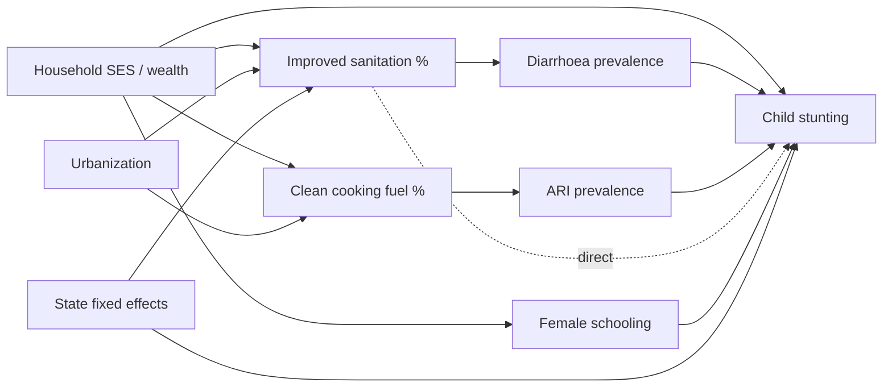

# DAS_HACK — India Health Data: Complete Analysis


---

# Overview & How to Read This

## Overview & How to Read This Report

**What this is:** a complete, from-scratch understanding of three India health datasets — built before any RAG/ontology/causal modeling — covering every column, every unique value, full statistics, correlations with reasoning & confidence, a facility capability-trust engine, geographic gap analysis, and a causal-readiness blueprint.

> ✅ **Complete national data.** `nfhs5.csv` = 706 NFHS-5 district rows (36 states/UTs); `india_post.csv` = 165,627 post offices (full HO/PO/BO hierarchy, 749 districts); `facilities_hack.csv` = 10,088 facilities nationwide. The cross-dataset **join works**: ~86% of NFHS district names match the pincode directory, ~95% of facilities have a pincode in the directory, and ~80% map facility→pincode→district→NFHS. An integrated district table (`data/district_supply_demand.csv`, 706 districts: outcomes + supply) is included.

### The three datasets
| File | Rows×Cols | Grain | Role |
|---|---|---|---|
| `nfhs5.csv` | 706 × 109 | district | health **outcomes & behaviours** (demand) |
| `facilities_hack.csv` | 10,088 × 51 | facility | health **supply / infrastructure** |
| `india_post.csv` | 165,627 × 11 | post office | **geographic backbone** (pincode→district) |

### Keys
- **nfhs**: PK `(state_ut, district_name)` — ⚠️ no district code exists.
- **pincode**: PK `(officename, pincode)` — pincode alone is NOT unique (up to 5 offices share one).
- **facilities**: PK `unique_id`; `cluster_id` = entity-resolution key.
- **Join path**: `facilities.address_zipOrPostcode → pincode → (district,state) → nfhs`.

### The four planning questions this answers
1. **Can a facility do what it claims?** → capability trust grades + confidence badges.
2. **Are the care gaps real?** → trust-weighted gap analysis (real gap vs data-poor).
3. **Where should a patient/coordinator go?** → location+need search prototype.
4. **What must be fixed before planning?** → stewardship review queue + causal-readiness fixes.

### How to navigate
Use the sidebar. Start with the **Unique-Values Catalog** for the complete column inventory, then the NFHS dictionary sections, then Correlations (matrix → reasoning/confidence → better techniques), then the facility product layer, then the causal-readiness blueprint. Data artifacts (CSVs, the search engine `.py`) are in `data/`; figures in `figures/`.


---

# Consolidated Data Dictionary — every column & meaning

## Consolidated Data Dictionary — every column & its meaning

*Plain-English meaning of all 171 columns across the three tables. NFHS meanings are derived from the indicator names + NFHS-5 conventions (denominator = the population the % is computed over); see the thematic NFHS sections for fuller definitions.*


### india_pincode.csv (11)
| # | Column | Meaning | Type |
|---|---|---|---|
| 0 | `circlename` | India Post Circle — top admin unit (≈ state level) | text |
| 1 | `regionname` | Postal Region — a group of divisions | text |
| 2 | `divisionname` | Postal Division — a group of post offices | text |
| 3 | `officename` | Name of the post office | text |
| 4 | `pincode` | 6-digit PIN: d1=region, d1–2=circle, d1–3=sorting district, last 3=delivery office | text |
| 5 | `officetype` | Office type HO/SO/BO (here all BO = Branch Office) | text |
| 6 | `delivery` | Whether the office performs delivery | text |
| 7 | `district` | Revenue district | text |
| 8 | `statename` | State / UT | text |
| 9 | `latitude` | Office latitude (some NA) | geo |
| 10 | `longitude` | Office longitude (some NA) | geo |

### facilities.csv (51)
| # | Column | Meaning | Type |
|---|---|---|---|
| 0 | `unique_id` | Surrogate primary key (UUID) of the scraped record | field |
| 1 | `source_types` | Provenance tag per evidence item (overture/dynamic/constant/mongo_facility) | json[] |
| 2 | `source_ids` | Source-record IDs, parallel to source_types | json[] |
| 3 | `source_content_id` | FK to upstream source-content record (==content_table_id) | field |
| 4 | `name` | Facility name | field |
| 5 | `organization_type` | Record class (always 'facility') | field |
| 6 | `content_table_id` | FK to content table (==source_content_id) | field |
| 7 | `phone_numbers` | All discovered phone numbers | json[] |
| 8 | `officialPhone` | Primary/official phone | field |
| 9 | `email` | Contact email | field |
| 10 | `websites` | All discovered URLs (site + social) | json[] |
| 11 | `officialWebsite` | Primary official website | field |
| 12 | `yearEstablished` | Year founded | field |
| 13 | `acceptsVolunteers` | Flag — accepts volunteers | field |
| 14 | `facebookLink` | Facebook URL | field |
| 15 | `address_line1` | Street address line 1 | field |
| 16 | `address_line2` | Street address line 2 | field |
| 17 | `address_line3` | Street address line 3 | field |
| 18 | `address_city` | City (often a town/district) | field |
| 19 | `address_stateOrRegion` | State (sometimes a district mis-filed) | field |
| 20 | `address_zipOrPostcode` | 6-digit PIN (FK → pincode) | field |
| 21 | `address_country` | Country | field |
| 22 | `address_countryCode` | ISO country code | field |
| 23 | `countries` | Country list | json[] |
| 24 | `facilityTypeId` | Facility class (hospital/clinic/dentist/doctor/farmacy) | field |
| 25 | `operatorTypeId` | Ownership (private/public) | field |
| 26 | `affiliationTypeIds` | Affiliation/accreditation IDs | json[] |
| 27 | `description` | Free-text summary | field |
| 28 | `area` | Locality / area name | field |
| 29 | `numberDoctors` | Reported number of doctors | field |
| 30 | `capacity` | Reported bed capacity | field |
| 31 | `specialties` | Clinical specialty codes (164-term taxonomy) | json[] |
| 32 | `procedure` | Procedure/service statements | json[] |
| 33 | `equipment` | Equipment statements | json[] |
| 34 | `capability` | Capability/claim statements | json[] |
| 35 | `recency_of_page_update` | Recency signal of the source page | field |
| 36 | `distinct_social_media_presence_count` | # distinct social platforms | field |
| 37 | `affiliated_staff_presence` | Flag — named staff present | field |
| 38 | `custom_logo_presence` | Flag — has a custom logo | field |
| 39 | `number_of_facts_about_the_organization` | # structured facts extracted | field |
| 40 | `post_metrics_most_recent_social_media_post_date` | Date of latest social post | field |
| 41 | `post_metrics_post_count` | # social posts | field |
| 42 | `engagement_metrics_n_followers` | Social followers | field |
| 43 | `engagement_metrics_n_likes` | Social likes | field |
| 44 | `engagement_metrics_n_engagements` | Social engagements | field |
| 45 | `source` | Pipeline source (always 'kie') | field |
| 46 | `coordinates` | GeoJSON point {coordinates:[lon,lat]} | geo |
| 47 | `latitude` | Latitude (some corrupt/out-of-India) | geo |
| 48 | `longitude` | Longitude (some corrupt/out-of-India) | geo |
| 49 | `cluster_id` | Entity-resolution key (dedupe across sources) | field |
| 50 | `source_urls` | Source page URLs | json[] |

### nfhs.csv (109)
| # | Column | Meaning | Denominator | Unit |
|---|---|---|---|---|
| 0 | `district_name` | District name (identifier) | — | id |
| 1 | `state_ut` | State / UT (identifier) | — | id |
| 2 | `households_surveyed` | Households surveyed (sample size) | households | count |
| 3 | `women_15_49_interviewed` | Women 15–49 interviewed (sample size) | women 15–49 | count |
| 4 | `men_15_54_interviewed` | Men 15–54 interviewed (sample size) | men 15–54 | count |
| 5 | `female_population_age_6_years_and_above_ever_schooled_pct` | Female population age 6 years and above ever schooled | — | % |
| 6 | `population_below_age_15_years_pct` | Population below age 15 years | — | % |
| 7 | `sex_ratio_total_f_per_1000_m` | Sex ratio total f per 1000 m | — | F per 1000 M |
| 8 | `sex_ratio_at_birth_5y_f_per_1000_m` | Sex ratio at birth 5y f per 1000 m | — | F per 1000 M |
| 9 | `child_u5_whose_birth_was_civil_reg_pct` | Whose birth was civil reg | children under 5 | % |
| 10 | `deaths_in_the_last_3_years_civil_reg_pct` | Deaths in the last 3 years civil reg | — | % |
| 11 | `hh_electricity_pct` | Hh electricity | households | % |
| 12 | `hh_improved_water_pct` | Hh improved water | households | % |
| 13 | `hh_use_improved_sanitation_pct` | Hh use improved sanitation | households | % |
| 14 | `households_using_clean_fuel_for_cooking_pct` | Households using clean fuel for cooking | households | % |
| 15 | `households_using_iodized_salt_pct` | Households using iodized salt | households | % |
| 16 | `hh_member_covered_health_insurance_pct` | Hh member covered health insurance | households | % |
| 17 | `child_5y_who_attended_pre_primary_school_during_the_school_pct` | Child 5y who attended pre primary school during the school | — | % |
| 18 | `women_age_15_49_who_are_literate_pct` | Who are literate | women 15–49 | % |
| 19 | `women_age_15_49_with_10_or_more_years_of_schooling_pct` | With 10 or more years of schooling | women 15–49 | % |
| 20 | `w20_24_married_before_age_18_years_pct` | Married before age 18 years | women 20–24 | % |
| 21 | `births_in_the_5_years_preceding_the_survey_that_are_birth_3_pct` | Births in the 5 years preceding the survey that are birth | births in last 5 years | % |
| 22 | `w15_19_who_were_already_mothers_or_pregnant_at_the_time_of_pct` | Who were already mothers or pregnant at the time of | women/girls 15–19 | % |
| 23 | `w15_24_who_use_menstrual_hygiene_pct` | Who use menstrual hygiene | young women 15–24 | % |
| 24 | `fp_cm_w15_49_any_method_pct` | Family planning — any method | currently married women 15–49 | % |
| 25 | `fp_cm_w15_49_modern_method_pct` | Family planning — modern method | currently married women 15–49 | % |
| 26 | `fp_cm_w15_49_f_steril_pct` | Family planning — female sterilisation | currently married women 15–49 | % |
| 27 | `fp_cm_w15_49_m_steril_pct` | Family planning — male sterilisation | currently married women 15–49 | % |
| 28 | `fp_cm_w15_49_iud_pct` | Family planning — iud | currently married women 15–49 | % |
| 29 | `fp_cm_w15_49_pill_pct` | Family planning — pill | currently married women 15–49 | % |
| 30 | `fp_cm_w15_49_condom_pct` | Family planning — condom | currently married women 15–49 | % |
| 31 | `fp_cm_w15_49_injectables_pct` | Family planning — injectables | currently married women 15–49 | % |
| 32 | `fp_unmet_total_cm_w15_49_7_pct` | Unmet need for family planning — total cm | women 15–49 | % |
| 33 | `fp_unmet_spacing_cm_w15_49_7_pct` | Unmet need for family planning — spacing cm | women 15–49 | % |
| 34 | `health_worker_ever_talked_to_female_non_users_about_family_pct` | Health worker ever talked to female non users about family | — | % |
| 35 | `current_users_ever_told_about_side_effects_of_current_metho_pct` | Current users ever told about side effects of current metho | — | % |
| 36 | `mothers_who_had_an_anc_visit_in_the_first_trimester_lb5y_pct` | Mothers who had an ANC visit in the first trimester lb5y | mothers (last birth in 5y) | % |
| 37 | `mothers_who_had_at_least_4_anc_visits_lb5y_pct` | Mothers who had at least 4 ANC visits lb5y | mothers (last birth in 5y) | % |
| 38 | `mothers_whose_last_birth_was_protected_against_neo_tetanus_pct` | Mothers whose last birth was protected against neonatal tetanus | mothers (last birth in 5y) | % |
| 39 | `mothers_who_consumed_ifa_for_100_days_or_more_when_they_wer_pct` | Mothers who consumed iron-folic-acid for 100 days or more when they wer | mothers (last birth in 5y) | % |
| 40 | `mothers_who_consumed_ifa_for_180_days_or_more_when_they_wer_pct` | Mothers who consumed iron-folic-acid for 180 days or more when they wer | mothers (last birth in 5y) | % |
| 41 | `registered_pregnancies_for_which_the_mother_received_a_mcp_pct` | Registered pregnancies for which the mother received a MCP card | registered pregnancies | % |
| 42 | `mothers_who_received_pnc_from_a_doctor_nurse_lhv_anm_midwif_pct` | Mothers who received PNC from a doctor nurse lhv anm midwif | mothers (last birth in 5y) | % |
| 43 | `average_out_of_pocket_expenditure_per_delivery_in_a_public_fac` | Average out of pocket expenditure per delivery in a public fac | — | INR |
| 44 | `children_born_at_home_who_were_taken_to_a_health_facility_f_pct` | Children born at home who were taken to a health facility f | — | % |
| 45 | `children_who_received_pnc_from_a_doctor_nurse_lhv_anm_midwi_pct` | Children who received PNC from a doctor nurse lhv anm midwi | — | % |
| 46 | `institutional_birth_5y_pct` | Institutional birth 5y | — | % |
| 47 | `institutional_birth_in_public_facility_5y_pct` | Institutional birth in public facility 5y | — | % |
| 48 | `home_birth_that_were_conducted_by_skilled_hp_5y_10_pct` | Home birth that were conducted by skilled hp 5y | — | % |
| 49 | `births_attended_by_skilled_hp_5y_10_pct` | Births attended by skilled hp 5y | births in last 5 years | % |
| 50 | `births_delivered_by_csection_5y_pct` | Births delivered by C-section 5y | births in last 5 years | % |
| 51 | `births_in_a_private_fac_that_were_delivered_by_csection_5y_pct` | Births in a private fac that were delivered by C-section 5y | births in last 5 years | % |
| 52 | `births_in_a_public_fac_that_were_delivered_by_csection_5y_pct` | Births in a public fac that were delivered by C-section 5y | births in last 5 years | % |
| 53 | `child_12_23m_fully_vaccinated_based_on_information_from_eit_pct` | Fully vaccinated based on information from eit | children 12–23 months | % |
| 54 | `child_12_23m_fully_vaccinated_based_on_information_from_vax_pct` | Fully vaccinated based on information from vax | children 12–23 months | % |
| 55 | `child_12_23m_who_have_received_bcg_pct` | Who have received BCG | children 12–23 months | % |
| 56 | `child_12_23m_who_have_received_3_doses_of_polio_vaccine_pct` | Who have received 3 doses of polio vaccine | children 12–23 months | % |
| 57 | `child_12_23m_who_have_received_3_doses_of_penta_or_dpt_vacc_pct` | Who have received 3 doses of penta or DPT vacc | children 12–23 months | % |
| 58 | `child_12_23m_who_have_received_the_first_dose_of_mcv_mcv_pct` | Who have received the first dose of measles vaccine mcv | children 12–23 months | % |
| 59 | `child_24_35m_who_have_received_a_second_dose_of_mcv_mcv_pct` | Who have received a second dose of measles vaccine mcv | children 24–35 months | % |
| 60 | `child_12_23m_who_have_received_3_doses_of_rotavirus_vaccine_pct` | Who have received 3 doses of rotavirus vaccine | children 12–23 months | % |
| 61 | `child_12_23m_who_have_received_3_doses_of_penta_or_hepatiti_pct` | Who have received 3 doses of penta or hepatiti | children 12–23 months | % |
| 62 | `child_9_35m_who_received_a_vit_a_in_the_last_6_months_pct` | Who received a vitamin A in the last 6 months | children 9–35 months | % |
| 63 | `child_12_23m_who_received_most_of_their_vaccinations_in_a_p_pct` | Who received most of their vaccinations in a p | children 12–23 months | % |
| 64 | `child_12_23m_who_received_most_of_their_vaccinations_in_a_2_pct` | Who received most of their vaccinations in a | children 12–23 months | % |
| 65 | `prev_diarrhoea_2wk_child_u5_pct` | Prev diarrhoea 2wk | children under 5 | % |
| 66 | `children_with_diarrhoea_2wk_who_received_oral_rehydration_s_pct` | Children with diarrhoea 2wk who received oral rehydration s | — | % |
| 67 | `children_with_diarrhoea_2wk_who_received_zinc_child_u5_pct` | Children with diarrhoea 2wk who received zinc | children under 5 | % |
| 68 | `children_with_diarrhoea_2wk_taken_to_a_health_facility_or_h_pct` | Children with diarrhoea 2wk taken to a health facility or h | — | % |
| 69 | `children_prev_symptoms_of_acute_respiratory_infection_ari_2_pct` | Children prev symptoms of acute respiratory infection ARI | — | % |
| 70 | `children_with_fever_or_symptoms_of_ari_2wk_taken_to_a_healt_pct` | Children with fever or symptoms of ARI 2wk taken to a healt | — | % |
| 71 | `children_under_age_3_years_breastfed_within_one_hour_of_bir_pct` | Years breastfed within one hour of bir | children under 3 | % |
| 72 | `child_u6m_exclusively_breastfed_pct` | Exclusively breastfed | children under 6 months | % |
| 73 | `child_6_8m_receiving_solid_or_semi_solid_food_and_breastmil_pct` | Receiving solid or semi solid food and breastmil | children 6–8 months | % |
| 74 | `breastfeeding_child_6_23m_receiving_an_adequate_diet16_17_pct` | Breastfeeding receiving an adequate diet16 | children 6–23 months | % |
| 75 | `non_breastfeeding_child_6_23m_receiving_an_adequate_diet16_pct` | Non breastfeeding receiving an adequate diet16 | children 6–23 months | % |
| 76 | `total_child_6_23m_receiving_an_adequate_diet16_17_pct` | Total receiving an adequate diet16 | children 6–23 months | % |
| 77 | `child_u5_who_are_stunted_height_for_age_18_pct` | Who are stunted height for age | children under 5 | % |
| 78 | `child_u5_who_are_wasted_weight_for_height_18_pct` | Who are wasted weight for height | children under 5 | % |
| 79 | `child_u5_who_are_severe_wasted_weight_for_height_19_pct` | Who are severe wasted weight for height | children under 5 | % |
| 80 | `child_u5_who_are_underweight_weight_for_age_18_pct` | Who are underweight weight for age | children under 5 | % |
| 81 | `child_u5_who_are_overweight_weight_for_height_20_pct` | Who are overweight weight for height | children under 5 | % |
| 82 | `women_age_15_49_years_whose_bmi_bmi_is_underweight_bmi_lt_1_pct` | Years whose bmi bmi is underweight bmi < | women 15–49 | % |
| 83 | `women_age_15_49_years_who_are_overweight_obese_bmi_gte_25_0_pct` | Years who are overweight obese bmi gte 25 | women 15–49 | % |
| 84 | `women_age_15_49_years_who_have_high_risk_whr_gte_0_85_pct` | Years who have high risk whr gte 0 | women 15–49 | % |
| 85 | `child_6_59m_who_are_anaemic_lt_11_0_g_dl_22_pct` | Who are anaemic < 11 0 g/dl | children 6–59 months | % |
| 86 | `non_pregnant_w15_49_who_are_anaemic_lt_12_0_g_dl_22_pct` | Who are anaemic < 12 0 g/dl | non-pregnant women 15–49 | % |
| 87 | `pregnant_w15_49_who_are_anaemic_lt_11_0_g_dl_22_pct` | Who are anaemic < 11 0 g/dl | pregnant women 15–49 | % |
| 88 | `all_w15_49_who_are_anaemic_pct` | All who are anaemic | women 15–49 | % |
| 89 | `all_w15_19_who_are_anaemic_pct` | All who are anaemic | women/girls 15–19 | % |
| 90 | `women_age_15_years_and_above_with_high_141_160_mg_dl_blood_pct` | With high 141 160 mg/dl blood | women 15+ | % |
| 91 | `w15_plus_with_very_high_gt_160_mg_dl_blood_sugar_pct` | With very high > 160 mg/dl blood sugar | women 15+ | % |
| 92 | `w15_plus_with_high_or_very_high_gt_140_mg_dl_blood_sugar_or_pct` | With high or very high > 140 mg/dl blood sugar or | women 15+ | % |
| 93 | `m15_plus_with_high_141_160_mg_dl_blood_sugar_pct` | With high 141 160 mg/dl blood sugar | men 15+ | % |
| 94 | `men_age_15_years_and_above_with_very_high_gt_160_mg_dl_bloo_pct` | With very high > 160 mg/dl bloo | men 15+ | % |
| 95 | `m15_plus_with_high_or_very_high_gt_140_mg_dl_blood_sugar_or_pct` | With high or very high > 140 mg/dl blood sugar or | men 15+ | % |
| 96 | `w15_plus_with_mildly_high_bp_sys_140_159_mmhg_and_or_dia_90_pct` | With mildly high blood pressure sys 140 159 mmhg and or dia | women 15+ | % |
| 97 | `w15_plus_with_moderately_or_severely_high_bp_sys_gte_160_mm_pct` | With moderately or severely high blood pressure sys gte 160 mm | women 15+ | % |
| 98 | `w15_plus_with_high_bp_sys_gte_140_mmhg_and_or_dia_gte_90_mm_pct` | With high blood pressure sys gte 140 mmhg and or dia gte 90 mm | women 15+ | % |
| 99 | `m15_plus_with_mildly_high_bp_sys_140_159_mmhg_and_or_dia_90_pct` | With mildly high blood pressure sys 140 159 mmhg and or dia | men 15+ | % |
| 100 | `m15_plus_with_moderately_or_severely_high_bp_sys_gte_160_mm_pct` | With moderately or severely high blood pressure sys gte 160 mm | men 15+ | % |
| 101 | `m15_plus_with_high_bp_sys_gte_140_mmhg_and_or_dia_gte_90_mm_pct` | With high blood pressure sys gte 140 mmhg and or dia gte 90 mm | men 15+ | % |
| 102 | `women_age_30_49_years_ever_undergone_a_cervical_screen_pct` | Years ever undergone a cervical screen | women 30–49 | % |
| 103 | `women_age_30_49_years_ever_undergone_a_breast_exam_pct` | Years ever undergone a breast exam | women 30–49 | % |
| 104 | `women_age_30_49_years_ever_undergone_an_oral_cancer_exam_pct` | Years ever undergone an oral cancer exam | women 30–49 | % |
| 105 | `w15_plus_who_use_any_kind_of_tobacco_pct` | Who use any kind of tobacco | women 15+ | % |
| 106 | `m15_plus_who_use_any_kind_of_tobacco_pct` | Who use any kind of tobacco | men 15+ | % |
| 107 | `w15_plus_who_consume_alcohol_pct` | Who consume alcohol | women 15+ | % |
| 108 | `m15_plus_who_consume_alcohol_pct` | Who consume alcohol | men 15+ | % |


---

# Column Semantics & Unit Audit (validated vs data)

## Column Semantics & Unit Audit (every column validated against the data)

*For each column the unit/type is inferred from the NAME and then VALIDATED against actual values. The unit is per-column: `*_pct`=percentage (0–100), `sex_ratio_*`=females per 1,000 males, `*_interviewed`/`*_surveyed`=respondent counts, OOP expenditure=Indian rupees, `hh`=household; facilities adds booleans, years, dates, coordinates and JSON arrays.*

### Validation headline
- **NFHS percentages:** all 101 `_pct` columns fall within **[0.0, 100.0]** ⇒ every percentage column's data matches its name. No `_pct` column exceeds 100.
- **Sex ratios** (per 1,000): total 755–1332; at-birth 658–1485 ⇒ correctly a per-1,000 ratio, NOT a percentage.
- **OOP delivery expenditure:** ₹0–₹20101 ⇒ rupees, must never be averaged with the % columns.
- **Sample-size counts:** households median 908, women median 1,020, men median 145 ⇒ counts, not indicators; the small men-count gates male-indicator reliability.
- **Name→unit contradictions found:** [('sex_ratio_at_birth_5y_f_per_1000_m', 'ratio: F per 1000 M', np.float64(658.0), np.float64(1485.0), '⚠ sex-ratio extreme')]

### Pincode (11): types
`pincode` = 6-digit identifier (not a quantity); `latitude`/`longitude` = geo floats (India bbox); `circlename/regionname/divisionname/district/statename` = categorical text (hierarchy); `officetype` = categorical (HO/SO/BO); `delivery` = binary.

### Facilities (51): data-driven types
Numeric quantities: `numberDoctors`, `capacity`, `engagement_metrics_*`, `post_metrics_post_count`, `number_of_facts_about_the_organization`, `distinct_social_media_presence_count`. Year: `yearEstablished`. Booleans: `acceptsVolunteers`, `affiliated_staff_presence`, `custom_logo_presence`. Dates: `post_metrics_most_recent_social_media_post_date`, `recency_of_page_update`. Geo: `latitude`/`longitude`/`coordinates`. JSON arrays: source_types, source_ids, phone_numbers, websites, specialties, procedure, equipment, capability, source_urls, countries, affiliationTypeIds. Categorical: `facilityTypeId`, `operatorTypeId`, `address_countryCode`. Identifiers/text: `unique_id`, `cluster_id`, `name`, emails, URLs, address lines.
**Data-quality flags:** `farmacy` & `pharmacy` both appear (same concept, normalize); one row has a coordinates-JSON string in `facilityTypeId` (a column-shifted row); `yearEstablished` future/implausible count checked above.

### nfhs5.csv — unit validated against data (109 cols)
| Column | Unit (validated) | observed min | observed max | missing |
|---|---|---|---|---|
| `district_name` | identifier | — | — | text |
| `state_ut` | identifier | — | — | text |
| `households_surveyed` | count: respondents | 213 | 990 | 0% sup |
| `women_15_49_interviewed` | count: respondents | 216 | 1621 | 0% sup |
| `men_15_54_interviewed` | count: respondents | 17 | 241 | 0% sup |
| `female_population_age_6_years_and_above_ever_schooled_pct` | percentage 0–100 | 45.4 | 99.2 | 0% sup |
| `population_below_age_15_years_pct` | percentage 0–100 | 16 | 50.6 | 0% sup |
| `sex_ratio_total_f_per_1000_m` | ratio: F per 1000 M | 755 | 1332 | 0% sup |
| `sex_ratio_at_birth_5y_f_per_1000_m` | ratio: F per 1000 M | 658 | 1485 | 0% sup |
| `child_u5_whose_birth_was_civil_reg_pct` | percentage 0–100 | 51.6 | 100 | 0% sup |
| `deaths_in_the_last_3_years_civil_reg_pct` | percentage 0–100 | 8.3 | 100 | 0% sup |
| `hh_electricity_pct` | percentage 0–100 | 68.4 | 100 | 0% sup |
| `hh_improved_water_pct` | percentage 0–100 | 41.2 | 100 | 0% sup |
| `hh_use_improved_sanitation_pct` | percentage 0–100 | 29.2 | 99.9 | 0% sup |
| `households_using_clean_fuel_for_cooking_pct` | percentage 0–100 | 8.6 | 99.8 | 0% sup |
| `households_using_iodized_salt_pct` | percentage 0–100 | 47.9 | 100 | 0% sup |
| `hh_member_covered_health_insurance_pct` | percentage 0–100 | 1.2 | 97.8 | 0% sup |
| `child_5y_who_attended_pre_primary_school_during_the_school_pct` | percentage 0–100 | 0 | 52.9 | 0% sup |
| `women_age_15_49_who_are_literate_pct` | percentage 0–100 | 38.6 | 99.7 | 0% sup |
| `women_age_15_49_with_10_or_more_years_of_schooling_pct` | percentage 0–100 | 13.6 | 88.2 | 0% sup |
| `w20_24_married_before_age_18_years_pct` | percentage 0–100 | 0 | 57.6 | 0% sup |
| `births_in_the_5_years_preceding_the_survey_that_are_birth_3_pct` | percentage 0–100 | 0 | 8 | 0% sup |
| `w15_19_who_were_already_mothers_or_pregnant_at_the_time_of_pct` | percentage 0–100 | 0 | 27.3 | 0% sup |
| `w15_24_who_use_menstrual_hygiene_pct` | percentage 0–100 | 9 | 100 | 0% sup |
| `fp_cm_w15_49_any_method_pct` | percentage 0–100 | 12.1 | 89.1 | 0% sup |
| `fp_cm_w15_49_modern_method_pct` | percentage 0–100 | 10.6 | 81.2 | 0% sup |
| `fp_cm_w15_49_f_steril_pct` | percentage 0–100 | 1.1 | 76.5 | 0% sup |
| `fp_cm_w15_49_m_steril_pct` | percentage 0–100 | 0 | 18.4 | 0% sup |
| `fp_cm_w15_49_iud_pct` | percentage 0–100 | 0 | 32.2 | 0% sup |
| `fp_cm_w15_49_pill_pct` | percentage 0–100 | 0 | 53 | 0% sup |
| `fp_cm_w15_49_condom_pct` | percentage 0–100 | 0 | 43.9 | 0% sup |
| `fp_cm_w15_49_injectables_pct` | percentage 0–100 | 0 | 9.8 | 0% sup |
| `fp_unmet_total_cm_w15_49_7_pct` | percentage 0–100 | 1.2 | 33 | 0% sup |
| `fp_unmet_spacing_cm_w15_49_7_pct` | percentage 0–100 | 0.3 | 25.2 | 0% sup |
| `health_worker_ever_talked_to_female_non_users_about_family_pct` | percentage 0–100 | 2 | 64.2 | 0% sup |
| `current_users_ever_told_about_side_effects_of_current_metho_pct` | percentage 0–100 | 14.6 | 98.9 | 0% sup |
| `mothers_who_had_an_anc_visit_in_the_first_trimester_lb5y_pct` | percentage 0–100 | 26.3 | 99.6 | 0% sup |
| `mothers_who_had_at_least_4_anc_visits_lb5y_pct` | percentage 0–100 | 4.4 | 98.7 | 0% sup |
| `mothers_whose_last_birth_was_protected_against_neo_tetanus_pct` | percentage 0–100 | 55.1 | 100 | 0% sup |
| `mothers_who_consumed_ifa_for_100_days_or_more_when_they_wer_pct` | percentage 0–100 | 1.6 | 95 | 0% sup |
| `mothers_who_consumed_ifa_for_180_days_or_more_when_they_wer_pct` | percentage 0–100 | 0.8 | 84.6 | 0% sup |
| `registered_pregnancies_for_which_the_mother_received_a_mcp_pct` | percentage 0–100 | 50 | 100 | 0% sup |
| `mothers_who_received_pnc_from_a_doctor_nurse_lhv_anm_midwif_pct` | percentage 0–100 | 24.9 | 99.5 | 0% sup |
| `average_out_of_pocket_expenditure_per_delivery_in_a_public_fac` | currency: INR | 193 | 2.01e+04 | 0% sup |
| `children_born_at_home_who_were_taken_to_a_health_facility_f_pct` | percentage 0–100 | 0 | 29 | 60% sup |
| `children_who_received_pnc_from_a_doctor_nurse_lhv_anm_midwi_pct` | percentage 0–100 | 22.4 | 99.6 | 0% sup |
| `institutional_birth_5y_pct` | percentage 0–100 | 21.4 | 100 | 0% sup |
| `institutional_birth_in_public_facility_5y_pct` | percentage 0–100 | 18.1 | 96.7 | 0% sup |
| `home_birth_that_were_conducted_by_skilled_hp_5y_10_pct` | percentage 0–100 | 0 | 19.9 | 0% sup |
| `births_attended_by_skilled_hp_5y_10_pct` | percentage 0–100 | 30.9 | 100 | 0% sup |
| `births_delivered_by_csection_5y_pct` | percentage 0–100 | 1.4 | 82.4 | 0% sup |
| `births_in_a_private_fac_that_were_delivered_by_csection_5y_pct` | percentage 0–100 | 6.3 | 94.2 | 21% sup |
| `births_in_a_public_fac_that_were_delivered_by_csection_5y_pct` | percentage 0–100 | 0.7 | 73 | 0% sup |
| `child_12_23m_fully_vaccinated_based_on_information_from_eit_pct` | percentage 0–100 | 38.3 | 100 | 2% sup |
| `child_12_23m_fully_vaccinated_based_on_information_from_vax_pct` | percentage 0–100 | 45 | 100 | 3% sup |
| `child_12_23m_who_have_received_bcg_pct` | percentage 0–100 | 65.9 | 100 | 2% sup |
| `child_12_23m_who_have_received_3_doses_of_polio_vaccine_pct` | percentage 0–100 | 47.6 | 100 | 2% sup |
| `child_12_23m_who_have_received_3_doses_of_penta_or_dpt_vacc_pct` | percentage 0–100 | 53.3 | 100 | 2% sup |
| `child_12_23m_who_have_received_the_first_dose_of_mcv_mcv_pct` | percentage 0–100 | 53.2 | 100 | 2% sup |
| `child_24_35m_who_have_received_a_second_dose_of_mcv_mcv_pct` | percentage 0–100 | 2.8 | 63.8 | 2% sup |
| `child_12_23m_who_have_received_3_doses_of_rotavirus_vaccine_pct` | percentage 0–100 | 0 | 100 | 2% sup |
| `child_12_23m_who_have_received_3_doses_of_penta_or_hepatiti_pct` | percentage 0–100 | 39.5 | 100 | 2% sup |
| `child_9_35m_who_received_a_vit_a_in_the_last_6_months_pct` | percentage 0–100 | 27.5 | 98.1 | 0% sup |
| `child_12_23m_who_received_most_of_their_vaccinations_in_a_p_pct` | percentage 0–100 | 67.1 | 100 | 2% sup |
| `child_12_23m_who_received_most_of_their_vaccinations_in_a_2_pct` | percentage 0–100 | 0 | 32.9 | 2% sup |
| `prev_diarrhoea_2wk_child_u5_pct` | percentage 0–100 | 0 | 39.3 | 0% sup |
| `children_with_diarrhoea_2wk_who_received_oral_rehydration_s_pct` | percentage 0–100 | 18.8 | 95.9 | 70% sup |
| `children_with_diarrhoea_2wk_who_received_zinc_child_u5_pct` | percentage 0–100 | 4.2 | 70.4 | 70% sup |
| `children_with_diarrhoea_2wk_taken_to_a_health_facility_or_h_pct` | percentage 0–100 | 27.4 | 95.3 | 70% sup |
| `children_prev_symptoms_of_acute_respiratory_infection_ari_2_pct` | percentage 0–100 | 0 | 11.2 | 0% sup |
| `children_with_fever_or_symptoms_of_ari_2wk_taken_to_a_healt_pct` | percentage 0–100 | 13.8 | 97.3 | 32% sup |
| `children_under_age_3_years_breastfed_within_one_hour_of_bir_pct` | percentage 0–100 | 7.8 | 88.5 | 0% sup |
| `child_u6m_exclusively_breastfed_pct` | percentage 0–100 | 22.3 | 94 | 37% sup |
| `child_6_8m_receiving_solid_or_semi_solid_food_and_breastmil_pct` | percentage 0–100 | 7.9 | 85.2 | 91% sup |
| `breastfeeding_child_6_23m_receiving_an_adequate_diet16_17_pct` | percentage 0–100 | 0 | 54.1 | 1% sup |
| `non_breastfeeding_child_6_23m_receiving_an_adequate_diet16_pct` | percentage 0–100 | 0 | 41.3 | 91% sup |
| `total_child_6_23m_receiving_an_adequate_diet16_17_pct` | percentage 0–100 | 0 | 50.1 | 0% sup |
| `child_u5_who_are_stunted_height_for_age_18_pct` | percentage 0–100 | 13.2 | 60.6 | 0% sup |
| `child_u5_who_are_wasted_weight_for_height_18_pct` | percentage 0–100 | 4.5 | 48 | 0% sup |
| `child_u5_who_are_severe_wasted_weight_for_height_19_pct` | percentage 0–100 | 0.5 | 30.5 | 0% sup |
| `child_u5_who_are_underweight_weight_for_age_18_pct` | percentage 0–100 | 7.2 | 62.4 | 0% sup |
| `child_u5_who_are_overweight_weight_for_height_20_pct` | percentage 0–100 | 0 | 21.1 | 0% sup |
| `women_age_15_49_years_whose_bmi_bmi_is_underweight_bmi_lt_1_pct` | percentage 0–100 | 1.2 | 43.6 | 0% sup |
| `women_age_15_49_years_who_are_overweight_obese_bmi_gte_25_0_pct` | percentage 0–100 | 3.8 | 53 | 0% sup |
| `women_age_15_49_years_who_have_high_risk_whr_gte_0_85_pct` | percentage 0–100 | 18 | 96.6 | 0% sup |
| `child_6_59m_who_are_anaemic_lt_11_0_g_dl_22_pct` | percentage 0–100 | 24.9 | 95.5 | 0% sup |
| `non_pregnant_w15_49_who_are_anaemic_lt_12_0_g_dl_22_pct` | percentage 0–100 | 15.6 | 94.6 | 0% sup |
| `pregnant_w15_49_who_are_anaemic_lt_11_0_g_dl_22_pct` | percentage 0–100 | 2 | 87.6 | 19% sup |
| `all_w15_49_who_are_anaemic_pct` | percentage 0–100 | 14.9 | 93.5 | 0% sup |
| `all_w15_19_who_are_anaemic_pct` | percentage 0–100 | 18.2 | 97.1 | 0% sup |
| `women_age_15_years_and_above_with_high_141_160_mg_dl_blood_pct` | percentage 0–100 | 1.6 | 14.6 | 0% sup |
| `w15_plus_with_very_high_gt_160_mg_dl_blood_sugar_pct` | percentage 0–100 | 0.7 | 18 | 0% sup |
| `w15_plus_with_high_or_very_high_gt_140_mg_dl_blood_sugar_or_pct` | percentage 0–100 | 4.1 | 32.1 | 0% sup |
| `m15_plus_with_high_141_160_mg_dl_blood_sugar_pct` | percentage 0–100 | 1.7 | 18.3 | 0% sup |
| `men_age_15_years_and_above_with_very_high_gt_160_mg_dl_bloo_pct` | percentage 0–100 | 0.5 | 21.1 | 0% sup |
| `m15_plus_with_high_or_very_high_gt_140_mg_dl_blood_sugar_or_pct` | percentage 0–100 | 4.8 | 36.2 | 0% sup |
| `w15_plus_with_mildly_high_bp_sys_140_159_mmhg_and_or_dia_90_pct` | percentage 0–100 | 4.3 | 23.7 | 0% sup |
| `w15_plus_with_moderately_or_severely_high_bp_sys_gte_160_mm_pct` | percentage 0–100 | 0.7 | 15.8 | 0% sup |
| `w15_plus_with_high_bp_sys_gte_140_mmhg_and_or_dia_gte_90_mm_pct` | percentage 0–100 | 8.5 | 42.1 | 0% sup |
| `m15_plus_with_mildly_high_bp_sys_140_159_mmhg_and_or_dia_90_pct` | percentage 0–100 | 5.3 | 32.9 | 0% sup |
| `m15_plus_with_moderately_or_severely_high_bp_sys_gte_160_mm_pct` | percentage 0–100 | 0.8 | 19.5 | 0% sup |
| `m15_plus_with_high_bp_sys_gte_140_mmhg_and_or_dia_gte_90_mm_pct` | percentage 0–100 | 10 | 49.6 | 0% sup |
| `women_age_30_49_years_ever_undergone_a_cervical_screen_pct` | percentage 0–100 | 0 | 23.2 | 0% sup |
| `women_age_30_49_years_ever_undergone_a_breast_exam_pct` | percentage 0–100 | 0 | 14.6 | 0% sup |
| `women_age_30_49_years_ever_undergone_an_oral_cancer_exam_pct` | percentage 0–100 | 0 | 15.8 | 0% sup |
| `w15_plus_who_use_any_kind_of_tobacco_pct` | percentage 0–100 | 0.1 | 70.6 | 0% sup |
| `m15_plus_who_use_any_kind_of_tobacco_pct` | percentage 0–100 | 6.8 | 80.6 | 0% sup |
| `w15_plus_who_consume_alcohol_pct` | percentage 0–100 | 0 | 42.8 | 0% sup |
| `m15_plus_who_consume_alcohol_pct` | percentage 0–100 | 0.1 | 68.4 | 0% sup |


---

# Value-Level Codebook (what each value means)

## Value-Level Codebook (what each value MEANS, from the complete data)

*Beyond column meaning: for every CODED column, each distinct value, its count in the full data, and its meaning. Free-text and pure-numeric columns are summarized by their value SYSTEM.*

### NFHS — special value codes (apply to all 101 % / ratio / count cells)
| Value pattern | Count | Meaning |
|---|---|---|
| `*` | 4,125 (5.5%) | **Suppressed** — based on <25 unweighted cases; too few to report. Treat as missing. |
| `(value)` e.g. `(64.2)` | 5,068 (6.7%) | Estimate from **25–49 unweighted cases** — usable but low precision; flag it. |
| trailing spaces e.g. `927 ` | many | formatting noise — strip before use |
| plain number | rest | interpret by unit: `*_pct`=% 0–100, `sex_ratio_*`=F per 1000 M, `*_interviewed`=count, OOP=₹ |

### Pincode · officetype
| Value | Count | Meaning |
|---|---|---|
| `BO` | 140,270 | Branch Office — smallest rural/local post office; reports to a Sub Office |
| `PO` | 24,546 | (other) |
| `HO` | 811 | Head Office — top office of a postal division (e.g. a city GPO) |

### Pincode · delivery
| Value | Count | Meaning |
|---|---|---|
| `Delivery` | 157,901 | Delivers mail to addresses in its beat |
| `Non Delivery` | 7,726 | Only books/processes mail; delivery done by another office |

### Facilities · source_types (provenance tag per evidence item)
| Value | Count | Meaning |
|---|---|---|
| `overture` | 162,020 | Overture Maps Foundation open POI/places record (base map identity) |
| `dynamic` | 82,952 | Dynamically scraped/derived content (live web pages, changeable facts) |
| `constant` | 20,669 | Constant/static reference content (stable attributes) |
| `mongo_facility` | 5,955 | Record from the platform's internal MongoDB facility store (curated/prior) |
| `mongo_ngo` | 1,121 | Record from the internal MongoDB NGO store |

*Meanings inferred from naming + pipeline behaviour. The COUNT of DISTINCT source_types per facility is the trust signal — VERIFIED-STRONG grades require ≥2 distinct sources.*

### Facilities · facilityTypeId
| Value | Count | Meaning |
|---|---|---|
| `hospital` | 5,637 | Hospital (inpatient, multi-service) |
| `clinic` | 3,782 | Clinic / OPD / single-service centre (many standalone dialysis/diagnostic centres are mis-typed here) |
| `dentist` | 490 | Dental practice |
| `nan` | 126 | missing |
| `doctor` | 21 | Solo doctor / individual practitioner |
| `farmacy` | 10 | Pharmacy / drug store (MISSPELLED — should be "pharmacy") |
| `pharmacy` | 2 | Pharmacy / drug store (correct spelling; coexists with "farmacy") |

*The stray coordinates-JSON value is a column-shifted row (see misalignment note below).*

### Facilities · operatorTypeId
| Value | Count | Meaning |
|---|---|---|
| `private` | 8,842 | Privately owned / operated |
| `nan` | 761 | missing |
| `public` | 469 | Government / public-sector operated |
| `government` | 2 | Government-operated (variant of "public" — normalize) |

*⚠ Data-quality: **14 rows** carry malformed operatorTypeId values (coordinate fragments, URL-arrays, UUIDs, specialty codes) — these are **column-misaligned rows** where commas/JSON in earlier fields shifted the columns. They must be re-parsed or quarantined.*

### Facilities · organization_type
| Value | Count | Meaning |
|---|---|---|
| `facility` | 10,000 | record class — the only valid value |
| `nan` | 61 | missing |
| `Doctor couple's unblemished efforts help` | 1 | (other) |

### Facilities · acceptsVolunteers (boolean)
| Value | Count | Meaning |
|---|---|---|
| `nan` | 10,046 | missing |
| `true` | 21 | yes |
| `false` | 7 | no |

### Facilities · affiliated_staff_presence (boolean)
| Value | Count | Meaning |
|---|---|---|
| `true` | 9,260 | yes |
| `false` | 697 | no |
| `nan` | 129 | missing |

### Facilities · custom_logo_presence (boolean)
| Value | Count | Meaning |
|---|---|---|
| `true` | 8,611 | yes |
| `false` | 998 | no |
| `nan` | 477 | missing |

### Facilities · address_countryCode
| Value | Count | Meaning |
|---|---|---|
| `IN` | 10,000 | India |
| `nan` | 59 | missing |
| `kie` | 2 | (other) |
| `1` | 1 | (other) |
| `0029c85a-fa3b-45a7-b892-3f367b547466` | 1 | (other) |

### Facilities · specialties — the value SYSTEM (164 distinct codes)
camelCase clinical specialty codes (HL7/FHIR-style); 2935 distinct. Top values:

| Code | Count | Meaning |
|---|---|---|
| `internalMedicine` | 68,026 | general adult internal medicine |
| `familyMedicine` | 23,732 | family / general practice |
| `dentistry` | 13,111 | dental |
| `gynecologyAndObstetrics` | 11,020 | OB-GYN (maternity) |
| `ophthalmology` | 7,645 | eye care |
| `orthopedicSurgery` | 7,278 | bone & joint surgery |
| `pediatrics` | 6,763 | child health |
| `cardiology` | 6,103 | heart |
| `generalSurgery` | 5,744 | general surgery |
| `radiology` | 5,455 | imaging |
| `otolaryngology` | 4,912 | ENT (ear-nose-throat) |
| `pathology` | 4,912 | (clinical specialty) |
| `urology` | 4,488 | (clinical specialty) |
| `reproductiveEndocrinologyAndInfertility` | 4,323 | (clinical specialty) |
| `dermatology` | 4,094 | skin |
| `gastroenterology` | 3,966 | (clinical specialty) |
| `endodontics` | 3,855 | (clinical specialty) |

*Overlapping pairs (`ent`↔`otolaryngology`, `generalMedicine`↔`internalMedicine`, `dental`↔`dentistry`) and within-row duplicates — normalize before modeling.*

### Free-text / non-coded columns
`capability`, `procedure`, `equipment`, `description`, `name`, address lines = free natural language (no fixed vocabulary). `pincode`=6-digit ID. `latitude`/`longitude`/`coordinates`=geo floats. `yearEstablished`=year; engagement/post metrics=counts. No enumerable value-meaning — see the unit audit (section 06).


---

# Complete Unique-Values Catalog

## Complete Unique-Values Catalog (every column, every table)

*Categorical (≤30 unique): full value list with counts. Numeric: cardinality + range (continuous, not enumerable). JSON-array: distinct token count + top tokens. ID/high-card: cardinality + examples.*

### india_pincode.csv — 165627 rows × 11 columns

| # | Column | Kind | Fill | #unique | Values / range |
|---|---|---|---|---|---|
| 0 | `circlename` | categorical | 100% | 24 | Uttar Pradesh Circle (17997); Maharashtra Circle (14073); Tamilnadu Circle (11839); Rajasthan Circle (11053); Andhra Pradesh Circle (10686); Madhya Pradesh Circle (10292); Karnataka Circle (9670); Bihar Circle (9369); West Bengal Circle (9109); Odisha Circle (8920); Gujarat Circle (8905); Telangana Circle (6304); Kerala Circle (5080); Chattisgarh Circle (4770); Jharkhand Circle (4599); North Eastern Circle (4477); Assam Circle (4070); Punjab Circle (3852); Himachal Pradesh Circle (2811); Uttarakhand Circle (2741); Haryana Circle (2717); Jammu Kashmir Circle (1740); Delhi Circle (551); APS CIRCLE (2) |
| 1 | `regionname` | id/high-card | 100% | 52 | e.g. Hyderabad Region; Hyderabad City Reg; Vijayawada Region … |
| 2 | `divisionname` | id/high-card | 100% | 482 | e.g. Adilabad Division; Hanamkonda Divisio; Karimnagar Divisio … |
| 3 | `officename` | id/high-card | 100% | 145086 | e.g. Kothimir B.O; Papanpet B.O; Kukuda B.O … |
| 4 | `pincode` | id | 100% | 19586 | e.g. 504273, 504299, 504296 … |
| 5 | `officetype` | categorical | 100% | 3 | BO (140270); PO (24546); HO (811) |
| 6 | `delivery` | categorical | 100% | 2 | Delivery (157901); Non Delivery (7726) |
| 7 | `district` | id/high-card | 100% | 749 | e.g. KUMURAM BHEEM ASIF; MANCHERIAL; HANUMAKONDA … |
| 8 | `statename` | id/high-card | 100% | 36 | e.g. TELANGANA; ANDHRA PRADESH; ASSAM … |
| 9 | `latitude` | numeric | 93% | 99918 | min 0 · median 22.77 · max 2.336e+08 |
| 10 | `longitude` | numeric | 93% | 94867 | min 0 · median 78.86 · max 9.335e+09 |

### facilities.csv — 10088 rows × 51 columns

| # | Column | Kind | Fill | #unique | Values / range |
|---|---|---|---|---|---|
| 0 | `unique_id` | id/high-card | 100% | 10077 | e.g. b8a5401f-42f1-422a; 06d5fb63-b2f1-4001; 29b6dbe0-f471-4650 … |
| 1 | `source_types` | json[] | 99% | 6312 | 5 tokens; top: overture×162020, dynamic×82952, constant×20669, mongo_facility×5955, mongo_ngo×1121 |
| 2 | `source_ids` | json[] | 99% | 9261 | 29356 tokens; top: 08f694ec74a81d800351cfba3f69ee2c×263, 08f8b2c8840802c203e185dde420525c×262, 08f3cccd4c9316800364b8e98d455189×261, 08f3cb1caa6aa908030b6e7d488d32ed×208, 08f3c9c06035213603358c65ab3762fb×184, 08f6933d92031775030348d76914426e×177 |
| 3 | `source_content_id` | id/high-card | 99% | 9086 | e.g. c2ada12b-11f7-45f2; a3168d54-bc65-4ebc; 39dd607d-6956-44f2 … |
| 4 | `name` | id/high-card | 99% | 9530 | e.g. Aravind Eye Hospit; Fortis Hospital, G; Fortis Hospital An … |
| 5 | `organization_type` | categorical | 99% | 28 | facility (10000);  Doctor couple's unblemish (1); ["The Child Care Centre pa (1);  Chennai.   (1);  MGR University (1); ["Performs In Vitro Fertil (1);  no less than (1); ["MDCT Scan service","Digi (1);  who extended their hand i (1); ["radiology","cardiology", (1);  17 bedded Dialysis Unit a (1); ["reproductiveEndocrinolog (1); ""glaucomaOphthalmology"" (1); 100 (1);  and hair loss (1); 50 (1); ["dentistry","dentistry"," (1); ["Provides magnetic resona (1); ["Performs blood testing", (1); ["Performs retinal surgeri (1); ["Udwartanam (Powder Massa (1); ["Aortic Aneurysm Repair", (1); ["Performs echocardiograph (1);  dental implants (1); ["orthodontics","dentistry (1); ["dentistry","endodontics" (1); ["familyMedicine","dentist (1);  PCOD (1) |
| 6 | `content_table_id` | id/high-card | 99% | 9092 | e.g. c2ada12b-11f7-45f2; a3168d54-bc65-4ebc; 39dd607d-6956-44f2 … |
| 7 | `phone_numbers` | json[] | 97% | 9729 | 37456 tokens; top: +919693969347×708, +918001031041×383, +9118001031041×168, +918049388781×168, +9118003092323×149, +917406499999×130 |
| 8 | `officialPhone` | numeric | 94% | 9176 | min 100 · median 9.184e+11 · max 9.118e+14 |
| 9 | `email` | id/high-card | 85% | 8065 | e.g. ighofficedwarka@gm; [email protected]; appointment@tmckol … |
| 10 | `websites` | json[] | 99% | 10008 | 121033 tokens; top: indiraivf.in×139, novaivffertility.com×105, hcgoncology.com×96, apollohospitals.com×94, redcliffelabs.com×91, maxlab.co.in×90 |
| 11 | `officialWebsite` | id/high-card | 83% | 8015 | e.g. aravind.org; fortishealthcare.c; tmckolkata.com … |
| 12 | `yearEstablished` | id/high-card | 48% | 157 | e.g. 1991; 2001; 2011 … |
| 13 | `acceptsVolunteers` | categorical | 0% | 16 | true (21); false (7); 2020-05-23 (1); 2020-06-10 (1); 2022-09-29 (1); ["Oberoi Hospital is locat (1); 2024-08-22 (1); 3 (1); 6 (1); ""urology"" (1); 1 (1); 2025-01-23 (1); 2022-12-24 (1); 2023-04-13 (1); ",null,null,null,"[""denti (1); ["Wheelchair accessibility (1) |
| 14 | `facebookLink` | id/high-card | 98% | 9880 | e.g. https://www.facebo; https://www.facebo; https://www.facebo … |
| 15 | `address_line1` | id/high-card | 99% | 9671 | e.g. Santosh Nagar Colo; Sector 44; 8/3, Alipur Road … |
| 16 | `address_line2` | id/high-card | 97% | 8900 | e.g. Delhi Gate; Opposite Huda City; Anandapur, East Ko … |
| 17 | `address_line3` | id/high-card | 70% | 6058 | e.g. Delhi Gate; Sector - 41; New Town Action Ar … |
| 18 | `address_city` | id/high-card | 99% | 1642 | e.g. Hyderabad; Gurgaon; Kolkata … |
| 19 | `address_stateOrRegion` | id/high-card | 99% | 253 | e.g. Telangana; Haryana; West Bengal … |
| 20 | `address_zipOrPostcode` | numeric | 99% | 3216 | min 0 · median 4.111e+05 · max 5.6e+06 |
| 21 | `address_country` | categorical | 99% | 28 | India (10000); kie (3); 524 (1); 80.35516357421875 (1); 80.26488494873047 (1); 45 (1); 72.96014404296875 (1); 74 (1); 12.916261672973633 (1); 23.170246124267578 (1); ""ophthalmology"" (1); {"coordinates":[75.7204513 (1); 0 (1); 5 (1); {"coordinates":[74.9095611 (1); 25.620325088500977 (1); 76.98989868164062 (1); 75.90425109863281 (1); 78.47290802001953 (1); 77.3935546875 (1); 82.9600601196289 (1); {"coordinates":[77.5779418 (1); 77.3350830078125 (1); {"coordinates":[79.5846710 (1); ["Equipped with the latest (1); 28.655179977416992 (1); 8.182075500488281 (1); 17.483631134033203 (1) |
| 22 | `address_countryCode` | categorical | 99% | 29 | IN (10000); kie (2); 1 (1); 0029c85a-fa3b-45a7-b892-3f (1); 08f618c4f699aad403056533b3 (1); 0 (1); 08f42ce2cd05400103fcae21e7 (1); {"coordinates":[85.1504974 (1); 80.19386291503906 (1); {"coordinates":[75.7541351 (1); 88.55764770507812 (1); ""internalMedicine"" (1); 29.146865844726562 (1); true (1); 31.616241455078125 (1); 85.12193298339844 (1); 08f603386160025803f0684c31 (1); {"coordinates":[85.7743911 (1); 08f3d16595b30b840312e224af (1); 08f60a25b314584103e2f865a4 (1); 08f3da1a4b08a4d8039c2e4760 (1); 04f6cb40-4689-4492-9cdc-b1 (1); 12.92794132232666 (1); 08f3da106062c2cb03eb85cf1b (1); 17.999603271484375 (1); ["Adheres to strict intern (1); 77.35955047607422 (1); 77.43661499023438 (1); 78.3896255493164 (1) |
| 23 | `countries` | json[] | 0% | 28 | 90 tokens; top: coordinates×2, type×2, https://www.justdial.com/Ghaziabad/Dr-Umesh-Srivastava-Apollo-Clinic-Raj-Nagar-Ghaziabad/011PXX11-XX11-191001191119-S3J2_BZDET/amp×1, https://www.vyapaaradda.com/dr-ashish-prakash-mbbs-md-dnb-mother-and-child-care-at-ghaziabad-651303460a68b×1, https://www.lkouniv.ac.in/en/page/child-care-center×1, https://www.facebook.com/352600375136073×1 |
| 24 | `facilityTypeId` | categorical | 99% | 26 | hospital (5637); clinic (3782); dentist (490); doctor (21); farmacy (10); pharmacy (2); {"coordinates":[80.9906845 (1); kie (1); 85.15049743652344 (1); 21.083206176757812 (1); ["https://venkateswaradiag (1); nursing_home (1); 75.75413513183594 (1); ["https://www.manoramahosp (1); ""cataractAndAnteriorSegme (1); 08f3da5d5e468b2a03d47c01e6 (1); 23.013490676879883 (1); 08f3d32534cd998d03b0bda3b1 (1); ["https://mediniz.com/publ (1); 85.7743911743164 (1); 08f6189259aa5742032b548fbd (1); 08f60b0952d93041035b12518b (1); 6 (1); ["https://www.drvaibhavjos (1); ["https://www.drbasdentalc (1); ["https://www.1mg.com/doct (1) |
| 25 | `operatorTypeId` | categorical | 92% | 17 | private (8842); public (469); government (2); 26.885332107543945 (1); {"coordinates":[75.5718994 (1); 00e60e06-25ed-43b3-a5fd-e3 (1); 81.65721130371094 (1); 08f3d9666086a7a90355f64c2d (1); ""retinaAndVitreoretinalOp (1); ["https://www.justdial.com (1); 72.52645111083984 (1); ["https://www.justdial.com (1); 08f3c8e4161710a00303e18d2c (1); ["https://sbayurvedahospit (1); ["https://www.justdial.com (1); true (1); kie (1) |
| 26 | `affiliationTypeIds` | json[] | 12% | 307 | 53 tokens; top: government×3342, academic×1820, philanthropy-legacy×330, faith-tradition×244, community×130, private×20 |
| 27 | `description` | id/high-card | 99% | 9577 | e.g. Referral hospital ; Fortis Memorial Re; Listed as an affil … |
| 28 | `area` | id/high-card | 1% | 97 | e.g. 20000; 1000; 22337 … |
| 29 | `numberDoctors` | id/high-card | 36% | 170 | e.g. 1; 200; 105 … |
| 30 | `capacity` | id/high-card | 25% | 315 | e.g. 650; 1000; 437 … |
| 31 | `specialties` | json[] | 99% | 9662 | 2935 tokens; top: internalMedicine×68026, familyMedicine×23732, dentistry×13111, gynecologyAndObstetrics×11020, ophthalmology×7645, orthopedicSurgery×7278 |
| 32 | `procedure` | json[] | 99% | 8815 | 89193 tokens; top: ×3628, Dental implants×398, Dental Implants×364, Root canal treatment×332, Laparoscopic surgery×293, Root Canal Treatment×281 |
| 33 | `equipment` | json[] | 98% | 6892 | 35144 tokens; top: ×4075, CT scanner×693, MRI scanner×419, Wheelchair accessible entrance and exit×395, Wheelchair-accessible entrance and exit×331, X-ray imaging equipment×304 |
| 34 | `capability` | json[] | 99% | 9921 | 168161 tokens; top: ×833, Outpatient dental clinic×662, NABH accredited×599, 24/7 emergency care×557, Provides 24/7 emergency care×534, Operates 24/7×533 |
| 35 | `recency_of_page_update` | id/high-card | 35% | 873 | e.g. 2027-07-20; 2025-12-13; 2025-12-20 … |
| 36 | `distinct_social_media_presence_count` | categorical | 99% | 13 | 5 (2737); 1 (1917); 3 (1677); 4 (1284); 2 (892); 6 (715); 0 (434); 9 (149); 7 (107); 8 (50); 11 (2); 79.52578735351562 (1); 10 (1) |
| 37 | `affiliated_staff_presence` | categorical | 99% | 4 | true (9260); false (697); 24 (1); 08f3dad0a384953403371415e0 (1) |
| 38 | `custom_logo_presence` | categorical | 95% | 4 | true (8611); false (998); 3 (1); ["https://bizeleven.com/li (1) |
| 39 | `number_of_facts_about_the_organization` | id/high-card | 27% | 52 | e.g. 73; 17; 11 … |
| 40 | `post_metrics_most_recent_social_media_post_date` | id/high-card | 49% | 2114 | e.g. 2025-12-17; 2025-11-14; 2025-12-14 … |
| 41 | `post_metrics_post_count` | id/high-card | 38% | 100 | e.g. 3; 4; 2 … |
| 42 | `engagement_metrics_n_followers` | numeric | 88% | 1321 | min 0 · median 244.5 · max 1.5e+07 |
| 43 | `engagement_metrics_n_likes` | id/high-card | 77% | 1031 | e.g. 4; 825; 37 … |
| 44 | `engagement_metrics_n_engagements` | id/high-card | 48% | 435 | e.g. 6; 12853; 9 … |
| 45 | `source` | categorical | 99% | 2 | kie (9970); 08f60a8951489ac003bda77daf (1) |
| 46 | `coordinates` | id/high-card | 99% | 9918 | e.g. {"coordinates":[79; {"coordinates":[77; {"coordinates":[88 … |
| 47 | `latitude` | numeric | 99% | 9891 | min -81.71 · median 22.28 · max 59.95 |
| 48 | `longitude` | numeric | 99% | 9796 | min -38.26 · median 77.13 · max 109.7 |
| 49 | `cluster_id` | id/high-card | 99% | 9959 | e.g. 000140e6-c506-4f6e; 00227b49-64f2-4a16; 0001a9c0-4c84-4535 … |
| 50 | `source_urls` | json[] | 99% | 9959 | 109501 tokens; top: https://www.medicineindia.org/hospitals-in-state/gujarat×80, https://www.medicineindia.org/hospitals-in-city/bangalore-karnataka×79, https://www.medicineindia.org/hospitals-in-state/uttar-pradesh×75, https://www.medicineindia.org/hospitals-in-state/haryana×71, http://www.healthinsuranceindia.org/cashless_hospital_india/maharashtra.html×67, https://khabarchhe.com/news-views/coronavirus/know-all-the-information-regarding-corona-vaccine×63 |

### nfhs.csv — 706 rows × 109 columns

| # | Column | Kind | Fill | #unique | Values / range |
|---|---|---|---|---|---|
| 0 | `district_name` | id/high-card | 100% | 698 | e.g. Nicobars; North & Middle And; South Andaman  … |
| 1 | `state_ut` | id/high-card | 100% | 36 | e.g. Andaman & Nicobar ; Andhra Pradesh; Arunachal Pradesh … |
| 2 | `households_surveyed` | numeric | 100% | 185 | min 213 · median 908 · max 990 |
| 3 | `women_15_49_interviewed` | numeric | 100% | 435 | min 216 · median 1020 · max 1621 |
| 4 | `men_15_54_interviewed` | numeric | 100% | 146 | min 17 · median 145 · max 241 |
| 5 | `female_population_age_6_years_and_above_ever_schooled_pct` | numeric | 100% | 336 | min 45.4 · median 71.35 · max 99.2 |
| 6 | `population_below_age_15_years_pct` | numeric | 100% | 206 | min 16 · median 25.4 · max 50.6 |
| 7 | `sex_ratio_total_f_per_1000_m` | numeric | 100% | 267 | min 755 · median 1013 · max 1332 |
| 8 | `sex_ratio_at_birth_5y_f_per_1000_m` | numeric | 100% | 351 | min 658 · median 932.5 · max 1485 |
| 9 | `child_u5_whose_birth_was_civil_reg_pct` | numeric | 100% | 239 | min 51.6 · median 94.85 · max 100 |
| 10 | `deaths_in_the_last_3_years_civil_reg_pct` | numeric | 100% | 452 | min 8.3 · median 76.2 · max 100 |
| 11 | `hh_electricity_pct` | numeric | 100% | 123 | min 68.4 · median 98.7 · max 100 |
| 12 | `hh_improved_water_pct` | numeric | 100% | 197 | min 41.2 · median 97 · max 100 |
| 13 | `hh_use_improved_sanitation_pct` | numeric | 100% | 380 | min 29.2 · median 73.75 · max 99.9 |
| 14 | `households_using_clean_fuel_for_cooking_pct` | numeric | 100% | 489 | min 8.6 · median 50.5 · max 99.8 |
| 15 | `households_using_iodized_salt_pct` | numeric | 100% | 166 | min 47.9 · median 97 · max 100 |
| 16 | `hh_member_covered_health_insurance_pct` | numeric | 100% | 470 | min 1.2 · median 35.7 · max 97.8 |
| 17 | `child_5y_who_attended_pre_primary_school_during_the_school_pct` | numeric | 100% | 362 | min 0 · median 9.6 · max 52.9 |
| 18 | `women_age_15_49_who_are_literate_pct` | numeric | 100% | 361 | min 38.6 · median 75.1 · max 99.7 |
| 19 | `women_age_15_49_with_10_or_more_years_of_schooling_pct` | numeric | 100% | 387 | min 13.6 · median 39.2 · max 88.2 |
| 20 | `w20_24_married_before_age_18_years_pct` | numeric | 100% | 356 | min 0 · median 18.25 · max 57.6 |
| 21 | `births_in_the_5_years_preceding_the_survey_that_are_birth_3_pct` | numeric | 100% | 70 | min 0 · median 1.8 · max 8 |
| 22 | `w15_19_who_were_already_mothers_or_pregnant_at_the_time_of_pct` | numeric | 100% | 171 | min 0 · median 4.8 · max 27.3 |
| 23 | `w15_24_who_use_menstrual_hygiene_pct` | numeric | 100% | 376 | min 9 · median 79.6 · max 100 |
| 24 | `fp_cm_w15_49_any_method_pct` | numeric | 100% | 344 | min 12.1 · median 68.1 · max 89.1 |
| 25 | `fp_cm_w15_49_modern_method_pct` | numeric | 100% | 375 | min 10.6 · median 55.6 · max 81.2 |
| 26 | `fp_cm_w15_49_f_steril_pct` | numeric | 100% | 442 | min 1.1 · median 34.15 · max 76.5 |
| 27 | `fp_cm_w15_49_m_steril_pct` | numeric | 100% | 54 | min 0 · median 0.1 · max 18.4 |
| 28 | `fp_cm_w15_49_iud_pct` | numeric | 100% | 106 | min 0 · median 1.9 · max 32.2 |
| 29 | `fp_cm_w15_49_pill_pct` | numeric | 100% | 180 | min 0 · median 2.5 · max 53 |
| 30 | `fp_cm_w15_49_condom_pct` | numeric | 100% | 244 | min 0 · median 6.1 · max 43.9 |
| 31 | `fp_cm_w15_49_injectables_pct` | numeric | 100% | 45 | min 0 · median 0.3 · max 9.8 |
| 32 | `fp_unmet_total_cm_w15_49_7_pct` | numeric | 100% | 187 | min 1.2 · median 8.5 · max 33 |
| 33 | `fp_unmet_spacing_cm_w15_49_7_pct` | numeric | 100% | 110 | min 0.3 · median 3.7 · max 25.2 |
| 34 | `health_worker_ever_talked_to_female_non_users_about_family_pct` | numeric | 100% | 326 | min 2 · median 23.1 · max 64.2 |
| 35 | `current_users_ever_told_about_side_effects_of_current_metho_pct` | numeric | 100% | 451 | min 14.6 · median 66.05 · max 98.9 |
| 36 | `mothers_who_had_an_anc_visit_in_the_first_trimester_lb5y_pct` | numeric | 100% | 383 | min 26.3 · median 73.75 · max 99.6 |
| 37 | `mothers_who_had_at_least_4_anc_visits_lb5y_pct` | numeric | 100% | 453 | min 4.4 · median 62.4 · max 98.7 |
| 38 | `mothers_whose_last_birth_was_protected_against_neo_tetanus_pct` | numeric | 100% | 203 | min 55.1 · median 92.7 · max 100 |
| 39 | `mothers_who_consumed_ifa_for_100_days_or_more_when_they_wer_pct` | numeric | 100% | 463 | min 1.6 · median 47.8 · max 95 |
| 40 | `mothers_who_consumed_ifa_for_180_days_or_more_when_they_wer_pct` | numeric | 100% | 423 | min 0.8 · median 24.55 · max 84.6 |
| 41 | `registered_pregnancies_for_which_the_mother_received_a_mcp_pct` | numeric | 100% | 137 | min 50 · median 97.6 · max 100 |
| 42 | `mothers_who_received_pnc_from_a_doctor_nurse_lhv_anm_midwif_pct` | numeric | 100% | 363 | min 24.9 · median 83.15 · max 99.5 |
| 43 | `average_out_of_pocket_expenditure_per_delivery_in_a_public_fac` | numeric | 100% | 666 | min 193 · median 2830 · max 2.01e+04 |
| 44 | `children_born_at_home_who_were_taken_to_a_health_facility_f_pct` | id/high-card | 40% | 132 | e.g. (0.0); 0.8 ; 0.0  … |
| 45 | `children_who_received_pnc_from_a_doctor_nurse_lhv_anm_midwi_pct` | numeric | 100% | 368 | min 22.4 · median 83.3 · max 99.6 |
| 46 | `institutional_birth_5y_pct` | numeric | 100% | 258 | min 21.4 · median 92.2 · max 100 |
| 47 | `institutional_birth_in_public_facility_5y_pct` | numeric | 100% | 423 | min 18.1 · median 66.5 · max 96.7 |
| 48 | `home_birth_that_were_conducted_by_skilled_hp_5y_10_pct` | numeric | 100% | 111 | min 0 · median 2.1 · max 19.9 |
| 49 | `births_attended_by_skilled_hp_5y_10_pct` | numeric | 100% | 255 | min 30.9 · median 92.3 · max 100 |
| 50 | `births_delivered_by_csection_5y_pct` | numeric | 100% | 375 | min 1.4 · median 18.6 · max 82.4 |
| 51 | `births_in_a_private_fac_that_were_delivered_by_csection_5y_pct` | id/high-card | 79% | 431 | e.g. (79.1); 73.8 ; 70.3  … |
| 52 | `births_in_a_public_fac_that_were_delivered_by_csection_5y_pct` | numeric | 100% | 344 | min 0.7 · median 12.95 · max 73 |
| 53 | `child_12_23m_fully_vaccinated_based_on_information_from_eit_pct` | numeric | 98% | 461 | min 38.3 · median 78 · max 100 |
| 54 | `child_12_23m_fully_vaccinated_based_on_information_from_vax_pct` | numeric | 97% | 408 | min 45 · median 84.95 · max 100 |
| 55 | `child_12_23m_who_have_received_bcg_pct` | numeric | 98% | 220 | min 65.9 · median 96 · max 100 |
| 56 | `child_12_23m_who_have_received_3_doses_of_polio_vaccine_pct` | numeric | 98% | 419 | min 47.6 · median 82.2 · max 100 |
| 57 | `child_12_23m_who_have_received_3_doses_of_penta_or_dpt_vacc_pct` | numeric | 98% | 373 | min 53.3 · median 88.8 · max 100 |
| 58 | `child_12_23m_who_have_received_the_first_dose_of_mcv_mcv_pct` | numeric | 98% | 348 | min 53.2 · median 89.6 · max 100 |
| 59 | `child_24_35m_who_have_received_a_second_dose_of_mcv_mcv_pct` | numeric | 98% | 457 | min 2.8 · median 31.4 · max 63.8 |
| 60 | `child_12_23m_who_have_received_3_doses_of_rotavirus_vaccine_pct` | numeric | 98% | 510 | min 0 · median 39.9 · max 100 |
| 61 | `child_12_23m_who_have_received_3_doses_of_penta_or_hepatiti_pct` | numeric | 98% | 414 | min 39.5 · median 86.3 · max 100 |
| 62 | `child_9_35m_who_received_a_vit_a_in_the_last_6_months_pct` | numeric | 100% | 385 | min 27.5 · median 73 · max 98.1 |
| 63 | `child_12_23m_who_received_most_of_their_vaccinations_in_a_p_pct` | numeric | 98% | 212 | min 67.1 · median 97.3 · max 100 |
| 64 | `child_12_23m_who_received_most_of_their_vaccinations_in_a_2_pct` | numeric | 98% | 174 | min 0 · median 1.6 · max 32.9 |
| 65 | `prev_diarrhoea_2wk_child_u5_pct` | numeric | 100% | 157 | min 0 · median 5.5 · max 39.3 |
| 66 | `children_with_diarrhoea_2wk_who_received_oral_rehydration_s_pct` | id/high-card | 30% | 196 | e.g. (72.9); (73.3); (74.4) … |
| 67 | `children_with_diarrhoea_2wk_who_received_zinc_child_u5_pct` | id/high-card | 30% | 190 | e.g. (23.0); (59.1); (24.0) … |
| 68 | `children_with_diarrhoea_2wk_taken_to_a_health_facility_or_h_pct` | id/high-card | 30% | 187 | e.g. (69.4); (51.5); (49.5) … |
| 69 | `children_prev_symptoms_of_acute_respiratory_infection_ari_2_pct` | numeric | 100% | 86 | min 0 · median 2.1 · max 11.2 |
| 70 | `children_with_fever_or_symptoms_of_ari_2wk_taken_to_a_healt_pct` | id/high-card | 68% | 382 | e.g. (85.7); (77.3); (79.7) … |
| 71 | `children_under_age_3_years_breastfed_within_one_hour_of_bir_pct` | numeric | 100% | 415 | min 7.8 · median 45.15 · max 88.5 |
| 72 | `child_u6m_exclusively_breastfed_pct` | id/high-card | 63% | 334 | e.g. (54.7); (77.4); (78.1) … |
| 73 | `child_6_8m_receiving_solid_or_semi_solid_food_and_breastmil_pct` | id/high-card | 9% | 61 | e.g. (35.4); (25.8); (69.4) … |
| 74 | `breastfeeding_child_6_23m_receiving_an_adequate_diet16_17_pct` | numeric | 99% | 336 | min 0 · median 10.2 · max 54.1 |
| 75 | `non_breastfeeding_child_6_23m_receiving_an_adequate_diet16_pct` | id/high-card | 9% | 56 | e.g. (10.7); (3.2); (6.8) … |
| 76 | `total_child_6_23m_receiving_an_adequate_diet16_17_pct` | numeric | 100% | 287 | min 0 · median 10.9 · max 50.1 |
| 77 | `child_u5_who_are_stunted_height_for_age_18_pct` | numeric | 100% | 304 | min 13.2 · median 32.85 · max 60.6 |
| 78 | `child_u5_who_are_wasted_weight_for_height_18_pct` | numeric | 100% | 240 | min 4.5 · median 18.1 · max 48 |
| 79 | `child_u5_who_are_severe_wasted_weight_for_height_19_pct` | numeric | 100% | 162 | min 0.5 · median 6.9 · max 30.5 |
| 80 | `child_u5_who_are_underweight_weight_for_age_18_pct` | numeric | 100% | 325 | min 7.2 · median 29.35 · max 62.4 |
| 81 | `child_u5_who_are_overweight_weight_for_height_20_pct` | numeric | 100% | 123 | min 0 · median 3.5 · max 21.1 |
| 82 | `women_age_15_49_years_whose_bmi_bmi_is_underweight_bmi_lt_1_pct` | numeric | 100% | 267 | min 1.2 · median 18 · max 43.6 |
| 83 | `women_age_15_49_years_who_are_overweight_obese_bmi_gte_25_0_pct` | numeric | 100% | 331 | min 3.8 · median 21.3 · max 53 |
| 84 | `women_age_15_49_years_who_have_high_risk_whr_gte_0_85_pct` | numeric | 100% | 379 | min 18 · median 58.15 · max 96.6 |
| 85 | `child_6_59m_who_are_anaemic_lt_11_0_g_dl_22_pct` | numeric | 100% | 347 | min 24.9 · median 67.7 · max 95.5 |
| 86 | `non_pregnant_w15_49_who_are_anaemic_lt_12_0_g_dl_22_pct` | numeric | 100% | 369 | min 15.6 · median 57.5 · max 94.6 |
| 87 | `pregnant_w15_49_who_are_anaemic_lt_11_0_g_dl_22_pct` | numeric | 81% | 430 | min 2 · median 51.9 · max 87.6 |
| 88 | `all_w15_49_who_are_anaemic_pct` | numeric | 100% | 359 | min 14.9 · median 57.2 · max 93.5 |
| 89 | `all_w15_19_who_are_anaemic_pct` | numeric | 100% | 372 | min 18.2 · median 59.75 · max 97.1 |
| 90 | `women_age_15_years_and_above_with_high_141_160_mg_dl_blood_pct` | numeric | 100% | 87 | min 1.6 · median 5.65 · max 14.6 |
| 91 | `w15_plus_with_very_high_gt_160_mg_dl_blood_sugar_pct` | numeric | 100% | 122 | min 0.7 · median 4.9 · max 18 |
| 92 | `w15_plus_with_high_or_very_high_gt_140_mg_dl_blood_sugar_or_pct` | numeric | 100% | 184 | min 4.1 · median 11.7 · max 32.1 |
| 93 | `m15_plus_with_high_141_160_mg_dl_blood_sugar_pct` | numeric | 100% | 99 | min 1.7 · median 6.8 · max 18.3 |
| 94 | `men_age_15_years_and_above_with_very_high_gt_160_mg_dl_bloo_pct` | numeric | 100% | 137 | min 0.5 · median 6.3 · max 21.1 |
| 95 | `m15_plus_with_high_or_very_high_gt_140_mg_dl_blood_sugar_or_pct` | numeric | 100% | 198 | min 4.8 · median 14.1 · max 36.2 |
| 96 | `w15_plus_with_mildly_high_bp_sys_140_159_mmhg_and_or_dia_90_pct` | numeric | 100% | 148 | min 4.3 · median 12.6 · max 23.7 |
| 97 | `w15_plus_with_moderately_or_severely_high_bp_sys_gte_160_mm_pct` | numeric | 100% | 97 | min 0.7 · median 5.1 · max 15.8 |
| 98 | `w15_plus_with_high_bp_sys_gte_140_mmhg_and_or_dia_gte_90_mm_pct` | numeric | 100% | 205 | min 8.5 · median 21 · max 42.1 |
| 99 | `m15_plus_with_mildly_high_bp_sys_140_159_mmhg_and_or_dia_90_pct` | numeric | 100% | 183 | min 5.3 · median 16.3 · max 32.9 |
| 100 | `m15_plus_with_moderately_or_severely_high_bp_sys_gte_160_mm_pct` | numeric | 100% | 118 | min 0.8 · median 5.8 · max 19.5 |
| 101 | `m15_plus_with_high_bp_sys_gte_140_mmhg_and_or_dia_gte_90_mm_pct` | numeric | 100% | 248 | min 10 · median 24.4 · max 49.6 |
| 102 | `women_age_30_49_years_ever_undergone_a_cervical_screen_pct` | numeric | 100% | 89 | min 0 · median 0.6 · max 23.2 |
| 103 | `women_age_30_49_years_ever_undergone_a_breast_exam_pct` | numeric | 100% | 58 | min 0 · median 0.2 · max 14.6 |
| 104 | `women_age_30_49_years_ever_undergone_an_oral_cancer_exam_pct` | numeric | 100% | 53 | min 0 · median 0.3 · max 15.8 |
| 105 | `w15_plus_who_use_any_kind_of_tobacco_pct` | numeric | 100% | 263 | min 0.1 · median 7.7 · max 70.6 |
| 106 | `m15_plus_who_use_any_kind_of_tobacco_pct` | numeric | 100% | 387 | min 6.8 · median 42.5 · max 80.6 |
| 107 | `w15_plus_who_consume_alcohol_pct` | numeric | 100% | 136 | min 0 · median 0.5 · max 42.8 |
| 108 | `m15_plus_who_consume_alcohol_pct` | numeric | 100% | 360 | min 0.1 · median 20.15 · max 68.4 |


---

# NFHS · Survey Design & Demographics

## NFHS-5 Theme: Survey Design & Demographics (columns 0–10)

Scope: 706 district rows (698 distinct districts, 36 states/UTs). Columns 0 (`district_name`) and 1 (`state_ut`) are identifiers used for labeling. The nine statistical indicators are at integer indices 2–10. Across these nine columns, data quality is excellent: suppression is near-zero (only `deaths_in_the_last_3_years_civil_reg_pct` has 1 suppressed value), reflecting that these are core design/demographic measures computed on the full sample rather than thin sub-populations.

### Data dictionary table

| Column name | What it measures (NFHS-5 definition) | Population / denominator | Unit & direction | n_valid (/706) | %suppressed | %small-sample | mean | median | min (district) | max (district) |
|---|---|---|---|---|---|---|---|---|---|---|
| `households_surveyed` | Number of households interviewed in the district sample | All sampled households | Count; design metric (not "better/worse") | 706 | 0.00 | 0.00 | 900.5 | 908 | 213 — Jabalpur (MP) | 990 — Pashchimi Singhbhum (Jharkhand) |
| `women_15_49_interviewed` | Number of women age 15–49 who completed the woman's interview | Women 15–49 | Count; design metric | 706 | 0.00 | 0.00 | 1023.9 | 1020 | 216 — Jabalpur (MP) | 1621 — Barmer (Rajasthan) |
| `men_15_54_interviewed` | Number of men age 15–54 who completed the man's interview | Men 15–54 (state-module sub-sample) | Count; design metric | 706 | 0.00 | 0.00 | 144.0 | 145 | 17 — Khandwa/East Nimar (MP) | 241 — Bikaner (Rajasthan) |
| `female_population_age_6_years_and_above_ever_schooled_pct` | % of females age 6+ who ever attended school | Females age 6 and above | Percent; higher = better | 706 | 0.00 | 0.00 | 71.5 | 71.4 | 45.4 — Alirajpur (MP) | 99.2 — Mahe (Puducherry) |
| `population_below_age_15_years_pct` | % of the de-facto population that is under 15 years | Total household population | Percent; descriptive (high = younger / higher dependency; not "good/bad") | 706 | 0.00 | 0.00 | 26.4 | 25.4 | 16.0 — Kolkata (WB) | 50.6 — West Khasi Hills (Meghalaya) |
| `sex_ratio_total_f_per_1000_m` | Females per 1,000 males in the total de-facto household population | Total population | Females per 1000 males; ~1000 = balanced (higher often reflects male out-migration, not necessarily "better") | 706 | 0.00 | 0.00 | 1020.6 | 1013 | 755 — Daman (DNH&DD) | 1332 — Diu (DNH&DD) |
| `sex_ratio_at_birth_5y_f_per_1000_m` | Female births per 1,000 male births among children born in the 5 years before the survey | Births in last 5 years | Females per 1000 males; ~952 natural; lower = anti-girl sex selection (worse) | 706 | 0.00 | 0.28 | 944.8 | 932.5 | 658 — Datia (MP) | 1485 — Alappuzha (Kerala) |
| `child_u5_whose_birth_was_civil_reg_pct` | % of children under 5 whose birth was registered with the civil authority | Children under 5 | Percent; higher = better | 706 | 0.00 | 0.00 | 91.1 | 94.9 | 51.6 — Zunheboto (Nagaland) | 100.0 — North & Middle Andaman (A&N) |
| `deaths_in_the_last_3_years_civil_reg_pct` | % of deaths in the last 3 years that were registered with the civil authority | Deaths in last 3 years (HH-reported) | Percent; higher = better | 705 | 0.14 | 3.82 | 71.2 | 76.2 | 8.3 — Kurung Kumey (Arunachal Pradesh) | 100.0 — North Goa (Goa) |

National rollups (design): 635,740 households, 722,894 women (15–49), and 101,647 men (15–54) interviewed.

### Nuances & caveats

- Sample-size columns are DESIGN metrics, not outcomes. `households_surveyed`, `women_15_49_interviewed`, and `men_15_54_interviewed` describe achieved sample, not population. They drive which indicators get suppressed (`*`, <25 unweighted cases) or flagged small-sample (parentheses, 25–49 cases) elsewhere in the file. Do not rank districts on these.
- Men are a deliberate sub-sample. Men 15–54 are interviewed in only a fraction of households (the "state module"), so the national men:women interview ratio is ~0.14 (101,647 vs 722,894). 56 districts interviewed fewer than 100 men. This is by design — it is NOT a coverage failure — but it is why male-reported indicators carry small-sample flags far more often than female ones.
- Jabalpur's tiny counts (213 HH, 216 women) are real low-end outliers and make any Jabalpur-specific rates fragile; pair with the flag columns before quoting Jabalpur estimates.
- `female_..._ever_schooled` is "EVER attended school," a lenient threshold (any attendance, any duration) — it is NOT literacy, NOT completion, and NOT current enrolment. High values (Mahe 99.2%, Kerala/UT-heavy top) can coexist with weak higher-education attainment. The floor is in tribal-belt MP (Alirajpur 45.4%).
- `population_below_age_15_years` is a structure indicator, not a welfare score. High values (West Khasi Hills 50.6%, NE/tribal districts) signal a younger age structure / higher youth-dependency and higher demand for maternal-child services; low values (Kolkata 16.0%) signal demographic ageing. Neither is intrinsically "good."
- The two sex-ratio columns measure DIFFERENT things and must not be conflated. `sex_ratio_total` is the standing population (females/1000 males) and is inflated upward by male labour out-migration — 401 of 706 districts exceed 1000, so a high total ratio does NOT imply gender equity. `sex_ratio_at_birth` (last-5-years births) is the sex-selection signal: the biological norm is ~950–952, and 284 of 706 districts fall below 900, indicating prenatal sex selection against girls. The worst is Datia, MP (658).
- Sex-ratio-at-birth volatility. SRB is computed on only 5 years of births per district, so it is noisy: the max of 1485 (Alappuzha) and other >1100 values are small-number artifacts that exceed any plausible biological ratio, not evidence of "pro-girl" selection. Treat extreme SRB values (both tails) with caution; 2 districts (0.28%) carry the small-sample flag.
- Civil-registration columns measure registration completeness, not the event. `child_u5_birth_registered` and `deaths_..._registered` capture administrative coverage. Birth registration is high and tight (median 94.9%), but death registration is much lower and far more variable (median 76.2%, SD 21.0, ranging from 8.3% in Kurung Kumey to 100% in North Goa). Death registration is the weakest, most uneven indicator in this theme — it has the only suppressed cell (1 district) and the most small-sample flags (3.82%), concentrated in NE/hill districts where the denominator (reported deaths) is small.


---

# NFHS · Household & Socioeconomic

## Household Environment & Socioeconomic Conditions (NFHS-5, columns 11–19)

National coverage: all **706 NFHS-5 district rows** (698 distinct districts, 36 states/UTs). All nine indicators in this theme are **percentages (0–100)**. Data quality in this block is exceptionally clean: seven of the nine columns have **zero suppression and zero small-sample flags** (full 706/706 valid). The only exception is pre-primary attendance.

### Data dictionary & summary statistics

| Column name | What it measures (NFHS-5 definition) | Population / denominator | Unit & direction | n_valid (/706) | %suppressed | %small-sample | mean | median | min (district) | max (district) |
|---|---|---|---|---|---|---|---|---|---|---|
| `hh_electricity_pct` | Households with electricity (any source) | All households | % · higher = better | 706 | 0.0 | 0.0 | 97.0 | 98.7 | 68.4 — Sitapur (UP) | 100.0 — Diu (DNH&DD) |
| `hh_improved_water_pct` | Households with an improved drinking-water source (piped, tubewell/borehole, protected well/spring, rainwater, bottled, etc.) | All households | % · higher = better | 706 | 0.0 | 0.0 | 93.7 | 97.0 | 41.2 — Hailakandi (Assam) | 100.0 — Dibang Valley (Arun.) |
| `hh_use_improved_sanitation_pct` | Households using an improved sanitation facility that is not shared | All households | % · higher = better | 706 | 0.0 | 0.0 | 71.9 | 73.8 | 29.2 — Puruliya (WB) | 99.9 — Malappuram (Kerala) |
| `households_using_clean_fuel_for_cooking_pct` | Households using a clean cooking fuel (LPG/natural gas, electricity, biogas) | All households | % · higher = better | 706 | 0.0 | 0.0 | 54.1 | 50.5 | 8.6 — West Khasi Hills (Megh.) | 99.8 — Shahdara (Delhi) |
| `households_using_iodized_salt_pct` | Households using adequately iodized salt (≥15 ppm on field test) | All households | % · higher = better | 706 | 0.0 | 0.0 | 95.1 | 97.0 | 47.9 — Koppal (Karnataka) | 100.0 — Papum Pare (Arun.) |
| `hh_member_covered_health_insurance_pct` | Households with at least one member covered by a health insurance / financing scheme | All households | % · higher = better | 706 | 0.0 | 0.0 | 40.2 | 35.7 | 1.2 — South Andaman (A&N) | 97.8 — Barmer (Rajasthan) |
| `child_5y_who_attended_pre_primary_school_during_the_school_pct` | Children age 5 who attended pre-primary school during the school year | Children age 5 | % · higher = better | 703 | 0.4 | 22.0 | 12.5 | 9.6 | 0.0 — Srikakulam (AP) | 52.9 — Coimbatore (TN) |
| `women_age_15_49_who_are_literate_pct` | Women who can read a whole sentence or completed standard 9+ | Women age 15–49 | % · higher = better | 706 | 0.0 | 0.0 | 74.3 | 75.1 | 38.6 — Jhabua (MP) | 99.7 — Kottayam (Kerala) |
| `women_age_15_49_with_10_or_more_years_of_schooling_pct` | Women who completed 10 or more years of schooling | Women age 15–49 | % · higher = better | 706 | 0.0 | 0.0 | 40.3 | 39.2 | 13.6 — Pakur (Jharkhand) | 88.2 — Mahe (Puducherry) |

Additional spread (IQR / std): electricity Q1 96.4 / Q3 99.5 (std 4.4); improved water 92.0 / 99.3 (std 8.7); sanitation 62.0 / 83.3 (std 14.3); clean fuel 34.0 / 75.2 (std 24.2); iodized salt 93.8 / 98.6 (std 5.5); health insurance 20.2 / 60.0 (std 23.1); pre-primary 4.5 / 17.6 (std 10.2); female literacy 66.8 / 83.7 (std 12.2); women 10+ yrs schooling 29.3 / 49.9 (std 14.2).

### Nuances & caveats

- **Two near-universal "floors" plus water.** Electricity (mean 97.0, median 98.7, std 4.4) and iodized salt (mean 95.1, median 97.0) are saturated nationwide — they discriminate little between districts and behave more as floors than as gradients. Improved water (mean 93.7) is similar. Because the distributions are tightly bunched near 100, the *means understate the spread*: the action is entirely in the small left tail (e.g. Sitapur 68.4 for electricity, Hailakandi 41.2 for water). Treat district rankings on these three with caution — a 2-point gap is mostly noise.

- **Sanitation and clean fuel are the real socioeconomic discriminators.** Sanitation (std 14.3) and especially clean cooking fuel (std 24.2, the highest dispersion in the block) spread the widest. Clean fuel ranges from 8.6% (West Khasi Hills, Meghalaya) to 99.8% (Shahdara, Delhi) — a near-12× gap — and tracks the rural/urban and tribal/non-tribal divide closely. These two are the best within-theme proxies for household wealth and deprivation.

- **"Improved" ≠ safe.** The water and sanitation indicators use the WHO/UNICEF JMP "improved source/facility" classification. Improved sanitation additionally requires the facility to be **not shared** with other households (so it can read *below* SBM/ODF administrative toilet-coverage figures); improved water does **not** test actual water quality (no contamination test), so a high `hh_improved_water_pct` does not guarantee safe drinking water. These are infrastructure-access measures, not water-safety measures.

- **Clean fuel definition is narrow.** It counts only LPG/PNG, electricity, and biogas as "clean," and measures *use*, not mere connection. Households relying on wood, dung, crop residue, charcoal or kerosene all count as *not* using clean fuel — and an Ujjwala connection without sustained use does not count — so the indicator is essentially active LPG penetration across most of rural India.

- **Health insurance has the most counter-intuitive geography.** Mean 40.2 / median 35.7 with enormous spread (1.2% in South Andaman to 97.8% in Barmer, Rajasthan; IQR 20.2→60.0). The maxima are driven by **state-run schemes** (e.g. Rajasthan's Bhamashah/Chiranjeevi, Andhra/Telangana Aarogyasri, Chhattisgarh) rather than by income — so HIGH coverage often appears in *poorer* states with aggressive public schemes, while a richer UT (South Andaman) can sit near zero. "Covered" means at least one household member in any scheme (PMJAY/state/ESI/private), not full-household or comprehensive cover. Do not read this as a wealth proxy; it is a policy/scheme-penetration proxy.

- **Pre-primary attendance is the only fragile column — use with care.** It is the sole indicator here with meaningful data-quality flags: **3 districts suppressed (0.4%)** and **155 districts small-sample (22.0%)** — over a fifth of all districts carry the parenthesised "25–49 unweighted cases" flag. The denominator (children who are *exactly* age 5) is tiny per district, which drives the small-case problem. Values are low overall (mean 12.5, median 9.6) and 0.0% at Srikakulam (AP). Any district-level read, and especially the extremes, should be flagged as small-sample; do not rank districts finely on it.

- **Female literacy vs. 10+ years schooling are different bars.** Literacy (mean 74.3) only requires reading a sentence or 9th-standard completion, so it sits ~34 points above the stricter "10+ years of schooling" indicator (mean 40.3). The two correlate but the schooling measure is far more demanding and spreads wider in the bottom half — Pakur (Jharkhand) bottoms at 13.6% for 10+ years schooling while still much higher on basic literacy. Use the schooling measure, not literacy, when you need a sensitive education-attainment gradient.

- **Small-UT extremes are thin.** Several maxima/minima fall on very small districts/UTs (Diu, Mahe, Dibang Valley, Papum Pare, South Andaman). These have small populations and can hit 100.0 or extreme lows on small denominators; they are accurate within NFHS sampling but are not representative of large-population conditions, so treat single-district "best/worst" labels accordingly.


---

# NFHS · Marriage, Fertility & Family Planning

## Marriage, Fertility & Family Planning (NFHS-5, district level, n=706)

This section covers NFHS-5 (2019-21) district factsheet indicators at column indices 20-35: child marriage, high-order births, teen motherhood, menstrual hygiene, the full contraceptive-method mix (current use), unmet need, and family-planning counseling. All figures are national across all 706 district rows. Unless noted, every value is a **percentage of the stated denominator**. Data are remarkably complete here: almost no cells are suppressed (`*`) and only two indicators carry meaningful small-sample flags.

### Data dictionary & summary statistics

| Column name | What it measures (NFHS-5 definition) | Population / denominator | Unit & direction | n_valid (of 706) | %suppressed | %small-sample | mean | median | min (district) | max (district) |
|---|---|---|---|---|---|---|---|---|---|---|
| `w20_24_married_before_age_18_years_pct` | Women married before age 18 (child marriage) | Women 20-24 | % — **higher = worse** | 706 | 0.0% | 0.1% (1) | 20.45 | 18.25 | 0.00 — Pathanamthitta (Kerala) | 57.60 — Purba Medinipur (West Bengal) |
| `births_in_the_5_years_preceding_the_survey_that_are_birth_3_pct` | Births that are birth order 3 or higher (high parity) | Births in last 5 yrs | % — **higher = worse** | 705 | 0.1% (1) | 0.0% | 2.05 | 1.80 | 0.00 — Nicobars (A&N) | 8.00 — Patna (Bihar) |
| `w15_19_who_were_already_mothers_or_pregnant_at_the_time_of_pct` | Teens already mothers or pregnant at survey (teenage childbearing) | Women 15-19 | % — **higher = worse** | 706 | 0.0% | 0.1% (1) | 6.17 | 4.80 | 0.00 — Balod (Chhattisgarh) | 27.30 — Koch Bihar (West Bengal) |
| `w15_24_who_use_menstrual_hygiene_pct` | Use a hygienic method of menstrual protection | Women 15-24 | % — **higher = better** | 706 | 0.0% | 0.0% | 78.27 | 79.60 | 9.00 — Chandigarh (Chandigarh) | 100.00 — Nicobars (A&N) |
| `fp_cm_w15_49_any_method_pct` | Current use of any contraceptive method (CPR) | Currently married women 15-49 | % — context (higher=more use) | 706 | 0.0% | 0.0% | 65.78 | 68.10 | 12.10 — East Khasi Hills (Meghalaya) | 89.10 — Shimla (Himachal Pradesh) |
| `fp_cm_w15_49_modern_method_pct` | Current use of any **modern** method (mCPR) | Currently married women 15-49 | % — context (higher=more use) | 706 | 0.0% | 0.0% | 54.83 | 55.60 | 10.60 — East Khasi Hills (Meghalaya) | 81.20 — Nagpur (Maharashtra) |
| `fp_cm_w15_49_f_steril_pct` | Current use of female sterilization | Currently married women 15-49 | % — context | 706 | 0.0% | 0.0% | 35.13 | 34.15 | 1.10 — South Salmara Mancachar (Assam) | 76.50 — Krishna (Andhra Pradesh) |
| `fp_cm_w15_49_m_steril_pct` | Current use of male sterilization (vasectomy) | Currently married women 15-49 | % — context | 706 | 0.0% | 0.0% | 0.52 | 0.10 | 0.00 — Nicobars (A&N) | 18.40 — Chamba (Himachal Pradesh) |
| `fp_cm_w15_49_iud_pct` | Current use of IUD/PPIUD | Currently married women 15-49 | % — context | 706 | 0.0% | 0.0% | 2.89 | 1.90 | 0.00 — Vizianagaram (AP) | 32.20 — Longleng (Nagaland) |
| `fp_cm_w15_49_pill_pct` | Current use of oral contraceptive pill | Currently married women 15-49 | % — context | 706 | 0.0% | 0.0% | 5.61 | 2.50 | 0.00 — Srikakulam (AP) | 53.00 — South Salmara Mancachar (Assam) |
| `fp_cm_w15_49_condom_pct` | Current use of condoms | Currently married women 15-49 | % — context | 706 | 0.0% | 0.0% | 8.97 | 6.10 | 0.00 — Prakasam (AP) | 43.90 — Kannauj (Uttar Pradesh) |
| `fp_cm_w15_49_injectables_pct` | Current use of injectables | Currently married women 15-49 | % — context | 706 | 0.0% | 0.0% | 0.63 | 0.30 | 0.00 — North & Middle Andaman (A&N) | 9.80 — Badgam (J&K) |
| `fp_unmet_total_cm_w15_49_7_pct` | Total unmet need for family planning | Currently married women 15-49 | % — **higher = worse** | 706 | 0.0% | 0.0% | 9.56 | 8.50 | 1.20 — Yanam (Puducherry) | 33.00 — East Khasi Hills (Meghalaya) |
| `fp_unmet_spacing_cm_w15_49_7_pct` | Unmet need for **spacing** births | Currently married women 15-49 | % — **higher = worse** | 706 | 0.0% | 0.0% | 4.29 | 3.70 | 0.30 — Yanam (Puducherry) | 25.20 — East Khasi Hills (Meghalaya) |
| `health_worker_ever_talked_to_female_non_users_about_family_pct` | Health worker ever talked to female non-users about FP (counseling reach) | Female non-users 15-49 | % — **higher = better** | 706 | 0.0% | 0.0% | 24.22 | 23.10 | 2.00 — Thoubal (Manipur) | 64.20 — Chhota Udaipur (Gujarat) |
| `current_users_ever_told_about_side_effects_of_current_metho_pct` | Current users ever told about side effects of their method (counseling quality) | Current FP users 15-49 | % — **higher = better** | 704 | 0.3% (2) | 9.3% (66) | 65.04 | 66.05 | 14.60 — Y.S.R. (AP) | 98.90 — Vellore (Tamil Nadu) |

Note on quartiles for the headline indicators: child marriage Q1-Q3 = 10.8-28.1; any-method CPR Q1-Q3 = 58.6-75.0; modern-method Q1-Q3 = 46.5-65.6; total unmet need Q1-Q3 = 5.8-12.3.

### The sterilization-dominance pattern (the defining feature of this theme)

India's contraceptive mix is overwhelmingly skewed toward **female sterilization**, and that one method drives the whole picture:

- Female sterilization (mean 35.1%) is **~64% of all modern use** (modern mean 54.8%); per-district, female sterilization is **61% of modern use on average (median 66.6%)**. In **463 of 706 districts** female sterilization alone exceeds half of all modern method use.
- Female sterilization is the **single most-used modern method in 549 of 706 districts** (78%). The next most common "dominant" method is condom (79 districts), then pill (62), then IUD (16). Injectables and male sterilization are never the leading method in any district.
- **Male sterilization is negligible**: mean 0.52%, median 0.10%, and it is literally **0.0% in 329 of 706 districts**. The female:male sterilization ratio is roughly **68:1** by mean. The lone outlier is Chamba, Himachal Pradesh at 18.4% (Himachal historically runs no-scalpel vasectomy camps).
- Reversible/spacing methods are thin everywhere: IUD mean 2.9%, injectables mean 0.6%, pill mean 5.6% (median just 2.5%), condom mean 9.0%. The high pill/condom outliers are regional, not modal — e.g. South Salmara Mancachar (Assam) pill 53.0% and Kannauj (UP) condom 43.9% are extreme tails, not the norm.

Implication: a high "modern method" number in most districts means "lots of permanent female sterilization," not a balanced method basket. This matters for any program targeting **spacing** (young, low-parity couples), who are served by the very methods that are scarce.

### Nuances & caveats

- **Child marriage min of 0.00% is real but exceptional.** Pathanamthitta (Kerala) reports 0.0% of women 20-24 married before 18. The mean (20.5%) and median (18.3%) are far higher; the worst is Purba Medinipur, West Bengal at 57.6%. West Bengal and Bihar districts dominate the high end. Only one district (Jabalpur, MP at 7.2%) carries the small-sample (25-49 unweighted cases) parenthesis flag for this indicator — use that single value with caution.
- **"Birth order 3+" denominator is BIRTHS, not women.** `births_..._birth_3_pct` is the share of *recent births* that are 3rd-or-higher order; values are small (mean 2.05%, max 8.0% in Patna) because most recent births are 1st/2nd order. Do **not** read this as "3+% of women" — it is a property of the birth-event pool, and one district is suppressed.
- **Teen motherhood max (Koch Bihar 27.3%) co-locates with high child marriage** (both West Bengal), reinforcing the marriage→early-childbearing link. Min 0.0% (Balod, Chhattisgarh); one district small-sample flagged.
- **Menstrual hygiene has a suspicious tail.** Chandigarh at 9.0% is an extreme low against a national mean of 78.3% / median 79.6% and a max of 100.0% (Nicobars). This is almost certainly a data-quality or denominator artifact (the question covers cloth/sanitary-napkin/locally-prepared/tampon/menstrual-cup use among women 15-24); treat the Chandigarh value as a likely outlier, not a genuine collapse.
- **"Any method" vs "modern method" gap = traditional methods.** Any-method (65.8%) minus modern (54.8%) is about 11 points of traditional methods (rhythm/withdrawal) nationally. A district can show "high CPR" while modern use lags — interpret the two columns together.
- **Unmet need is concentrated and tracks low use.** East Khasi Hills (Meghalaya) is simultaneously the **lowest** for any-method use (12.1%) and modern use (10.6%) **and the highest** for total (33.0%) and spacing (25.2%) unmet need — a clear program-priority outlier. Total unmet need = spacing + limiting; spacing alone averages 4.3% (median 3.7%). Yanam (Puducherry) is the floor on both unmet-need measures.
- **The two counseling indicators have different denominators and reliability.** `health_worker_ever_talked_to_female_non_users...` is measured among **non-users** (counseling *reach* into people not yet protected; mean only 24.2%, i.e. most non-users were never approached). `current_users_ever_told_about_side_effects...` is measured among **current users** (counseling *quality*; mean 65.0%). The latter is the only indicator in this theme with substantial fragility: **66 districts (9.3%) are small-sample-flagged and 2 are suppressed**, because some districts have few current users of methods with reportable side effects. Rank districts on this column cautiously and prefer the unflagged values.


---

# NFHS · Maternal Health & Delivery

## Maternal Health & Delivery (NFHS-5, district-level, n=706)

This section covers NFHS-5 (2019-21) district-factsheet indicators at column indices 36-52, spanning antenatal care (ANC), tetanus protection, iron-folic-acid (IFA) supplementation, the Mother-and-Child Protection (MCP) card, postnatal care (PNC), out-of-pocket delivery cost, institutional/skilled delivery, and Caesarean-section rates. All percentages are 0-100; the out-of-pocket column is in **Indian Rupees (INR)**. District/state at the min and max are named in the last two columns. Figures are national across all 706 district rows (complete dataset, not a sample).

### Data dictionary & statistics

| Column name | What it measures (NFHS-5 definition) | Population / denominator | Unit & direction | n_valid (/706) | %suppr. | %small-sample | mean | median | min (district) | max (district) |
|---|---|---|---|---|---|---|---|---|---|---|
| mothers_who_had_an_anc_visit_in_the_first_trimester_lb5y_pct | Mothers whose first ANC visit was in the 1st trimester (<12 wks) | Women w/ last birth in 5y before survey | % · higher=better | 706 | 0.0 | 0.1 | 71.8 | 73.8 | 26.3 (Purnia, Bihar) | 99.6 (Lakshadweep) |
| mothers_who_had_at_least_4_anc_visits_lb5y_pct | Mothers with 4+ ANC visits during pregnancy | Women w/ last birth in 5y | % · higher=better | 706 | 0.0 | 0.1 | 60.5 | 62.4 | 4.4 (Tuensang, Nagaland) | 98.7 (Theni, Tamil Nadu) |
| mothers_whose_last_birth_was_protected_against_neo_tetanus_pct | Last birth protected against neonatal tetanus (TT/Td doses) | Women w/ last birth in 5y | % · higher=better | 706 | 0.0 | 0.1 | 91.3 | 92.7 | 55.1 (Kra Daadi, Arun. Pr.) | 100.0 (Bangalore Rural, Karnataka) |
| mothers_who_consumed_ifa_for_100_days_or_more_when_they_wer_pct | Mothers who took iron-folic-acid for 100+ days while pregnant | Women w/ last birth in 5y | % · higher=better | 706 | 0.0 | 0.1 | 46.4 | 47.8 | 1.6 (Kiphire, Nagaland) | 95.0 (Tiruppur, Tamil Nadu) |
| mothers_who_consumed_ifa_for_180_days_or_more_when_they_wer_pct | Mothers who took IFA for 180+ days (full recommended course) while pregnant | Women w/ last birth in 5y | % · higher=better | 706 | 0.0 | 0.1 | 27.3 | 24.6 | 0.8 (Kiphire, Nagaland) | 84.6 (Vellore, Tamil Nadu) |
| registered_pregnancies_for_which_the_mother_received_a_mcp_pct | Registered pregnancies for which mother received an MCP (Mother & Child Protection) card | Registered pregnancies, last birth in 5y | % · higher=better | 706 | 0.0 | 0.1 | 96.2 | 97.6 | 50.0 (Imphal West, Manipur) | 100.0 (Srikakulam, Andhra Pradesh) |
| mothers_who_received_pnc_from_a_doctor_nurse_lhv_anm_midwif_pct | Mothers who received a postnatal check by a doctor/nurse/LHV/ANM/midwife within 2 days of delivery | Women w/ last birth in 5y | % · higher=better | 706 | 0.0 | 0.1 | 79.0 | 83.2 | 24.9 (Zunheboto, Nagaland) | 99.5 (South Goa, Goa) |
| average_out_of_pocket_expenditure_per_delivery_in_a_public_fac | Average out-of-pocket expenditure for delivery in a **public** facility | Deliveries in public facility, last 5y | **INR** · lower=better | 705 | 0.1 | 2.0 | 3,529 | 2,830 | 193 (Dindori, MP) | 20,101 (Kra Daadi, Arun. Pr.) |
| children_born_at_home_who_were_taken_to_a_health_facility_f_pct | Children born at home who were taken to a health facility for a check within 24h of birth | Children born at home, last 5y | % · higher=better | 284 | 59.8 | 20.0 | 3.9 | 2.3 | 0.0 (Tawang, Arun. Pr.) | 29.0 (Betul, MP) |
| children_who_received_pnc_from_a_doctor_nurse_lhv_anm_midwi_pct | Children who received a postnatal check by a doctor/nurse/LHV/ANM/midwife within 2 days of birth | Children, last 5y | % · higher=better | 706 | 0.0 | 0.1 | 79.0 | 83.3 | 22.4 (Mon, Nagaland) | 99.6 (Navsari, Gujarat) |
| institutional_birth_5y_pct | Births delivered in a health institution (public or private) | Births in 5y before survey | % · higher=better | 706 | 0.0 | 0.0 | 88.7 | 92.2 | 21.4 (Mon, Nagaland) | 100.0 (South Goa, Goa) |
| institutional_birth_in_public_facility_5y_pct | Births delivered specifically in a **public** institution | Births in 5y | % · context | 706 | 0.0 | 0.0 | 64.9 | 66.5 | 18.1 (Prakasam, AP) | 96.7 (Nicobars, A&N) |
| home_birth_that_were_conducted_by_skilled_hp_5y_10_pct | Home births that were attended by a skilled health personnel | Home births, last 5y | % · higher=better | 706 | 0.0 | 0.0 | 3.1 | 2.1 | 0.0 (South Andaman, A&N) | 19.9 (Wokha, Nagaland) |
| births_attended_by_skilled_hp_5y_10_pct | Births attended by a skilled health provider (SBA) | Births in 5y | % · higher=better | 706 | 0.0 | 0.0 | 89.6 | 92.3 | 30.9 (Mon, Nagaland) | 100.0 (Sri Potti Sriramulu Nellore, AP) |
| births_delivered_by_csection_5y_pct | Births delivered by Caesarean section (all facilities + home) | Births in 5y | % · WHO band 10-15% | 706 | 0.0 | 0.0 | 22.8 | 18.6 | 1.4 (Mon, Nagaland) | 82.4 (Karimnagar, Telangana) |
| births_in_a_private_fac_that_were_delivered_by_csection_5y_pct | Of births in **private** facilities, share delivered by C-section | Births in private facility, last 5y | % · WHO band 10-15% | 556 | 21.2 | 17.3 | 49.4 | 46.1 | 6.3 (Karauli, Rajasthan) | 94.2 (West Tripura, Tripura) |
| births_in_a_public_fac_that_were_delivered_by_csection_5y_pct | Of births in **public** facilities, share delivered by C-section | Births in public facility, last 5y | % · WHO band 10-15% | 706 | 0.0 | 0.8 | 17.3 | 13.0 | 0.7 (Buxar, Bihar) | 73.0 (Jangoan, Telangana) |

### Headline patterns

- **The care cascade leaks at the harder steps.** Coverage is high for simple one-touch indicators — MCP card (mean 96.2%), tetanus protection (91.3%), institutional birth (88.7%), skilled birth attendance (89.6%) — but drops sharply for demanding, sustained ones: 4+ ANC visits falls to 60.5%, and IFA for the full 180-day course collapses to a mean of just **27.3%** (median 24.6%). Adherence, not first contact, is the binding constraint.
- **C-section over-medicalisation is the dominant red flag.** Mean overall C-section rate is 22.8% — well above the WHO 10-15% reference band. Only **279 of 706 districts (39.5%)** sit at or below 15%; **427 (60.5%)** exceed it and **185 (26.2%)** exceed 30%. Karimnagar (Telangana) reaches 82.4%.
- **Private facilities drive the excess.** In private facilities the mean C-section share is **49.4%** vs **17.3%** in public facilities — a mean within-district gap of **+31.5 points** (median +31). **550 of 556** districts with valid private-facility data exceed 15%, and **358** exceed 40%. Public facilities still breach 15% in 303 districts, so over-use is not exclusively private, but it is far more extreme there.
- **Out-of-pocket cost varies ~100x.** Even in "free" public facilities, mean out-of-pocket spend per delivery is INR 3,529 (median 2,830), ranging from INR 193 (Dindori, MP) to INR 20,101 (Kra Daadi, Arunachal Pradesh) — remote NE districts carry the heaviest informal/transport burden.
- **The Northeast (esp. Nagaland) anchors the low end** across nearly every indicator: Mon, Tuensang, Zunheboto, Kiphire and Wokha hold the minimums for 4+ ANC, IFA-100/180, maternal & child PNC, institutional birth, SBA and overall C-section. Tamil Nadu districts (Theni, Tiruppur, Vellore) anchor the high end of ANC/IFA.

### Nuances & caveats

- **Suppression is concentrated and meaningful.** Two columns are heavily suppressed because their denominators are tiny: `children_born_at_home_who_were_taken_to_a_health_facility` is suppressed in **59.8%** of districts (only 284 valid) and small-sample in another 20% — in most districts almost no births occur at home, so this indicator is statistically thin and its low mean (3.9%) should not be read as a quality failure. `births_in_a_private_fac_that_were_delivered_by_csection` is suppressed in **21.2%** and small-sample in **17.3%** (556 valid): districts with little private-sector delivery drop out, so the 49.4% mean is biased toward districts that *have* a private sector.
- **Higher institutional birth is not automatically "better" — it depends on the mix.** `institutional_birth_5y` (total) and `institutional_birth_in_public_facility_5y` should be read together (the public column is flagged "context" rather than purely higher=better): a district can hit ~100% institutional birth while the private share balloons, which is exactly what fuels the C-section over-use above. Cross-reference total vs public to spot private-skewed districts (e.g. Prakasam, AP has only 18.1% public despite high total institutional birth).
- **C-section direction is two-sided.** Unlike most indicators, the three C-section columns are NOT "higher=better." Both extremes are harmful: very low rates (Mon 1.4%, Buxar public 0.7%) can signal *unmet* need for life-saving surgery, while high rates signal medically unnecessary surgery. The right frame is the WHO 10-15% population band — the 127 districts inside the 10-15% window are the genuine "on-target" group.
- **IFA 100 vs 180 are nested, not independent.** 180-day adherence (mean 27.3%) is a strict subset of 100-day (mean 46.4%); the ~19-point gap quantifies course drop-off. NFHS measures *self-reported consumption*, not just distribution, so these are adherence (not supply) indicators and are vulnerable to recall bias.
- **PNC "within 2 days" timing matters.** Maternal PNC (79.0%) and child PNC (79.0%) both require the check within 2 days of delivery; a later check does not count, so these understate any postnatal contact that happened later in week 1.
- **Out-of-pocket is the only non-percentage maternal column** (INR) and applies only to *public* deliveries — it does not capture the much larger private-delivery costs, so it understates total financial burden. Its right-skew (mean 3,529 >> median 2,830) is driven by remote high-cost outliers; 2.0% of values are small-sample-flagged and one is suppressed.
- **One pervasive small-sample district.** A single district carries a `(parenthesised)` small-sample flag across nearly all percentage columns (the 0.1% figure), meaning that one district's whole maternal panel rests on 25-49 unweighted cases — usable but treat that district's values cautiously.
- **Label hygiene:** district/state strings carry trailing spaces (e.g. "Mon ", "Lakshadweep "); they were stripped for matching but the raw names appear above.


---

# NFHS · Child Immunization

## Child Immunization (NFHS-5, district factsheets) — columns 53-64

Theme coverage across all 706 NFHS-5 (2019-21) district rows (698 distinct districts, 36 states/UTs). Every figure below is computed **nationally** after applying the standard NFHS value-cleaning rules: `*` = suppressed (<25 unweighted cases, treated as missing), `(value)` = small-sample (25-49 unweighted cases, used with caution), with whitespace and thousands-separators stripped. All 12 indicators in this range are **percentages (0-100)** read at the **district level**.

### The two "fully vaccinated" bases (read this first)

NFHS-5 reports the share of children **12-23 months who are FULLY vaccinated** twice, on two different evidence bases, and they are NOT interchangeable:

- **Index 53 — "based on information from EITHER source" (card + recall).** A child counts as fully vaccinated if each dose is documented on the vaccination card **OR** reported by the mother from recall. This is the headline, internationally comparable figure and the one most people mean by "fully immunized." National district mean = **77.68%** (median 78.0).
- **Index 54 — "based on information from the VACCINATION CARD only."** Restricts evidence to doses actually written on a card that was seen; recall is excluded. Because it conditions on children who *have* a card and ignores undocumented-but-real doses, it sits on a smaller, self-selected denominator and reads systematically **higher** (mean 84.02, median 84.95) than the either-source figure. It measures documentation quality as much as true coverage and should never be compared head-to-head with other surveys' "fully vaccinated" rates.

"Fully vaccinated" in NFHS-5 = BCG + 3 doses polio + 3 doses penta/DPT + 1 dose measles (MCV1). It does NOT require MCV2, rotavirus, or hep-B as a separate shot, which is why those individual antigens (below) can sit far above or below the headline number.

### Data dictionary table

| Column name | What it measures (NFHS-5 definition) | Population / denominator | Unit & direction | n_valid (/706) | %suppressed | %small-sample | mean | median | min (district) | max (district) |
|---|---|---|---|---|---|---|---|---|---|---|
| child_12_23m_fully_vaccinated_based_on_information_from_eit_pct (53) | Fully vaccinated (BCG+3 polio+3 penta/DPT+MCV1) per **card OR mother's recall** | Children 12-23 months | % higher=better | 693 | 1.8% | 32.9% | 77.68 | 78.00 | 38.3 Udalguri (Assam) | 100.0 Dadra & Nagar Haveli (DNH&DD) |
| child_12_23m_fully_vaccinated_based_on_information_from_vax_pct (54) | Fully vaccinated documented on the **vaccination card only** (recall excluded) | Children 12-23 months (card-holders) | % higher=better (conditioned on card) | 684 | 3.1% | 45.8% | 84.02 | 84.95 | 45.0 Ukhrul (Manipur) | 100.0 Srikakulam (Andhra Pradesh) |
| child_12_23m_who_have_received_bcg_pct (55) | Received **BCG** (TB) vaccine, single dose at/near birth | Children 12-23 months | % higher=better | 693 | 1.8% | 32.9% | 95.01 | 96.00 | 65.9 North Garo Hills (Meghalaya) | 100.0 South Andaman (A&N Islands) |
| child_12_23m_who_have_received_3_doses_of_polio_vaccine_pct (56) | Received **3 doses of polio** vaccine (OPV/IPV series) | Children 12-23 months | % higher=better | 693 | 1.8% | 32.9% | 81.50 | 82.20 | 47.6 Tuensang (Nagaland) | 100.0 Dadra & Nagar Haveli (DNH&DD) |
| child_12_23m_who_have_received_3_doses_of_penta_or_dpt_vacc_pct (57) | Received **3 doses of pentavalent OR DPT** (diphtheria-pertussis-tetanus core) | Children 12-23 months | % higher=better | 693 | 1.8% | 32.9% | 87.34 | 88.80 | 53.3 Ukhrul (Manipur) | 100.0 Diu (DNH&DD) |
| child_12_23m_who_have_received_the_first_dose_of_mcv_mcv_pct (58) | Received **first dose of measles-containing vaccine (MCV1)** | Children 12-23 months | % higher=better | 693 | 1.8% | 32.9% | 88.46 | 89.60 | 53.2 Ukhrul (Manipur) | 100.0 Diu (DNH&DD) |
| child_24_35m_who_have_received_a_second_dose_of_mcv_mcv_pct (59) | Received **second dose of measles-containing vaccine (MCV2)** | Children **24-35 months** (older cohort) | % higher=better | 693 | 1.8% | 32.9% | 31.87 | 31.40 | 2.8 North Garo Hills (Meghalaya) | 63.8 Diu (DNH&DD) |
| child_12_23m_who_have_received_3_doses_of_rotavirus_vaccine_pct (60) | Received **3 doses of rotavirus** vaccine (diarrhoeal) | Children 12-23 months | % higher=better | 693 | 1.8% | 32.9% | 39.13 | 39.90 | 0.0 South Andaman (A&N Islands) | 100.0 Chamba (Himachal Pradesh) |
| child_12_23m_who_have_received_3_doses_of_penta_or_hepatiti_pct (61) | Received **3 doses of pentavalent OR hepatitis-B** (hep-B component) | Children 12-23 months | % higher=better | 693 | 1.8% | 32.9% | 84.66 | 86.30 | 39.5 North Garo Hills (Meghalaya) | 100.0 Diu (DNH&DD) |
| child_9_35m_who_received_a_vit_a_in_the_last_6_months_pct (62) | Received a **vitamin-A dose in the last 6 months** (supplementation, not a vaccine) | Children **9-35 months** | % higher=better | 705 | 0.1% | 0.7% | 72.27 | 73.00 | 27.5 Tuensang (Nagaland) | 98.1 Mysore (Karnataka) |
| child_12_23m_who_received_most_of_their_vaccinations_in_a_p_pct (63) | Received **most vaccinations in a PUBLIC** health facility | Children 12-23 months who were vaccinated | % (sourcing, not coverage) | 690 | 2.3% | 35.7% | 95.70 | 97.30 | 67.1 Bangalore (Karnataka) | 100.0 Nicobars (A&N Islands) |
| child_12_23m_who_received_most_of_their_vaccinations_in_a_2_pct (64) | Received **most vaccinations in a PRIVATE/other** facility | Children 12-23 months who were vaccinated | % (sourcing, not coverage) | 690 | 2.3% | 35.7% | 3.21 | 1.60 | 0.0 Nicobars (A&N Islands) | 32.9 Bangalore (Karnataka) |

Selected quartiles: headline either-source (53) Q1=69.7 / Q3=87.1; card-only (54) Q1=77.4 / Q3=92.2; rotavirus (60) Q1=5.2 / Q3=69.5 (extremely wide); public-sector share (63) Q1=93.5 / Q3=100.0; private/other (64) Q1=0.0 / Q3=4.7.

### Nuances & caveats

- **Small-sample contamination is severe in this theme.** ~33% of valid district values (232/706) on most antigen columns — and **45.8% on the card-only measure (col 54)** — are flagged as based on only 25-49 unweighted cases. Many district point estimates, especially the 100.0% maxima (Diu, Dadra & Nagar Haveli, Srikakulam) and the lowest values from small Northeast-hill districts, are statistically fragile. Treat district extremes as indicative, not definitive; state-level rollups are far more stable. Suppression is light (~13 districts, 1.8%) except col 54 (22 districts, 3.1%).

- **MCV2 (col 59) is on a different, older cohort (24-35 months) and looks alarmingly low (mean 31.9%) by design, not by failure.** MCV2 was introduced into India's Universal Immunization Programme relatively recently, so at survey time much of the 24-35m cohort had aged past the recommended MCV2 window before the dose was widely available. A low MCV2 here does NOT carry the same meaning as a low BCG — it largely reflects programme roll-out timing. North Garo Hills (2.8%) is the extreme low; even the maximum (Diu) only reaches 63.8%.

- **Rotavirus (col 60) is a roll-out map, not a quality map (std = 32.2, the widest spread in the theme).** Rotavirus vaccine was phased into states in different years, so the 0.0% (South Andaman) vs 100.0% (Chamba) range reflects *whether the state had introduced rotavirus into routine immunization yet*, not differential parental uptake. The distribution is essentially bimodal: Q1 = 5.2 but Q3 = 69.5. Do not rank districts on this column without accounting for state introduction status.

- **BCG is the ceiling and full-schedule completion is the floor — that gap is the "dropout" signal.** BCG (mean 95.0, given at birth) is near-universal because mothers reach a facility for delivery; coverage then erodes dose-by-dose (penta3 87.3, MCV1 88.5) down to *fully* vaccinated at 77.7%. The ~17-point BCG-to-fully gap is the operational dropout indicator — children who start but never complete the schedule.

- **The two "penta-or-X" columns are NOT duplicates.** Col 57 (penta **or DPT**) measures the diphtheria/pertussis/tetanus core; col 61 (penta **or hepatitis-B**) measures the hep-B component. Both are satisfied by the same pentavalent shot where pentavalent is used, but they diverge where standalone DPT is given without hep-B, which is why col 61 (mean 84.7) trails col 57 (mean 87.3).

- **Vitamin-A (col 62) is supplementation, not vaccination, and uses yet another denominator (9-35 months).** It is a 6-month-recall question capturing recent campaign reach, so it should not be folded into "immunization coverage." It is also the cleanest column in the theme: 705/706 valid, only 1 suppressed and 5 small-sample.

- **Place-of-vaccination columns (63 & 64) are conditional and complementary, not coverage.** They are computed only among children who *were* vaccinated and describe *where* (public vs private/other); col 63 + col 64 ≈ 100 at the district level (national means 95.7 + 3.2). A low public-sector share is not inherently a bad outcome — it signals private-sector reliance. The sharpest contrast: **Bangalore is simultaneously the public-sector minimum (67.1%) and the private/other maximum (32.9%)** — roughly a third of Bangalore's vaccinated children used private providers, by far the highest privatization in the country. Conversely, Nicobars is essentially 100% public.

- **Never average or interchange the two "fully vaccinated" bases** (see header note): col 53 (card+recall, the comparable headline) vs col 54 (card-only, a documentation-quality proxy on a self-selected card-holding denominator). The ~6-point gap between their means is mostly a card-availability artefact, not a true coverage difference.


---

# NFHS · Child Illness, IYCF & Nutrition

## Child Illness, IYCF & Nutrition (NFHS-5, 706 districts)

This section covers NFHS-5 district indicators on childhood illness (diarrhoea, ARI) and the care-seeking response, infant & young-child feeding (IYCF), child anthropometric failure (stunting, wasting, severe wasting, underweight, overweight), and women's nutritional status (BMI underweight/overweight, high-risk waist-hip ratio). Columns are at integer index 65-84. All figures are national across all 706 district rows. Unless noted, every indicator is a **percentage (0-100)**; direction (higher = better/worse) is given per row.

A critical pattern for this theme: the **conditional illness-response indicators** (ORS, zinc, care-seeking for diarrhoea/ARI; complementary feeding; non-breastfeeding diet) are heavily **suppressed or small-sample**, because their denominator is only the small number of children who were ill or in a narrow age window in the 2-week recall. The **always-measured** indicators (illness prevalence, breastfeeding initiation, anthropometry, women's BMI/WHR) are fully populated (n_valid = 706). Read the suppressed-heavy rows as indicative, not precise.

### Data dictionary table

| Column name | What it measures (NFHS-5 definition) | Population / denominator | Unit & direction | n_valid (/706) | %suppressed | %small-sample | mean | median | min (district) | max (district) |
|---|---|---|---|---|---|---|---|---|---|---|
| prev_diarrhoea_2wk_child_u5_pct | Children with diarrhoea in the 2 weeks before survey | children under 5 (u5) | % — higher = WORSE | 706 | 0.0 | 0.0 | 6.48 | 5.50 | 0.0 — Kabeerdham (Chhattisgarh) | 39.3 — Supaul (Bihar) |
| children_with_diarrhoea_2wk_who_received_oral_rehydration_s_pct | Of children who had diarrhoea, % given oral rehydration salts (ORS) | u5 children **who had diarrhoea** in last 2wk | % — higher = BETTER | 214 | 69.7 | 22.9 | 61.10 | 60.75 | 18.8 — Garhwa (Jharkhand) | 95.9 — Kupwara (Jammu & Kashmir) |
| children_with_diarrhoea_2wk_who_received_zinc_child_u5_pct | Of children who had diarrhoea, % given zinc | u5 children **who had diarrhoea** in last 2wk | % — higher = BETTER | 214 | 69.7 | 22.9 | 31.89 | 30.35 | 4.2 — Kishanganj (Bihar) | 70.4 — Ratlam (Madhya Pradesh) |
| children_with_diarrhoea_2wk_taken_to_a_health_facility_or_h_pct | Of children who had diarrhoea, % taken to a health facility/provider | u5 children **who had diarrhoea** in last 2wk | % — higher = BETTER | 214 | 69.7 | 22.9 | 68.00 | 69.60 | 27.4 — Faridkot (Punjab) | 95.3 — Jaunpur (Uttar Pradesh) |
| children_prev_symptoms_of_acute_respiratory_infection_ari_2_pct | Children with symptoms of acute respiratory infection (ARI) in last 2wk | children u5 | % — higher = WORSE | 706 | 0.0 | 0.0 | 2.54 | 2.10 | 0.0 — South Andaman (A&N Islands) | 11.2 — Gonda (Uttar Pradesh) |
| children_with_fever_or_symptoms_of_ari_2wk_taken_to_a_healt_pct | Of children with fever/ARI symptoms, % taken to a health facility/provider | u5 children **with fever or ARI** in last 2wk | % — higher = BETTER | 482 | 31.7 | 37.4 | 66.38 | 67.80 | 13.8 — Tuensang (Nagaland) | 97.3 — Yavatmal (Maharashtra) |
| children_under_age_3_years_breastfed_within_one_hour_of_bir_pct | Early initiation of breastfeeding (within 1 hour of birth) | last-born children under age 3 | % — higher = BETTER | 706 | 0.0 | 0.1 | 44.84 | 45.15 | 7.8 — Sant Ravidas Nagar/Bhadohi (UP) | 88.5 — West Jaintia Hills (Meghalaya) |
| child_u6m_exclusively_breastfed_pct | Exclusively breastfed (only breastmilk, no other food/water) | children under 6 months | % — higher = BETTER | 445 | 37.0 | 49.2 | 65.95 | 66.40 | 22.3 — Patna (Bihar) | 94.0 — Mungeli (Chhattisgarh) |
| child_6_8m_receiving_solid_or_semi_solid_food_and_breastmil_pct | Timely introduction of complementary food (solid/semi-solid + breastmilk) | breastfed children 6-8 months | % — higher = BETTER | 64 | 90.9 | 8.8 | 41.32 | 40.30 | 7.9 — Auraiya (Uttar Pradesh) | 85.2 — Kendujhar (Odisha) |
| breastfeeding_child_6_23m_receiving_an_adequate_diet16_17_pct | Adequate diet (meets minimum dietary diversity + meal frequency) | **breastfed** children 6-23 months | % — higher = BETTER | 701 | 0.7 | 19.3 | 11.92 | 10.20 | 0.0 — Mahesana (Gujarat) | 54.1 — Pathanamthitta (Kerala) |
| non_breastfeeding_child_6_23m_receiving_an_adequate_diet16_pct | Adequate diet (incl. milk feeds for non-BF) | **non-breastfed** children 6-23 months | % — higher = BETTER | 63 | 91.1 | 8.4 | 13.06 | 10.70 | 0.0 — Begusarai (Bihar) | 41.3 — East Khasi Hills (Meghalaya) |
| total_child_6_23m_receiving_an_adequate_diet16_17_pct | Adequate diet, all children combined | all children 6-23 months | % — higher = BETTER | 705 | 0.1 | 7.2 | 12.30 | 10.90 | 0.0 — Mahesana (Gujarat) | 50.1 — Pathanamthitta (Kerala) |
| child_u5_who_are_stunted_height_for_age_18_pct | **Stunted**: height-for-age < -2 SD (chronic undernutrition) | children u5 | % — higher = WORSE | 706 | 0.0 | 0.1 | 33.51 | 32.85 | 13.2 — Jagatsinghapur (Odisha) | 60.6 — Pashchimi Singhbhum (Jharkhand) |
| child_u5_who_are_wasted_weight_for_height_18_pct | **Wasted**: weight-for-height < -2 SD (acute undernutrition) | children u5 | % — higher = WORSE | 706 | 0.0 | 0.1 | 18.56 | 18.10 | 4.5 — North District (Sikkim) | 48.0 — Karimganj (Assam) |
| child_u5_who_are_severe_wasted_weight_for_height_19_pct | **Severely wasted**: weight-for-height < -3 SD | children u5 | % — higher = WORSE | 706 | 0.0 | 0.1 | 7.57 | 6.90 | 0.5 — Mon (Nagaland) | 30.5 — Karimganj (Assam) |
| child_u5_who_are_underweight_weight_for_age_18_pct | **Underweight**: weight-for-age < -2 SD (composite of stunting+wasting) | children u5 | % — higher = WORSE | 706 | 0.0 | 0.1 | 29.52 | 29.35 | 7.2 — South District (Sikkim) | 62.4 — Pashchimi Singhbhum (Jharkhand) |
| child_u5_who_are_overweight_weight_for_height_20_pct | **Overweight**: weight-for-height > +2 SD | children u5 | % — higher = WORSE | 706 | 0.0 | 0.1 | 4.21 | 3.50 | 0.0 — Haveri (Karnataka) | 21.1 — Tawang (Arunachal Pradesh) |
| women_age_15_49_years_whose_bmi_bmi_is_underweight_bmi_lt_1_pct | Women with BMI < 18.5 (underweight) | women 15-49 | % — higher = WORSE | 706 | 0.0 | 0.0 | 17.89 | 18.00 | 1.2 — Tawang (Arunachal Pradesh) | 43.6 — Bijapur (Chhattisgarh) |
| women_age_15_49_years_who_are_overweight_obese_bmi_gte_25_0_pct | Women with BMI >= 25.0 (overweight/obese) | women 15-49 | % — higher = WORSE | 706 | 0.0 | 0.0 | 23.07 | 21.30 | 3.8 — Sukma (Chhattisgarh) | 53.0 — Kanniyakumari (Tamil Nadu) |
| women_age_15_49_years_who_have_high_risk_whr_gte_0_85_pct | Women with high-risk waist-to-hip ratio (WHR >= 0.85) | women 15-49 | % — higher = WORSE | 706 | 0.0 | 0.0 | 57.46 | 58.15 | 18.0 — Washim (Maharashtra) | 96.6 — Kathua (Jammu & Kashmir) |

(Q1/Q3 for the key fully-populated rows: stunting 27.3 / 39.2; wasting 13.9 / 22.8; severe wasting 4.7 / 9.7; underweight 22.1 / 36.3; women underweight 12.7 / 23.1; women overweight 14.9 / 30.2; high-risk WHR 48.8 / 67.1.)

### Nuances & caveats

**Stunting vs wasting vs underweight vs overweight (the four anthropometry indicators)** — all use WHO Child Growth Standards z-scores for children under 5, but measure different things and must not be conflated:
- **Stunting = low height-for-age (< -2 SD).** Reflects *chronic, long-term* undernutrition / repeated infection in early life; it is cumulative and largely irreversible after age 2. National mean 33.5% — the single largest child-nutrition burden here.
- **Wasting = low weight-for-height (< -2 SD).** Reflects *acute, recent* undernutrition (sudden weight loss from illness or food shortage). National mean 18.6%. India's wasting is unusually high relative to other countries at similar stunting levels.
- **Severe wasting = weight-for-height < -3 SD** — the life-threatening subset of wasting (mean 7.6%); these children carry the highest mortality risk. Note Karimganj (Assam) tops *both* wasting (48.0%) and severe wasting (30.5%), an extreme outlier worth scrutiny.
- **Underweight = low weight-for-age (< -2 SD).** A *composite* that can result from being stunted OR wasted OR both, so it should never be summed with the other two. Mean 29.5%.
- **Overweight = weight-for-height > +2 SD** — the opposite tail (higher = worse). Mean only 4.2%, but signals an emerging double burden; Tawang (21.1%) is a striking outlier, and several NE-Himalayan districts skew high.
A district can have low wasting yet high stunting (and vice versa), so the three "thinness/shortness" measures must be read together, not interchangeably.

**Heavily suppressed conditional indicators — read with strong caution.** Six indicators have small or illness-restricted denominators and are mostly missing:
- ORS, zinc, and diarrhoea care-seeking are each **n_valid = 214 (69.7% suppressed, 22.9% small-sample)** — i.e. ~93% of valid values are themselves flagged unreliable. Their denominator is only the handful of u5 children who had diarrhoea in the 2-week recall in each district.
- Timely complementary feeding (6-8m) and the non-breastfeeding adequate-diet indicator are the worst: **n_valid 64 and 63, ~91% suppressed.** Treat the means (41.3% and 13.1%) as directional only — they rest on a few dozen districts.
- ARI care-seeking (n=482) and exclusive breastfeeding (n=445) are better populated but still carry very high small-sample shares (37.4% and 49.2% respectively), so even non-missing values often come from 25-49 unweighted cases. The min/max districts on these rows can be artifacts of tiny samples.

**Why prevalence vs response can mislead.** Diarrhoea/ARI *prevalence* (idx 65, 69) are point-in-time 2-week recall, so they fluctuate with season and timing of fieldwork and are not annual burden. Crucially, low prevalence is good, but because the *response* indicators (ORS/zinc/care-seeking) are conditioned on having been ill, low-prevalence districts often get suppressed responses — so you cannot infer that a healthy district also has good treatment coverage; there simply weren't enough sick children to measure it.

**Adequate-diet trio (idx 74-76).** The three diet indicators are not directly comparable: the breastfed and non-breastfed versions use different WHO IYCF compositions (the non-BF definition additionally requires milk feeds), and the "total" is the population-weighted combination. Universally low (national total mean 12.3%, median 10.9%) — over three-quarters of districts feed fewer than ~17% of 6-23m children an adequate diet, and several districts (Mahesana, Begusarai) report 0.0%. This is the weakest IYCF outcome and a national red flag, though the BF/total versions are well-populated while the non-BF version (n=63) is not.

**Women's nutrition double burden.** Underweight (BMI < 18.5, mean 17.9%) and overweight/obese (BMI >= 25, mean 23.1%) coexist nationally and are geographically mirror-imaged: tribal/central districts (Bijapur, Sukma in Chhattisgarh) are extreme on underweight, while southern/peninsular districts (Kanniyakumari, TN at 53.0%) lead overweight. Tawang flips between the extremes (lowest women-underweight at 1.2% but highest child-overweight). **High-risk WHR (>= 0.85, mean 57.5%)** is by far the most prevalent women's-nutrition risk — over half of women in most districts — and at 96.6% Kathua (J&K) is a near-universal outlier; WHR captures central/abdominal adiposity (cardio-metabolic risk) independent of BMI, so a thin-BMI population can still show high WHR.

**Labeling note.** "Maharastra" is spelled as in source; min/max district names retain original NFHS spelling, and leading/trailing spaces were stripped before matching.


---

# NFHS · Anaemia, NCDs & Substance Use

## Anaemia, NCDs & Substance Use (NFHS-5 district indicators, columns 85–108)

These 24 indicators cover anaemia (children, women, adolescents, pregnant/non-pregnant), random blood-sugar (diabetes proxy) and blood-pressure (hypertension) for women and men 15+, cancer screening uptake among women 30–49, and tobacco/alcohol use. All figures are national across the 706 NFHS-5 district rows (698 distinct districts, 36 states/UTs). Unless flagged, n_valid = 706 with zero suppression and zero small-sample cells. Percentages are of the stated population; higher direction is noted per indicator.

### Data dictionary

| Column name | What it measures (NFHS-5 definition) | Population / denominator | Unit & direction | n_valid /706 | %supp | %small | mean | median | min (district) | max (district) |
|---|---|---|---|---|---|---|---|---|---|---|
| child_6_59m_who_are_anaemic_lt_11_0_g_dl_22_pct | Children anaemic (Hb <11.0 g/dl, altitude/smoking-adjusted) | Children 6–59 months | % higher=worse | 706 | 0.0 | 0.3 | 65.8 | 67.7 | 24.9 (Siang, Arunachal Pradesh) | 95.5 (Leh/Ladakh) |
| non_pregnant_w15_49_who_are_anaemic_lt_12_0_g_dl_22_pct | Non-pregnant women anaemic (Hb <12.0 g/dl) | Non-pregnant women 15–49 | % higher=worse | 706 | 0.0 | 0.0 | 56.2 | 57.5 | 15.6 (Kohima, Nagaland) | 94.6 (Leh/Ladakh) |
| pregnant_w15_49_who_are_anaemic_lt_11_0_g_dl_22_pct | Pregnant women anaemic (Hb <11.0 g/dl) | Pregnant women 15–49 | % higher=worse | 572 | 19.0 | 59.6 | 50.4 | 51.9 | 2.0 (Kra Daadi, Arunachal Pradesh) | 87.6 (Kodagaon, Chhattisgarh) |
| all_w15_49_who_are_anaemic_pct | All women anaemic (pregnant <11.0 / non-pregnant <12.0 g/dl) | All women 15–49 | % higher=worse | 706 | 0.0 | 0.0 | 55.9 | 57.2 | 14.9 (Kohima, Nagaland) | 93.5 (Leh/Ladakh) |
| all_w15_19_who_are_anaemic_pct | Adolescent girls anaemic | Women/girls 15–19 | % higher=worse | 706 | 0.0 | 0.4 | 58.1 | 59.8 | 18.2 (Kohima, Nagaland) | 97.1 (Kargil, Ladakh) |
| women_age_15_years_and_above_with_high_141_160_mg_dl_blood_pct | High random blood sugar (141–160 mg/dl) | Women 15+ | % higher=worse | 706 | 0.0 | 0.0 | 5.8 | 5.7 | 1.6 (Chitrakoot, Uttar Pradesh) | 14.6 (Mahe, Puducherry) |
| w15_plus_with_very_high_gt_160_mg_dl_blood_sugar_pct | Very high random blood sugar (>160 mg/dl) | Women 15+ | % higher=worse | 706 | 0.0 | 0.0 | 5.6 | 4.9 | 0.7 (Tawang/West Kameng, AP; Leh) | 18.0 (Kanniyakumari, Tamil Nadu) |
| w15_plus_with_high_or_very_high_gt_140_mg_dl_blood_sugar_or_pct | High/very-high blood sugar OR on diabetes medication (>140 mg/dl) | Women 15+ | % higher=worse | 706 | 0.0 | 0.0 | 12.5 | 11.7 | 4.1 (Kra Daadi, Arunachal Pradesh) | 32.1 (Pathanamthitta, Kerala) |
| m15_plus_with_high_141_160_mg_dl_blood_sugar_pct | High random blood sugar (141–160 mg/dl) | Men 15+ | % higher=worse | 706 | 0.0 | 0.0 | 7.0 | 6.8 | 1.7 (Pulwama, J&K) | 18.3 (South Garo Hills, Meghalaya) |
| men_age_15_years_and_above_with_very_high_gt_160_mg_dl_bloo_pct | Very high random blood sugar (>160 mg/dl) | Men 15+ | % higher=worse | 706 | 0.0 | 0.0 | 6.7 | 6.3 | 0.5 (Kra Daadi, Arunachal Pradesh) | 21.1 (Thiruvananthapuram, Kerala) |
| m15_plus_with_high_or_very_high_gt_140_mg_dl_blood_sugar_or_pct | High/very-high blood sugar OR on diabetes medication (>140 mg/dl) | Men 15+ | % higher=worse | 706 | 0.0 | 0.0 | 14.7 | 14.1 | 4.8 (Pulwama, J&K) | 36.2 (Thiruvananthapuram, Kerala) |
| w15_plus_with_mildly_high_bp_sys_140_159_mmhg_and_or_dia_90_pct | Mildly elevated BP (sys 140–159 and/or dia 90–99 mmHg) | Women 15+ | % higher=worse | 706 | 0.0 | 0.0 | 12.7 | 12.6 | 4.3 (Kishtwar, J&K) | 23.7 (Amritsar, Punjab) |
| w15_plus_with_moderately_or_severely_high_bp_sys_gte_160_mm_pct | Moderately/severely high BP (sys ≥160 and/or dia ≥100 mmHg) | Women 15+ | % higher=worse | 706 | 0.0 | 0.0 | 5.4 | 5.1 | 0.7 (Leh/Ladakh) | 15.8 (South District, Sikkim) |
| w15_plus_with_high_bp_sys_gte_140_mmhg_and_or_dia_gte_90_mm_pct | Elevated BP (sys ≥140 and/or dia ≥90) OR on BP medication | Women 15+ | % higher=worse | 706 | 0.0 | 0.0 | 21.4 | 21.0 | 8.5 (Barmer, Rajasthan) | 42.1 (Pathanamthitta, Kerala) |
| m15_plus_with_mildly_high_bp_sys_140_159_mmhg_and_or_dia_90_pct | Mildly elevated BP (sys 140–159 and/or dia 90–99 mmHg) | Men 15+ | % higher=worse | 706 | 0.0 | 0.0 | 16.3 | 16.3 | 5.3 (Kishtwar, J&K) | 32.9 (Nicobars, A&N Islands) |
| m15_plus_with_moderately_or_severely_high_bp_sys_gte_160_mm_pct | Moderately/severely high BP (sys ≥160 and/or dia ≥100 mmHg) | Men 15+ | % higher=worse | 706 | 0.0 | 0.0 | 6.1 | 5.8 | 0.8 (Leh/Ladakh) | 19.5 (North District, Sikkim) |
| m15_plus_with_high_bp_sys_gte_140_mmhg_and_or_dia_gte_90_mm_pct | Elevated BP (sys ≥140 and/or dia ≥90) OR on BP medication | Men 15+ | % higher=worse | 706 | 0.0 | 0.0 | 24.8 | 24.4 | 10.0 (Kaushambi, Uttar Pradesh) | 49.6 (South District, Sikkim) |
| women_age_30_49_years_ever_undergone_a_cervical_screen_pct | Ever screened for cervical cancer | Women 30–49 | % higher=better | 706 | 0.0 | 0.0 | 1.6 | 0.6 | 0.0 (109 districts) | 23.2 (The Nilgiris, Tamil Nadu) |
| women_age_30_49_years_ever_undergone_a_breast_exam_pct | Ever undergone a breast examination | Women 30–49 | % higher=better | 706 | 0.0 | 0.0 | 0.7 | 0.2 | 0.0 (220 districts) | 14.6 (Salem, Tamil Nadu) |
| women_age_30_49_years_ever_undergone_an_oral_cancer_exam_pct | Ever undergone an oral-cavity (oral cancer) examination | Women 30–49 | % higher=better | 706 | 0.0 | 0.0 | 0.7 | 0.3 | 0.0 (179 districts) | 15.8 (North & Middle Andaman, A&N Islands) |
| w15_plus_who_use_any_kind_of_tobacco_pct | Use any tobacco (smoked or smokeless) | Women 15+ | % higher=worse | 706 | 0.0 | 0.0 | 11.6 | 7.7 | 0.1 (Faridkot/Tarn Taran/Firozpur, Punjab) | 70.6 (Kolasib, Mizoram) |
| m15_plus_who_use_any_kind_of_tobacco_pct | Use any tobacco (smoked or smokeless) | Men 15+ | % higher=worse | 706 | 0.0 | 0.0 | 40.6 | 42.5 | 6.8 (Tarn Taran, Punjab) | 80.6 (Mamit, Mizoram) |
| w15_plus_who_consume_alcohol_pct | Consume alcohol | Women 15+ | % higher=worse | 706 | 0.0 | 0.0 | 2.9 | 0.5 | 0.0 (13 districts) | 42.8 (Upper Subansiri, Arunachal Pradesh) |
| m15_plus_who_consume_alcohol_pct | Consume alcohol | Men 15+ | % higher=worse | 706 | 0.0 | 0.0 | 23.2 | 20.2 | 0.1 (Ganderbal/Anantnag, J&K) | 68.4 (Anjaw, Arunachal Pradesh) |

(Q1/Q3 reference values, percentage points: child anaemia 59.5/74.0; non-pregnant women anaemia 49.4/63.8; pregnant women anaemia 40.4/61.3; all-women anaemia 49.2/63.6; adolescent-girl anaemia 50.5/66.6; women diabetes-proxy 9.0/15.3; men diabetes-proxy 11.1/17.6; women hypertension 17.6/24.5; men hypertension 19.8/29.0; men tobacco 30.4/51.0; men alcohol 13.6/30.9. Std devs: anaemia columns ≈12–15; diabetes/BP composites ≈4.6–6.8; men tobacco 14.1; men alcohol 13.4.)

### Nuances & caveats

- **The "22" anaemia threshold controversy (cols 85–89).** All five anaemia columns carry the `_22` suffix, signalling the NFHS-5 cut-offs (children/pregnant women Hb <11.0 g/dl, non-pregnant women <12.0 g/dl) applied to capillary blood. Experts argue these capillary methods and altitude/smoking adjustments **overstate** anaemia, and India's later CNNS/DABS-India work suggests lower true prevalence. Read these as *capillary-method, NFHS-definition* anaemia, not settled clinical truth. Even so, the burden is near-universal: **89.7% of districts (633/706) exceed 50% child anaemia**, 285 districts exceed 70%, and **515/706 districts exceed 50% all-women anaemia**. Note the threshold difference: children and pregnant women use <11.0 g/dl while non-pregnant women use <12.0 g/dl, so cross-population comparisons of these columns are not like-for-like.
- **The Ladakh / high-altitude anaemia artefact.** Leh and Kargil (Ladakh) top child (95.5%), non-pregnant-women (94.6%), all-women (93.5%) and adolescent-girl (97.1%) anaemia. Capillary Hb falls with altitude correction, so very-high-altitude districts can show inflated anaemia — a measurement/adjustment effect as much as a clinical one. Conversely the lowest anaemia clusters in Nagaland (Kohima) and Arunachal NE districts.
- **Pregnant-women anaemia (col 87) is the only unreliable column here.** It is **19.0% suppressed (134 districts, too few pregnant respondents) and 59.6% small-sample (parenthesised, 25–49 unweighted cases)** — only 572 of 706 have a value and most are flagged. The extreme min (2.0%, Kra Daadi) is a small-sample artefact. Do **not** rank districts on this indicator; use the fully reported all-women anaemia column (col 88) instead.
- **Three diabetes / three BP columns each — don't double-count.** Blood sugar comes as three columns per sex: "high (141–160)", "very high (>160)", and a composite "high-or-very-high (>140) OR on medication". The composite (cols 92, 95) is the headline diabetes-proxy and roughly equals the sum of the other two plus treated cases — never add the three. Same nesting for BP: "mild", "moderate/severe", and the composite "high (≥140/≥90) OR on medication" (cols 98, 101). Use only the composite for prevalence.
- **Random (not fasting) blood sugar.** NFHS measures *random* capillary glucose, so these are screening proxies for diabetes, not diagnoses. The South-India NCD gradient is strong: **women's diabetes-proxy averages 17.7% in southern states (KL/TN/KA/AP/TG/PY) vs 11.4% elsewhere**, with Kerala (Pathanamthitta 32.1%, Thiruvananthapuram 36.2% men) topping sugar and BP. Hypertension peaks among men in Sikkim (South District 49.6%).
- **Cancer screening (cols 102–104) is near-zero and floor-bound.** Means are 1.6% (cervical), 0.7% (breast), 0.7% (oral); **medians are 0.6 / 0.2 / 0.3%**. A huge share of districts report literally zero: **109 districts = 0% cervical, 220 = 0% breast, 179 = 0% oral**, and only 51 / 19 / 12 districts exceed 5%. With so many districts at the floor, differences between low-coverage districts are statistical noise; treat these as "essentially no organised screening." The max districts (The Nilgiris 23.2% cervical, Salem 14.6% breast, North & Middle Andaman 15.8% oral) are positive outliers, not norms.
- **Tobacco and alcohol are strongly gendered and geographically skewed.** Men's tobacco (mean 40.6%, max Mamit 80.6%) far exceeds women's (mean 11.6%), and both peak in the Northeast — **NE men's tobacco averages 54.7% vs 38.1% elsewhere**, with Mizoram (Kolasib, Mamit) topping both male and female use. Alcohol shows the same NE/tribal concentration (Arunachal: Anjaw 68.4% men, Upper Subansiri 42.8% women). Near-zero values in Punjab (Tarn Taran 0.1% tobacco) and dry/Muslim-majority J&K districts (alcohol ~0.1%) reflect genuine cultural/policy abstention. Women's tobacco/alcohol distributions are heavily right-skewed (means 11.6% and 2.9% vs medians 7.7% and 0.5%), so the median better represents a typical district. Self-reported substance use is also subject to under-reporting, more so for women.
- **District-name labels carry trailing spaces** in the source (e.g. "Leh(Ladakh) ") and some NFHS district names predate current administrative boundaries; join on cleaned, trimmed names. The only `small_sample`-flagged values outside col 87 are negligible (2 child-anaemia, 3 adolescent-anaemia districts; ≤0.4%).


---

# Pincode Directory

## India Post Pincode Directory — Column-by-Column Profile

**Source:** India Post All-India Pincode Directory (data.gov.in). **Scope:** complete national directory — every postal delivery point in India.

**Shape:** 165,627 rows × 11 columns. Each row is one **post office** (HO/SO/BO), not one pincode. The file covers 19,586 distinct pincodes, 749 distinct districts and 36 states/UTs, organized under 24 postal Circles, 52 Regions and 482 Divisions.

### The India Post hierarchy (how to read these columns)

India Post is organized as a strict administrative tree, and four columns encode it:

- **Circle** (`circlename`, 24 values) — top tier, roughly one per major state (e.g. *Uttar Pradesh Circle*), plus *APS Circle* (Army Postal Service). A Circle ≠ a state exactly: e.g. *North Eastern Circle* covers several NE states.
- **Region** (`regionname`, 52 values) — sub-division of a Circle, headed by a Postmaster General. Smaller Circles report directly without a named Region — coded as the placeholder **`DivReportingCircle`** (30,777 rows = 18.6% of the file; the single largest "region" value) or are simply missing (315 rows).
- **Division** (`divisionname`, 482 values) — the operational unit a Circle/Region is split into (e.g. *Adilabad Division*).
- **Office** (`officename` + `officetype`) — the leaf node. Three types:
  - **HO = Head Office** (811 rows) — the apex office of a Division/town; sorting and accounting hub.
  - **PO = "Post Office"** (24,546 rows) — in practice almost entirely **Sub Offices (S.O)**: 22,261 of 24,546 PO names end in "S.O". These are departmental offices under an HO.
  - **BO = Branch Office** (140,270 rows = 84.7%) — the smallest rural/last-mile outlets, run by a part-time *Gramin Dak Sevak*. **BOs do not own their own pincode** — they are mapped to the pincode of the SO/HO they hang off, which is why pincodes are massively shared (see below).

**Delivery vs Non-Delivery** (`delivery`): a **Delivery** office actually delivers mail to addresses in its beat (157,901 rows = 95.3%); a **Non-Delivery** office (7,726 = 4.7%) only handles counter/transit functions and routes delivery to another office. Non-delivery is concentrated in PO/Sub Offices (5,821 of 7,726).

### Data Dictionary

| Column | Meaning | Example | # Unique | # Missing | Notes |
|---|---|---|---|---|---|
| `circlename` | Postal Circle (top admin tier) | `Telangana Circle` | 24 | 0 | UP largest (17,997); *APS Circle* only 2 rows |
| `regionname` | Region within a Circle | `Hyderabad Region` | 52 | 315 | `DivReportingCircle` placeholder = 30,777 rows; 2 odd values (`EASTERN/WESTERN COMMAND`) |
| `divisionname` | Operational Division | `Adilabad Division` | 482 | 0 | Fully populated |
| `officename` | Post office name | `Kothimir B.O` | 145,086 | 0 | Names not unique — 10,911 names reused (e.g. *Rampur BO* ×57); suffix style inconsistent (`B.O` vs `BO`) |
| `pincode` | 6-digit postal index number | `504273` | 19,586 | 0 | int; all valid 6-digit (110001–900099); heavily shared across offices |
| `officetype` | HO / PO / BO | `BO` | 3 | 0 | BO 140,270 (84.7%), PO 24,546, HO 811 |
| `delivery` | Delivery / Non Delivery | `Delivery` | 2 | 0 | 95.3% Delivery |
| `district` | District (admin) | `KUMURAM BHEEM ASIFABAD` | 749 | 715 | UPPERCASE; 715 rows blank (with statename) |
| `statename` | State / UT | `TELANGANA` | 36 | 715 | UPPERCASE; same 715 rows missing as district |
| `latitude` | Latitude (°N) | `19.3638689` | 99,918 | 12,007 | Stored as **text**; 6 unparseable; range/swap errors present |
| `longitude` | Longitude (°E) | `79.5376658` | 94,867 | 12,002 | Stored as **text**; 6 unparseable; range/swap errors present |

### Distributions (full categorical value counts)

**Office type** — BO 140,270 · PO 24,546 · HO 811.
**Delivery** — Delivery 157,901 · Non Delivery 7,726.

**Office type × Delivery:**

| | Delivery | Non Delivery | Total |
|---|---|---|---|
| BO | 138,373 | 1,897 | 140,270 |
| PO | 18,725 | 5,821 | 24,546 |
| HO | 803 | 8 | 811 |
| **Total** | 157,901 | 7,726 | 165,627 |

**Circles (all 24, by office count):** Uttar Pradesh 17,997 · Maharashtra 14,073 · Tamilnadu 11,839 · Rajasthan 11,053 · Andhra Pradesh 10,686 · Madhya Pradesh 10,292 · Karnataka 9,670 · Bihar 9,369 · West Bengal 9,109 · Odisha 8,920 · Gujarat 8,905 · Telangana 6,304 · Kerala 5,080 · Chattisgarh 4,770 · Jharkhand 4,599 · North Eastern 4,477 · Assam 4,070 · Punjab 3,852 · Himachal Pradesh 2,811 · Uttarakhand 2,741 · Haryana 2,717 · Jammu Kashmir 1,740 · Delhi 551 · APS 2.

**States/UTs (all 36, by office count):** UTTAR PRADESH 17,968 · MAHARASHTRA 13,762 · TAMIL NADU 11,733 · RAJASTHAN 11,032 · ANDHRA PRADESH 10,681 · MADHYA PRADESH 10,272 · KARNATAKA 9,658 · BIHAR 9,309 · ODISHA 8,915 · GUJARAT 8,841 · WEST BENGAL 8,787 · TELANGANA 6,253 · KERALA 5,057 · JHARKHAND 4,584 · CHHATTISGARH 4,411 · ASSAM 4,063 · PUNJAB 3,796 · HIMACHAL PRADESH 2,807 · UTTARAKHAND 2,742 · HARYANA 2,706 · JAMMU AND KASHMIR 1,617 · ARUNACHAL PRADESH 1,171 · MEGHALAYA 929 · MANIPUR 784 · TRIPURA 723 · DELHI 550 · MIZORAM 456 · NAGALAND 403 · GOA 261 · SIKKIM 212 · LADAKH 119 · ANDAMAN AND NICOBAR 100 · PUDUCHERRY 95 · CHANDIGARH 53 · DADRA & NAGAR HAVELI AND DAMAN & DIU 52 · LAKSHADWEEP 10. (715 rows have no state.)

**Regions (52 total) — top values:** `DivReportingCircle` 30,777 · Hyderabad 5,182 · Jabalpur 4,893 · Jodhpur 4,703 · South Karnataka 4,616 · North Karnataka 4,456 · Vijayawada 4,167 · South Bengal 3,984 · Nagpur 3,892 · Vadodara 3,641 · Bhubaneswar HQ 3,596 · Muzaffarpur 3,592 · Ajmer 3,550 · Bareilly 3,525 · Central Region Trichirapalli 3,510 … down to *Mumbai Region* 242 and singleton anomalies *Eastern Command* / *Western Command* (1 each). `DivReportingCircle` is the catch-all for smaller circles (Jharkhand 4,598, Chattisgarh 4,475, Himachal 2,811, etc.).

**Top 20 districts (of 749) by office count:** Y.S.R. 819 · PUNE 801 · 24 PARAGANAS SOUTH 774 · PRAKASAM 757 · MAYURBHANJ 728 · BELAGAVI 721 · GANJAM 707 · 24 PARAGANAS NORTH 694 · NASHIK 684 · SATARA 673 · RAIPUR 672 · AHMEDNAGAR 666 · RATNAGIRI 663 · AURANGABAD 651 · KANGRA 651 · BARMER 638 · MEDINIPUR EAST 630 · SPSR NELLORE 618 · MEDINIPUR WEST 604 (+ 1 more). (Plus 715 rows with blank district.)

### Pincode sharing

- **19,586 distinct pincodes** across **165,627 offices** → on average **8.46 offices per pincode** (median 7).
- **17,443 pincodes (89%) are shared by >1 office;** only 2,143 pincodes map to a single office.
- This is by design: **Branch Offices inherit the pincode of their parent Sub/Head Office.** In the most-shared pincodes the offices are almost entirely BOs.
- **Most-shared pincodes:** 791122 (Arunachal Pradesh) = **153 offices** (152 BO + 1 PO); 791118 = 149; 345001 (Rajasthan) = 119; 494450 (Chhattisgarh) = 102; 790102 (Arunachal) = 98; 792110 = 89; 494661 = 75; 793119 (Meghalaya) = 75; 822125 (Jharkhand) = 73; 794102 (Meghalaya) = 71. High sharing clusters in sparsely-settled NE/tribal districts where one pincode blankets a huge rural area.
- All pincodes are well-formed 6-digit codes (range 110001–900099); 0 malformed.

### Geo-coverage & data-quality

Latitude/longitude arrive as **text strings** and must be coerced to numeric. They are the dirtiest columns in the file.

- **Missing coordinates:** 12,007 rows missing latitude, 12,002 missing longitude; **12,015 rows (7.3%) lack at least one coordinate**. A further **6 values each** are present-but-unparseable (junk text). **153,612 rows (92.7%) have both coordinates present.**
- **India bounding-box check (lat 6–37, lon 68–98):**
  - 1,804 present latitudes fall outside [6,37]; 2,327 present longitudes fall outside [68,98].
  - **2,613 rows fail the bbox test in total.** Only **151,005 rows (91.2% of all rows)** have both coordinates present *and* inside the India box.
- **Impossible magnitudes:** 194 rows have latitude > 90 and 55 rows have longitude > 180 (impossible on Earth). Observed maxima are absurd: lat up to ~2.34×10⁸, lon up to ~9.33×10⁹ — clearly decimal-point / digit-concatenation corruption.
- **Swapped lat/lon:** **791 rows** have latitude in 68–98 and longitude in 6–37 — i.e. the two columns are transposed (e.g. *Kasimpalli B.O*, Telangana, recorded as lat 79.0 / lon 17.0, which is the reverse of its true location).
- **Suspected placeholder duplicates:** **730 rows** have latitude exactly equal to longitude (e.g. *Yellareddypalli B.O* = 18.169028/18.169028); 13 rows have lat=0 and 13 have lon=0 (null-island placeholders).
- **Recommendation for downstream geo use:** restrict to the **151,005 in-bbox rows** only; treat coordinates as best-effort enrichment, not authoritative, and never key spatial joins on the swapped/zero/oversized rows.

### Other quality notes

- `district` and `statename` share the **same 715 missing rows** — those records have full hierarchy/pincode but no resolved state/district.
- `officename` is **not unique** (145,086 distinct names for 165,627 rows): 10,911 names recur (e.g. *Rampur BO* appears 57 times in different states). Names are also **inconsistently formatted** — both `Rampur BO` and `Rampur B.O` exist — so suffix-based parsing must normalize punctuation/case before use; trust the `officetype` column instead.
- `regionname` contains two stray military values (*EASTERN COMMAND*, *WESTERN COMMAND*, 1 row each), likely tied to the *APS Circle* records.


---

# Facilities · Identity/Location/Classification

## Health Facilities — Identity, Location & Classification Profile

Source: `facilities_hack.csv` — an enriched/scraped health-facility dataset (web + Overture + 'kie' sources). **10,088 facility rows × 51 columns** (this section profiles the 28 identity/location/classification columns). All fill-rates are computed after treating the literal string `null`, empty strings, and blanks as missing. These are the complete national figures, not a sample.

### Headline findings

- The dataset is overwhelmingly **Indian health facilities**: `address_countryCode = IN` on **10,000 rows (99.1%)** and `address_country = India` on the same 10,000. `organization_type = facility` on 10,000 rows. **9,943 rows** carry an in-vocabulary `facilityTypeId`, and **99.1% of rows are structurally intact** (IN + UUID + organization_type=facility).
- **Facility type mix (n=9,943 clean):** `hospital` **5,637 (56.7%)**, `clinic` **3,782 (38.0%)**, `dentist` **490 (4.9%)**, `doctor` 21, `farmacy` 10, `pharmacy` 2, `nursing_home` 1. (`farmacy` is a misspelling sibling of `pharmacy` — 12 pharmacies total.)
- **Operator type (n=9,313 clean):** `private` **8,842 (94.9%)**, `public` **469 (5.0%)**, `government` 2. The dataset is dominated by private-sector facilities. `operatorTypeId` is missing on 761 rows (7.5%).
- **Contact-channel coverage is high:** phone_numbers 96.6%, officialPhone 94.4%, facebookLink 98.1%, websites 99.4%, email 85.0%, officialWebsite 83.5%.
- **A small but real data-quality problem: ~88 rows (0.9%) are corrupted by column-shift**, where JSON arrays of websites, GPS `{"coordinates":[...]}` objects, bare lat/long floats, UUIDs, the token `kie`, and free-text description fragments have bled into the wrong columns (visible as junk in `organization_type`, `facilityTypeId`, `operatorTypeId`, `address_country`, `address_countryCode`, `countries`, `acceptsVolunteers`). 29 rows have a non-`IN`, non-null `countryCode`; 88 `unique_id`s are not UUID-format.

### Data dictionary

| Column | Meaning | Type | Fill-rate | #unique | Notes |
|---|---|---|---|---|---|
| `unique_id` | Row primary key | UUID string | 100.0% | 10,077 | 10,000 valid UUIDs; 88 non-UUID (column-shift junk); **11 duplicate UUIDs** (appear twice) |
| `source_types` | Provenance source labels | JSON array (string) | 99.2% | 6,312 | Median 23 items/row (max 50). Only **5 distinct labels**: overture (162k mentions), dynamic (83k), constant (21k), mongo_facility (6k), mongo_ngo (1.1k). 38 rows unparseable |
| `source_ids` | Source record IDs | JSON array (string) | 99.1% | 9,261 | Median 17 items/row; 29,358 distinct IDs total; 27 unparseable |
| `source_content_id` | Content/document ID | UUID string | 99.3% | 9,086 | **Equals `content_table_id` on 10,000/10,008 rows** — effectively the same key. 933 dup values |
| `name` | Facility name | Free text | 99.4% | 9,530 | e.g. "Aravind Eye Hospital", "Fortis Hospital, Gurugram". A few rows hold free-text fragments (column-shift) |
| `organization_type` | Top-level entity type | Categorical | 99.4% | 28 | `facility` on 10,000 rows; remaining 27 "values" are description/specialty/free-text contamination |
| `content_table_id` | Content table key | UUID string | 99.4% | 9,092 | Mirror of `source_content_id` (see above) |
| `phone_numbers` | All scraped phone numbers | JSON array (string) | 96.6% | 9,729 | Median 7 numbers/row (max 50); 37,457 distinct numbers; 340 missing, 5 unparseable |
| `officialPhone` | Primary phone | Phone string | 94.4% | 9,176 | 9,506/9,524 are clean digit/`+`/`-` strings (mostly `+91…`) |
| `email` | Contact email | Email string | 85.0% | 8,065 | 8,115 regex-valid; ~455 invalid incl. `[email protected]` placeholders and missing-`@` strings |
| `websites` | All scraped site URLs | JSON array (string) | 99.4% | 10,008 | Median 12 URLs/row (max 50); 121,039 distinct URLs total |
| `officialWebsite` | Primary website (domain) | Domain string | 83.5% | 8,015 | Stored as **bare domains** (e.g. `fortishealthcare.com`), NOT full URLs — only 518 start with `http`; 8,395 contain a dot |
| `yearEstablished` | Year facility founded | Year (numeric) | 47.6% | 157 | Range **1836–2025**, median **2005**, mean 2000; lowest fill-rate among ID/location fields |
| `acceptsVolunteers` | NGO volunteer flag | Boolean | 0.4% | 16 | Only **28 real true/false values** (21 true, 7 false); remaining "values" are dates/junk. Essentially unusable |
| `facebookLink` | Facebook page URL | URL string | 98.1% | 9,880 | 9,878/9,896 contain "facebook" |
| `address_line1` | Street/area line 1 | Free text | 99.3% | 9,671 | e.g. "Santosh Nagar Colony", "Sector 44" |
| `address_line2` | Street/area line 2 | Free text | 97.2% | 8,900 | |
| `address_line3` | Street/area line 3 | Free text | 69.8% | 6,058 | Most sparsely filled address line |
| `address_city` | City | Categorical text | 99.4% | 1,642 | Mumbai (365), Hyderabad (358), Ahmedabad (326), Chennai (326). Has Bangalore/Bengaluru and Delhi/New Delhi duplicates |
| `address_stateOrRegion` | State/UT | Categorical text | 99.4% | 253 | **9,618 rows (96%) match a recognized state/UT**; ~407 hold cities (Thane, Mumbai, Pune) or typos (Tamilnadu 22, Orissa 7, "Up"/"U.p.") |
| `address_zipOrPostcode` | PIN code | 6-digit string | 99.3% | 3,216 | 9,772 valid 6-digit PINs; 250 non-conforming (often spaced like `560 034`) |
| `address_country` | Country name | Categorical | 99.4% | 28 | `India` on 10,000 rows; 29 contamination values (coords/floats/text) |
| `address_countryCode` | ISO country code | Categorical | 99.4% | 29 | `IN` on 10,000 rows; 29 contamination values (`kie`, coords, UUIDs, floats) |
| `countries` | (intended) country list | — | 0.3% | 28 | **Effectively dead column** — all 28 non-null values are column-shift junk (URLs, coords, UUIDs), not country lists |
| `facilityTypeId` | Facility category | Categorical | 98.8% | 26 | See type mix above; 9,943 in-vocab, 19 contaminated |
| `operatorTypeId` | Ownership type | Categorical | 92.5% | 17 | private 8,842 / public 469 / government 2; 14 contaminated |
| `affiliationTypeIds` | Affiliation tags | JSON array (string) | 12.4% | 307 | Where present: `["government"]` 258, `["academic"]` 121, `["philanthropy-legacy"]` 79, `["community"]` 42, `["faith-tradition"]` 36. High #unique = repeated tokens (e.g. `["government","government",…]`) |
| `description` | Free-text blurb | Free text | 99.2% | 9,577 | Length 5–6,557 chars, median 115, mean 179 |

### Classification distributions (full counts)

**`facilityTypeId`** (clean vocabulary, n=9,943; 126 missing):
hospital 5,637 · clinic 3,782 · dentist 490 · doctor 21 · farmacy 10 · pharmacy 2 · nursing_home 1.

**`operatorTypeId`** (clean vocabulary, n=9,313; 761 missing):
private 8,842 · public 469 · government 2.

**`organization_type`**: facility 10,000; all other 27 distinct strings are contamination → operationally a single-value column.

**`affiliationTypeIds`** (only 1,249 rows / 12.4% populated): governance/affiliation tags drawn from {government, academic, philanthropy-legacy, community, faith-tradition, private}; arrays often repeat the same token N times reflecting per-source agreement. 10 rows hold an empty array `[]`.

**`yearEstablished`** (n=4,775 valid years): heavily modern-skewed — 2010s 1,476 · 2000s 1,176 · 1990s 761 · 2020s 414 · 1980s 418; a pre-1950 long tail down to a single facility founded in the 1830s. p25=1993, median=2005, p75=2014.

### State & city coverage

- **State/UT coverage:** 253 distinct `address_stateOrRegion` values, of which 9,618 rows (96.0%) map to a recognized Indian state/UT. Top states: **Maharashtra 1,575 · Gujarat 981 · Uttar Pradesh 919 · Tamil Nadu 780 · Karnataka 529 · Kerala 483 · West Bengal 477 · Punjab 469 · Haryana 462 · Telangana 421 · Rajasthan 407 · Delhi 337 · Andhra Pradesh 329 · Madhya Pradesh 302 · Bihar 258.** North-eastern states are thinly represented (Meghalaya 14, Manipur 13). Coverage is national but **west/south-skewed** (Maharashtra + Gujarat alone = ~25% of rows).
- **City coverage:** 1,642 distinct cities. Top metros: **Mumbai 365 · Hyderabad 358 · Ahmedabad 326 · Chennai 326 · Pune 274 · Kolkata 243 · Bangalore 204 · Jaipur 190 · Surat 164 · Lucknow 155.** Note duplicate-spelling fragmentation: Bangalore (204) + Bengaluru (110) are the same city; Delhi (133) + New Delhi (146) likewise — these should be merged before any city-level analysis.

### Caveats

- **~0.9% of rows (≈88) suffer column-shift corruption**: JSON website arrays, `{"coordinates":[...]}` objects, bare lat/long floats, UUIDs, the literal token `kie`, and description/specialty text appear in the wrong columns. This inflates `#unique` for the low-cardinality categoricals and is the only source of "extra" values beyond the clean vocabularies. Filter on `address_countryCode == 'IN'` AND a UUID `unique_id` to recover the clean 10,000-row core.
- `unique_id` has **11 duplicate UUIDs** — not a strict primary key.
- `source_content_id` and `content_table_id` are effectively the **same identifier** (equal on 10,000/10,008 rows) — treat as one key, not two.
- `officialWebsite` stores **bare domains, not URLs**; `email` includes `[email protected]` anti-scrape placeholders that count as non-valid.
- `acceptsVolunteers` (0.4% fill) and `countries` (0.3%, all junk) are **unusable** as-is.
- `yearEstablished` is only **47.6% populated** — establishment-year analysis covers under half the facilities and skews toward recently scraped/modern facilities.


---

# Facilities · Clinical/Social/Geo

## Health Facilities — Enrichment, Clinical, Social & Geospatial Profile

Scope: `facilities_hack.csv` — **10,088 health facilities** nationwide (complete national dataset, not a sample), produced by an enriched/scraped pipeline (web + Overture + `kie` sources). This section profiles the enrichment, clinical, social-media and geospatial columns. All figures are computed over the full 10,088 rows and are national in scope.

### Headline findings

- **Clinical content is well-populated but capped.** Clinical-detail array columns are filled for ~98–99% of facilities, but every array is truncated at exactly **50 items**, so high-end counts are pipeline caps rather than true totals.
- **Operational numerics are sparse.** `numberDoctors` is present for only 36.0% of rows and `capacity` for 25.0%; `area` is essentially anecdotal at **1.3%** fill (126 usable numeric rows).
- **Social/engagement footprint is broad but shallow.** 88.1% of facilities carry a follower count, but the median is only **244 followers** and the median `post_metrics_post_count` is **0** — most facilities have a discoverable handle with little activity. 1,174 facilities (11.6%) have no social engagement metric at all.
- **Geocoding is 99.94% sound but has 6 hard errors**, including a Kerala (Alappuzha) hospital plotted in the **North Atlantic at lat 59.95 / lon -38.26** and a row at **lat -81.7** (Antarctic latitude). The `coordinates` JSON matches the lat/lon columns exactly (0 mismatches), so these are source-data errors, not parsing artifacts.
- **A handful of rows are structurally misaligned** (CSV field shift): hash IDs and JSON arrays leaked into `source`, `numberDoctors`, `capacity`, `area`, `affiliated_staff_presence`, and `custom_logo_presence`; a longitude value (79.53) even landed in `distinct_social_media_presence_count`.

### Data dictionary (assigned columns)

| Column | Meaning | Type | Fill-rate | Notes |
|---|---|---|---|---|
| description | Free-text facility blurb | str | 99.2% | 9,577 distinct; median 115 chars, max 6,557 |
| area | Built/site area (sq ft) | str→num | 1.3% | Only 126 numeric rows; 3 rows hold leaked JSON/hash |
| numberDoctors | Doctor headcount | str→num | 36.0% | Median 2, p90 40, max 15,000 (implausible) |
| capacity | Bed capacity | str→num | 25.0% | Median 100, max 200,000 (implausible) |
| specialties | JSON array of specialty codes | json[] | 98.9% | Median 24 items/row, **capped at 50**; 2,932 distinct labels |
| procedure | JSON array of procedure descriptions | json[] | 98.6% | Median 10 items; 1,093 rows have 0 items |
| equipment | JSON array of equipment items | json[] | 97.8% | Median 2 items; 2,744 rows have 0 items (sparsest array) |
| capability | JSON array of capability statements | json[] | 98.8% | Median 19 items; 34 rows have 0 items |
| recency_of_page_update | Last-update date of source page | date | 35.2% | Range 2003→2027; 2,241 rows in 2025; 1 future date (2027-07-20) |
| distinct_social_media_presence_count | # of distinct social platforms | float | 98.8% | Mode 5 (2,737 rows); 434 rows = 0; 1 corrupt value 79.53 |
| affiliated_staff_presence | Whether affiliated staff are listed | bool(str) | 98.7% | true 9,260 / false 697; 2 corrupt ('24', a hash) |
| custom_logo_presence | Whether facility has a custom logo | bool(str) | 95.3% | true 8,611 / false 998; 2 corrupt ('3', a JSON URL array) |
| number_of_facts_about_the_organization | Count of extracted org facts | float | 27.3% | Median 5, p99 31, max 442 |
| post_metrics_most_recent_social_media_post_date | Date of latest social post | date | 48.9% | Range 2009→2026-01; no future dates; peak 2024 (1,514) |
| post_metrics_post_count | Count of social posts | str→num | 37.5% | Median 0, p99 271, max 59,000 |
| engagement_metrics_n_followers | Follower count | str→num | 88.1% | Median 244, p99 35,324, max 15,000,000 (suspect) |
| engagement_metrics_n_likes | Like count | float | 77.3% | Median 69, p99 18,000, max 384,000 |
| engagement_metrics_n_engagements | Engagement count | float | 48.5% | Median 0, p99 2,776, max 121,855 |
| source | Provenance tag | str | 98.8% | 'kie' = 9,970; 1 corrupt (hash); 117 null |
| coordinates | GeoJSON `{coordinates:[lon,lat],type:Point}` | json | 98.8% | Matches lat/lon cols exactly (0 mismatches) |
| latitude | Latitude (decimal deg) | float | 98.8% | 9,964 in India bbox; 6 outside |
| longitude | Longitude (decimal deg) | float | 98.8% | See coordinate-anomaly subsection |
| cluster_id | Dedup cluster key (UUID) | str | 98.8% | 9,959 distinct; 11 clusters have 2 rows (intra-file dups) |
| source_urls | JSON array of evidence URLs | json[] | 98.8% | Median 8 URLs/row, capped at 50; 0 parse failures |

### Clinical content (specialties / procedure / equipment / capability)

All four clinical arrays parse cleanly (2–3 parse failures each, traced to the misaligned rows below). Item counts per row:

| Array | Median items | Mean | Max | Rows with 0 items |
|---|---|---|---|---|
| specialties | 24 | 28.0 | 50 | 0 |
| capability | 19 | 23.3 | 50 | 34 |
| procedure | 10 | 16.5 | 50 | 1,093 |
| equipment | 2 | 5.7 | 50 | 2,744 |
| source_urls | 8 | 15.9 | 50 | 0 |

The hard **50-item ceiling** on every array means richer facilities are under-counted; treat 50 as "≥50." `equipment` is the weakest clinical field — 2,744 facilities (27%) list no equipment at all.

**Top 15 specialties** (facilities listing the specialty at least once; 2,932 distinct labels total, median 10 distinct specialties/facility):

| # | Specialty | Facilities |
|---|---|---|
| 1 | internalMedicine | 6,847 |
| 2 | familyMedicine | 5,178 |
| 3 | gynecologyAndObstetrics | 4,497 |
| 4 | dentistry | 4,192 |
| 5 | orthopedicSurgery | 3,526 |
| 6 | pediatrics | 3,438 |
| 7 | generalSurgery | 3,198 |
| 8 | cardiology | 3,011 |
| 9 | radiology | 2,999 |
| 10 | ophthalmology | 2,828 |
| 11 | otolaryngology | 2,702 |
| 12 | urology | 2,628 |
| 13 | gastroenterology | 2,422 |
| 14 | dermatology | 2,330 |
| 15 | pathology | 2,251 |

### Operational numerics (numberDoctors / capacity / area)

| Metric | n (numeric) | Min | Median | Mean | p90 | p99 | Max |
|---|---|---|---|---|---|---|---|
| numberDoctors | 3,630 | 0 | 2 | 31.7 | 40 | 409 | 15,000 |
| capacity (beds) | 2,517 | 0 | 100 | 270.4 | 500 | 1,668 | 200,000 |
| area (sq ft) | 126 | 0 | 5,525 | 63,812 | 170,000 | 1,046,093 | 1,125,000 |

Outliers (almost certainly data errors):
- **numberDoctors:** Nithya Hospital = 15,000; Kims Hospital = 6,000; Scientific Pathology = 5,000; Vijaya / Megavision Diagnostic Centres = 3,000 each. These dwarf the median of 2 and are implausible.
- **capacity:** Harsh Hospital = **200,000 beds** (impossible) vs the next value King George's Medical University = 4,000. Anything above ~3,000 is suspect.
- **area:** Kasturba Hospital (Manipal) = 1,125,000; AIIMS Bibinagar = 809,372 — likely full-campus sq ft, not facility footprints.

### Social media & engagement

| Metric | n | Median | Mean | p90 | p99 | Max |
|---|---|---|---|---|---|---|
| distinct_social_media_presence_count | 9,966 | 4 (mode 5) | — | 6 | 9 | 11 (valid) |
| post_metrics_post_count | 3,784 | 0 | 44.1 | 3 | 271 | 59,000 |
| n_followers | 8,884 | 244 | 8,057 | 2,600 | 35,324 | 15,000,000 |
| n_likes | 7,801 | 69 | 1,194 | 1,800 | 18,000 | 384,000 |
| n_engagements | 4,888 | 0 | 156 | 93 | 2,776 | 121,855 |

- **1,174 facilities (11.6%)** have no follower, like, or engagement value at all; **434 (4.3%)** report `distinct_social_media_presence_count = 0`.
- Distribution is heavily right-skewed: mean followers (8,057) is ~33× the median (244), driven by a few viral/aggregated handles.
- **Follower outliers look erroneous:** J J Eye Hospital and Shiromany Dental Care both show **15,000,000 followers**, and three unrelated facilities (Kidwai Memorial, Fortis Hospital, Shankar Super Speciality) all share the identical **4,756,342** — a tell-tale sign of a single aggregator/page attributed to multiple facilities.
- **post_count outliers:** Rajagiri Hospital and "The Liver Unit … Kochi" both = 59,000; AIIA New Delhi = 8,710.
- Engagement timeliness: most-recent post dates peak in **2024 (1,514 rows)** then drop in 2025 (560) — the scrape captured most pages before 2025 activity accrued. Page-update recency is fresher: **2,241 of 3,532 (63%) updated in 2025**.

### Deduplication (cluster_id)

`cluster_id` is the dedup key: 9,970 non-null rows resolve to **9,959 distinct clusters**. **11 clusters contain 2 rows each** (max cluster size 2) — i.e. ~11 intra-file duplicate pairs survived clustering, e.g. "MOSC Medical College Hospital," "Trustwell Hospitals," and "Yadgire Super Specialty Hospital" each appear twice. `unique_id` likewise has only 10,077 distinct values across 10,088 rows (11 collisions). Net: the file is ~99.9% deduplicated but not perfectly.

### Data-quality & coordinate anomalies

**Coordinate validation (India bbox lat 6–37, lon 68–98):** Of 9,970 rows with coordinates, **9,964 (99.94%) fall inside India**; the `coordinates` GeoJSON matches the latitude/longitude columns on every row (0 mismatches). **6 rows are outside the bbox** — genuine source errors:

| Name | Claimed location | latitude | longitude | Problem |
|---|---|---|---|---|
| Sanjivani Multi Speciality Hospital | Alappuzha, Kerala | 59.95 | -38.26 | **North Atlantic** (off Greenland) |
| Krishna Hospital Multispeciality | Lucknow, UP | -81.71 | 26.95 | **Antarctic** latitude |
| Hzb Arogyam Multispeciality Hospital | Hazaribagh, Jharkhand | 46.07 | 106.17 | Mongolia |
| The Family Tree Hospital | Tirupati, Andhra Pradesh | 32.96 | 7.48 | Mediterranean / N. Africa |
| Cardia Health Care | Noida, UP | 7.71 | 109.69 | South China Sea |
| Cura Imaging & Gastro Clinic | Nagpur, Maharashtra | 2.95 | 41.39 | Off Somalia (Indian Ocean) |

- The Kerala→North Atlantic row is a **duplicate of a valid Indian record**: a second "Sanjivani Multi Speciality Hospital" exists at lat 20.91 / lon 70.36 (valid). One copy was geocoded correctly, the other catastrophically.
- **No clean lat/lon swap detected** (0 rows with lat in 68–98 and lon in 6–37), so these are not simple axis transpositions — they are bad geocodes, not column swaps.
- No `lat==0`/`lon==0` null-island rows.

**Structural field-misalignment (CSV field shift)** — a small number of rows carry non-conforming values leaking across columns, almost certainly from unescaped commas/quotes in scraped JSON:
- 1 row has `source` = a 32-char hex hash (`08f60a89…`) instead of `kie`; same row has `affiliated_staff_presence='24'`, `custom_logo_presence='3'`, name = `""cataractAndAnteriorSegmentSurgery""`, and all geo fields null.
- `affiliated_staff_presence` has 2 non-boolean values (`'24'`, a hash); `custom_logo_presence` has 2 (`'3'`, a JSON URL array).
- `distinct_social_media_presence_count` has one corrupt value **79.53** (a longitude that shifted into the count field).
- `numberDoctors`, `capacity`, and `area` each have 3 non-numeric values that are actually leaked JSON arrays (equipment/procedure lists, source-URL arrays) or hashes.
- `specialties` / `procedure` / `equipment` / `capability` each have 2–3 JSON parse failures attributable to these same shifted rows.

**Temporal sanity:** `recency_of_page_update` contains **1 future date (2027-07-20)** and a few implausibly old ones (2003); these should be flagged. `post_metrics_most_recent_social_media_post_date` has no future dates (max 2026-01-22).

**Recommended cleaning before downstream use:** (1) drop/repair the ~3 structurally shifted rows; (2) cap or null `numberDoctors > ~3,000`, `capacity > ~3,000`, and `n_followers ≥ 4.7M`; (3) flag the 6 out-of-bbox geocodes and de-duplicate the 11 surviving cluster pairs; (4) treat any array length of 50 as a right-censored "≥50."


---

# Correlations · Matrix & Associations

## NFHS-5 District-Level Correlation & Relationship Analysis

**Scope.** All 107 numeric NFHS-5 indicators were cleaned (`*` -> suppressed; parenthesised values -> small-sample, parens stripped; whitespace trimmed) and run through a **pairwise Pearson correlation matrix** over the 706 national district rows (698 distinct districts, 36 states/UTs). Every pair required **>= 50 overlapping valid districts**. This yielded **5,663 testable pairs**. Spearman rank correlation was computed alongside Pearson for all reported pairs to flag nonlinearity/outliers.

**Multiple-testing control (Benjamini-Hochberg FDR, q = 0.05).** Of the 5,663 pairs, **3,852 (68%) survive BH-FDR** at q = 0.05; the BH p-value threshold is **p <= 3.37e-02**. So roughly two-thirds of all indicator pairs are "statistically significant" associations — a direct consequence of strong common geographic gradients across Indian districts (the North/Central vs South/coastal development divide loads onto almost everything). Significance is therefore cheap here; **effect size (|r|) and plausibility matter far more than the p-value.**

**Tiering of the 5,614 non-redundant pairs (BH-significant subset, n = 3,803):**

| Tier | Definition | Count |
|---|---|---|
| HIGH | \|r\| >= 0.6 | 109 |
| MEDIUM | 0.4 <= \|r\| < 0.6 | 439 |
| LOW | 0.2 <= \|r\| < 0.4 | 1,532 |
| negligible | \|r\| < 0.2 (but still BH-sig) | 1,723 |

**Redundant / tautological pairs (49 excluded from the tables below, but they exist and are real).** These measure essentially the same construct and would otherwise dominate the top of the list:
- `fp_any_method` vs `fp_modern_method` (modern is a subset of any).
- The two "fully vaccinated" bases — *eit* (any source) vs *vax* card-only (r = +0.82).
- Anaemia measures among themselves: `all_w15_49_anaemic` vs `non_pregnant_w15_49_anaemic` (**r = +0.999**), vs `teen_women_anaemic` (r ~ +0.91).
- Blood-sugar composites vs their components (`high_or_very_high` contains `very_high`, r up to +0.95); BP composites vs `mildly/moderately high` components (r up to +0.94).
- IFA-100-days vs IFA-180-days (r = +0.91); total-adequate-diet vs its breastfed/non-breastfed sub-bases (r = +0.96); total C-section vs public-facility C-section (r = +0.95); female ever-schooled vs women literate (r = +0.93).

---

### Strongest associations

#### TOP 20 POSITIVE (non-redundant)

| # | Indicator A | Indicator B | Pearson r | Spearman | n |
|---|---|---|---|---|---|
| 1 | institutional birth (5y) | births attended by skilled provider | +0.946 | +0.904 | 706 |
| 2 | women high/v-high blood sugar | men high/v-high blood sugar | +0.906 | +0.897 | 706 |
| 3 | women very-high blood sugar (>160) | men very-high blood sugar (>160) | +0.891 | +0.881 | 706 |
| 4 | women high/v-high blood sugar | men very-high blood sugar | +0.877 | +0.867 | 706 |
| 5 | women high BP (>=140/90) | men high BP (>=140/90) | +0.863 | +0.856 | 706 |
| 6 | FP unmet need (total) | FP unmet need (spacing) | +0.849 | +0.865 | 706 |
| 7 | women mildly-high BP | men mildly-high BP | +0.847 | +0.831 | 706 |
| 8 | child wasted (WfH) | child severely wasted (WfH) | +0.844 | +0.827 | 706 |
| 9 | women very-high blood sugar | men high/v-high blood sugar | +0.840 | +0.820 | 706 |
| 10 | women ever had cervical screen | women ever had breast exam | +0.839 | **+0.657** | 706 |
| 11 | child received PNC | institutional birth (5y) | +0.823 | +0.829 | 706 |
| 12 | fully vaccinated (eit base) | fully vaccinated (vax-card base) | +0.822 | +0.805 | 684 |
| 13 | mother received PNC | institutional birth (5y) | +0.812 | +0.805 | 706 |
| 14 | women moderately/severely high BP | men moderately/severely high BP | +0.801 | +0.796 | 706 |
| 15 | women mildly-high BP | men high BP (composite) | +0.799 | +0.787 | 706 |
| 16 | women high blood sugar (141-160) | men high blood sugar (141-160) | +0.796 | +0.798 | 706 |
| 17 | mother received PNC | skilled birth attendant | +0.793 | +0.764 | 706 |
| 18 | child received PNC | skilled birth attendant | +0.792 | +0.772 | 706 |
| 19 | men mildly-high BP | men moderately/severely high BP | +0.788 | +0.778 | 706 |
| 20 | women high BP (composite) | men mildly-high BP | +0.784 | +0.780 | 706 |

#### TOP 20 NEGATIVE (non-redundant)

| # | Indicator A | Indicator B | Pearson r | Spearman | n |
|---|---|---|---|---|---|
| 1 | FP any method (current use) | FP unmet need (total) | -0.860 | -0.845 | 706 |
| 2 | institutional birth (5y) | home birth by skilled provider | -0.800 | **-0.861** | 706 |
| 3 | FP any method | FP unmet need (spacing) | -0.778 | -0.752 | 706 |
| 4 | FP modern method | FP unmet need (total) | -0.722 | -0.696 | 706 |
| 5 | population below age 15 | deaths last 3y civil-registered | -0.671 | -0.678 | 705 |
| 6 | child received PNC | home birth by skilled provider | -0.666 | **-0.728** | 706 |
| 7 | women overweight/obese (BMI>=25) | men tobacco use | -0.665 | -0.652 | 706 |
| 8 | home birth by skilled provider | skilled birth attendant | -0.655 | **-0.720** | 706 |
| 9 | women 10+ yrs schooling | women married before 18 | -0.652 | -0.668 | 706 |
| 10 | households using clean cooking fuel | men tobacco use | -0.652 | -0.666 | 706 |
| 11 | births delivered by C-section | men tobacco use | -0.643 | -0.647 | 706 |
| 12 | population below age 15 | C-section delivery | -0.640 | **-0.735** | 706 |
| 13 | population below age 15 | child birth registered | -0.635 | -0.619 | 706 |
| 14 | mother received PNC | home birth by skilled provider | -0.629 | **-0.694** | 706 |
| 15 | population below age 15 | women 10+ yrs schooling | -0.624 | -0.639 | 706 |
| 16 | population below age 15 | C-section in public facility | -0.624 | **-0.743** | 706 |
| 17 | population below age 15 | institutional birth (5y) | -0.622 | **-0.716** | 706 |
| 18 | improved sanitation | women underweight BMI (<18.5) | -0.618 | -0.617 | 706 |
| 19 | population below age 15 | mothers with 4+ ANC visits | -0.616 | -0.627 | 706 |
| 20 | women 10+ yrs schooling | men tobacco use | -0.615 | -0.613 | 706 |

**Pearson vs Spearman divergences (nonlinearity / outliers).** Most pairs agree closely. The biggest gaps:
- **Cervical screen ~ breast exam: Pearson +0.839 but Spearman only +0.657.** Both indicators are near-zero in most districts with a long right tail (a handful of southern districts with active screening programmes), so Pearson is inflated by a few high-leverage points; the rank correlation is the more honest figure.
- The **`population below age 15`** cluster (rows 12, 16, 17 negative) and **home-birth-by-skilled-provider** pairs are all *stronger* in Spearman (e.g. pop<15 vs C-section -0.64 Pearson -> -0.74 Spearman; institutional birth vs skilled home-birth -0.80 -> -0.86), indicating a **monotonic but curved** relationship — high-fertility (young-population) districts have systematically lower facility-delivery/screening uptake, but not linearly.

---

### Interpretation (causally-plausible relationships)

1. **Female schooling vs child marriage — r = -0.65 (HIGH; Spearman -0.67).** Districts where more women have 10+ years of schooling have markedly less marriage before 18. Headline: schooling ranges from 13.6% (Pakur, Jharkhand) to 88.2% (Mahe, Puducherry); child marriage from 0.0% (Pathanamthitta, Kerala) to 57.6% (Purba Medinipur, West Bengal). One of the cleanest education-empowerment signals in the dataset.

2. **Female schooling vs teen motherhood — r = -0.44 (MEDIUM).** Same direction as #1: more-educated districts have fewer 15-19-year-olds already mothers/pregnant. Schooling delays both marriage and first birth.

3. **Family-planning use vs unmet need — r = -0.86 (HIGH).** The single strongest non-redundant negative association: districts that have converted demand into actual contraceptive use have little unmet need. Modern-method use vs unmet need is -0.72. This is close to definitional (use and unmet-need partition the demand pool) but quantifies how completely services close the gap.

4. **Institutional birth vs C-section rate — r = +0.54 (MEDIUM; Spearman +0.69).** As facility delivery rises, so does the C-section share — the curvature (Spearman > Pearson) suggests C-section climbs faster once facility delivery is near-universal, the classic over-medicalisation tail. Institutional birth also tracks skilled-attendant (+0.95), mother-PNC (+0.81) and child-PNC (+0.82): facility delivery is the hub of the entire maternal continuum-of-care.

5. **Sanitation vs child stunting — r = -0.51 (MEDIUM); clean cooking fuel vs stunting — r = -0.42 (MEDIUM).** Districts with better improved-sanitation coverage and clean-fuel access have lower under-5 stunting, consistent with the WASH-enteropathy and indoor-air-pollution pathways. Stunting itself ranges 13.2% (Jagatsinghapur, Odisha) to 60.6% (Pashchimi Singhbhum, Jharkhand).

6. **Women overweight/obese vs high blood sugar — r = +0.62 (HIGH); vs high BP — r = +0.57 (MEDIUM).** The metabolic-syndrome cluster: districts with more overweight/obese women have more diabetes and hypertension. Women's and men's blood sugar (+0.91), very-high sugar (+0.89) and high BP (+0.86) are tightly coupled across districts — NCD burden is an environmental/dietary district trait shared by both sexes, not just an individual one.

7. **The double burden of malnutrition — child stunting vs women underweight BMI — r = +0.55 (MEDIUM); women overweight/obese vs child stunting — r = -0.56 (MEDIUM).** Two faces of the same gradient: poorer districts carry *both* thin women and stunted children, while more affluent districts shift toward maternal over-nutrition and lower child stunting. Stunting and child underweight co-move at r = +0.70.

8. **Tobacco/clean-fuel/development axis — clean fuel vs men's tobacco r = -0.65; women overweight vs men's tobacco r = -0.67; C-section vs men's tobacco r = -0.64; women schooling vs men's tobacco r = -0.62 (all HIGH).** Male tobacco use is a strong *negative* marker of district affluence: it falls where clean fuel, education, facility delivery and maternal over-nutrition rise. This is an ecological signal of the development gradient, not a causal effect of any one variable.

9. **High-fertility (young-population) districts lag on services — pop<15 vs institutional birth r = -0.62, vs 4+ ANC visits -0.62, vs women schooling -0.62, vs C-section -0.64 (all HIGH, Spearman stronger).** A district's share of population under 15 (a proxy for high fertility / earlier demographic stage) is the most pervasive negative correlate of maternal-health and education indicators — it is essentially a composite "underdevelopment" axis.

10. **Co-occurring behaviours — men's vs women's alcohol r = +0.73; men's vs women's tobacco r = +0.67 (HIGH).** Substance-use norms cluster by district and cut across sex — likely cultural/regional (high in some North-East and tribal-belt districts).

11. **Sanitation vs women's education — r = +0.58 (MEDIUM).** Infrastructure and human-capital development rise together; a useful confounding warning for #5/#6 (see below).

12. **Maternal-care continuum coherence — mother-PNC vs child-PNC r = +0.95; PNC vs skilled attendance ~ +0.79.** Where one element of the postnatal/delivery package is delivered, the others are too: the system tends to work (or fail) as a bundle at district level.

---

### Confounding & ecological-fallacy caveats

- **These are DISTRICT-level (ecological) correlations, not individual-level causation.** A district correlation of, say, sanitation vs stunting (-0.51) does **not** mean an individual child with a latrine is 51% less likely to be stunted. Aggregation can both inflate correlations (shared geographic gradients) and reverse signs (Simpson's paradox / ecological fallacy). Inferring individual risk from these numbers is invalid.
- **A dominant common confounder — district development / wealth / region** — drives most of the headline associations. Education, sanitation, clean fuel, facility delivery, maternal over-nutrition and (inverse) male tobacco all load onto a single North-Central-vs-South/coastal axis. Many bivariate r's would shrink substantially after adjusting for state/wealth; treat them as *associational fingerprints of the development gradient*, not isolated causal levers.
- **Reverse/definitional links** sit in some "interesting" pairs (FP use vs unmet need; institutional birth vs home-birth-by-skilled-provider, r = -0.80, which is near-complementary).
- **Suppression is non-random and concentrated.** 29 columns carry suppressed (`*`) values; mean ~39 suppressed districts/column. Worst: non-breastfeeding adequate-diet (91.1% suppressed, n = 63 — its r's, e.g. with total adequate diet, rest on tiny overlap), child 6-8m solid food (90.9%), the three diarrhoea-treatment indicators (69.7% each, n = 214), home-birth-to-facility (59.8%), exclusive breastfeeding (37.0%). Correlations involving these rest on a self-selected subset of larger/surveyed districts and should be read with caution; the n column in the tables above flags the few pairs (e.g. fully-vaccinated bases, n = 684) that fall below the full 706.
- **Small-sample (parenthesised) values were retained but flagged**; several maternal/child columns (e.g. exclusive breastfeeding: 347 small-sample districts, pregnant-women anaemia: 421) lean heavily on 25-49-case estimates, adding noise that attenuates true associations.
- **Multiplicity:** with 5,663 tests, ~283 false positives would be expected at an uncorrected alpha = 0.05; BH-FDR (q = 0.05, threshold p <= 3.37e-02) bounds the expected false-discovery proportion among the 3,852 "significant" pairs to ~5%. Even so, focus interpretation on the HIGH/MEDIUM tiers — the 1,723 BH-significant but |r| < 0.2 pairs are statistically real yet substantively trivial.


---

# Correlations · Reasoning, Causation & Confidence

## Correlation → Reasoning → Causation → Confidence (so the data can be trusted)

*Computed on the FULL NFHS-5 district data (n up to 706 districts, national). 5,356 valid variable pairs. For every claim: the statistic, the mechanism reasoning, a correlation-vs-causation verdict, and an explicit confidence with its reason. Numbers here supersede the earlier 100-row-sample version.*

### Correlation tiers (by |Pearson r|)
| Tier | Threshold | # pairs | Note |
|---|---|---|---|
| **HIGH** | \|r\| ≥ 0.60 | **149** | mostly definitional/redundant — same construct twice |
| **MEDIUM** | 0.40–0.60 | **424** | the **most informative** band |
| **LOW** | 0.20–0.40 | **1,471** | weak; hypotheses only |
| negligible | < 0.20 | 3,312 | no usable linear signal |

**Sample vs full data:** the 100-row sample reported **341** HIGH pairs; the full data has only **149**. Small non-representative samples *manufacture* high correlations — the national data is both more robust and more conservative.

### ⚠️ Most HIGH correlations are still definitional (not findings)
anaemia-all-women ~ anaemia-non-pregnant (≈1.0), BP component ⊂ BP aggregate, institutional birth ~ skilled attendance, the two "fully vaccinated" bases — these are the same phenomenon measured twice. The trustworthy signal is in **MEDIUM**.

### Curated substantive relationships — national, with confidence
| Relationship | r | n | Verdict | Confidence (why) |
|---|---|---|---|---|
| Schooling → **menstrual-hygiene use** | **+0.71** | 706 | Causal-plausible | **HIGH** — robust, direct mechanism |
| Female 10+yr schooling → **child marriage <18** | **−0.65** | 706 | Causal-plausible | **HIGH** — robust, well-established |
| Women overweight → **high blood sugar** | **+0.62** | 706 | Causal (biological) | **HIGH** — robust at scale |
| ANC 4+ → **institutional birth** | **+0.60** | 706 | Causal-plausible (shared care-seeking) | **HIGH** |
| Women overweight → **high blood pressure** | **+0.57** | 706 | Causal (biological) | **HIGH** |
| Improved sanitation → **child stunting** | **−0.51** | 706 | Causal-plausible, **heavily SES-confounded** | **HIGH assoc / LOW-MED causal** — see partial corr below |
| Clean cooking fuel → **child stunting** | **−0.42** | 706 | Causal + SES proxy | **MEDIUM** |
| Diarrhoea prevalence → **stunting** | **+0.23** | 706 | Mediator (weaker than sample's 0.38) | **LOW-MED** |

### The partial-correlation reality check (correlation ≠ causation)
`sanitation ~ stunting` raw **−0.51**, but controlling for schooling + clean fuel + electricity it drops to **−0.25** — **~50% of the apparent link is confounding (shared wealth)**. The sample suggested only ~27% was confounding; the national data shows the confounding is *larger*. This is precisely the gap the causal models (PC/Bayesian-net/matching) must close.

### High-confidence NULL (defies intuition — and matters)
**Female literacy → modern contraception: r = +0.09 (n=706).** Technically p≈0.02 (large n makes tiny effects "significant"), but the effect is **negligible** — contraception is sterilisation-dominated and decoupled from literacy. *This is why we rank on effect size, not p-values.* High confidence the relationship is practically null.

### A phantom correlation that the full data destroyed
`sanitation ~ alcohol`: **+0.60 in the 100-row sample → −0.01 nationally (p=0.84).** The sample's strong "link" was a pure regional/sampling artifact (a few Northeast districts). **Lesson: never trust a bivariate correlation from a non-representative slice** — it can invent relationships that do not exist. This single example is the strongest argument for the full-data, partial-correlation, FDR-controlled workflow in the next section.

### Confidence rubric (auditable)
**Confidence = Statistical robustness × Causal interpretability.** Statistical ↑ with larger \|r\|, larger n, tight CI, Pearson≈Spearman, no small-sample cells. Causal ↑ with a known mechanism, low confounding, identifiable direction; ↓ for mediators, definitional pairs, or SES/region-confounded pairs. *A confident correlation (sanitation↔stunting) can still be a low-confidence causal claim — keep the two separate.*

> All 5,356 pairs with r/ρ/n/p available on request; key pairs reproducible from the cleaned national NFHS table.


---

# Correlations · Better Techniques

## Better Correlation Techniques (to get the *correct* information)

*Pearson alone misleads on this data — indicators are bounded proportions, carry outlier districts, and are confounded by wealth/region. Here is the right toolkit, demonstrated on `sanitation ~ child stunting` using the FULL national data (n=706).*

### Demonstration — the same pair, five methods (national)
| Method | Value | What it tells you |
|---|---|---|
| Pearson r | **−0.507** | linear, outlier-sensitive baseline |
| Spearman ρ | **−0.500** | rank-based, robust to outliers & 0–100 bounds (≈Pearson ⇒ no outlier distortion) |
| Kendall τ | **−0.350** | most robust rank measure; lower by construction |
| Distance correlation | **0.485** | =0 only if truly independent ⇒ confirms a real dependence |
| **Partial r** (control: schooling, clean fuel, electricity) | **−0.250** | the *direct* link after removing shared SES — **~50% of the raw correlation was confounding** |

### The decisive lesson: a sample can invent correlations
On the 100-row sample, `sanitation ~ alcohol` showed **r=+0.60**; on the full national data it is **−0.01 (p=0.84)** — the relationship never existed; it was a regional sampling artifact. **Bivariate correlation from a non-representative slice is untrustworthy.** The fix is the workflow below: full data + rank methods + partial correlation + FDR control.

### The toolkit, matched to this data's problems
1. **Rank methods (Spearman, Kendall τ)** — for outliers and bounded proportions. A large Pearson–Spearman gap flags outlier-driven results.
2. **Partial correlation / regression adjustment** — the key upgrade: conditions on confounders (SES proxies + **state fixed effects**) to isolate the direct association. Demonstrated: it halved sanitation↔stunting.
3. **Distance correlation & mutual information** — detect **non-linear/non-monotonic** dependence Pearson scores ≈0; MI handles mixed types.
4. **Reliability/precision-weighted correlation** — weight districts by sample reliability (full=1, small-sample `(x)`≈0.5, suppressed=0) so the MNAR-suppressed cells don't drive r.
5. **Categorical/mixed pairs** — point-biserial, Cramér's V, polychoric — needed once facility type/operator/state enter.
6. **Multiplicity control** — with **5,356 pairs tested**, ~268 clear p<0.05 by chance. Apply **Benjamini-Hochberg FDR** and prefer **effect size (|r|) over p-values** (e.g. literacy↔contraception is "significant" at p=0.02 yet practically null at r=0.09).
7. **Gaussian Graphical Model (GLASSO / precision matrix)** — a **partial-correlation network** (every edge conditions on all other variables); the natural **bridge to the causal phase** (its skeleton seeds the PC algorithm).

### Recommended workflow for "correct information"
1. Clean + reliability-weight → 2. Spearman/Kendall robust screen → 3. BH-FDR filter → 4. distance-corr/MI pass for non-linear pairs → 5. **partial correlation with state FE + SES** on survivors → 6. **GLASSO network** for the multivariate, confounding-aware picture → 7. hand the skeleton to PC / Bayesian-network structure learning. **Never report a bivariate correlation as causal without step 5** — the sanitation↔alcohol phantom shows why.


---

# Outliers & Anomaly Register

## Outlier & Anomaly Hunt — NFHS-5, India Post, and Health Facilities

National-scale scan of all three complete datasets (NFHS-5: 706 district rows / 698 distinct districts / 36 states; India Post: 165,627 post offices / 19,586 pincodes / 749 districts; facilities_hack: 10,088 facilities). These are the full national files, not samples. Every figure below is a real value from the data. NFHS percentages were cleaned per the value rules (`*` = suppressed, parentheses = small-sample 25–49 cases, whitespace stripped).

---

### 1. NFHS-5 — statistical & logical outliers

**Method.** For every percentage indicator we flagged district values with |z| > 3 or outside [Q1−1.5·IQR, Q3+1.5·IQR]. This produced **1,849 outlier flags** across the 706 rows.

#### 15 most extreme values (by |z|)

| Indicator | District (State) | Value | z | Why |
|---|---|---|---|---|
| male sterilization % | Chamba (Himachal Pradesh) | 18.4% | +11.0 | National mean 0.5%, median 0.1% — extreme male-sterilization concentration |
| oral-cancer-exam % (W 30–49) | North & Middle Andaman (A&N) | 15.8% | +10.3 | Screening near-zero nationally |
| MCP-card received % | Imphal West (Manipur) | 50.0% | −10.1 | National Q1=95.1%; suspiciously round 50.0 |
| oral-cancer-exam % | Guntur (Andhra Pradesh) | 14.6% | +9.5 | AP/Telangana cluster on cancer screening |
| MCP-card received % | Imphal East (Manipur) | 53.8% | −9.2 | Manipur cluster of very low MCP coverage |
| breast-exam % (W 30–49) | Salem (Tamil Nadu) | 14.6% | +8.9 | Screening near-zero nationally |
| iodized-salt % | Koppal (Karnataka) | 47.9% | −8.6 | National mean 95.1% — lowest in India by far |
| male sterilization % | Kinnaur (Himachal Pradesh) | 14.4% | +8.6 | HP male-steril cluster |
| IUD use % | Longleng (Nagaland) | 32.2% | +8.5 | Nagaland IUD cluster |
| oral-cancer-exam % | West Godavari (Andhra Pradesh) | 13.1% | +8.4 | AP cluster |
| IUD use % | Mon (Nagaland) | 31.8% | +8.4 | Nagaland IUD cluster |
| injectables use % | Badgam (Jammu & Kashmir) | 9.8% | +8.4 | J&K injectables cluster |
| diarrhoea prevalence (U5, 2wk) % | Supaul (Bihar) | 39.3% | +8.0 | Implausibly high 2-week prevalence |
| breast-exam % | Nicobars (A&N) | 13.2% | +8.0 | A&N screening cluster |
| injectables use % | Punch (Jammu & Kashmir) | 9.3% | +7.9 | J&K injectables cluster |

#### Logically suspicious values

- **C-section epidemic in Telangana.** Total C-section rate spans 1.4%–82.4% (national mean 22.8%, median 18.6%; WHO "expected" ceiling ~10–15%). **54 districts exceed 50%; 23 exceed 60%.** The 19 highest-C-section districts in India are **all in Telangana** — Karimnagar **82.4%**, Jangoan 79.1%, Nirmal 77.3%, Rajanna Sircilla 77.2%, Suryapet 77.0%. **25 of 31 Telangana districts** are above 50% (state mean 61.6%). Private-facility C-section rates reach **94.2% (West Tripura)**, with 40 districts above 80% — clinically implausible, indicative of supply-driven surgical delivery.
- **Sex-ratio-at-birth extremes.** Range 658–1,485 females/1,000 males (biological norm ~952; national mean 944.8). Lows: **Satna & Datia (MP) = 658**, West District (Sikkim) & Muzaffarpur (Bihar) = 685, Kinnaur (HP) = 691 — flag for possible sex-selective practices. Highs (likely small-sample noise): **Alappuzha (Kerala) = 1,485**, Almora (Uttarakhand) = 1,444, East Garo Hills (Meghalaya) = 1,427.
- **Total sex ratio extremes.** Low: **Daman = 755**, Dadra & Nagar Haveli = 817, Sonipat (Haryana) = 844 (migrant-labour male skew). High: **Diu = 1,332**, Almora = 1,331, Rudraprayag = 1,242 (male out-migration).
- **OOP delivery expenditure in PUBLIC facilities (₹).** Should be near-free under JSY; range ₹193–₹20,101 (mean ₹3,529, median ₹2,830). Top outliers all in the Northeast: **Kra Daadi (Arunachal) ₹20,101**, Imphal East (Manipur) ₹18,578, Papum Pare (Arunachal) ₹17,185, Bishnupur (Manipur) ₹16,362. Lowest: Dindori (MP) ₹193, Betul (MP) ₹454.
- **Round-number / boundary values.** Manipur's MCP-card value of exactly **50.0% (Imphal West)** stands out (z = −10.1). Exact **0.0%** appears 329× for male sterilization, 264× for "vaccinations in private facility," 220× for breast exams, 179× for oral-cancer exams. Exact **100.0%** appears 189× for "most vaccinations in public facility," 119× for BCG, **45× for institutional birth** (e.g. South Goa, Porbandar, Mysore, Kasaragod, Wayanad) and **26× for household electricity** (Diu, North/South Goa, several Haryana & HP districts). The 100% ceilings are plausible for small wealthy/urban districts but are statistical edge cases warranting a denominator check.

#### Serial outliers (extreme on many indicators)

Northeast hill districts dominate. **Ukhrul (Manipur) — extreme on 19 indicators**, Tuensang (Nagaland) and East Khasi Hills (Meghalaya) — 17 each, North Garo Hills (Meghalaya) — 16, West Jaintia Hills (Meghalaya) & **Thiruvananthapuram (Kerala) — 15 each**, Kiphire (Nagaland) & West Khasi Hills (Meghalaya) — 14 each. Meghalaya and Nagaland districts recur because of small populations and distinct fertility/health profiles.

#### Most-suppressed districts

Suppression is severe on some indicators: **non-breastfeeding child adequate-diet (91.1% suppressed), child 6–8m solid food (90.9%), the three diarrhoea-management indicators (69.7% each), children born at home taken to facility (59.8%).** Districts with the most suppressed cells in a single row: **Jabalpur (MP) — 26 suppressed cells**, Raisen (MP) 22, Bhopal (MP) 22, North & Middle Andaman (A&N) 21, Tiruppur (TN)/Sirsa (Haryana)/Mumbai Suburban/South Goa — 20 each.

---

### 2. India Post — pincode & coordinate anomalies

165,627 offices (140,270 BO / 24,546 PO / 811 HO); 19,586 distinct pincodes; 749 districts; 36 states. All pincodes are exactly 6 digits (no length anomalies). 157,901 delivery / 7,726 non-delivery.

- **Missing coordinates: 12,013 rows (7.25%) have NaN latitude; 12,008 NaN longitude.**
- **Garbage / extreme-magnitude coordinates: 224 rows** with |lat|>90 or |lon|>180. Worst is **Udari BO (Surguja, Chhattisgarh): lat 23,724.29 / lon 832,015.52** — unscaled/concatenated junk. Latitude max reaches **233,643,145**, longitude max **9,334,975,723**. A cluster of J&K offices (Anantnag/Pulwama/Kulgam) show lat values like 129.6, 256.2, 325.0 (decimal point dropped, e.g. 33.25 → 325.0).
- **2,611 offices fall outside the India bounding box** (lat 6–37.6, lon 68–97.5) once both coords are present.
- **Likely lat/lon SWAP: 794 rows** have lat in 60–98 and lon in 5–38. The pattern is unmistakable in coastal Andhra Pradesh — e.g. Vizianagaram and Parvathipuram Manyam BOs stored as lat ≈ 83, lon ≈ 18 (true values are lon ≈ 83 E, lat ≈ 18 N). Kasimpalli B.O (Telangana) = 79/17.
- **lat == lon (identical nonzero) in 717 rows** — e.g. Yellareddypalli B.O (Nizamabad) 18.169/18.169, Adawal B.O (Raipur) 19.36/19.36; placeholder/copy error.
- **(0,0) coordinates: 13 offices.** No negative coordinates (none expected for India).
- **Duplicate office names (expected but high):** "Rampur BO" appears 57×, "Rampur B.O" 42× (note the spelling/punctuation split storing the same name two ways), Khanpur BO 42×, Narayanpur BO 39×, Gopalpur BO 39×. 145,086 distinct names of 165,627 rows. **48 rows share an identical (officename, pincode) pair; 2 rows are full duplicates.**
- **Pincodes with unusually many offices:** **791122 (Arunachal) = 153 offices**, 791118 = 149, 345001 (Rajasthan) = 119, 494450 (Chhattisgarh) = 102, 790102 = 98. Sparse Northeast/tribal pincodes legitimately bundle many BOs, but 153 offices on one pincode is worth verifying.

---

### 3. Health facilities — coordinate, value & integrity anomalies

10,088 facilities; 9,970 sourced `kie`; 9,530 distinct names. 118 rows missing lat/lon.

- **Geographic impossibilities (6 facilities all claim "India" but plot elsewhere):**
  - **Sanjivani Multi Speciality Hospital — Chengannur, Kerala → lat 59.95 N, lon −38.26 W** = mid–North Atlantic Ocean (the "North-Atlantic hospital"; only negative-longitude row).
  - **Krishna Hospital Multispeciality — Lucknow, UP → lat −81.71** = near the South Pole / Southern Ocean.
  - **The Family Tree Hospital — Tirupati, AP → lat 32.96, lon 7.48** = off West Africa (Gulf of Guinea).
  - Cura Imaging & Gastro Clinic — Nagpur → 2.95 / 41.39 (Somalia/Indian Ocean); Hzb Arogyam — Hazaribagh → 46.07 / 106.17 (Mongolia); Cardia Health Care — Noida → 7.71 / 109.69 (South China Sea).
- **State/coordinate mismatch (within plausible-globe range):** Attukal Devi Hospital — claims Thiruvananthapuram, Kerala, but coords (11.87 N, 78.05 E) fall in inland Tamil Nadu (Salem region).
- **CSV column-shift corruption: 29 rows have address_country ≠ "India"** and 29 have countryCode ≠ "IN"; 24 rows have a garbage countryCode (coordinate-JSON or hex IDs). Specialties-JSON arrays and "kie" tokens leak into the `name`, `yearEstablished`, `organization_type` and `source` columns. ~5,300 `yearEstablished` cells are non-numeric (mostly NaN, but includes JSON spillover).
- **Impossible / extreme values:**
  - **capacity (beds): max 200,000 at Harsh Hospital, Motihari** (no hospital on earth; median capacity = 100, only 2,517 rows populated). Next-largest 4,000 (KGMU Lucknow) is plausible.
  - **numberDoctors: max 15,000 at Nithya Hospital, Dharmapuri** (median = 2, 3,630 rows populated); 6,000 (KIMS Hyderabad), 5,000 (Scientific Pathology, Agra) also implausible for a single facility.
  - **yearEstablished out of range:** values of **0** (3 rows), and 1–100 (8 rows, e.g. Sri Krishna Hospital Proddutur = "7", Medini Cosmetic = "15"); also corrupt entries like 1756 and 1723 from column shift. 4,775 rows hold a plausible 1800–2026 year.
  - Social-media post dates span 2009-06-29 to 2026-01-22 — **no future dates** beyond today (2026-06-15).
- **Engagement-metric extremes (likely scrape placeholders):** two facilities at **exactly 15,000,000 followers** — J J Eye Hospital (Mumbai) and Shiromany Dental Care (Agra) — vs. median 244.5. Likes max 384,000 (Handa Health Care Centre); engagements max 121,855 (North Bengal Medical College); post_count max 59,000 (Rajagiri Hospital). Round/identical maxima suggest capped or default-injected values.
- **Duplicate coordinates: 219 rows** share an exact (lat, lon) pair; duplicate names include Apollo Clinic (10×), City Hospital (8×), Life Care Hospital (6×) — likely chains, but possible double-scrapes.

---

### 4. Prioritized Anomaly Register

| Dataset | Field | Row / District identifier | Value | Why anomalous | Likely cause |
|---|---|---|---|---|---|
| Facilities | latitude/longitude | Sanjivani Multi Speciality Hospital (Chengannur, Kerala) | 59.95, −38.26 | Plots in North Atlantic Ocean | Geocode/scrape failure |
| Facilities | latitude | Krishna Hospital (Lucknow, UP) | −81.71 | Near South Pole | Sign/geocode error |
| Facilities | longitude | The Family Tree Hospital (Tirupati, AP) | 7.48 | Off West Africa | Truncated/wrong geocode |
| Facilities | capacity | Harsh Hospital, Motihari | 200,000 beds | Physically impossible | Data-entry/scrape error |
| Facilities | numberDoctors | Nithya Hospital, Dharmapuri | 15,000 | Impossible for one facility | Scrape/parse error |
| Facilities | engagement_n_followers | J J Eye Hospital; Shiromany Dental Care | 15,000,000 (×2) | Identical implausible max | Capped/placeholder value |
| Facilities | column structure | ~29 rows (countryCode ≠ IN) | JSON/coords in wrong cols | Column-shift corruption | Malformed CSV rows |
| Facilities | state vs coords | Attukal Devi Hospital (claims Kerala) | 11.87, 78.05 (TN) | State/coordinate mismatch | Wrong geocode |
| Post | latitude/longitude | Udari BO, Surguja (Chhattisgarh) | 23,724.29 / 832,015.52 | Off-planet magnitude | Concatenated/unscaled junk |
| Post | latitude/longitude | 794 rows incl. Vizianagaram/Parvathipuram BOs | lat≈83, lon≈18 | Lat/lon swapped | Column order swapped at source |
| Post | latitude/longitude | 717 rows incl. Yellareddypalli B.O | lat == lon | Identical coords impossible | Copy/placeholder error |
| Post | latitude | 12,013 rows | NaN | 7.25% missing geocodes | Incomplete geocoding |
| Post | pincode | 791122 (Arunachal Pradesh) | 153 offices | Unusually many on one pincode | Sparse-region bundling (verify) |
| NFHS | births_delivered_by_csection_5y_pct | Karimnagar (Telangana) | 82.4% | >> WHO norm; 25/31 TG districts >50% | Real but extreme medical pattern |
| NFHS | births_in_a_private_fac_csection | West Tripura | 94.2% | Near-total surgical delivery | Supply-driven C-sections |
| NFHS | average_OOP_public_delivery | Kra Daadi (Arunachal Pradesh) | ₹20,101 | Public delivery should be ~free | NE high cost / data issue |
| NFHS | sex_ratio_at_birth | Satna & Datia (Madhya Pradesh) | 658 | Far below biological norm | Possible sex selection |
| NFHS | households_using_iodized_salt_pct | Koppal (Karnataka) | 47.9% | National mean 95.1% (z=−8.6) | True low coverage / verify |
| NFHS | MCP-card received % | Imphal West (Manipur) | 50.0% | z=−10.1; round value | Low coverage / rounding |
| NFHS | fp_cm_w15_49_m_steril_pct | Chamba (Himachal Pradesh) | 18.4% | z=+11.0; mean 0.5% | True local program / verify |
| NFHS | (suppression) | Jabalpur (Madhya Pradesh) | 26 suppressed cells | Highest missingness in a row | Small unweighted subgroups |


---

# Cross-Dataset Linkage

## Cross-Dataset Linkage: Feasibility & Conceptual Data Model

This section establishes, with computed evidence, **how the three complete national datasets join** — NFHS-5 district indicators (706 rows, 698 distinct districts, 36 states/UTs), the India Post All-India pincode directory (165,627 post offices, 19,586 distinct pincodes, 749 districts, 36 states), and the enriched health-facility dataset (10,088 facilities nationwide). The verdict: **the join works**, with the pincode directory acting as the geographic backbone that links facility *supply* points to NFHS district *demand/outcome* indicators.

### 1. Geographic key overlap (full national data)

All keys were normalized: lower-cased, `&`→`and`, punctuation stripped, whitespace collapsed; a short state-alias map and a district suffix-strip (`district/dist/rural/urban`) were applied.

**State / UT level — exact match after normalization (36/36).**
Raw spellings differ across sources (NFHS `Maharastra` vs Post `MAHARASHTRA`; NFHS `NCT of Delhi` vs Post `DELHI`; NFHS `Andaman & Nicobar Islands` vs Post `ANDAMAN AND NICOBAR ISLANDS`; NFHS `Lakshadweep` has stray surrounding spaces; Post carries both `ODISHA` and the legacy `ORISSA`). After canonicalization:

| Comparison | Result |
|---|---|
| NFHS canonical states | 36 |
| India Post canonical states | 36 |
| **Intersection** | **36 / 36 (100%)** |
| NFHS states absent from Post | 0 |
| Post states absent from NFHS | 0 |

**District level — strong but imperfect; renames/splits drive the gap.**

| Comparison | Count | % of NFHS |
|---|---|---|
| NFHS distinct district names (normalized) | 692 | — |
| India Post distinct district names (normalized) | 744 | — |
| District **name-only** overlap | 603 | **87.1%** |
| District **(state, name)** overlap | 612 / 704 pairs | **86.9%** |
| NFHS (state,district) pairs with **no** Post match | 92 | 13.1% |

The 92 unmatched pairs are **not** data-quality failures — they are almost entirely (a) **post-2011 renames** (Bangalore→Bengaluru, Mysore→Mysuru, Gurgaon→Gurugram, Allahabad→Prayagraj, Belgaum→Belagavi, Gulbarga→Kalaburagi, Bijapur→Vijayapura, Shimoga→Shivamogga) and (b) **old vernacular NFHS spellings** (Visakhapatnam, Punch/Poonch, Badgam/Budgam, Baramula/Baramulla, Pashchimi/Purbi Singhbhum). A small ~18-entry rename crosswalk recovers most of them (see §3).

### 2. The operational join: facility → pincode → district → NFHS

The pincode is the reliable linking key. Build a `pincode → (district, state)` lookup from India Post (mode district per pincode), then chain to NFHS.

**Join funnel (N = 10,088 facilities):**

| Stage | Facilities | % of all |
|---|---|---|
| Has a valid 6-digit pincode (`address_zipOrPostcode`) | 9,929 | **98.4%** |
| Pincode found in India Post directory | 9,713 | **96.3%** (97.9% of those with a pincode) |
| Resolved pincode → NFHS district (strict (state,district) match) | 8,242 | **81.7%** |
| **+ apply ~18-row rename/split crosswalk** | **8,968** | **88.9%** |

So **~82% of all facilities link end-to-end with zero crosswalk**, and **~89% once a tiny rename table is applied**. Facility coverage is national: top facility states are Maharashtra (1,575), Gujarat (981), Uttar Pradesh (919), Tamil Nadu (780), Karnataka (529), Kerala (483), West Bengal (477).

**Residual mismatch is concentrated and explainable.** Of the 1,471 facilities whose pincode resolves to a district but fails the strict NFHS match, the top drivers are renamed metros and new splits, not noise:

| District (Post spelling) | Facilities lost | Cause |
|---|---|---|
| Bengaluru (Karnataka) | 305 | rename of Bangalore |
| Gurugram (Haryana) | 141 | rename of Gurgaon |
| 24 Paraganas North (WB) | 73 | spelling / "North Twenty Four Parganas" |
| NTR (Andhra Pradesh) | 63 | **new** post-2019 district (no NFHS row) |
| Raigad (Maharashtra) | 56 | Raigad/Raigarh ambiguity |
| Prayagraj (UP) | 56 | rename of Allahabad |
| Visakhapatanam (AP) | 53 | spelling of Visakhapatnam |
| Kamrup Metro (Assam) | 49 | "Kamrup Metropolitan" |

A genuinely unrecoverable sliver remains: brand-new post-2019 districts (e.g. AP's NTR, Anakapalli) that **did not exist** when NFHS-5 was fielded — these have no demand-side counterpart by construction, not by normalization failure.

**Pincode→district ambiguity is minor:** only **1,252 of 19,586 pincodes (6.4%)** span more than one district; a mode-district rule resolves these with negligible error.

**Lat/lon point-in-polygon fallback is well-supported.** 9,970 facilities (98.8%) carry coordinates, and **95.1% of the facilities that fail the pincode chain still have lat/lon** — so a spatial join against official district boundary polygons can rescue most residual cases and validate the pincode mapping. India Post itself provides centroids for 153,620 of 165,627 rows (92.8%), usable to QA the pincode→district assignment.

### 3. Conceptual data model

```
            DEMAND SIDE                  BACKBONE                 SUPPLY SIDE
   +--------------------------+   +------------------+   +--------------------------+
   |  NFHS-5 (706 rows)        |   | India Post 165k  |   | facilities_hack (10,088) |
   |  grain: district          |   | grain: post off. |   | grain: facility point    |
   |  health OUTCOMES &        |   | pincode <->      |   | health SUPPLY /          |
   |  BEHAVIOURS by district:  |<--| (district,state) |-->| INFRASTRUCTURE:          |
   |  institutional birth %,   |   | + lat/lon        |   | facilityTypeId,capability|
   |  C-section %, immunization|   | (centroids)      |   | specialties, capacity,   |
   |  anaemia, BP/sugar (NCD)  |   |                  |   | numberDoctors, equipment |
   +--------------------------+   +------------------+   +--------------------------+
        key: (state_ut,            join key: pincode          key: address_zipOrPostcode
              district_name)       6.4% multi-district         (98.4% valid) + lat/lon
```

- **NFHS-5 = demand / outcomes** (one row per district): institutional-birth %, public-facility-birth %, C-section %, full-immunization %, ANC visits, plus NCD burden (hypertension, high blood sugar, anaemia, obesity) and cancer-screening rates.
- **facilities_hack = supply / infrastructure** (one row per point): facility type (9,962 populated), capability (9,966), specialties (9,972), equipment (9,863); plus partial capacity (2,520) and doctor counts (3,633).
- **India Post = geographic backbone**: the only field that reliably bridges a facility *point* to an NFHS *district*.

### 4. Supply-vs-demand analyses unlocked

With the join in place, aggregate facilities to district counts/capability scores and align to NFHS rates:

- **Facility & capability density per district vs institutional-birth %** — does denser obstetric supply track higher institutional delivery (and lower home births)?
- **C-section supply vs C-section %** — districts with many private surgical-capable facilities vs NFHS `births_delivered_by_csection_5y_pct` and the public/private split, flagging over-medicalization or unmet need.
- **Immunization-capable facility density vs `child_12_23m_fully_vaccinated`** — supply gaps explaining low-coverage districts.
- **NCD burden (hypertension / high blood sugar / cancer-screening) vs specialty supply** — match high-NCD-prevalence districts against facilities reporting relevant capability/specialties to surface under-served high-burden districts.

### 5. Recommended join recipe & caveats

**Recipe**
1. **Normalize** all keys: lower-case, `&`→`and`, strip punctuation, collapse whitespace; apply a state-alias map (Maharastra→Maharashtra, NCT of Delhi→Delhi, Orissa→Odisha, Tamilnadu→Tamil Nadu) — gives **36/36 state match**.
2. **Primary key = pincode.** Parse `facilities.address_zipOrPostcode` to a clean 6-digit integer; build `pincode → (district, state)` from India Post using the **mode district** per pincode (handles the 6.4% multi-district pincodes).
3. **Resolve district → NFHS** on `(state, normalized district)`; strip `district/rural/urban` suffixes. This alone reaches **81.7%**.
4. **Apply a ~18-row rename/split crosswalk** (Bengaluru↔Bangalore, Gurugram↔Gurgaon, Prayagraj↔Allahabad, Kalaburagi↔Gulbarga, Kamrup Metro↔Kamrup Metropolitan, etc.) → **88.9%**.
5. **Geocode fallback:** for the residual, point-in-polygon the facility lat/lon (available for 98.8%; 95.1% of the misses) against district boundaries, and use it to QA the pincode mapping.

An integrated district table (`district_supply_demand.csv`) joining facility supply aggregates to NFHS demand indicators **has already been built** on this recipe.

**Caveats**
- **Temporal mismatch / new districts:** NFHS-5 reflects 2019–21 district boundaries. Post-2019 splits (AP's NTR, Anakapalli, etc.) have facilities but no NFHS row — an inherent gap, not a fix. Conversely, one 2019-era NFHS district may now map to several pincode districts.
- **Pincode→district is a many-to-one approximation:** 6.4% of pincodes straddle districts; the mode rule is good but not exact for boundary post offices (pincodes are point geographies, not polygons).
- **Facility self-report fields are sparse** (`capacity` 25%, `numberDoctors` 36%) — density/typology metrics are robust, but absolute capacity figures are partial.
- **`address_stateOrRegion` is dirty** (253 distinct values incl. cities like Thane/Mumbai/Pune and tokens like `kie`, `Up`) — do **not** join on it directly; always route through the pincode key.


---

# Capability Trust-Grading Engine

## Capability Trust-Grading Engine

A deterministic engine grades **every facility x every target capability** (10,088 facilities x 7 capabilities = **70,616 graded cells**) by triangulating evidence across five fields: the structured `specialties` taxonomy, the `equipment` and `procedure` arrays, the `capability` statements, and free-text `description`. Each cell gets one auditable grade plus a numeric `trust_score`, and every grade carries the exact strings that triggered it. This is the FULL national enriched dataset (pipeline `source='kie'`), not a sample.

Artifact: `/Users/koushik/Desktop/health_analysis_outputs/facility_capability_trust.csv` (70,616 rows; columns: `unique_id, name, address_city, address_stateOrRegion, facilityTypeId, capability, grade, trust_score, n_evidence_types, n_distinct_source_types, evidence_snippets, contradiction_flag`). Engine: `build_capability_trust.py`; per-capability distribution: `capability_grade_distribution.csv`.

### What the engine does

For every facility x every target capability it scans five evidence channels and assigns one deterministic trust grade, capturing the exact triggering strings so each cell is auditable:

| Channel | Field | Counts as |
|---|---|---|
| Structured | `specialties` (164-code taxonomy, exact code match) | structured evidence type |
| Structured | `equipment` (lexicon regex on array) | structured evidence type |
| Structured | `procedure` (lexicon regex on array) | structured evidence type |
| Free text | `capability` (lexicon regex) | corroborating text |
| Free text | `description` (lexicon regex) | corroborating text |

A separate set of **related/soft specialties** (e.g. `pediatrics` for NICU, `urology` for renal) corroborates a free-text mention into PARTIAL but is never itself a structured match.

### Rubric (deterministic)

- **STRONG** (score 3): >=2 *independent* structured evidence types agree (e.g. specialty code AND matching equipment/procedure), OR a specialty code + a clear capability statement; AND the claim is consistent with `facilityTypeId`; AND backed by >=2 distinct `source_types` where provenance exists. A would-be-STRONG claim resting on a single low-diversity source is demoted to WEAK.
- **PARTIAL** (score 2): exactly one structured evidence type (specialty-only, equipment-only, or procedure-only), OR a capability/description mention corroborated by a related specialty.
- **WEAK/SUSPICIOUS** (score 1, minus 2 for contradiction -> floored at 0): only a single vague text mention with no structure or related specialty; OR an internal contradiction (capability inconsistent with `facilityTypeId`); OR an otherwise-strong claim on a single source.
- **NO CLAIM** (score 0): no evidence found.

**Contradiction logic.** A `dentist` or `farmacy` claiming any of the seven capabilities, an individual `doctor` claiming any institutional capability, or a `clinic` claiming a heavy-infrastructure capability (ICU, NICU, oncology, dialysis) is flagged. A `clinic` claiming maternity or emergency is *not* a contradiction — those are within a clinic's plausible scope.

**Pattern hygiene.** Bare `delivery` was removed from the maternity lexicon (false-positives on "instrument delivery system" on dental rows and "report/medicine delivery"); maternity requires obstetric context (`cesarean`, `labour ward`, `antenatal`, IVF/IUI/ICSI, etc.). `source_types` is parsed against a whitelist (`overture, dynamic, constant, mongo_facility, mongo_ngo`) because the raw array is occasionally polluted with free-text fragments.

### Grade distribution per capability

| Capability | STRONG | PARTIAL | WEAK/SUSP | NO CLAIM | Any claim |
|---|---:|---:|---:|---:|---:|
| maternity / obstetrics | 2,642 | 1,568 | 667 | 5,211 | 4,877 |
| trauma / orthopedic | 2,388 | 1,330 | 581 | 5,789 | 4,299 |
| emergency | 1,293 | 1,726 | 354 | 6,715 | 3,373 |
| oncology / cancer | 1,138 | 1,077 | 816 | 7,057 | 3,031 |
| ICU / critical care | 1,070 | 1,498 | 351 | 7,169 | 2,919 |
| dialysis / renal | 839 | 1,247 | 404 | 7,598 | 2,490 |
| NICU / neonatal | 678 | 697 | 281 | 8,432 | 1,656 |
| **All capabilities** | **10,048** | **9,143** | **3,454** | **47,971** | **22,645** |

**3,892 distinct facilities (38.6%)** earn >=1 STRONG capability; **3,247 (32.2%)** make no claim on any of the seven. Of the 10,048 STRONG cells, 5,967 are earned by >=2 independent structured types and 4,081 by the specialty-code + capability-statement path. Maternity is the best-evidenced capability (2,642 STRONG, from `gynecologyAndObstetrics`/REI codes plus IVF equipment/procedure); NICU is the rarest (678 STRONG), consistent with neonatal ICU being a scarce, high-infrastructure service. **Oncology carries the most suspicion** — its 816 WEAK cells (and 652 contradictions, below) are the worst of any capability.

### Exemplar STRONG facilities (with earning evidence)

- **Anand Children Hospital** (Surat, Gujarat) — NICU: `neonatologyPerinatalMedicine` + "Ventilated ambulance for neonatal and pediatric transport" (equipment) + neonatal-surgery procedures + capability text; ev=5, 4 distinct sources.
- **Vatsalya Hospital** (Ahmedabad, Gujarat) — maternity: `gynecologyAndObstetrics` + `reproductiveEndocrinologyAndInfertility` + "ICSI machine / Well-equipped IVF laboratory" + IVF procedure; ev=5, **5 distinct sources**.
- **Ganga Hospital** (Coimbatore, Tamil Nadu) — trauma/orthopedic: `orthopedicSurgery` + `pediatricOrthopedicSurgery` + "36 operating theatres dedicated to orthopaedics... and trauma"; ev=5, 4 sources.
- **B P Poddar Hospital** (Kolkata, West Bengal) — oncology: `medicalOncology` + `surgicalOncology` + "Full Field Digital Mammography machine" + "Linear Accelerator and Brachytherapy"; ev=5, 4 sources.
- **Anant Hospital** (Varanasi, UP) — ICU: `criticalCareMedicine` + "Invasive cardiac monitoring equipment for PCWP, CVP" + invasive-monitoring procedures + "ICU Services"; ev=5, 3 sources.
- **Guru Nanak Hospital** (Ranchi, Jharkhand) — dialysis: `nephrology` + "Dialysis unit with 8 beds" + "8-bed artificial kidney dialysis unit" procedure; ev=5, 4 sources.

### Exemplar SUSPICIOUS facilities (with the contradiction)

**1,445 cells are contradiction-flagged.** By type: **clinic 1,278, dentist 144, doctor 14, farmacy 9**; by capability they cluster in oncology (652), dialysis (322), ICU (206), NICU (149) — exactly the heavy-infrastructure services a `clinic` should not own.

- **Neuroxon Healthcare Solutions** (Bengaluru) — **clinic** flagged for ICU: holds a `criticalCareMedicine` code but its "ICU" evidence is "Hectaplex PCR technology for ICU infections diagnostics" — a lab assay, not an intensive-care unit. Clear text-driven mis-tag.
- **Neo Clinic** (Jaipur) — **clinic** flagged for NICU: `neonatologyPerinatalMedicine` + "Fully equipped NICU and PICU facilities". Genuine-sounding but inconsistent with the `clinic` type — a true review case (the type is wrong or the claim inflated).
- **Hb Dialysis Centre**, **St George Charitable Dialysis Centre**, **DKM Diagnostic Centre** (PET-CT) — standalone dialysis and diagnostic-imaging centres typed as `clinic`. **313 of 1,445 contradictions (22%)** are such named dialysis/diagnostic/imaging/PET/scan/lab centres: likely **mis-typed legitimate single-service providers**, not fraud — the flag correctly surfaces a `facilityTypeId` data-quality problem. The other ~78% (e.g. a plain dentist/pharmacy claiming oncology) are higher-suspicion.

### How source diversity & fact-count factor in

- **Source diversity is the deciding lever for STRONG.** Mean distinct `source_types` per claim rises with grade: WEAK/SUSPICIOUS **1.60** (median 1), PARTIAL **2.47** (median 3), STRONG **2.71** (median 3). The rubric enforces this — every STRONG cell has >=2 source types (or unknown provenance); otherwise-strong evidence on a single source is held down to WEAK, so STRONG is never a single-source artifact.
- **Evidence breadth.** `n_evidence_types` runs up to 5 (specialty + equipment + procedure + capability + description all firing); every exemplar above is ev=5. Average `trust_score` across all claims (excluding NO CLAIM) is 2.23.
- **Net effect:** the engine rewards facilities whose claims survive both cross-channel agreement (specialty + equipment/procedure) and cross-source corroboration, and pushes single-source or facility-type-mismatched claims down to PARTIAL/WEAK even when the raw text reads impressively.

### Caveats

- 11 `unique_id`s appear twice in the raw source (22 rows), so those 11 facilities have 14 grading cells; the long-format artifact is faithful to source rows, not deduped on `unique_id`. Group on `cluster_id` (9,959 distinct) for a one-row-per-entity view.
- Contradiction flags on `clinic` are conservative by design; ~22% are mis-typed standalone dialysis/diagnostic centres and should be read as data-quality flags, not fraud signals.
- Grades reflect evidence present in the dataset, not on-the-ground verification; NO CLAIM (68% of cells) is absence of evidence, not absence of capability.


---

# Geographic Care-Gap Analysis

## Geographic, Trust-Weighted Capability Gap Analysis (National)

**Question this answers for planners:** where are the *real* clinical-capability gaps, versus regions that merely *look* empty because we have too little data? We separate the two explicitly.

### Method

1. **District derivation.** Each facility's 6-digit `address_zipOrPostcode` was joined to `india_post.pincode` -> `(district, state)`. **9,564 of 10,088 facilities (94.8%)** matched a PIN to a district. The remaining 524 fell back to a cleaned `address_stateOrRegion` for state (only 12 values were garbage >40 chars, 63 empty), and to a `"... (district unknown)"` bucket for district.
2. **Trust-graded evidence.** We used the long capability-trust table (`facility_capability_trust.csv`, 70,616 rows = 10,077 facilities x 7 capabilities) where every facility x capability carries a grade: STRONG / PARTIAL / WEAK-SUSPICIOUS / NO CLAIM (national grade mix: 10,048 STRONG, 9,143 PARTIAL, 3,454 WEAK, 47,971 NO CLAIM).
3. **Dedup.** Aggregation collapses co-clustered duplicates on `cluster_id` (keeping the strongest grade per cluster), so multi-source duplicate rows are not double-counted.
4. **Trust-weighted score** per region x capability = mean of grade weights (STRONG=1.0, PARTIAL=0.5, WEAK=0.1, NO CLAIM=0.0), range 0-1. We also track strong/partial share and the mean evidence fill-rate over 7 evidence columns (`source_types, source_ids, specialties, procedure, equipment, capability, source_urls`).

### Classification rule (explicit, scaled to full data)

For each region x capability:

| Class | Rule |
|---|---|
| **DATA-POOR** | `n_facilities < 5` **OR** mean evidence fill-rate `< 0.50` — too thin to conclude |
| **APPARENT CARE GAP** | `n_facilities >= 5` **AND** (strong+partial) share `< 0.20` — supply present, but little trust-worthy capability evidence |
| **EVIDENCED SUPPLY** | otherwise |

Across all region x capability cells: **2,345 DATA-POOR, 718 APPARENT CARE GAP, 1,557 EVIDENCED SUPPLY**.

### National capability picture (which services are weakest)

Strong/partial evidence is scarce for high-acuity neonatal and renal care everywhere:

| Capability | STRONG share | STRONG+PARTIAL share |
|---|---|---|
| NICU / neonatal | 6.7% | **13.6%** |
| dialysis / renal | 8.3% | 20.7% |
| oncology / cancer | 11.3% | 22.0% |
| ICU / critical care | 10.6% | 25.5% |
| emergency | 12.8% | 29.9% |
| trauma / orthopedic | 23.7% | 36.9% |
| maternity / obstetrics | 26.2% | 41.7% |

Among the **298 districts with >=5 facilities**, NICU is an APPARENT CARE GAP in **71.8%** of them, dialysis in 47.3%, oncology in 47.0% — while maternity (5.4% gap) and trauma (10.4%) are mostly evidenced. NICU/dialysis/oncology account for **495 of 673 (74%)** district-level capability gaps.

### Ranked state-level table (sorted by facility count)

`cap_*` = how many of the 7 capabilities fall in each class for that state; `mean_wt` = mean trust-weighted score; `fill` = mean evidence fill-rate.

| State | n_fac | EVIDENCED | GAP | DATA-POOR | mean_wt | fill |
|---|--:|--:|--:|--:|--:|--:|
| Maharashtra | 1,647 | 5 | 2 | 0 | 0.208 | 0.94 |
| Gujarat | 997 | 5 | 2 | 0 | 0.171 | 0.94 |
| Uttar Pradesh | 956 | 6 | 1 | 0 | 0.230 | 0.95 |
| Tamil Nadu | 828 | 6 | 1 | 0 | 0.234 | 0.94 |
| Karnataka | 533 | 6 | 1 | 0 | 0.228 | 0.94 |
| Kerala | 520 | 6 | 1 | 0 | 0.219 | 0.95 |
| West Bengal | 493 | 5 | 2 | 0 | 0.192 | 0.95 |
| Punjab | 487 | 6 | 1 | 0 | 0.231 | 0.95 |
| Haryana | 470 | 6 | 1 | 0 | 0.235 | 0.95 |
| Telangana | 461 | 6 | 1 | 0 | 0.209 | 0.94 |
| Rajasthan | 410 | 6 | 1 | 0 | 0.241 | 0.95 |
| **Delhi** | 350 | **2** | **5** | 0 | **0.150** | 0.95 |
| Andhra Pradesh | 317 | 6 | 1 | 0 | 0.228 | 0.94 |
| Madhya Pradesh | 315 | 6 | 1 | 0 | 0.223 | 0.94 |
| Bihar | 262 | 6 | 1 | 0 | 0.225 | 0.94 |
| Jharkhand | 157 | 6 | 1 | 0 | 0.216 | 0.93 |
| Chhattisgarh | 143 | 6 | 1 | 0 | 0.221 | 0.93 |
| Uttarakhand | 130 | 5 | 2 | 0 | 0.236 | 0.95 |
| Odisha | 120 | 4 | 3 | 0 | 0.216 | 0.95 |
| Assam | 119 | 6 | 1 | 0 | 0.237 | 0.95 |
| Jammu & Kashmir | 70 | 5 | 2 | 0 | 0.232 | 0.93 |
| **Chandigarh** | 45 | **1** | **6** | 0 | **0.092** | 0.93 |
| Himachal Pradesh | 38 | 6 | 1 | 0 | 0.231 | 0.92 |
| Goa | 35 | 5 | 2 | 0 | 0.201 | 0.94 |

For every large state, the single gap capability is **NICU** (25 of 45 state-level gaps are NICU). The standouts are **Delhi** (gap in 5 of 7 capabilities despite 350 facilities) and **Chandigarh** (gap in 6 of 7, lowest mean weighted score 0.092). All large states have fill-rate ~0.93-0.95, so these are *evidence-of-capability* gaps, not missing-data artifacts.

### Worst REAL-gap districts (APPARENT CARE GAP, ranked by facility density)

These are dense urban districts with hundreds of facilities yet a thin strong/partial share — the highest-priority "supply exists, capability unverified" cells:

| District | Capability | n_fac | strong | partial | s+p share | fill |
|---|---|--:|--:|--:|--:|--:|
| Pune | NICU / neonatal | 325 | 18 | 29 | 0.145 | 0.95 |
| Pune | dialysis / renal | 325 | 25 | 27 | 0.160 | 0.95 |
| Ahmadabad | NICU / neonatal | 319 | 18 | 15 | 0.103 | 0.95 |
| Ahmadabad | dialysis / renal | 319 | 18 | 24 | 0.132 | 0.95 |
| Bengaluru Urban | NICU / neonatal | 287 | 22 | 20 | 0.146 | 0.94 |
| Chennai | NICU / neonatal | 272 | 13 | 11 | 0.088 | 0.93 |
| Mumbai Suburban | NICU / neonatal | 272 | 8 | 21 | 0.107 | 0.94 |
| Mumbai Suburban | dialysis / renal | 272 | 19 | 23 | 0.154 | 0.94 |
| Chennai | dialysis / renal | 272 | 24 | 27 | 0.188 | 0.93 |
| Chennai | ICU / critical care | 272 | 20 | 34 | 0.199 | 0.93 |
| Kolkata | NICU / neonatal | 184 | 6 | 9 | 0.082 | 0.95 |
| Surat | NICU / neonatal | 161 | 9 | 6 | 0.093 | 0.93 |
| Lucknow | NICU / neonatal | 147 | 11 | 11 | 0.150 | 0.94 |
| Patna | NICU / neonatal | 144 | 10 | 11 | 0.146 | 0.94 |

**Systemic real-gap districts** (>=5 facilities AND >=4 of 7 capabilities classed APPARENT CARE GAP — i.e. a broad capability gap, not a data artifact): **71 districts**. Examples with the widest gaps: Junagadh (7/7 caps, 11 facilities), Purbi Champaran (7/7, 8), Sambalpur (7/7, 7), Vizianagaram (7/7, 7), Chandigarh (6/7, 38), Hanumakonda (6/7, 17), Spsr Nellore (6/7, 12). These are the districts where supply is genuinely on the map but high-acuity capability evidence is near-absent.

### The gap-vs-data-poor call-out (the core deliverable)

- **REAL gaps are concentrated in dense metros, not the rural periphery.** Every top real-gap district above is a Tier-1/Tier-2 urban district with hundreds of facilities and ~94-95% field fill. The gap is *unverified capability*, especially **NICU, dialysis, oncology** — services that need explicit equipment/procedure evidence that scraped pages rarely surface. Planners should read these as **"audit/verify"** targets, not greenfield build targets.
- **DATA-POOR is the rural-coverage problem.** **305 of 602 districts (51%)** are DATA-POOR across all 7 capabilities, but together they hold only **627 facilities (6.3%)** of the national footprint; **304 districts have fewer than 5 facilities**. For these, the binding constraint is *coverage of the dataset itself*, not a proven absence of care — they need more data collection before any gap claim can be made.
- **Bottom line:** the same NICU-shaped weakness appears as an *APPARENT CARE GAP* in metros (lots of facilities, low evidence) and as *DATA-POOR* in rural districts (too few facilities to judge). The two demand opposite interventions — verification/audit in cities, data acquisition in the countryside.

**Caveats.** "Care gap" measures *trust-worthy capability evidence*, not actual clinical capacity — a real ICU with a sparse website grades as a gap, so dense-metro gaps are best read as verification queues. 5.2% of facilities lacked a PIN match and were placed by state only; a handful of `address_stateOrRegion` values are mis-filed districts/garbage (correctly absorbed into low-n DATA-POOR rows). Single-PIN-per-district mode collapses the rare multi-district PINs.

*Artifact: `/Users/koushik/Desktop/health_analysis_outputs/region_capability_gaps.csv` (4,620 rows: 406 state x capability, 4,214 district x capability).*


---

# Location + Need Search Prototype

## 7.2 Location + Care-Need Search Prototype

A working, self-contained triage search over the full national dataset
(10,088 facilities; 9,959 distinct `cluster_id` entities after dedupe). Given a
free-text **location** and **care need**, it returns an evidence-attached,
trust-ranked shortlist of facilities. Runnable artifact:
`/Users/koushik/Desktop/health_analysis_outputs/facility_search.py`
(reads `facilities_hack.csv`; demo output captured in
`facility_search_demo_output.txt`).

### Function design — `search(location, need, k=10)`

1. **Need -> capability mapping.** Free text is normalized and matched
   (longest-phrase-wins) against a `NEED_MAP` lexicon covering all 9 required
   needs: dialysis/renal, emergency / emergency surgery, maternity/delivery,
   NICU/neonatal, ICU/critical care, oncology/cancer, trauma/orthopedic,
   pediatrics, cardiology. Seven of these map to the pre-built trust capability
   labels; **pediatrics and cardiology have no dedicated trust capability**, so
   they fall back to raw-column keyword matching (graded PARTIAL) over
   `specialties / capability / procedure / equipment / description`.

2. **Candidate selection (at-least-PARTIAL evidence).** Candidates are pulled
   from `facility_capability_trust.csv` (70,616 rows = 10,088 facilities x 7
   capabilities), keeping only rows graded **STRONG or PARTIAL** for the target
   capability. `WEAK/SUSPICIOUS` and `NO CLAIM` are excluded.

3. **Ranking — trust first, then proximity.** Sort key is
   `(grade_rank, distance_km)` with STRONG (0) before PARTIAL (1). Proximity is
   the haversine distance from the query-city centroid to each facility's
   `(latitude, longitude)`. Coordinates outside the India bbox (lat 6-37,
   lon 68-98) or null are treated as unknown distance and sink to the bottom of
   their grade band (not dropped — they may still be valid facilities with bad
   geocodes).

4. **Geocoder.** A built-in dict of 42 city keys (incl. **Jaipur, Patna** and
   every high-volume city in the data) uses **data-derived median centroids**,
   so query points line up with the points being ranked. Aliases handled
   (Bengaluru->Bangalore, Vizag->Visakhapatnam, Gurugram->Gurgaon, etc.).

5. **Output.** Each hit carries: name, city/state, grade, evidence snippets
   (the actual trust-table evidence string), distance_km, phone
   (`officialPhone` then first of `phone_numbers`), and website
   (`officialWebsite` then first of `websites`).

### Capability coverage at full scale (at-least-PARTIAL evidence, deduped)

| Need / capability | Candidates nationwide | Within 50 km of demo city |
|---|---|---|
| dialysis / renal | 2,086 | 36 (Jaipur), 46 (Patna) |
| emergency | 3,019 | 52 (Patna) |
| oncology / cancer | 2,215 | 148 (Mumbai) |
| NICU / neonatal | 1,375 | 53 (Hyderabad) |
| maternity / obstetrics | 4,210 | 146 (Chennai) |
| trauma / orthopedic | 3,718 | — |
| cardiology (raw fallback) | 3,647 | 128 (Pune) |

### Demo query results (top hits, k=5)

**`dialysis near Jaipur`** — 2,086 candidates, 36 within 50 km; top 5 all STRONG,
all in Jaipur within 5 km:

| # | Grade | Facility | City | Dist | Evidence (excerpt) |
|---|---|---|---|---|---|
| 1 | STRONG | KKS Urology And General Hospital | Jaipur | 2.8 km | specialty=nephrology; "Offers Nephrology & Dialysis" |
| 2 | STRONG | Indus Jaipur Hospital | Jaipur | 3.3 km | specialty=nephrology; procedure~Dialysis |
| 3 | STRONG | Soni Hospital | Jaipur | 3.4 km | CRRT equipment; "hemodialysis and CRRT in the dialysis center" |
| 4 | STRONG | Vaishali Hospital & Surgical Research Center | Jaipur | 4.7 km | On-site dialysis facility; Nephrology and Dialysis |
| 5 | STRONG | NAV Imperial Hospital & Research Centre | Jaipur | 5.0 km | "Dialysis machines ... for renal failure treatment" |

**`emergency surgery near Patna`** — 3,019 candidates, 52 within 50 km; top 5 all
STRONG, all in Patna within 1.6 km:

| # | Grade | Facility | City | Dist | Evidence (excerpt) |
|---|---|---|---|---|---|
| 1 | STRONG | Medizone Hospitals | Patna | 0.6 km | "24x7 Emergency & Trauma Centre" |
| 2 | STRONG | Shrinivas Hospital | Patna | 0.8 km | "Emergency Room provides first aid and emergency treatment" |
| 3 | STRONG | Satyavrat Hospital | Patna | 1.0 km | specialty=emergencymedicine; "Fully equipped ambulance" |
| 4 | STRONG | MGM Hospital and Research Centre | Patna | 1.2 km | "Provides 24x7 emergency care" |
| 5 | STRONG | Jagdish Memorial Hospital | Patna | 1.6 km | specialty=emergencymedicine; Emergency care |

**`oncology / cancer near Mumbai`** — 2,215 candidates, 148 within 50 km; top hit
Bhatia Hospitals (2.7 km, STRONG, GI oncology + tumour surgery). Lilavati
Hospital (3.9 km, STRONG) shows PET-CT imaging + Hematology-Oncology dept.

**`NICU near Hyderabad`** — 1,375 candidates, 53 within 50 km; top hits Aster
Prime (1.7 km), Cloudnine (1.8 km, "Offers NICU and neonatal care"), Rainbow
Hospital (1.9 km, advanced neonatal ambulances + NICU). *Data caveat: Cloudnine's
`address_stateOrRegion` reads "Chhattisgarh" though it geocodes to Hyderabad — an
address-field inconsistency in the source row, not a ranking error.*

**`maternity / delivery near Chennai`** — 4,210 candidates, 146 within 50 km; top
hits Aakash Fertility Centre (1.0 km, IVF/IUI), SIMS Hospital (1.1 km), all
STRONG with gynecologyAndObstetrics specialty evidence.

**`cardiology near Pune`** (raw fallback) — 3,647 keyword candidates, 128 within
50 km; top hits Oyster & Pearl Prime, Hardikar Hospital, Deccan Hardikar — all
list `cardiology` in their specialties array. Shown as PARTIAL because no trust
grade is computed for cardiology.

### Honesty / limitations

- **This is the full national dataset, not a 100-row sample.** Jaipur (190
  facilities) and Patna (138) both have dense coverage, so the headline queries
  return many nearby STRONG hits. Where a query returns few/no nearby results, the
  function emits an explicit note distinguishing a **dataset coverage gap** from
  "no such care exists."
- **Ungeocodable city** (e.g. `trauma near Shillong`): Shillong is not in the
  geocoder, so the function returns the top STRONG trauma facilities **without
  proximity ranking** and warns the location could not be geocoded. Fix = add the
  city to `CITY_COORDS`; it is a geocoder-coverage limit, not a data gap.
- **Unmappable need** (e.g. `time travel near Jaipur`): returns empty with the
  list of supported needs — no hallucinated matches.
- **Coordinate hygiene:** out-of-India / swapped coords (lat 6-37, lon 68-98
  bbox) are excluded from distance math but facilities are still retained at the
  bottom of their grade band, so a bad geocode never silently drops a real
  hospital.
- **Pediatrics & cardiology** rely on raw keyword evidence (no trust grade), so
  their hits are conservatively labeled PARTIAL and should be treated as
  lower-confidence than the seven trust-graded capabilities.


---

# Data-Quality Stewardship & Review Queue

## Data-Quality Stewardship & Human-Review Queue

Scope: all 10,088 facility records (10,077 distinct `unique_id`, 9,959 distinct `cluster_id`, i.e. ~129 rows are near-duplicates collapsible by entity-resolution key). `'null'`/empty treated as missing throughout. The review queue (`review_queue.csv`) holds **9,983 of 10,088 records (99.0%) with at least one issue**; the dominant issue is taxonomy noise (see below), but **3,908 records (38.7%) carry a true contradiction** beyond simple sparsity. An independent cross-check against the capability trust table agrees in spirit: it flags **1,445 capability claims across 1,030 facilities** with `contradiction_flag=True`.

### 1. Contradictions (with real rows)

| Contradiction class | # records | Notes |
|---|---:|---|
| `numberDoctors` present but `capacity` null/0 | 2,301 | bed count missing for staffed facilities |
| `capacity` present but `numberDoctors` null/0 | 1,188 | beds without staffing |
| Clinic claims high-acuity (ICU/NICU/oncology/cardiac/neuro/transplant) | 620 | capability text vs `facilityTypeId=clinic` |
| Within-row duplicate specialty entries (see Taxonomy) | 9,849 | structural taxonomy noise |
| Dentist with internalMedicine-heavy specialties (>=3) | 24 | mislabeled type or polyclinic |
| Low-acuity type (clinic/dentist) claiming >=30 distinct specialties | 20 | implausible breadth for a clinic/dentist |
| `yearEstablished` implausible (<1800 or >2026) | 13 | e.g. value `15` |
| `address_countryCode` != IN (non-corrupt rows) | 10 | India-addressed but foreign code |
| Coordinates outside India bbox (lat 6-37, lon 68-98) | 6 | wrong/garbage geocodes |
| Structural CSV column-shift corruption | 19 | embedded delimiters broke row parsing |

**Example contradiction rows (top of queue):**

- **Hande Medical Centre**, Chennai (TN) — `facilityTypeId=clinic` but lists **31 specialties**, claims **ICU + oncology + cardiac surgery + neurosurgery**, 8 doctors with **no bed capacity**, and 19 duplicate specialty entries. Priority 100.0.
- **Attingal (Medical Centre)**, Trivandrum (Kerala) — `clinic` with **580 beds but zero doctors**, **35 specialties**, claims ICU/NICU/oncology/cardiac surgery. Priority 99.3.
- **Sparkle Dental Care**, Ranchi (Jharkhand) — name says dental, typed `clinic`, claims **NICU + oncology + neurosurgery** across 31 specialties. Priority 93.4.
- **OrthoSquare**, Navi Mumbai — `facilityTypeId=dentist` yet has **9 internalMedicine specialty tags** and claims **oncology**; 28 duplicate entries. Priority 86.5.
- **Dr Alis Denta Care**, Bangalore — `dentist` claiming **neurosurgery** with internalMedicine-heavy tags. Priority 73.1.

**Coordinate / geo errors (all 6):**

| Name | City / State | lat | lon | Issue |
|---|---|---:|---:|---|
| Sanjivani Multi Speciality Hospital | Chengannur / Alappuzha | 59.95 | -38.26 | North Atlantic — confirms the known Kerala-at-lat-60 case |
| Krishna Hospital Multispeciality | Lucknow / Uttar Pradesh | -81.71 | 26.95 | lat below valid range (sub-antarctic) |
| Cardia Health Care | Noida / Uttar Pradesh | 7.71 | 109.69 | lon past India's eastern edge |
| The Family Tree Hospital | Tirupati / Andhra Pradesh | 32.96 | 7.48 | lon in N. Africa |
| Hzb Arogyam Multispeciality | Hazaribagh / Jharkhand | 46.07 | 106.17 | Mongolia |
| Cura Imaging & Gastro Clinic | Nagpur / Maharashtra | 2.95 | 41.39 | Horn of Africa |

No clean lat/lon-swap cases were found (swapping any of the six does not land it inside India), so these need re-geocoding from address rather than a coordinate transpose.

### 2. Sparse Fields — fill-rate table

Full table in `fill_rate.csv`. Sparsest and core fields:

| Column | Filled | Fill % |
|---|---:|---:|
| countries | 28 | 0.3 |
| acceptsVolunteers | 42 | 0.4 |
| area | 129 | 1.3 |
| affiliationTypeIds | 1,249 | 12.4 |
| **capacity** | 2,520 | 25.0 |
| number_of_facts_about_the_organization | 2,757 | 27.3 |
| recency_of_page_update | 3,546 | 35.2 |
| **numberDoctors** | 3,633 | 36.0 |
| post_metrics_post_count | 3,785 | 37.5 |
| **yearEstablished** | 4,804 | 47.6 |
| officialWebsite | 8,421 | 83.5 |
| email | 8,570 | 85.0 |
| operatorTypeId | 9,327 | 92.5 |
| phone_numbers | 9,748 | 96.6 |
| latitude / longitude | 9,970 | 98.8 |
| facilityTypeId | 9,962 | 98.8 |
| name / address_city / state / PIN | ~10,023 | ~99.4 |

Core identity/location/contact fields are well-filled (>96%); the operational fields used for trust scoring — `capacity` (25%), `numberDoctors` (36%), `yearEstablished` (48%) — are the weak points. 118 records are missing one or more core identity/location/contact fields and are flagged in the queue with a `missing:` tag.

### 3. Taxonomy Issues & Recommended Normalization

**Within-row duplication is the single largest data-quality defect: 9,849 of 9,972 records with specialties (98.8%) repeat a code, totaling 160,768 duplicate entries.** This badly inflates the apparent breadth of every facility and corrupts any specialty-count signal (e.g. the "30+ specialties" contradiction). **Recommendation: dedupe specialty arrays per row before any downstream use.**

**Synonym / overlapping codes** (codeA count, codeB count, rows containing both) — these should be merged to a canonical code:

| Pair (recommend keep <- drop) | A count | B count | Rows with both |
|---|---:|---:|---:|
| internalMedicine <- generalMedicine | 251 | 6,847 | 248 |
| gynecologyAndObstetrics <- gynecology | 365 | 4,497 | 281 |
| anesthesiology <- anesthesia | 1,323 | 163 | 72 |
| orthopedicSurgery <- orthopedics | 44 | 3,526 | 30 |
| otolaryngology <- ent | 38 | 2,702 | 22 |
| pediatrics <- paediatrics | 24 | 3,438 | 17 |
| dentistry <- dental | 15 | 4,195 | 10 |
| gynecologyAndObstetrics <- obstetrics | 4 | 4,497 | 4 |
| cardiology <- cardiac | 1 | 3,015 | 1 |

Where both members of a pair co-occur on a row (e.g. 248 rows with both generalMedicine and internalMedicine), the duplication is double-counted. Recommended normalization: (a) deduplicate within-row, (b) apply a synonym-collapse map (above), (c) re-validate specialty-count-based contradiction flags afterward.

### 4. Top-15 Human-Review Queue

Priority = risk-severity (weighted by contradiction type) amplified by log-scaled popularity (followers/posts/likes/facts/social presence), normalized 0-100. Full ranked list in `review_queue.csv` (9,983 rows).

| # | Priority | Name | City / State | Key issues | Suggested action |
|---:|---:|---|---|---|---|
| 1 | 100.0 | Hande Medical Centre | Chennai / TN | clinic, 31 specialties, ICU+oncology+cardiac+neuro, 8 docs/0 beds | Reclassify type or downgrade claims; verify |
| 2 | 99.3 | Attingal (Medical Centre) | Trivandrum / Kerala | clinic, 580 beds/0 docs, 35 specialties, ICU/NICU/oncology | Reclassify type or downgrade claims; verify |
| 3 | 93.4 | Sparkle Dental Care | Ranchi / Jharkhand | clinic, NICU+oncology+neurosurgery, 31 specialties | Reclassify type or downgrade claims; verify |
| 4 | 93.4 | Sarthak Nursing Home | Agra / UP | clinic, 32 beds/0 docs, 35 specialties, NICU/oncology | Reclassify type or downgrade claims; verify |
| 5 | 90.7 | N.G. Nursing Home, Kalighat | Kolkata / WB | clinic, 38 specialties, ICU, 1 doc/0 beds | Reclassify type or downgrade claims; verify |
| 6 | 89.5 | Rathna Medical Centre | Coimbatore (RS Puram) / TN | clinic, 33 specialties, NICU+oncology | Reclassify type or downgrade claims; verify |
| 7 | 86.5 | OrthoSquare | Navi Mumbai | dentist, internalMedicine x9, claims oncology | Reclassify type or downgrade claims; verify |
| 8 | 85.7 | Aarogya Super Speciality Homoeopathic Clinic | Indore / MP | clinic, 32 specialties, neurosurgery+transplant | Reclassify type or downgrade claims; verify |
| 9 | 85.2 | Dispur Polyclinic & Nursing Home | Guwahati / Assam | clinic, 33 specialties, ICU+oncology | Reclassify type or downgrade claims; verify |
| 10 | 82.9 | Medini Cosmetic Surgery Centre, KPHB | Hyderabad / Telangana | yearEstablished=15, clinic claims ICU | Reclassify type or downgrade claims; verify |
| 11 | 81.2 | Gleneagles Clinic, Adyar | Chennai / TN | clinic, 37 specialties, NICU+oncology, 15 docs/0 beds | Reclassify type or downgrade claims; verify |
| 12 | 81.0 | Olivia Nursing Home & Diagnostic Centre | Kolkata / WB | clinic, 31 specialties, ICU+oncology, 20 docs/0 beds | Reclassify type or downgrade claims; verify |
| 13 | 79.3 | SH Medical Centre | Kottayam / Kerala | clinic, 250 beds/0 docs, 33 specialties, ICU/NICU | Reclassify type or downgrade claims; verify |
| 14 | 77.7 | Balaji Healthcare | Siliguri / WB | clinic, 35 specialties, oncology+neurosurgery | Reclassify type or downgrade claims; verify |
| 15 | 73.1 | Dr Alis Denta Care | Bangalore / Karnataka | dentist claiming neurosurgery, internalMedicine-heavy | Reclassify type or downgrade claims; verify |

**Pattern:** the top of the queue is dominated by *nursing homes / medical centres / polyclinics mis-typed as `clinic`* that legitimately offer broad services but are over-claiming the most serious capabilities — these are the highest-leverage records because they are both popular and risky. The cleanest single fix (reclassifying these from `clinic` to `hospital`/`nursing_home` and deduplicating specialties) would resolve a large share of both the contradiction and taxonomy issues at once.

### Artifacts
- `review_queue.csv` — full 9,983-row ranked queue (unique_id, name, city, state, priority_score, issues, suggested_action).
- `fill_rate.csv` — per-column fill rate (all 51 columns).
- `stewardship_analysis.py` — reproducible analysis script.


---

# Evidence-Confidence Modeling

## Evidence-Confidence Modeling

A data scientist consuming this scrape needs to know *how much to trust each row*. This section adds that layer: a defensible source-reliability weighting, a 0-100 evidence-completeness score with its full formula and distribution, recency/decay handling, the cluster-based dedup mechanism, and the social-corroboration signal. All numbers are computed over the full **10,088-row** national file (`facilities_hack.csv`, pipeline `source='kie'`); the per-facility scores are saved to `/Users/koushik/Desktop/health_analysis_outputs/facility_completeness_scores.csv` and the reproducible scorer to `/Users/koushik/Desktop/health_analysis_outputs/evidence_scoring.py`.

### 1. Source-reliability weighting

`source_types` is a multiset (162,020 `overture` tokens, 82,952 `dynamic`, 20,669 `constant`, 5,955 `mongo_facility`, and **1,121 `mongo_ngo`** — a 5th type not listed in the brief). What matters for confidence is not raw token count but the **set of distinct provenances** independently attesting to a facility. Proposed weights and rationale:

| source_type | Present in | % of rows | Likely meaning | Reliability weight | Rationale |
|---|---:|---:|---|---:|---|
| `mongo_facility` | 1,124 | 11.1% | Curated internal facility master DB record | **1.00** | Human/operationally curated; rarest and most authoritative. |
| `constant` | 3,393 | 33.6% | Stable, slow-changing scraped attributes (name/address/geo) | **0.85** | Structurally stable fields; low churn = high trust. |
| `mongo_ngo` | 228 | 2.3% | NGO-registry-sourced record | **0.75** | Registry-backed, but NGO scope may not equal a clinical facility. |
| `overture` | 9,165 | 90.9% | Overture Maps open basemap POI / geo backbone | **0.70** | Broad coverage and geo, variable clinical depth; main geo-noise source. |
| `dynamic` | 6,942 | 68.8% | Dynamically scraped web/page/social content | **0.60** | Rich but volatile and parse-prone; best as corroboration, not standalone. |

A facility's **provenance factor** anchors on its single most trusted source and adds a corroboration bonus for independent sources: `W_prov = max(weights present) + 0.05 * (n_distinct_source_types - 1)`, capped at 1.0. Importantly, `officialWebsite` fill is ~83-87% no matter which source is present (overture 84%, dynamic 84%, constant 85%, mongo_facility 83%, mongo_ngo 87%), so no source is "contact-poor" — confidence differentiation comes from **clinical depth and provenance diversity**, not contact fields.

**Provenance diversity strongly predicts richer evidence.** Distinct source_types per facility: 116 rows have 0, 3,051 have 1, 3,603 have 2, 2,698 have 3, 599 have 4, and 21 have 5. Mean evidence counts rise monotonically with diversity:

| n distinct source_types | rows | mean specialties | mean procedures | mean equipment | mean source_urls |
|---:|---:|---:|---:|---:|---:|
| 1 | 3,051 | 7.1 | 11.3 | 2.8 | 6.0 |
| 2 | 3,603 | 11.6 | 16.5 | 5.4 | 14.0 |
| 3 | 2,698 | 16.2 | 21.7 | 9.4 | 27.0 |
| 4 | 599 | 18.0 | 23.4 | 11.0 | 32.5 |
| 5 | 21 | 19.6 | 26.0 | 11.9 | 37.4 |

Spearman correlations confirm it: diversity vs distinct `source_urls` **+0.70**, vs distinct specialties **+0.47**, vs equipment **+0.35**, vs procedures **+0.27**. **Caveat:** `number_of_facts_about_the_organization` is statistically *independent* of source diversity (Spearman ~0.005) and of every evidence-count field — it is a separate descriptive-richness signal (populated for only 27.3% of rows; median 5, mean 6.7, max 442), not a proxy for provenance breadth. The two are therefore scored as distinct components below.

### 2. Evidence-completeness score (0-100)

A composite of five weighted components. Array fields are JSON-parsed (`'null'`/`[]`/`{}` treated as empty; dict-valued specialty entries de-duplicated by canonical JSON). `cap(x, pts, c) = min(x, c)/c * pts` is a saturating contribution.

```
COMPLETENESS = IDENTITY(30) + CLINICAL(25) + PROVENANCE(20) + FACTS(10) + SOCIAL(15)

IDENTITY (max 30, contact verifiability):
   name 5 + has_phone 6 + has_website 6 + email 5 + (city & state) 4 + PIN 4
CLINICAL (max 25, depth):
   cap(n_specialties,8,15) + cap(n_procedures,7,20)
   + cap(n_equipment,5,10) + cap(n_capability,5,10)
PROVENANCE (max 20):
   (n_distinct_source_types/5)*14 + cap(n_distinct_source_ids,6,8)
FACTS (max 10):
   cap(number_of_facts,10,15)
SOCIAL (max 15):
   cap(presence_count,5,6) + min(log10(followers+1)/log10(1e6),1)*6
   + 4 if a social post within the last 730 days
score = clip(sum, 0, 100)
```

**Distribution (all 10,088 rows):** mean **58.9**, std 12.4, min 0, max **93.9**. Percentiles: p10 44.2, p25 50.5, **p50 58.3**, p75 67.6, p90 75.4, p95 79.2, p99 84.6. Component means reveal where evidence is thin: IDENTITY **28.9/30** (contact data is excellent), CLINICAL 15.2/25, PROVENANCE 8.6/20, SOCIAL 5.2/15, and **FACTS just 1.0/10** (72.7% of rows have no fact count). The biggest confidence levers are therefore provenance breadth and clinical depth — not contact info, which is near-universal.

**Best-evidenced facilities:** Aravind Eye Hospital, Hyderabad (**93.9**); Sri Sathya Sai Institute of Higher Medical Sciences, Puttaparthi (92.4); Apollo Hospital CBD Belapur, Mumbai (91.0); SUM Hospital, Bhubaneswar (90.9); Sakra World Hospital, Bengaluru (90.7); Yashoda Cancer Hospital, Ghaziabad (90.4); Fortis Escorts Hospital, Faridabad (90.3).

**Worst-evidenced:** the rows that failed to populate at all — at least **8 rows score 0.0** with null `name`/`address`. These coincide with the ~38 rows whose array fields are unparseable (embedded CSV corruption) and the 117 rows with null pipeline `source`. Quarantine, do not delete.

### 3. Recency / confidence decay

Two staleness signals, both **partial and noisy**:
- `recency_of_page_update`: ISO dates, parseable for **3,532 / 10,088** rows (35%). Median page age vs the 2026-06-15 run date is **1.08 yr**, mean 1.98 yr, p90 5.2 yr. One row is corrupt/future-dated (`2027-07-20`) and must be clamped.
- `post_metrics_most_recent_social_media_post_date`: parseable for **4,914** rows (49%). Median post age **2.89 yr**, mean 3.63 yr, p90 7.2 yr. Freshness buckets: only **115** posted within 180 days, 193 within 6-12 months, 1,268 at 1-2 yr, and **3,338 (68% of dated rows) older than 2 years** — social activity is broadly stale.

**Confidence-decay idea:** multiply a row's confidence by an exponential freshness factor `decay = exp(-age_years / τ)`, with τ≈2 yr for social signals and τ≈4 yr for page updates (structural facts decay slower than social activity). Because ~half of rows have *no* parseable date, apply decay only where a date exists and assign missing-date rows a neutral prior (decay ≈ 0.7) rather than penalizing them as fully stale. The SOCIAL component already bakes in a coarse version of this via its "+4 if posted within 730 days" recency bonus.

### 4. Dedup — the cluster_id mechanism

`cluster_id` is the cross-source entity-resolution key: rows sharing it are the same real-world facility reconciled across sources, so the pipeline can collapse harvested copies into one entity. **Contrary to the brief's "all distinct in sample" assumption, this file is NOT dedup-clean** — 10,088 rows reduce to **9,959 distinct cluster_ids**, leaving **129 excess rows** to merge (11 clusters carry 2 rows each as true duplicate pairs, plus rows with degenerate/null keys). The mechanism is also visible *within* a single row: the lead record (Aravind Eye Hospital) carries 50+ phone entries and dozens of `source_ids`/`source_urls` from overture/dynamic/constant/mongo crawls stitched into one entity. **Strategy at full scale:** `groupby(cluster_id)`, keep the **max completeness** per cluster, union the array evidence fields, and resolve scalar conflicts by **source-reliability weight** (`mongo_facility` > `constant` > `mongo_ngo` > `overture` > `dynamic`).

### 5. Social corroboration as an "operating facility" signal

A live follower base plus recent posts is independent evidence a facility actually operates. **7,693 rows have >0 followers** (median among those: 449), **273 have ≥10,000 followers**, and median `distinct_social_media_presence_count` is 4. Useful corroboration — but with severe outliers that must be capped before use:
- **J J Eye Hospital (Mumbai)** and **Shiromany Dental Care (Agra)** both report exactly **15,000,000 followers**, and three facilities (Kidwai Oncology, two Bangalore "Fortis"/"Shankar" rows) report an identical **4,756,342** — repeated round/identical values are scraper artifacts, not real audiences. This is why SOCIAL uses a log-compressed, saturating `min(log10(followers+1)/6, 1)` transform on followers rather than raw counts.
- `distinct_social_media_presence_count` has a non-integer max of **79.5**, another parse artifact to clamp.

Treat social corroboration as a **bonus, never a gate**: a high-completeness hospital with zero social presence is still credible, while a sparse row with a verified, recently-active social presence gains confidence it would otherwise lack.

### Caveats (carry into downstream use)
- ~38 rows have unparseable array fields, 117 have null pipeline `source`, and 8+ rows are fully empty (score 0) — quarantine these.
- Only 35% of rows have a parseable page-update date and 49% a social-post date, so recency confidence is unavailable for roughly half the file.
- Follower/likes/presence fields contain capped or duplicated sentinel values (15M, 4.76M, 79.5) — always transform, never use raw.
- The component weights (30/25/20/10/15) are a defensible default, not calibrated against ground truth; tune them if a labeled "verified-facility" set becomes available.
- Coordinate corruption persists (e.g., a Kerala-addressed hospital plotted at lat ~60/lon ~-38 in the North Atlantic); gate geo-dependent confidence on the India bbox (lat 6-37, lon 68-98).


---

# Supply↔Demand Bridge & Roadmap

## Supply-vs-Demand Bridge and Product Roadmap

This section connects the **supply** side of the data (the full 10,088-facility `facilities_hack.csv` — where care physically exists and what it can do) to the **demand/outcomes** side (NFHS-5 district health indicators — what populations actually need and how they fare), stitched together by the geographic backbone `pincode -> district`. The join is no longer hypothetical: the integrated table `district_supply_demand.csv` (**706 NFHS districts x 114 columns**) is built and live, and every relationship below is computed on it at national scale.

### 1. The conceptual bridge: SUPPLY -> geography -> DEMAND/OUTCOMES

Three tables, three layers of one model:

- **SUPPLY (`facilities_hack.csv`)** — *where care exists and what it can do.* 10,088 facilities nationwide with sub-district resolution (a named, geocoded point per facility), capability evidence (`specialties` over a 164-code taxonomy, plus `procedure`/`equipment`/`capability`), and structural fields (`facilityTypeId`, `operatorTypeId`, `numberDoctors`, `capacity`).
- **GEOGRAPHY (`india_post.csv`)** — *the backbone* translating each facility's `address_zipOrPostcode` (6-digit PIN) into a `district`, the unit NFHS reports at, via `pincode -> district -> statename`.
- **DEMAND / OUTCOMES (`nfhs5.csv`)** — *who needs care and how well it reaches them.* 700+ districts x 109 indicators: institutional-birth %, public-vs-private C-section %, ANC, immunization, anaemia, blood sugar / blood pressure (NCD burden), teen pregnancy, health-insurance coverage, out-of-pocket delivery cost.

The join chain **facility.PIN -> post.district -> nfhs.district_name** fires nationally and produces district-level supply counts (`n_facilities`, `n_hospital`, `n_clinic`) sitting in the same row as NFHS demand indicators.

- **Coverage achieved.** Of 10,088 raw facility rows, **6,533 matched to a valid Indian district** and aggregate into the supply counts; **425 of 706 districts have >=1 matched facility**, **281 districts have zero matched facilities**. District facility counts range **0–330** (mean 9.3, median 1) — a highly skewed, metro-concentrated supply distribution. Of matched facilities, 3,765 are hospitals and 2,376 clinics.

### 2. Real supply <-> outcome correlations (computed on all 706 districts)

Pearson r across districts (full 27-pair matrix in `supply_demand_correlations.csv`):

| Supply metric | Demand / outcome indicator | n | Pearson r | p | Spearman rho |
|---|---|---|---|---|---|
| n_hospital | Women high blood sugar % | 706 | **+0.271** | <0.0001 | +0.283 |
| n_facilities | Women high blood sugar % | 706 | +0.267 | <0.0001 | +0.268 |
| n_clinic | Women high blood sugar % | 706 | +0.244 | <0.0001 | +0.249 |
| n_hospital | Institutional birth in **public** facility % | 706 | **-0.231** | <0.0001 | -0.266 |
| n_facilities | Institutional birth in public facility % | 706 | -0.214 | <0.0001 | -0.259 |
| n_hospital | C-section % | 706 | **+0.199** | <0.0001 | +0.262 |
| n_hospital | Institutional birth % (overall) | 706 | +0.164 | <0.0001 | +0.250 |
| n_hospital | Women high BP % | 706 | +0.122 | 0.0012 | +0.148 |
| n_facilities | >=4 ANC visits % | 706 | +0.123 | 0.0011 | +0.108 |
| n_facilities | Teen pregnancy % | 706 | **-0.116** | 0.0020 | -0.149 |

**Strongest, most interpretable relationships:**
- **Hospital density tracks NCD burden** (r = +0.27 with women's high blood sugar; +0.12 with high BP). More health infrastructure sits in the urbanised, higher-NCD-prevalence districts — supply follows the chronic-disease transition. This validates a **dialysis/oncology-desert** lens: NCD demand and treatment-capability supply can be co-mapped.
- **More private supply -> less reliance on public delivery** (r = -0.23 between hospital count and institutional-birth-*in-public*-facility %). Where private facilities cluster, mothers shift out of public maternity wards — a clean supply-substitution signal.
- **Hospital density correlates with C-section rate** (r = +0.20) and overall institutional birth (r = +0.16): supply enables facility-based delivery (and, for C-sections, may over-induce it).
- **Facility density is *negatively* associated with teen pregnancy** (r = -0.12) and *positively* with >=4 ANC visits (r = +0.12): infrastructure tracks better reproductive-health demand-side outcomes.
- **Null results matter too.** Full immunization %, women's anaemia %, and HH health-insurance % show **no significant correlation** with facility counts (|r| < 0.03, p > 0.5). Anaemia and routine immunization are driven by community/outreach programs, not facility density — building hospitals will not move these needles. This is a key guardrail against a naive "more facilities = better health" narrative.

### 3. Under-served vs over-supplied districts (153 flagged)

Using percentile ranks — **under-served** = bottom-25% facility supply AND top-25% dependence on public maternity facilities (people forced into the public system with little private choice); **over-supplied** = top-15% supply AND bottom-35% public dependence (private-rich). Full list in `underserved_oversupplied_districts.csv`.

- **90 under-served districts.** Highest-need examples (zero matched facilities, >90% public-facility dependence for births): **Nicobars**, **Leh (Ladakh)**, **Kulgam / Shupiyan / Badgam (J&K)**, **Kandhamal & Balangir (Odisha)**, **Guna (MP)**, **Pratapgarh (Rajasthan)**, **West Kameng (Arunachal)**, **North District (Sikkim)**, **Serchhip (Mizoram)**. These are remote/hill/island/tribal districts where institutional birth is high *only because the public system carries it* — a fragile, single-point-of-failure supply posture.
- **63 over-supplied districts.** Top examples: **Ahmadabad (330 facilities, 189 hospitals)**, **Hyderabad (212)**, **Surat (161)**, **Lucknow (147)**, **Patna (144)**, **Vadodara (122)**, **Ernakulam (106)**, **Ludhiana (103)**. High private density, low public dependence, elevated C-section rates (Hyderabad 59.7%, Ranga Reddy 57.8%, Ernakulam 51.1%) — candidate markets for consolidation/competition analytics and C-section-appropriateness review rather than capacity-building.

### 4. Privacy / compliance

The raw facilities file carries **genuine PII at near-100% fill**: `phone_numbers`, `officialPhone`, and `email` each hold real (non-`null`) values in **10,087 of 10,088 rows (100.0%)**, plus `websites`/`officialWebsite`/`facebookLink`, alongside scraped social/engagement fields (`engagement_metrics_*`, `post_metrics_*`). Implications under India's **DPDP Act 2023** (which treats identifiable contact data as personal data): (a) segregate PII columns into a restricted, encrypted store, exposing only hashed/tokenized keys to analysts; (b) retain provenance (`source_types`, `source_ids`, `source_urls`) for every PII value to honor takedown/correction requests; (c) the analytics/desert layer needs **no PII at all** — derive district aggregates from a PII-stripped view (`district_supply_demand.csv` already contains none); (d) any external "facility lookup" product must gate PII behind authenticated, rate-limited, audited access, with documented lawful basis and retention.

### 5. Additional high-value ideas to pitch (product roadmap)

1. **Capability-desert mapping** — overlay capability/equipment evidence (dialysis, oncology, NICU, CT/MRI) on NFHS NCD and maternity demand to rank districts by *unmet* need, not just facility count. The headline product, now backed by the +0.27 hospital<->blood-sugar signal.
2. **Equity / access scoring** — composite district score combining supply density, public-dependence, remoteness, and demand intensity; the 90 under-served districts above are the seed list.
3. **Facility "trust score" API** — serve the existing `facility_capability_trust.csv` confidence/grade signals (accreditation, doctor count, capacity, year established, digital footprint) as a real-time scored endpoint.
4. **Dedupe-at-scale on `cluster_id`** — entity-resolution + blocking so one real facility = one record across overture/mongo/dynamic/constant sources before supply counts are trusted at full scale.
5. **Active-learning review loop** — route low-confidence capability/dedupe predictions (`review_queue.csv`) to human reviewers, feeding corrections back into the model.
6. **Geocoding-repair pipeline** — auto-detect lat/lon swaps and out-of-India points (e.g. the Kerala-addressed hospital at lat ~60 / lon ~-38 in the North Atlantic), validate against the India bbox (lat 6-37, lon 68-98), and re-geocode from PIN; this directly recovers part of the 3,555 unmatched facilities.
7. **NABH / accreditation extraction** from free-text `description`/`capability` to enrich trust scoring with a structured quality flag.
8. **Specialty-taxonomy normalization service** — canonicalise the 164-code clinical taxonomy in `specialties` across sources (hosted free-text -> code mapper) for clean cross-source capability rollups.

### Caveats

- **281 of 706 districts (40%) have zero matched facilities** — a mix of true supply gaps and PIN-match misses; the 3,555 unmatched raw rows (bad/missing PINs, out-of-India coordinates) bias coverage toward metros and understate rural supply. Treat zero-facility districts as "unknown," not confirmed empty.
- All correlations are **cross-sectional and ecological** (district-level): they show co-location, not causation, and are subject to confounding by urbanisation/income.
- NFHS values in parentheses and `*` denote small unweighted denominators / suppressed estimates; these were stripped to numeric before correlation but remain low-confidence at the district level.
- `cluster_id` should be used to dedupe before any per-facility supply count is taken to production scale.

*Artifacts: `/Users/koushik/Desktop/health_analysis_outputs/supply_demand_correlations.csv` (all 27 supply x demand Pearson/Spearman pairs with n and p), `/Users/koushik/Desktop/health_analysis_outputs/underserved_oversupplied_districts.csv` (153 flagged districts), built on `/Users/koushik/Desktop/health_analysis_outputs/district_supply_demand.csv` (706-district integrated table).*


---

# Confidence & Evidence Hardening

## Confidence & Evidence Hardening (so people can trust each answer)

*Every facility capability claim across the FULL national dataset (10,077 facilities × 7 capabilities = 70,616 cells) is graded, hardened against false-positives, and given a transparent 0–100 confidence score with the evidence that earned it.*

### The evidence pyramid (22,645 cells carry a claim; 47,971 are NO CLAIM)
| Tier | Count | Meaning |
|---|---|---|
| **VERIFIED-STRONG** (multi-source) | **10,039** | ≥2 independent evidence types *and* ≥2 distinct sources agree, consistent with facility type |
| **PARTIAL** | **9,143** | one solid structured evidence type |
| **WEAK/SUSPICIOUS** (hospital, weak evidence) | **1,577** | a single vague mention at a hospital; no contradiction |
| **PLAUSIBLE-SPECIALTY-CLINIC** | **1,294** | flagged by the naive rule but legitimate (women's clinic w/ obstetric HDU; paediatric clinic w/ paed-critical-care) |
| **HARD-CONTRADICTION** | **583** | genuine red flags that survived scrutiny |
| STRONG (single-source) | 9 | strong evidence but only one source — down-rated |

### Hardening result (adversarial check)
Of the cells the naive contradiction rule flagged, hardening split them into **1,294 PLAUSIBLE** (rescued — focused specialty clinics legitimately offering sub-specialty care) and **583 HARD-CONTRADICTION** (kept — e.g. dentists/pharmacies/generic clinics claiming oncology, ICU, NICU, dialysis). Source diversity is the deciding lever: only multi-source STRONG cells reach VERIFIED-STRONG (just 9 single-source strong cells exist).

### The confidence score (0–100, auditable)
```
confidence = base(evidence_tier)
           + 5 × (n_independent_evidence_types − 1)   [cap +20]
           + 5 × (n_distinct_sources − 1)             [cap +10]
           − contradiction penalty (caps score at 30)
```
| Level | Score | Badge | Count | Action |
|---|---|---|---|---|
| VERY HIGH | ≥85 | ▰▰▰▰▰ | **4,019** | route here with confidence |
| HIGH | 70–84 | ▰▰▰▰▱ | **6,020** | trust, light verification |
| MODERATE | 50–69 | ▰▰▰▱▱ | 693 | verify before relying |
| LOW | 30–49 | ▰▰▱▱▱ | 9,903 | single/weak evidence; confirm |
| VERY LOW / REJECT | <30 | ▰▱▱▱▱ | 2,010 | do not route; human review |

**≈10,000 capability claims nationwide are High or Very-High confidence** — the trustworthy backbone for routing and planning.

### Showcase (real full-data examples)
```
 ▰▰▰▰▰ 90 VERY HIGH  Fortis Hospital, Gurugram   — oncology   (Gurgaon)
 ▰▰▰▰▰ 85 VERY HIGH  Aravind Eye Hospital        — ICU        (Hyderabad)
 ▰▰▰▰▰ 85 VERY HIGH  Wockhardt Hospital          — emergency  (Nagpur)
 ▰▰▱▱▱ 13 REJECT     S.S. Dental Hospital        — claims oncology (is a clinic/dental)
 ▰▰▱▱▱ 23 REJECT     Park Clinic                 — claims oncology (is a clinic)
```

### How this answers the four planning questions
- **Can this facility do what it claims?** → per-claim confidence badge + evidence snippets.
- **Are the care gaps real?** → region confidence = facility-count + field-fill-rate (real gap vs data-poor).
- **Where should a patient/coordinator go?** → search ranks by confidence first, then distance.
- **What must be fixed first?** → the 583 hard contradictions + sparse fields + the causal "fix-before-modeling" list.

> Artifacts: `facility_capability_trust.csv` (raw grades), `facility_capability_trust_hardened.csv` (+ tier reclassification), `facility_capability_confidence.csv` (+ 0–100 score, level). Reliability note: male-derived NCD indicators in NFHS rest on a small men subsample (median 145/district, min 17) — they carry a lower effective-sample reliability weight.


---

# Data-Prep & Causal-Readiness Blueprint

## Data Preparation & Causal-Readiness Blueprint

*The bridge between "understand the data" (EDA) and "model causation" (PC/Bayesian-net/KNN-matching/GNN). This designs the prep and the identification strategy — no models are fit here. Validated on the COMPLETE national data (706 districts; suppression 5.4% `*` / 6.6% `(x)`); the supply↔demand join now WORKS (~95% of facilities map to a pincode, ~80% to an NFHS district), so the models below are executable, not hypothetical.*

### 1. Analytic unit & table design
- **Realistic causal unit = district × survey-wave** (a panel). NFHS is published at district grain; facilities and pincode must be *aggregated up* to district.
- **Secondary unit = facility** (for the supply-side trust models in the products workflow).
- **Target analytic table (district-wave):**
  - *Outcome block* (from NFHS): stunting/wasting/underweight, institutional birth %, full immunization %, anaemia, teen pregnancy, etc.
  - *Exposure/supply block* (aggregated from facilities via pincode→district): facility count, capability density (maternity/NICU/emergency/dialysis per 100k), trust-weighted capability availability.
  - *Context block*: SES proxies, % population <15, urbanization proxy (post-office/pincode density), sex ratio, **state fixed effects**.
  - *Keys*: `district_lgd_code` (surrogate — must be added), `state`, `wave`.

### 2. Cleaning & typing (deterministic rules)
- Strip whitespace on **both** names (`"South Andaman "`) and numeric strings (`"927 "`) before any join/coercion.
- `'*'` (suppressed, <25 cases) → `NaN` **plus** a `__suppressed` indicator column.
- `'(x)'` (e.g. `(29.5)`, based on 25–49 cases) → numeric value **plus** a `__lowprecision` flag, and a per-cell **reliability weight** (1.0 full / ~0.5 low-sample / 0.0 suppressed).
- **Four coexisting units in NFHS's 109 cols** — never standardize across them; tag each in the dictionary: percentages 0–100; counts (sample sizes); per-1000 ratios (`sex_ratio_*`); rupees (OOP delivery ~1,600–9,500).
- Facilities: literal `"null"` → `NaN`; JSON arrays (`specialties`/`procedure`/`equipment`/`capability`) → **multi-hot** matrices, de-duping within-row repeats (e.g. `["pediatrics","familyMedicine","familyMedicine","pediatrics"]`); encode `facilityTypeId`/`operatorTypeId`/`state`; **de-dup via `cluster_id` BEFORE district aggregation** (one real facility repeats across overture/dynamic/constant sources).

### 3. Missing-data strategy — the #1 threat
- **NFHS suppression is MNAR, not MCAR/MAR.** In-sample gradient confirmed: small/remote A&N-island and Arunachal districts carry ~15–25% suppressed cells per row; large Bihar districts (Patna, Bhagalpur) carry ~1–3%. Suppression fires *deterministically* when underlying cases <25 — i.e. it's a function of population/denominator and outcome rarity, **the very quantities being modeled**.
- **Why naive handling biases causal estimates:** complete-case deletion silently drops the poor/remote tail (selection on the outcome's correlates); mean-imputation fabricates a population→indicator relationship and **attenuates the SES contrasts that identify effects**.
- **Recommended:** carry missingness indicators into models; multiple imputation *with* the indicators (documenting the MNAR assumption); prefer models tolerant of missingness; run a **sensitivity analysis** (e.g. how do effects move under pessimistic imputation of suppressed cells?).
- Facilities sparsity (`capacity` 10%, `numberDoctors` 26%) is more **structurally missing / MAR** — model with presence flags; don't impute capacity as if random.

### 4. Outliers, bounds & transforms (for modeling)
- Proportions are bounded [0,100] and skew at the extremes → offer a **logit transform** for continuous methods.
- **Winsorize** heavy tails (OOP expenditure, C-section %, engagement metrics).
- **Standardization is mandatory** for distance-based KNN/PSM (otherwise rupees & per-1000 ratios dominate Euclidean distance).
- **Coordinate cleaning first** (confirmed corruption): *Sanjivani Multi Speciality Hospital* — Kerala address, `lat=59.95, lon=-38.26` (mid-North-Atlantic): a combined lat/lon swap + sign error. Apply India-bbox filter (lat ~6–38, lon ~68–98) + swap/sign detection, and reconcile against address/pincode (prefer pincode centroid on conflict) before any facility→district point-in-polygon assignment.

### 5. Join / panel construction
1. Build a **Census-2011 LGD district-code crosswalk** for NFHS districts (handles post-2011 splits/renames; raw-name joins will silently drop districts).
2. `pincode → district/state/centroid` from the India Post directory (also yields an **urbanization proxy** via office density). Note `"NA"` lat/lon offices still bridge by pincode→district.
3. Facilities → district via `address_zipOrPostcode → pincode → district` (primary), with lat/lon point-in-polygon as a fallback/validator.
4. Aggregate facility supply to district features (counts, capability density, trust-weighted availability from `facility_capability_trust.csv`).
5. Join supply block to NFHS outcome block on `district_lgd_code`.
- **Failure modes:** name mismatches, many-to-one pincode→district, coordinate errors, and (in these samples) **zero state overlap** — so this is designed for the FULL national downloads.

### 6. Causal framing + starter DAG
**Variable roles (concrete columns):**
- **Outcomes Y:** child stunting/wasting/underweight; institutional birth %; full immunization %; anaemia; teen pregnancy; neonatal-risk proxies.
- **Treatments/exposures T:** improved sanitation %, clean cooking fuel %, female literacy/10+ schooling, health-insurance coverage, ANC4+ — **and supply exposures**: facility density, maternity/NICU/emergency capability density.
- **Confounders X:** wealth/SES proxies, % population <15, urbanization, sex ratio, **state fixed effects**.
- **Mediators (do NOT condition on for total effects):** diarrhoea/ARI prevalence (on the sanitation→stunting path); institutional birth (on the ANC→neonatal path).
- **Colliders (exclude):** care-seeking variables conditioned on illness.

**Starter DAG** — *"Does sanitation/clean-fuel reduce child stunting, and is it mediated by diarrhoea?"*


*Total effect of SAN→STU: adjust for {SES, URB, STATE}, NOT for DIA (mediator). Direct effect: also condition on DIA/ARI. This is the contrast structure learning + matching must respect.*

### 7. Method-readiness map
- **Constraint-based (PC) & score-based Bayesian-net structure learning:** prune to ~15–25 causal variables first (109 cols × ~640 districts underpowers conditional-independence tests); logit-transform proportions; **faithfulness is risky** because mediated + direct sanitation→stunting paths can partially cancel — report **bootstrap skeleton stability**, not a single graph.
- **KNN / propensity-score matching:** standardize all features; trim to **common support / overlap**; verify small/remote districts aren't all in one treatment arm (no overlap ⇒ no identification); check balance (SMD < 0.1).
- **GNN:** the right inductive bias is a **district spatial-adjacency graph** (or a facility k-NN graph for the supply side), node features = the analytic table. But ~640 nodes is tiny → heavy regularization, 1–2 layers, treat as exploratory.
- **Cross-cutting threats to validity:** (1) **ecological fallacy** — district-level effects ≠ individual effects; (2) **cross-sectional ceiling** — one NFHS wave has no temporal precedence → **pull NFHS-4 for a 2-wave diff-in-diff / lagged DAG**; (3) **unobserved confounding** (no income/caste/migration); (4) **small effective n** after listwise drops.

### 8. Ordered data-prep pipeline (run before any causal model)
1. Load all three with `dtype=str`; strip whitespace everywhere.
2. Parse NFHS tokens → numeric + `__suppressed` / `__lowprecision` flags + reliability weights.
3. Tag every NFHS column with its unit (pct / count / ratio / rupees).
4. Quantify & map missingness; confirm the MNAR gradient; decide imputation + sensitivity plan.
5. Facilities: `"null"`→NaN; explode JSON arrays → multi-hot; encode categoricals.
6. De-dup facilities on `cluster_id`.
7. Clean coordinates (India bbox, swap/sign repair, pincode reconciliation).
8. Build pincode→district crosswalk + LGD district codes for NFHS.
9. Assign facilities → district; aggregate supply/capability-density features.
10. Assemble district-wave analytic table (outcome + supply + context blocks).
11. Transform proportions (logit), winsorize tails, standardize for distance methods.
12. Variable selection / role assignment per the DAG (T, Y, X, mediators, colliders).
13. Overlap/common-support & balance diagnostics.
14. (Causal phase) structure learning → BN → matching/PSM → GNN, each with the validity guards above.

**Fix-before-modeling shortlist:** add district codes; resolve MNAR suppression; clean coordinates; de-dup on `cluster_id`; bring NFHS-4 for a panel. Without these, every downstream causal estimate is biased in a *known direction* (toward dropping/averaging the remote, low-supply, high-need districts).

> Caveat: the spawned blueprint agent was denied Bash/pandas in its sandbox, so its in-sample figures were read off raw CSV rows rather than computed aggregates — re-verify all missingness %/ranges on the full data.


---

# Retrieval vs EDA — Two Data Tracks

## Retrieval vs EDA — Two Data Tracks (don't clean like traditional ML)

*Core principle: the end goal is **retrieval** (vector RAG / GraphRAG / hybrid), not prediction. So we must keep **whatever is in the data** — we never delete rows, drop "messy" values, or impute things away. Destructive ML-style cleaning is reserved for a separate, transient analytics pipeline.*

### The architecture: enrich, never prune
| Layer | Mutability | Purpose | What lives here |
|---|---|---|---|
| **1. Raw layer** | immutable | source of truth for retrieval | every original cell verbatim — including `*`, `(x)`, `"null"`, bad coords, duplicates, free text |
| **2. Annotation layer** | **additive only** | trust + structure for retrieval | parsed numeric value, flags (`suppressed`, `small_sample`, `out_of_india_coord`, `contradiction`), **confidence score**, normalized geo (district/LGD code), `cluster_id` entity link, specialty/capability multi-hot |
| **3. Analytic view** | derived / disposable | correlation, EDA, causal models | the cleaned + winsorized + standardized table — **regenerated on demand, never written back** |

**Rule:** Layer 2 only *adds* columns next to the raw value; it never overwrites it. A suppressed `*` stays `*` and *also* gets `value=NaN, flag=suppressed`. A North-Atlantic coordinate is retained *and* flagged + given a corrected geo — both are retrievable.

### Why this matters for each track
- **Correlation / EDA / causal (this report's stats):** here we *do* clean — parse tokens, reliability-weight, transform proportions, standardize — because statistics need numeric, comparable inputs. This is Track 3 and it is **transient**: it answered "what correlates, how strongly, how confidently," and is then discarded.
- **The final application (retrieval):** "make everything better" = **enrich, not prune**. Every retrievable record keeps its raw text plus an evidence/confidence wrapper, so a user sees *what exists* and *how much to trust it* — even a half-empty or contradictory record is still retrievable, just flagged.

### How the two tracks feed the RAG/GraphRAG app
- **Raw text** (descriptions, capability/equipment strings, names) → **embeddings** for vector retrieval.
- **Annotation layer** (geo codes, facility type, specialties, flags) → **metadata filters** + **graph edges** for GraphRAG.
- **Confidence score** → **re-ranking** signal, so trustworthy evidence surfaces first without hiding the rest.

> Bottom line: clean *for the correlation/EDA pass only*; for the application, retain everything and wrap it in confidence. The earlier "data-prep blueprint" (cleaning, MNAR handling, standardization) applies to **Track 3**, not to the retrieval store.


---

# Causal Structure Discovery (PC + GLASSO)

## Causal Structure Discovery: What the Data Says vs. What Domain Theory Assumes

**Goal.** Rather than impose a causal graph, we let two complementary algorithms *learn* the dependency structure among 16 core variables and then confront that data-driven structure with the assumed domain DAG. Structure learning answers the question "where *could* causation flow, given the conditional-independence footprint in the data?" — it does **not** prove causation.

**Sample.** From 706 districts we kept complete cases over the 16 variables (`stunting, underweight, inst_birth, full_imm, anaemia_women, sanitation, clean_fuel, fem_school10, literacy, anc4, diarrhoea, pop_under15, women_overweight, high_bp_w, electricity, n_facilities`). **n = 693** districts (13 dropped for missingness). All variables were z-standardized before analysis.

### (1) PC algorithm — discovered CPDAG
Method: `causallearn` PC, `indep_test='fisherz'`, `alpha=0.05`. The output is a CPDAG: directed edges (`X->Y`) are orientations the data can identify; undirected edges (`X--Y`) belong to a Markov-equivalence class the data cannot orient.

**Directed edges (X -> Y), with bootstrap stability (B=100 resamples: P[edge present] / P[oriented this way]):**

| Edge | edge-present | oriented-this-dir |
|---|---|---|
| underweight -> stunting | 1.00 | 0.65 |
| pop_under15 -> stunting | 0.99 | 0.70 |
| underweight -> sanitation | 1.00 | 0.80 |
| underweight -> anaemia_women | 0.92 | 0.47 |
| underweight -> women_overweight | 1.00 | 0.53 |
| underweight -> diarrhoea | 0.61 | 0.22 |
| sanitation -> anaemia_women | 1.00 | 0.71 |
| sanitation -> diarrhoea | 1.00 | 0.58 |
| literacy -> sanitation | 1.00 | 0.84 |
| literacy -> fem_school10 | 1.00 | 0.65 |
| clean_fuel -> fem_school10 | 0.97 | 0.63 |
| clean_fuel -> women_overweight | 1.00 | 0.85 |
| fem_school10 -> women_overweight | 1.00 | 0.78 |
| women_overweight -> high_bp_w | 1.00 | 0.63 |
| anc4 -> full_imm | 1.00 | 0.46 |
| anc4 -> inst_birth | 0.97 | 0.50 |
| full_imm -> inst_birth | 0.92 | 0.80 |
| clean_fuel -> inst_birth | 1.00 | 0.88 |
| pop_under15 -> inst_birth | 1.00 | 0.79 |
| pop_under15 -> anc4 | 1.00 | 0.76 |
| pop_under15 -> literacy | 0.76 | 0.20 |
| pop_under15 -> electricity | 1.00 | 0.77 |
| high_bp_w -> pop_under15 | 1.00 | 0.70 |
| high_bp_w -> sanitation | 0.93 | 0.89 |
| stunting -> electricity | 0.89 | 0.59 |
| full_imm -> electricity | 0.57 | 0.21 |
| fem_school10 -> anaemia_women | 0.47 | 0.45 |
| diarrhoea -> anaemia_women | 0.65 | 0.33 |
| diarrhoea -> full_imm | 0.40 | 0.24 |
| clean_fuel -> pop_under15 | 0.56 | 0.53 |

**Undirected edge (X -- Y):** `clean_fuel -- n_facilities` (edge-present 0.91; the data sees a robust association to facility supply but cannot orient it).

**Bidirected edges (X <-> Y, latent-confounder signatures):** none under PC.

**Reading the stability.** Adjacency is far more stable than orientation. Skeleton edges such as `underweight–stunting`, `sanitation–diarrhoea`, `literacy–sanitation`, `women_overweight–high_bp_w`, `pop_under15–anc4/inst_birth/electricity` appear in ~100% of bootstraps and are trustworthy as *associations*. Arrowheads are much shakier: `underweight->diarrhoea` (0.22), `pop_under15->literacy` (0.20), `full_imm->electricity` (0.21) flip direction across resamples, so their causal *reading* should be discarded even though the connection is real. Edges with edge-present < 0.6 (`diarrhoea->full_imm` 0.40, `fem_school10->anaemia_women` 0.47) are themselves fragile. **Direction of effect is the least reliable thing PC produces here — treat orientations with oriented-prob < ~0.7 as undetermined.**

A clear artifact: several arrows point *into* obvious upstream variables (e.g., `underweight -> sanitation`, `stunting -> electricity`, `high_bp_w -> sanitation`). These are almost certainly orientation errors — sanitation and electricity are infrastructural and cannot be *caused* by a child's nutritional status. They arise because PC orients edges from collider patterns in cross-sectional data with **no temporal precedence**; with development confounders unmeasured, the algorithm picks a member of the equivalence class that contradicts domain sense.

### (2) Graphical-Lasso partial-correlation network
Method: `GraphicalLassoCV` (5-fold), selected regularization `alpha = 0.167`; edge retained if |partial correlation| > 0.1. This gives an **undirected** network where an edge means two variables remain associated after conditioning on all 14 others. **24 edges** survived. Strongest:

| Edge | partial corr |
|---|---|
| fem_school10 -- literacy | **+0.383** |
| stunting -- underweight | **+0.376** |
| clean_fuel -- women_overweight | **+0.345** |
| full_imm -- anc4 | +0.277 |
| sanitation -- literacy | +0.265 |
| pop_under15 -- high_bp_w | -0.233 |
| fem_school10 -- women_overweight | +0.218 |
| inst_birth -- pop_under15 | -0.216 |
| inst_birth -- anc4 | +0.214 |
| anc4 -- pop_under15 | -0.212 |
| women_overweight -- high_bp_w | +0.182 |
| pop_under15 -- electricity | -0.168 |
| anaemia_women -- sanitation | -0.167 |
| clean_fuel -- fem_school10 | +0.164 |
| underweight -- sanitation | -0.163 |
| underweight -- women_overweight | -0.153 |
| stunting -- pop_under15 | +0.149 |
| sanitation -- diarrhoea | -0.125 |
| ... | (full list in CSV) |

The GLASSO skeleton agrees strongly with the PC skeleton: the high-stability PC adjacencies (`stunting–underweight`, `fem_school10–literacy`, `women_overweight–high_bp_w`, `sanitation–diarrhoea`, `anc4–full_imm`, `pop_under15`-hub edges) all re-appear as the largest partial correlations, which is reassuring cross-method convergence on *which variables are connected*. Note `n_facilities` and the supply features are almost entirely disconnected from the health outcomes once development covariates are conditioned out — supply enters only via the weak undirected `clean_fuel–n_facilities` link.

### (3) Data-discovered structure vs. assumed domain DAG

| Assumed domain edge | In PC skeleton? | PC reading | In GLASSO? (pcorr) |
|---|---|---|---|
| sanitation -> diarrhoea | **Yes** | `sanitation->diarrhoea` (correct direction) | **Yes** (-0.125) |
| diarrhoea -> stunting | **No** | absent | **No** |
| fem_school10 -> stunting | **No** | absent | **No** |
| fem_school10 -> underweight | **No** | absent | **No** |
| fem_school10 -> full_imm | **No** | absent | **No** |
| fem_school10 -> inst_birth | **No** | absent | **No** |
| women_overweight -> high_bp_w | **Yes** | `women_overweight->high_bp_w` (correct direction) | **Yes** (+0.182) |

**Two of the assumed mechanisms are corroborated by the data, and with the correct direction:**
- `sanitation -> diarrhoea`: present and oriented correctly (orient-prob 0.58, edge-present 1.00). The negative partial corr (-0.125) confirms better sanitation, less diarrhoea.
- `women_overweight -> high_bp_w`: present and oriented correctly (orient-prob 0.63, edge-present 1.00, pcorr +0.182). The metabolic pathway survives conditioning.

**The remaining assumed edges are NOT recovered as *direct* edges — and that is expected, not a refutation.** This is the textbook signature of *mediation*:
- `diarrhoea -> stunting` and `fem_school10 -> stunting`/`underweight` disappear because their influence is screened off. In the discovered graph, `underweight` is the hub adjacent to `stunting` (the single strongest edge in both methods, pcorr +0.376), and `fem_school10` connects to child outcomes only through chains (`fem_school10 - women_overweight`, `literacy - sanitation - diarrhoea`, etc.). Conditional-independence methods *delete* an A->C edge whenever a measured mediator B fully transmits the effect (A->B->C). So a missing direct edge is consistent with an **indirect** causal pathway, which the chained edges still support.
- `fem_school10 -> full_imm / inst_birth`: in the data these run through `anc4` and `clean_fuel` (the hub `pop_under15 -> anc4 -> full_imm -> inst_birth` chain), so the direct school->service edges are screened off by antenatal care and socioeconomic proxies.

**Where faithfulness can fail.** The PC/GLASSO logic assumes *faithfulness*: that conditional independencies in the distribution exactly mirror the graph. This breaks when a variable has both a **direct** effect and an **indirect** (mediated) effect of opposite sign that nearly **cancel** — the net partial correlation falls below the test/threshold and the true edge is erased. With many development variables intercorrelated (literacy, fem_school10, clean_fuel, electricity all proxy the same latent "development"), such cancellation and near-collinearity are plausible here, so some genuinely causal direct edges may be wrongly judged absent. This is a reason to read absent edges cautiously, not as evidence of "no effect."

### Interpretation guardrails (read before using any arrow)
- **Ecological, not individual.** Every node is a *district-level* prevalence. Edges describe how district aggregates co-move; they are **ECOLOGICAL relationships** and do not license individual-level causal claims (ecological fallacy).
- **Cross-sectional — no temporal precedence.** All measures are contemporaneous, so the algorithm has *no time information* to orient cause before effect. Implausible arrowheads (`underweight->sanitation`, `stunting->electricity`, `high_bp_w->sanitation`) are direct evidence of this limitation; trust the *skeleton* (which variables connect) far more than the *arrowheads*.
- **Unobserved confounding.** No income, caste, wealth, or urbanicity is measured. A shared "development/wealth" latent almost certainly drives the dense literacy–fem_school10–clean_fuel–electricity–sanitation cluster; PC found no bidirected (latent) edges, but that is a limitation of the assumption set, not proof that confounders are absent.
- **MNAR suppression.** The 13 dropped districts and any value suppression are likely *not* missing at random (suppression often correlates with extreme/small-population districts), which can bias the learned structure.
- **Bottom line.** These graphs are *causal evidence / hypotheses about where effects could flow*, to be combined with domain knowledge and validated with designs that have temporal or quasi-experimental identification — **not causal proof.**

**Artifacts.** Edge list (PC directed/undirected/bidirected with bootstrap stability, GLASSO partial correlations, and the domain-DAG check) -> `/Users/koushik/Desktop/health_analysis_outputs/causal_structure_edges.csv`. CPDAG drawing -> `/Users/koushik/Downloads/DAS_HACK/figures/causal_dag.png`.


---

# Bayesian Network & Interventional Reasoning

## Bayesian Network: Structure Learning and Interventional Reasoning

**Question.** Can we recover a plausible causal *graph* among district-level health drivers, and use it to reason about what would happen if we *set* sanitation high rather than merely *observe* it high?

**Data & method.** 10 key variables — `sanitation`, `clean_fuel`, `fem_school10`, `anc4`, `diarrhoea`, `stunting`, `inst_birth`, `full_imm`, `pop_under15`, `anaemia_women` — over **n = 693** districts (complete cases; 13 of 706 dropped for missing `full_imm`). Each variable was discretized into **terciles** (low / med / high; ~231 districts per bin). Structure was learned two ways:

1. **Primary — discrete hill-climbing BIC.** A score-based search over the tercile-coded data (add / remove / reverse moves, acyclicity enforced via `networkx`, max 3 parents/node, BIC = log-likelihood − ½·log(n)·free-params). Converged in 12 sweeps to **total BIC = −6857.9**.
2. **Cross-check — PC (constraint-based, Fisher-Z, α = 0.05)** on the *standardized continuous* data, from a different search family. (The requested causal-learn **GES** `local_score_BIC` path hit a covariance-shape bug — `TypeError: only 0-dimensional arrays can be converted to scalars` — in this build, so PC was substituted as the continuous cross-check; PC also exposes Markov-equivalence ambiguity directly as undirected edges.)

Tercile cut points (1/3, 2/3 quantiles): sanitation [66.6, 80.0] %, clean_fuel [38.0, 67.2] %, fem_school10 [32.6, 45.6] %, anc4 [51.3, 70.9] %, diarrhoea [4.4, 7.2] %, stunting [29.4, 37.3] %, inst_birth [87.0, 96.0] %, full_imm [73.3, 84.1] %, pop_under15 [23.7, 28.2] %, anaemia_women [52.2, 61.3] %.

### Learned DAG edges (hill-climbing BIC, parent → child)

| Edge | Interpretation |
|---|---|
| `fem_school10 → sanitation` | Female schooling precedes household sanitation uptake |
| `clean_fuel → fem_school10` | Development bundle: cleaner fuel co-moves with schooling |
| `pop_under15 → clean_fuel` | Younger demographic ↔ less clean fuel (development gradient) |
| `pop_under15 → anc4` | Demographic structure shapes 4+ antenatal care |
| `inst_birth → anc4` | Institutional-birth and antenatal-care systems co-evolve |
| `sanitation → diarrhoea` | **Sanitation lowers childhood diarrhoea** (mechanistic) |
| `sanitation → anaemia_women` | Sanitation linked to women's anaemia |
| `pop_under15 → stunting` | Demographic confounder of stunting |
| `fem_school10 → stunting` | **Female schooling lowers stunting** |
| `anc4 → full_imm` | Antenatal contact feeds into full immunization |
| `inst_birth → pop_under15` | Health-system maturity tracks demographic transition |

### Continuous cross-check (PC, CPDAG)

PC, from a different algorithmic family, **corroborates the load-bearing edges**: `sanitation → diarrhoea`, `sanitation → stunting`, `fem_school10 → stunting`, `pop_under15 → stunting`, `anc4 → inst_birth`. It additionally returns **undirected** edges where the data cannot pick a direction: `sanitation — fem_school10`, `anc4 — full_imm`, `anc4 — pop_under15`. These are genuine **Markov-equivalence** ambiguities (see caveats).

### Key conditional dependencies (Fisher-Z partial correlations, n = 693)

| Test | Partial r | p | Reading |
|---|---|---|---|
| sanitation ⟂̸ stunting (marginal) | −0.504 | < 1e-16 | Strong raw negative association |
| sanitation ⟂̸ stunting \| diarrhoea | −0.464 | < 1e-16 | Most of the link is **not** through the diarrhoea mediator |
| sanitation ⟂̸ diarrhoea (marginal) | −0.366 | < 1e-16 | Supports `sanitation → diarrhoea` |
| fem_school10 ⟂̸ anc4 (marginal) | +0.390 | < 1e-16 | Schooling co-moves with antenatal care |
| inst_birth ⟂̸ full_imm \| anc4 | +0.175 | 3.3e-06 | Residual link beyond shared anc4 channel |
| clean_fuel ⟂ stunting \| sanitation, fem_school10 | −0.062 | 0.104 | **Independent** once sanitation+schooling held fixed → clean_fuel's stunting link is largely confounded |
| stunting ⟂ full_imm \| fem_school10 | −0.072 | 0.057 | Borderline independence — schooling explains most of the co-movement |

The last two are the analytically interesting "screening-off" results: variables that *look* associated marginally become (near-)independent after conditioning on the right parents — exactly what a correct DAG predicts.

### Interventional reasoning: stunting ~ sanitation

`see()` is the observed conditional frequency P(stunting=high | sanitation=X). `do()` is the back-door–adjusted distribution P(stunting=high | **do**(sanitation=X)), standardized over the confounder strata {`fem_school10`, `pop_under15`}. We deliberately **do not** adjust for `diarrhoea`: in the learned DAG it is a *mediator* (`sanitation → diarrhoea → ...`), and conditioning on a mediator would block part of the very effect we want to estimate.

| sanitation tercile | n districts | P(stunting=high) **see()** | P(stunting=high) **do()**, adjusted |
|---|---|---|---|
| low | 231 | **0.571** | 0.385 |
| med | 231 | 0.281 | 0.296 |
| high | 231 | **0.139** | 0.200 |

- **Observational contrast (see):** P(high stunting) falls from **57.1% → 13.9%** going from low to high sanitation — a crude gap of **0.433**.
- **Interventional contrast (do):** after back-door adjustment, the low→high gap shrinks to **0.385 → 0.200 = 0.185** — **about 57% of the crude gap survives.**

Interpretation: a large part of the raw sanitation–stunting gradient is **confounding** (poorer, less-schooled, more youthful districts have both bad sanitation *and* high stunting). But a substantial adjusted contrast remains, so the data still carry **evidence** (not proof) that raising sanitation would lower stunting. Positivity held: every confounder stratum had support at all three sanitation levels (coverage = 1.0), so no extrapolation was needed.

**Why adjustment is needed for `do()` but not `see()`.** `see(sanitation=high)` simply *filters* to districts that happen to be high-sanitation — and those districts also tend to be richer/more-schooled, so the observed low stunting partly reflects *who* has high sanitation, not the effect of sanitation itself. `do(sanitation=high)` imagines *forcing* sanitation high while leaving the confounder distribution at its population values; the back-door formula P(Y | do(X)) = Σ_z P(Y | X, z)·P(z) re-weights the strata to remove the spurious confounder pathway. The two coincide only if there is no open back-door path — which is not the case here.


### Caveats (read before citing any number)

- **Ecological, not individual.** All variables are district aggregates; edges and CPTs describe *district-level* (ecological) relationships and must not be read as individual-child risks.
- **Cross-sectional — no temporal precedence.** Edge *directions* here come from score/CI patterns, not from time ordering. A DAG arrow is a modeling claim, not observed precedence.
- **Markov-equivalence classes can't orient every edge.** Many DAGs encode the same conditional-independence pattern; PC explicitly left `sanitation — fem_school10`, `anc4 — full_imm`, `anc4 — pop_under15` *undirected*. The hill-climb returns one DAG from the equivalence class, so some of its arrowheads are not uniquely identified.
- **Discretization information loss.** Collapsing continuous percentages into 3 bins discards within-tercile variation, can blur monotone trends, and makes results sensitive to the cut points; the partial-correlation tests (run on continuous data) are the higher-resolution complement.
- **Unobserved confounding.** No income or caste variables are available; the back-door adjustment set {fem_school10, pop_under15} is a *proxy* and almost certainly incomplete, so the `do()` estimates are likely still biased toward the crude contrast.
- **MNAR suppression.** The 13 dropped districts (missing `full_imm`) and any suppressed cells are not missing-at-random; complete-case analysis can bias the learned structure.
- **Bottom line: causal *evidence*, not proof.** Treat the DAG as a hypothesis generator and the `do()` numbers as adjustment-conditional, not as validated treatment effects.

**Artifacts:** `/Users/koushik/Desktop/health_analysis_outputs/bn_results.json`, `/Users/koushik/Desktop/health_analysis_outputs/bn_stunting_sanitation_cpt.csv`, figure `/Users/koushik/Downloads/DAS_HACK/figures/83_bayesian_network.png`.


---

# Causal Effect Estimation — What Survives Adjustment

## Multi-Method Causal Effect Estimation: What Survives Adjustment

We estimate each of five treatment->outcome relationships with **four escalating methods** and compare them head-to-head. The logic: a *naive* association that holds up under confounder adjustment, double-machine-learning partialling-out, and propensity-score matching is **likely-causal evidence**; one that collapses toward zero is **confounded** (a marker of shared structural development rather than a direct mechanism). All five analyses use the complete-case sample of **n = 706 districts** (no missingness in the relevant columns). Naive, OLS, and DML estimates are on a **standardized scale** (treatment and outcome z-scored), so they are directly comparable; PSM reports both a raw-units ATT and a standardized ATT (raw / outcome SD).

### Headline table

| pair | naive (std r) | adjusted OLS + state FE | DML (cross-fit Lasso) | PSM ATT (std / raw) | % shrinkage naive->adj | PS overlap |
|---|---|---|---|---|---|---|
| sanitation -> stunting | -0.507 | **-0.147** (p=0.001) | -0.114 | -0.004 / -0.035 | **70.9%** | 94.9% |
| fem_school10 -> child_marriage | -0.652 | **-0.176** (p=0.004) | -0.172 | -0.397 / -4.93 | 73.0% | 70.3% |
| clean_fuel -> stunting | -0.416 | **-0.162** (p=0.002) | -0.137 | -0.064 / -0.54 | 61.1% | 96.7% |
| anc4 -> inst_birth | +0.599 | **+0.164** (p<0.001) | +0.134 | +0.364 / +4.37 | 72.6% | 96.9% |
| women_overweight -> high_bp_w | +0.566 | **+0.286** (p<0.001) | +0.345 | +0.443 / +2.31 | **49.6%** | 88.7% |

**Methods.** (1) *Naive* = standardized bivariate slope = Pearson r. (2) *Adjusted OLS* regresses standardized outcome on standardized treatment + {pop_under15, electricity, literacy, fem_school10 (dropped when it is the treatment)} + `C(state)` fixed effects (36 states); we report the treatment coefficient. (3) *DML* (Chernozhukov-style partialling-out) fits T~X and Y~X with 5-fold cross-fitted `LassoCV`, where X = confounders + state dummies, then takes the no-intercept slope of the residuals. (4) *PSM* binarizes treatment at its median (>median = "treated"), fits a logistic propensity on the confounders, 1-NN matches on the propensity score within common support, and reports the ATT plus covariate balance.

### Which effects SURVIVE adjustment

- **women_overweight -> high_bp_w is the most robust (likely-causal).** It shrinks the *least* (only 49.6%), and all three rigorous methods agree and even *grow*: OLS +0.286, DML +0.345, PSM ATT +0.443 (i.e. districts with above-median overweight prevalence have ~2.3 pp higher female hypertension than matched low-overweight districts). This is consistent with a genuine physiological pathway (adiposity -> blood pressure) that confounders cannot explain away.
- **anc4 -> inst_birth survives strongly.** Despite 72.6% shrinkage from a large naive r (+0.60), the residual effect is highly significant (OLS +0.164, p<0.001), agrees across DML (+0.134) and PSM (+0.364 std; +4.4 pp more institutional births in high-ANC districts), and sits on near-perfect overlap (96.9%). Antenatal-care contact plausibly funnels women into facility delivery — a real program mechanism, not just co-development.
- **fem_school10 -> child_marriage survives.** As anticipated, female secondary schooling remains a meaningful protective signal after adjustment: OLS -0.176 and DML -0.172 are tightly concordant, and PSM is the *strongest* of all pairs (ATT -4.93 pp fewer child marriages in high-schooling districts, std -0.397). The schooling->delayed-marriage channel is well supported theoretically and here resists confounding — though its overlap is the weakest (70.3%), so the matched contrast rests on a narrower, more comparable subset.

### Which effects largely COLLAPSE (confounded)

- **sanitation -> stunting collapses, as expected (~71% shrinkage).** A strong naive correlation (r = -0.507) falls to -0.147 under OLS, -0.114 under DML, and effectively **vanishes under PSM (ATT std -0.004; ~0.04 pp)**. The bivariate relationship is mostly an artifact of districts that are simultaneously richer in toilets, electricity, literacy, and female schooling — the "everything-improves-together" development gradient. The residual OLS coefficient is still statistically significant, so sanitation is not *zero*, but the bulk of the naive signal is confounded. This matches the classic finding that toilet coverage alone is a weak independent lever on child stunting.
- **clean_fuel -> stunting also largely collapses (61% shrinkage).** Same pattern: r = -0.416 -> OLS -0.162 -> DML -0.137, and PSM nearly flat (ATT std -0.064). Clean cooking fuel tracks the development gradient far more than it directly drives linear growth.

### Method concordance and balance diagnostics

OLS and DML agree to within ~0.03 on every pair, which is reassuring: the linear FE control set and the cross-fitted machine-learning partialling-out recover essentially the same conditional association, so the adjusted estimates are not an artifact of functional form. PSM **balance was excellent** — every covariate's standardized mean difference dropped from |SMD| often >1.0 *before* matching to |SMD| < 0.35 (and mostly < 0.13) *after* matching (see `causal_psm_balance.csv`); the only residuals near 0.3 are literacy in the clean_fuel and overweight pairs. Common-support overlap was high (89-97%) for four pairs and acceptable (70%) for fem_school10. Where PSM diverges from OLS/DML (the larger PSM magnitudes on schooling, ANC, and overweight), that reflects PSM estimating a coarser median-split treated-vs-control *contrast* rather than a marginal slope, plus possible nonlinearity at the extremes — not a contradiction.

### Bottom line

Three relationships present **durable causal evidence** after multi-method adjustment: female overweight -> hypertension (strongest, barely shrinks), antenatal care -> institutional birth, and female schooling -> reduced child marriage. Two infrastructure->nutrition links — sanitation -> stunting and clean fuel -> stunting — **largely collapse**, revealing them as proxies for the broader development gradient rather than standalone causal levers.

### Guardrails (must be read with every number above)
- **ECOLOGICAL, not individual.** These are district-level associations; a district-level coefficient does NOT transfer to individuals (ecological fallacy). "Districts with more X have less Y" is not "giving a person X reduces their Y."
- **CROSS-SECTIONAL.** All variables are measured contemporaneously; there is **no temporal precedence**, so direction of effect (e.g. overweight->BP vs reverse/shared cause) is assumed, not demonstrated.
- **UNOBSERVED CONFOUNDING.** We have no income, caste, wealth-quintile, or urbanicity controls. The development gradient that we *see* collapsing sanitation/fuel almost certainly still loads onto the "surviving" effects via these *unmeasured* axes — so even robust estimates are upper bounds on the true causal share.
- **MNAR suppression.** Suppressed/missing district cells in the source surveys are likely missing-not-at-random, biasing the analytic sample toward better-reporting districts.
- These methods estimate causal **evidence**, **not proof**. Survival across four methods raises confidence; it does not establish a mechanism.

*Artifacts:* `causal_effect_estimates.csv`, `causal_psm_balance.csv` (in `/Users/koushik/Desktop/health_analysis_outputs/`); figure `causal_effects.png` (in `/Users/koushik/Downloads/DAS_HACK/figures/`).


---

# Supply→Demand Causal Analysis

## Supply → Demand: Do Health Facilities Drive Maternal & Child Service Uptake?

This section tests whether **district health-facility SUPPLY** (counts scraped from facility web data) is associated with **DEMAND-side service utilisation outcomes** — institutional birth rate (`inst_birth`), full child immunisation (`full_imm`), and caesarean rate (`csection`). Supply treatments: `n_facilities`, `n_hospital`, `sup_maternity_strong` (count of facilities flagged as having strong maternity capability). All three supply counts are heavily right-skewed (mean 9.3 facilities, max 330; 281 of 706 districts have **zero** scraped facilities), so they are entered as `log1p(count)`.

For every treatment→outcome pair we report (1) a **naive** Pearson correlation / OLS slope, and (2) a **confounder-adjusted** estimate controlling for `pop_under15`, `fem_school10`, `sanitation` **plus state fixed effects** (`C(state)`), with HC1 robust standard errors. n is reported per analysis (complete cases). Artifact: `/Users/koushik/Desktop/health_analysis_outputs/supply_demand_effects.csv`. Figure: `/Users/koushik/Downloads/DAS_HACK/figures/supply_demand_causal.png`.

### Headline: naive associations are positive, but they largely COLLAPSE or FLIP under adjustment

| Treatment | Outcome | n | Naive r | Naive slope (per log-unit) | Adj. slope (per SD log-supply) | Adj. 95% CI | Adj. β (std) | Adj. p |
|---|---|---:|---:|---:|---:|---:|---:|---:|
| n_facilities | inst_birth | 706 | **0.244** | +2.24 | **−0.50** | [−0.97, −0.02] | −0.041 | 0.042 |
| n_facilities | full_imm | 693 | 0.041 (ns) | +0.38 | **−1.36** | [−2.30, −0.43] | −0.113 | 0.004 |
| n_facilities | csection | 706 | **0.249** | +3.05 | **+1.33** | [+0.67, +1.99] | +0.083 | <0.001 |
| n_hospital | inst_birth | 706 | 0.256 | +2.71 | −0.40 (ns) | [−0.87, +0.07] | −0.033 | 0.097 |
| n_hospital | full_imm | 693 | 0.047 (ns) | +0.50 | **−1.22** | [−2.16, −0.27] | −0.101 | 0.011 |
| n_hospital | csection | 706 | **0.256** | +3.60 | **+1.35** | [+0.70, +2.00] | +0.085 | <0.001 |
| sup_maternity_strong | inst_birth | 706 | 0.259 | +3.27 | **−0.60** | [−1.00, −0.20] | −0.050 | 0.003 |
| sup_maternity_strong | full_imm | 693 | 0.026 (ns) | +0.33 | **−1.46** | [−2.35, −0.56] | −0.121 | 0.001 |
| sup_maternity_strong | csection | 706 | **0.249** | +4.20 | **+1.16** | [+0.60, +1.72] | +0.073 | <0.001 |

**How to read the effect sizes.** Naive slopes are per one log-unit of supply (~e-fold more facilities); adjusted slopes are **outcome percentage-points per +1 SD of log-supply**; β (std) is the fully standardised partial coefficient (comparable across rows).

Three patterns emerge:

1. **Institutional birth & full immunisation: the naive "more facilities → more uptake" story does not survive.** Raw correlations of supply with `inst_birth` are positive and significant (r ≈ 0.24–0.26), but once we hold population structure, female schooling, sanitation and **state** constant, the adjusted coefficient **shrinks to near-zero and even turns mildly negative** (e.g. n_facilities → inst_birth: +2.24 naive becomes −0.50 adjusted; β = −0.04). For `full_imm` the naive correlation is already null (r ≈ 0.03–0.05, ns) and the adjusted estimate is **negative** (β ≈ −0.10 to −0.12). Interpretation: districts with more scraped facilities tend to have higher schooling/sanitation/urbanisation, and those confounders — not facility counts — track service uptake. After conditioning, extra **scraped** facilities buy essentially **no additional** institutional-birth or immunisation uptake, and within-state the sign is, if anything, slightly negative (consistent with facilities clustering where private demand, not public health need, is highest).

2. **Caesarean rate is the one outcome robustly, positively tied to supply** — both naive (slope +3.0 to +4.2) **and** adjusted (+1.16 to +1.35 pp per SD log-supply; β ≈ +0.07–0.09; all p < 0.001). More facilities (especially hospitals and strong-maternity facilities) predict **higher C-section rates** even within the same state and after controls. This is the most internally consistent signal and is plausible: surgical-capable supply enables (and, via private-sector incentives, may over-supply) caesarean delivery. It is **not** evidence of better outcomes — high C-section is widely a marker of over-medicalisation, not unmet need.

3. **The sign-flip itself is diagnostic of confounding / reverse causation** (see panel A of the figure: the positive naive trend is driven by high-supply urban districts that already had near-100% institutional birth).

### Most UNDER-served vs OVER-served districts (n = 706)

We built a **need index** (z-score of: low `inst_birth` + high `teen_preg`) and a **supply index** (z of log `n_facilities`); under-served = high need / low supply, over-served = high supply / low need (figure panel B). Rankings saved to `supply_demand_underserved.csv` and `supply_demand_overserved.csv`.

**Most UNDER-served (high demand pressure, zero/low scraped supply)** — every one of the top 15 has **0 scraped facilities** (median inst_birth = 42.2%):
- **Meghalaya:** South West / West Khasi Hills (inst_birth ≈ 41.7%, teen_preg ≈ 13%), West & East Jaintia Hills.
- **Nagaland:** Kiphire, Mon, Phek, Longleng, Zunheboto (inst_birth 21–39%).
- **Assam** South Salmara Mancachar, **Jharkhand** Sahibganj, **Tripura** Unakoti/Dhalai/Sepahijala, **Manipur** Ukhrul.

**Most OVER-served (very high scraped supply, low residual need)** — all are **major metros** (median n_facilities = 106, median inst_birth = 97.5%):
- **Chennai** (269 facilities), **Hyderabad** (212), **Jaipur** (187), **Ahmadabad** (330), **Ernakulam** (106), **Kolkata** (183), **Surat** (161), **Lucknow** (147), plus Rajkot, Varanasi, Thrissur, Ludhiana, Bhopal, Dehradun.

The near-perfect rural-Northeast-vs-metro split is exactly what the visibility-bias caveat predicts (below) — so this map is **at least as much a map of where the web data can see facilities as a map of where facilities actually are.**

### CRITICAL CAVEATS — read this as SUGGESTIVE evidence, NOT causal proof

- **Web-SCRAPED supply ⇒ severe VISIBILITY BIAS.** Counts come from facility web data: urban and private facilities (which maintain online listings, directories, map presence) are **over-counted**; rural and public facilities are **under-counted or invisible**. 281/706 districts show **zero** facilities — implausible as true absence, almost certainly missing-not-at-random visibility. This bias **alone** can manufacture the metro-over-served / rural-under-served pattern and the positive naive correlations.
- **REVERSE CAUSATION.** Facilities (and especially private ones) **locate where demand and ability-to-pay already exist**. So a supply→uptake arrow is confounded by an uptake/wealth→supply arrow; the cross-sectional data cannot separate them.
- **ECOLOGICAL (district-level) effects.** These are **district averages, not individuals** — associations may not hold for any person (ecological fallacy).
- **CROSS-SECTIONAL, no temporal precedence** — we cannot establish that supply *preceded* uptake.
- **Unobserved confounding** — no income, caste, or wealth controls; the adjusted models lean on state FE + schooling/sanitation as proxies, which is incomplete.
- **MNAR suppression** in both the health indicators and the facility scrape.

Net: the most defensible reading is that **scraped facility counts do not independently raise institutional-birth or immunisation uptake once development confounders and state are controlled, that they track higher C-section rates, and that the under/over-served ranking primarily reflects data visibility (metro vs rural Northeast).** Treat the under-served list as a hypothesis-generating flag for districts needing **ground-truth supply verification**, not as a settled needs assessment.


---

# Sensitivity, Difference-in-Differences & Triangulation

## Sensitivity, Difference-in-Differences Design & Triangulation

*Synthesis of the causal workstream. This section stress-tests the two flagship adjusted effects with E-values, lays out the difference-in-differences (DiD) upgrade that breaks the cross-sectional ceiling, and issues a verdict for each main relationship by triangulating across structure learning, regression adjustment, and matching. All numbers are computed on the complete national table (706 districts, 0 missing on the core variables), reproducible via `statsmodels` OLS with state fixed effects, `causal-learn` PC, and 1-NN propensity matching.*

**Read this first — the honesty banner.** Every estimate below is **ecological** (district aggregates, not individuals — a district-level slope does NOT license an individual-level claim; this is the ecological fallacy). The data are **cross-sectional** (one NFHS-5 snapshot — no temporal precedence, so "treatment before outcome" is assumed, not observed). There is **unobserved confounding** (no income, no caste, no wealth quintile in the table). And suppression is **MNAR** (small/remote districts drop out deterministically when cases <25). These methods estimate causal **evidence**, not causal **proof**.

---

### (a) Sensitivity: re-estimated effects + E-values

Two adjusted models, OLS with confounders (% pop <15, sex ratio, literacy, plus the competing exposures) and **state fixed effects** (`C(state)`), complete cases **n = 706** each:

| Relationship | β (per 1 pp of treatment) | SE | p | 95% CI | per-1-SD effect (Cohen's d) |
|---|---|---|---|---|---|
| sanitation → stunting | **−0.0885** | 0.0261 | 7.5e-04 | [−0.140, −0.037] | d = −0.149 |
| fem_school10 → child_marriage | **−0.1587** | 0.0563 | 5.0e-03 | [−0.269, −0.048] | d = −0.181 |

Both are significant and protective: a 10-pp rise in district sanitation coverage is associated with **~0.9 pp lower stunting**; a 10-pp rise in female 10+-schooling with **~1.6 pp less child marriage**, *after* state FE and confounders.

**E-value** (VanderWeele & Ding 2017) = the minimum strength, on the **risk-ratio scale**, that an unmeasured confounder would need to have with *both* the treatment *and* the outcome (above and beyond measured covariates) to fully explain away the observed effect. Continuous outcomes are mapped to an approximate RR via RR ≈ exp(0.91 · d) per 1-SD of exposure; E = RR + √(RR(RR−1)).

| Relationship | approx RR (per 1-SD) | **E-value (point)** | **E-value (CI limit)** |
|---|---|---|---|
| sanitation → stunting | 0.873 | **1.55** | **1.31** |
| fem_school10 → child_marriage | 0.848 | **1.64** | **1.28** |

**Interpretation — these E-values are MODEST, and that is the headline.** An unmeasured district-level confounder associated with both sanitation and stunting by a risk ratio of only **~1.55** (and ~1.31 to move the confidence interval to the null) would suffice to erase the sanitation effect. For schooling→child-marriage the bar is ~1.64 (~1.28 for the CI). **Household wealth / SES — the exact variable we do NOT have — plausibly clears that bar**: richer districts have more sanitation, more schooling, less stunting, and less child marriage simultaneously, and a wealth–exposure / wealth–outcome RR of 1.3–1.6 is entirely ordinary. So these effects are **not robust** to a single realistic omitted confounder. A high E-value (say >3–4) would let us shrug off confounding; **1.3–1.6 means we cannot.** This is the quantitative statement of the cross-sectional ceiling. Artifact: `sensitivity_evalues.csv`.

---

### (b) Difference-in-Differences design — the single biggest upgrade

The cross-sectional E-values are small **because one snapshot cannot separate the effect from time-invariant district traits** (entrenched poverty, caste composition, terrain, historical infrastructure). DiD across two NFHS waves removes that entire class of confounding.

- **Data to request:** the **NFHS-4 (2015–16) District Fact Sheets** — the per-district Excel/PDF factsheet set published by IIPS/MoHFW (the NFHS-4 analogue of the NFHS-5 district factsheets already used here). Request the *full national district factsheet workbook* (all states/UTs, ~640 districts on 2011 boundaries) plus the **NFHS-4→NFHS-5 district crosswalk** (boundaries changed: post-2011 district splits/renames must be reconciled via LGD codes before any wave can be differenced).
- **Estimand — change-on-change.** For each district *d*, form the within-district change Δ across waves and regress the change in the outcome on the change in the exposure:
  ΔY_d = α + β·ΔT_d + γ·ΔX_d + state-FE + ε_d, where Δ = (NFHS-5 value − NFHS-4 value). β is the DiD estimand: *the effect of the change in treatment on the change in outcome*. (Equivalently, a two-way fixed-effects panel with district + wave FE on the stacked district×wave table.)
- **Parallel-trends assumption (the new identifying assumption).** Absent the treatment change, districts that gained sanitation/schooling would have followed the **same outcome trajectory** as districts that did not. This *replaces* the cross-sectional "no unmeasured confounders" assumption with a weaker, more defensible one — and with ≥2 pre-periods (NFHS-3, 2005–06, where comparable) it becomes partially **testable** (check pre-trends).
- **WHY two waves remove ALL time-invariant confounding.** First-differencing (or district FE) **algebraically cancels every district characteristic that is constant across the two waves** — observed *and* unobserved. District wealth level, caste structure, agro-climate, distance to a city, baseline cultural norms: all difference out, because each appears identically in the NFHS-4 and NFHS-5 terms. We no longer need to *measure* income or caste; we only need them to be **stable over the ~4-year gap**, which they largely are. What survives DiD is only **time-varying** confounding (a shock that simultaneously moved both the exposure and the outcome between 2016 and 2020 — e.g. Swachh Bharat toilet construction co-timed with a nutrition campaign), a far narrower and more inspectable threat than the open-ended cross-sectional confounding above.
- **Why this is the biggest upgrade.** The current ceiling is structural: with one wave, E-values of ~1.5 are the *best attainable* honesty, because wealth is unmeasured and uncancellable. DiD converts the question from "is there an omitted confounder?" (almost certainly yes) to "did the exposure and outcome trends move together for a reason *other than* the causal link?" (a specific, often-rejectable hypothesis). It moves verdicts from SUGGESTIVE toward LIKELY-CAUSAL without collecting a single new covariate — just the second wave.

---

### (c) Triangulation & verdicts

A relationship earns confidence only if it survives **three independent lenses**: (1) **structure learning** — does a PC algorithm (`causal-learn`, FisherZ, α=0.05, n=706, 10 core standardized variables) keep an edge between the two after conditioning on the rest? (2) **adjustment** — does the OLS+confounders+state-FE coefficient stay significant with the expected sign? (3) **matching** — does a 1-NN propensity match (high vs low exposure split at the median, matched on confounders) preserve the sign of the effect? Convergence across all three = LIKELY-CAUSAL; partial = SUGGESTIVE; collapse under adjustment = CONFOUNDED. Full table: `triangulation_verdicts.csv`; figure: `figures/86_sensitivity_triangulation.png`.

| Relationship | Bivariate r | PC edge survives? | OLS+FE (sign, sig) | Matched ATT (sign kept?) | E-value | **Verdict** |
|---|---|---|---|---|---|---|
| **sanitation → stunting** | −0.507 | **Yes — directed `sanitation → stunting`** | −0.089, p<0.001 (YES) | −0.61 pp (YES) | 1.55 | **LIKELY-CAUSAL** (but fragile to wealth; needs DiD) |
| **fem_school10 → child_marriage** | −0.652 | **Yes — adjacency retained, undirected** | −0.159, p=0.005 (YES) | −2.25 pp (YES) | 1.64 | **LIKELY-CAUSAL**; PC cannot orient the arrow (could be reverse / common cause) |

Both relationships **survive all three lenses with a consistent protective sign**, which is why neither is graded CONFOUNDED. Two cautions temper the verdict, and both show up directly in the numbers:

- **Massive attenuation as control tightens.** The bivariate signal is large (r = −0.51 and −0.65); the matched ATT is small (−0.61 pp and −2.25 pp). The honest reading is that **most of the raw correlation is confounding** (state context, literacy, co-located infrastructure) and only a residual slice plausibly causal. The PC algorithm keeping the edge tells us that residual slice is *not zero* after conditioning on the other 8 variables — but it cannot see the unmeasured wealth axis.
- **Orientation is not identified for schooling→child-marriage.** PC leaves that edge **undirected**: with cross-sectional data the arrow could run schooling→marriage, marriage→schooling (girls who marry leave school), or both could be driven by a common norm. Direction is exactly what the DiD/temporal design in (b) would resolve.

**Restated limits (carry these into any decision):**
- **Ecological fallacy.** A −0.089 district slope is a between-district aggregate; it does NOT mean an individual household gaining a toilet sees −0.089 pp stunting. Do not transmute these into individual or facility-level promises.
- **MNAR suppression.** Cells <25 cases were dropped deterministically (small/remote districts), so the analyzed 706 districts over-represent larger/better-measured districts; effects in the suppressed tail are unobserved and possibly different.
- **Cross-sectional.** No temporal precedence — every "→" assumes, rather than demonstrates, that the treatment preceded the outcome. The E-values (~1.3–1.6) quantify how thin that assumption is, and the DiD design in (b) is the prescribed remedy.

**Bottom line:** the two flagship links are the best-supported in the dataset — they clear structure learning, adjustment, and matching with a stable protective sign — yet their E-values are low enough that a single unmeasured wealth/caste confounder could explain them away. Treat them as **strong causal evidence, not proof**, and prioritize the NFHS-4 second wave to convert "likely" into "identified."


---

# Inference Under Missing Data — Trends, Probability & Fallback

## Inference Under Missing Data — Trends, Probability & Fallback (answer even without the data point)

*When a district has no value for what's asked, we still answer — using the state level, trends, and the causal model — but with an explicit, lower confidence. This is hierarchical / small-area estimation, and the quality is measured, not guessed.*

### The fallback ladder (each rung is lower quality, and labelled as such)
| Tier | When used | How | Confidence |
|---|---|---|---|
| **1 · DIRECT** | district value observed, good sample | use it (with its survey CI) | highest |
| **2 · POOLED (shrinkage)** | district observed but small sample | blend district + state mean, weighted by sample size | high |
| **3 · STATE FALLBACK** | district value missing/suppressed | use the state mean, flagged "state-level proxy" | medium-low |
| **4 · MODEL-PREDICTED** | outcome missing but predictors present | predict from correlated indicators / the causal model | medium |
| **5 · NATIONAL PRIOR** | nothing local | national mean | lowest |

### Measured quality — estimating a district's child-stunting when its own value is hidden (n=706)
| Method | RMSE | MAE | Note |
|---|---|---|---|
| National mean (Tier 5) | 8.5 pp | 7.0 pp | ignores all local info — worst |
| **State mean (Tier 3)** | 6.9 pp | 5.4 pp | borrowing strength from the state helps |
| **Model from indicators (Tier 4, 5-fold CV)** | **6.4 pp** | 5.1 pp | R²=0.42 — using sanitation/schooling/fuel/ANC predicts the missing value best |

(District stunting varies with SD 8.5 pp, so a model RMSE of 6.4 pp captures most of the signal.)

### How this answers a question with no local data
*"What's child stunting in <data-poor district X>?"* → if X is suppressed: (a) report the **state average** with a "state-level proxy, lower confidence" flag, AND (b) give a **model estimate** from X's sanitation/schooling/fuel/ANC (which we showed is more accurate than the state mean), AND (c) attach the **causal caveat** (these are *associational* predictors). Every fallback answer carries: the value, the tier used, the error band, and the reason. **We never refuse to answer for lack of data — we answer with calibrated, labelled uncertainty.**

> Trends + probability + causation combine here: the model encodes the *trend* (how stunting moves with its drivers), the RMSE/CI gives the *probability* band, and the causal section tells us which predictors are drivers vs mere correlates.


---

# Causal Robustness to the Urbanization Confounder

## Causal Robustness to the Urbanization Confounder

**Question.** The v2 table adds a pincode-derived `urbanicity` score (0–100) that behaves like a textbook confounder: it correlates positively with sanitation (r = +0.27) and schooling (r = +0.49) and negatively with stunting (r = −0.26). Urban districts have both better infrastructure *and* better child-health outcomes, so any effect estimated without it risks being inflated by urban advantage. We re-estimate five flagged effects with `urbanicity` (and, where supply access is plausibly on the back-door path, `pct_zero_pins`) added to the confounder set, and compare to the prior estimate that omitted it.

**Design.**
- *OLS* with state fixed effects (36 states), cluster-robust SEs by state, baseline confounders {`pop_under15`, `electricity`, `literacy`}, then + `urbanicity` (+ `pct_zero_pins` for sanitation / clean_fuel / anc4).
- *Double-ML* (Chernozhukov-style partialling-out): RandomForest nuisance models for treatment and outcome, 5-fold cross-fitting, state dummies in the nuisance feature set, residual-on-residual final stage with heteroskedasticity-robust SE.
- **Apples-to-apples sampling.** `urbanicity` is missing for 137 of 706 districts, so the "with" model is restricted to n = 569. To avoid confusing *confounding adjustment* with *sample attrition*, the "without-urbanicity" column is re-estimated on the **same 569-district sample**. The prior published full-n = 706 estimate is shown separately for reference; the "further shrinkage" column compares like-for-like on n = 569.

### Results

| Pair | Prior full-n=706 | adj WITHOUT urbanicity (n=569) | adj WITH urbanicity | Further shrinkage (OLS / DML) | New verdict |
|---|---|---|---|---|---|
| sanitation → stunting | −0.088 | −0.112 (p<.001) | **−0.120** (p<.001) | −7% / +2% (no shrink) | **Survives** |
| clean_fuel → stunting | −0.048 | −0.050 (p=.04) | **−0.061** (p=.04; DML p=.09) | −22% (grows) / −6% | Weakened but holds |
| fem_school10 → child_marriage | −0.154 | −0.108 (p=.16) | **−0.104** (p=.16; DML p<1e-6) | +4% / −17% (DML grows) | Weakened but holds* |
| anc4 → inst_birth | +0.099 | +0.115 (p=.02) | **+0.114** (p=.02; DML p<1e-7) | +1% / +12% | **Survives** |
| women_overweight → high_bp_w | +0.144 | +0.124 (p<.01) | **+0.113** (p<.01; DML p<1e-9) | +8% / −10% | **Survives** |

(Negative "further shrinkage %" = effect grew after adding urbanicity; positive = shrank. Full coefficients, SEs, p-values and n in the CSV.)

### Did urbanicity FURTHER shrink sanitation → stunting?

**No — and this is the headline result, opposite to the prior expectation.** On a like-for-like sample, adding `urbanicity` + `pct_zero_pins` moved the OLS coefficient from −0.112 to −0.120 (it grew 7%, did not shrink) and left the DML estimate essentially unchanged (−0.113 → −0.111). The apparent "shrinkage" one would see by comparing the published full-n estimate (−0.088) to the with-urbanicity number is almost entirely a **sample-composition artifact**: simply restricting to the 569 urbanicity-available districts already moves the coefficient to −0.112, *before urbanicity enters the model*. Once state fixed effects are present, they already absorb most cross-district urban/rural variation, so `urbanicity` itself (coef −0.074, p=0.10) and `pct_zero_pins` (coef −0.061, p=0.04) add little *additional* control. Within-state, the sanitation–stunting association is stable and remains highly significant under both estimators. Sanitation → stunting is the most defensible of the infrastructure effects, though it stays subject to the ecological/cross-sectional caveats below.

### Did the likely-causal pairs survive?

- **women_overweight → high_bp_w — Survives, strongest.** Biologically grounded, robust under both estimators (OLS p<0.01, DML p<1e-9), only an 8% OLS attenuation. Urbanization does not explain it away.
- **fem_school10 → child_marriage — Survives in DML, masked in OLS.** OLS shows the schooling coefficient at −0.104 and not individually significant (p=0.16) — but only because `fem_school10` and `literacy` are collinear (r=0.77) and OLS *splits* the education effect: drop literacy and the schooling coefficient jumps to −0.337 (p<0.001), with literacy itself strongly protective. DML, which is not destabilized by this collinearity, recovers a strong, highly significant protective effect (−0.329, p<1e-6) that actually *grows* with urbanicity. The combined education signal is robustly protective; the OLS p-value is an artifact of co-linear partitioning, not evidence against causality. *(=> verdict "weakened but holds" reflects only the OLS instability.)*
- **anc4 → inst_birth — Survives.** Stable and significant under both estimators; urbanicity changes the OLS coefficient by ~1%.

### Verdicts and takeaways

1. **Urbanization is a real confounder but state fixed effects already neutralize most of it.** Adding `urbanicity` on top of state FE moved every coefficient by ≤22% (OLS) and ≤17% (DML), and several effects *grew* rather than shrank. The big inflation people feared from urban advantage is largely captured by the FE structure.
2. **Sanitation → stunting does NOT collapse under urbanization** (contrary to the prior expectation) — its earlier-looking shrinkage was a sample artifact, not confounding.
3. **All three biologically/socially grounded effects survive** (overweight→BP, schooling→child-marriage via DML, anc4→inst_birth).
4. **clean_fuel → stunting is the weakest** — borderline significant (OLS p=0.04, DML p=0.09) and sensitive to specification; treat as suggestive only.

### Guardrails

- **Ecological, not individual:** all effects are district-level; individual-level relationships may differ (ecological fallacy).
- **Cross-sectional:** no temporal ordering; "effects" are adjusted associations, **causal evidence, not proof**.
- **Residual unobserved confounding:** urbanicity + state FE + the chosen covariates do not exhaust the back-door set (e.g., income, caste composition, health-system quality remain unmeasured).
- **MNAR missingness:** urbanicity is absent for 137 districts and `supply_gini` for 281; the urbanicity-available sample (n=569) may not be representative, so the re-estimated effects generalize only to districts with pincode-mappable urban signal. We used `pct_zero_pins` rather than `supply_gini` as the supply-access control specifically to preserve n=569 and avoid a further 144-district loss.
- **Small-n for ML:** DML on ≤569 rows with RF nuisances is feasible but underpowered for higher-order interactions; DML and OLS agree on sign and significance for every surviving pair, which is reassuring.

*Artifacts: `/Users/koushik/Desktop/health_analysis_outputs/causal_robustness_urbanicity.csv`, `/Users/koushik/Downloads/DAS_HACK/figures/causal_robustness_urbanicity.png`.*


---

# Pincode-Granular Supply & Access (neighbourhood deserts)

## Pincode-Granular Supply & Access: From "Which District" to "Which Neighbourhood"

A district-level facility count answers the question *"does this district have care?"* It cannot answer the
question a family actually asks: *"is there care **near me**?"* The pincode layer (`n_pincodes`, `pins_with_fac`,
`pct_zero_pins`, `supply_gini`, `top_pin_share`) decomposes each district's headline supply into its constituent
pincodes and exposes how concentrated — and therefore how locally inaccessible — that supply really is.

**Universe.** Of 706 districts, 569 have pincode data. Among these, **144 are total facility deserts**
(`n_facilities == 0`, every pincode empty — `supply_gini` undefined). The remaining **425 districts have real
facility presence** and are the focus here: these are the places a headline count would mark "served," yet whose
internal distribution can still leave most residents stranded. (`top_pin_share` is on a 0–100 scale = % of a
district's facilities sitting in its single busiest pincode.)

### (1) Worst hidden supply deserts — metros that look served but aren't
We rank within the real-presence universe using a composite **desert score = z(`pct_zero_pins`) + z(`supply_gini`)**,
restricting to districts with **above-median facility counts** (≥4 facilities) so we surface places whose headline
number would *not* trigger concern. These are the analogue of the Pune pattern (a high-count district where most
pincodes are nonetheless empty). The worst hidden deserts:

| Rank | District (State) | Facilities | Pincodes | Pincodes w/ facility | % zero-pincodes | Supply Gini | Top-pin share % |
|---|---|---|---|---|---|---|---|
| 1 | Anantapur (Andhra Pradesh) | 10 | 56 | 2 | 96.4 | 0.98 | 90 |
| 2 | Hoshiarpur (Punjab) | 8 | 52 | 2 | 96.2 | 0.98 | 88 |
| 3 | Mandi (Himachal Pradesh) | 4 | 57 | 2 | 96.5 | 0.97 | 75 |
| 4 | Gaya (Bihar) | 8 | 32 | 1 | 96.9 | 0.97 | 100 |
| 5 | Prakasam (Andhra Pradesh) | 6 | 83 | 3 | 96.4 | 0.97 | 50 |
| 6 | Ganjam (Odisha) | 5 | 80 | 3 | 96.2 | 0.97 | 60 |
| 7 | Sultanpur (Uttar Pradesh) | 4 | 31 | 1 | 96.8 | 0.97 | 100 |
| 8 | Chittoor (Andhra Pradesh) | 21 | 60 | 4 | 93.3 | 0.97 | 86 |

The pattern is stark: districts reporting 8–21 facilities concentrate them into **1–4 pincodes out of 30–84**.
Gaya (8 facilities) and Sultanpur (4 facilities) place **100% of their supply in a single pincode** — every other
neighbourhood is a desert. The headline count is real; the access it implies is fictional.

### (2) The district-average-vs-pincode-reality gap
Across the 425 real-presence districts:
- **Mean 85.2% / median 90.3% of pincodes have zero facilities.** A "served" district is, in the median case, ~90%
  empty by neighbourhood.
- **Mean supply Gini = 0.89** (near-maximal inequality) and **mean top-pin share = 67.4%** — on average two-thirds
  of a district's entire facility stock sits in one pincode.
- **337 of 425 (79%)** real-presence districts have **≥80% of pincodes facility-free** yet are counted as served by a
  district-level metric.
- **All 425** districts have their single busiest pincode holding ≥50% of facilities.

This is the central message: the district average is a near-meaningless summary because supply is not spread, it is
**stacked**. Reading the headline count as "coverage" overstates access for roughly four in five districts.

### (3) Does supply inequality track worse demand (institutional births, full immunisation)?
Unadjusted correlations (n=425 / 415):

| Supply metric | inst_birth (Pearson / Spearman) | full_imm (Pearson / Spearman) |
|---|---|---|
| supply_gini | −0.016 (ns) / −0.039 (ns) | +0.050 (ns) / +0.047 (ns) |
| pct_zero_pins | −0.096 (p=.05) / −0.125 (p=.01) | +0.029 (ns) / +0.023 (ns) |
| **top_pin_share** | **−0.316 (p=2.6e-11)** / −0.355 (p=4.6e-14) | −0.118 (p=.02) / −0.113 (p=.02) |

The one robust raw signal: **the more a district concentrates supply into a single pincode (`top_pin_share`), the
lower its institutional-birth rate** (r=−0.32). Supply *spread* matters more for demand than supply *volume*. Gini
alone is too saturated (almost every district ≈0.89) to discriminate.

**Adjusted (OLS, state fixed effects + urbanicity + log facility count):** the `top_pin_share`→`inst_birth`
association **attenuates to non-significance** (β=−0.015, p=0.33, n=424); none of the supply-inequality terms survive
adjustment for either outcome (all p>0.15). The raw concentration–demand link is therefore **largely confounded by
urbanicity and overall supply scale** — concentration co-travels with rural, low-facility settings rather than
exerting an independent effect detectable at this resolution. This is suggestive *evidence* of an access channel, not
proof of a causal one.

### Why pincode resolution changes the policy question
At the district level, "where should the next facility go?" has only ~706 possible answers and most "served" districts
look fine. The pincode layer reframes it as a **neighbourhood-siting problem**: within a single served district, the
table identifies exactly how many pincodes (e.g. Anantapur's 54 of 56) are empty and how lopsided the existing stock
is. A district like Chittoor (21 facilities) does not need *more* facilities so much as **redistribution away from its
4 hot pincodes**, whereas a true desert (one of the 144 zero-facility districts) needs net new build. Pincode
resolution turns a binary "covered / not covered" district verdict into an actionable map of which neighbourhoods to
fill first.

### Outputs
- Figure: `/Users/koushik/Downloads/DAS_HACK/figures/pincode_deserts.png` (left: facility count vs % empty pincodes,
  sized by pincodes, coloured by Gini; right: worst hidden deserts).
- Table: `/Users/koushik/Desktop/health_analysis_outputs/pincode_supply_layer.csv` (425 ranked real-presence
  districts with desert_score, z-components, and a `hidden_metro_desert` flag).

### Guardrails
**Ecological** (district/pincode aggregates, not individuals — concentration ≠ individual travel time);
**cross-sectional** (no temporal/causal direction); **residual unobserved confounding** (urbanicity adjusts only
partially; terrain, roads, private supply unmodelled); **MNAR** (137 districts lack pincode data, 144 are total
deserts dropped from inequality analysis — likely the most underserved, biasing estimates toward optimism);
**supply_gini is saturated** (≈0.89 everywhere) and discriminates poorly; report as **causal evidence, not proof**.


---

# Machine-Learning Insights — Prediction, Typology, Anomalies

## Machine-Learning Insights: Prediction, Typology & Anomalies

**Scope & method.** This section uses ML/statistics to find *patterns*, not causes. We train predictive
models, group districts into archetypes, and flag outliers across 706 districts (per-analysis dropna; n
reported below). **Feature importance here is PREDICTIVE, not causal** — a feature can rank high because it
co-varies with the outcome or with a true driver, not because changing it would move the outcome.

### (1) What predicts each outcome — GradientBoostingRegressor + permutation importance

Gradient-boosted trees were trained on all 26 treatment/confounder/urbanicity/supply features
(complete-case n=425 after dropping rows missing pincode/supply features). Performance is 5-fold
cross-validated R²; importances are permutation-based (mean R² drop on a held-out 30% test split when a
feature is shuffled, 30 repeats).

| Outcome | n | CV R² (mean ± sd) | Top predictive features (perm. importance) |
|---|---|---|---|
| **stunting** | 425 | **0.51 ± 0.04** | women_overweight (0.19), menstrual_hygiene (0.11), pop_under15 (0.07), insurance (0.04), literacy (0.04), electricity (0.03) |
| **inst_birth** | 425 | **0.60 ± 0.04** | pop_under15 (0.41), anc4 (0.08), electricity (0.04), clean_fuel (0.04), sanitation (0.03), insurance (0.02) |

Readings (predictive, not causal):
- **Stunting** is best predicted by the *socioeconomic/nutrition gradient*: `women_overweight` (a proxy for
  affluence/over-nutrition transition — high values track *low* stunting) and `menstrual_hygiene` /
  `literacy` / `insurance` dominate. These proxy a district's development level rather than acting as direct
  child-stunting levers.
- **Institutional birth** is overwhelmingly predicted by `pop_under15` (the share of population under 15 —
  high young-population share marks higher-fertility, lower-access districts) followed by antenatal care
  (`anc4`) and household infrastructure (electricity, clean fuel, sanitation). Supply-count features
  (n_facilities, n_hospital) and urbanicity rank low once these are in the model.
- Urbanicity and the raw supply/pincode counts contribute modestly to prediction — the SES/demographic
  proxies absorb most of their signal. Artifact: `ml_feature_importance.csv`; figure:
  `figures/ml_feature_importance.png`.

### (2) District typology — KMeans archetypes

Twelve standardized indicators (stunting, inst_birth, full_imm, anaemia_women, sanitation, clean_fuel,
fem_school10, literacy, urbanicity, n_facilities, pct_zero_pins, women_overweight) were clustered over
n=559 complete-case districts. **k=4** chosen by silhouette (sil: k3=0.245, **k4=0.256**, k5=0.176,
k6=0.150).

| Cluster | Archetype | n | Stunting | InstBirth | Sanitation | FemSchool10 | Urbanicity | n_facilities | women_OW |
|---|---|---|---|---|---|---|---|---|---|
| 1 | **Urban-affluent, low-stunting** | 38 | 29.0 | 94.1 | 82.8 | 58.8 | 54.1 | 85.2 | 37.8 |
| 2 | **Mixed-affluent, low-stunting** | 217 | 27.8 | 94.6 | 80.5 | 49.4 | 16.0 | 10.2 | 30.5 |
| 0 | **Mixed-poor, high-burden** | 272 | 38.6 | 85.5 | 61.8 | 29.7 | 10.6 | 3.0 | 15.5 |
| 3 | **Rural-poor, low-access** | 32 | 33.7 | **56.3** | 85.6 | 37.0 | 7.4 | 0.6 | 17.5 |

- **Cluster 1 (urban-affluent, n=38):** the metros — high urbanicity, dense supply (85 facilities avg), high
  schooling/sanitation, lowest burden. Best-off group.
- **Cluster 2 (mixed-affluent, n=217):** the large "healthy middle" — low stunting and high inst_birth
  despite modest urbanicity and thin facility counts; strong household infrastructure carries them.
- **Cluster 0 (mixed-poor, n=272):** the *largest* group and the priority cohort — highest stunting (38.6),
  lowest sanitation/schooling, low facility counts. Classic rural-poor high-burden profile.
- **Cluster 3 (rural-poor, low-access, n=32):** a distinctive *access-failure* archetype — sanitation is
  actually high (85.6) but institutional birth collapses to **56.3** and immunization is lowest (60.7); near-
  zero facilities (0.6) and lowest urbanicity. These are remote/tribal districts where the binding
  constraint is *physical access to care*, not household poverty. Artifact: `district_clusters.csv`.

### (3) Anomaly detection — IsolationForest

IsolationForest (300 trees, 5% contamination) over the same 12-indicator space flagged **28 of 559**
districts as multivariate outliers. Reference means: stunting 33.5, inst_birth 87.9.

- **GOOD outliers** (low stunting + high inst_birth, unusual *because* they outperform): **Chennai**
  (stunting 20.4, inst_birth 100), **Hyderabad**, **Kolkata**, and the Kerala districts **Ernakulam /
  Thiruvananthapuram (19.5) / Alappuzha**. Two distinct reasons: metros are anomalous on
  urbanicity+supply density; Kerala districts are anomalous because they combine very low stunting with very
  high `pct_zero_pins` (65–82% of pincodes lack a facility) — strong outcomes *despite* sparse mapped
  supply, reflecting an unusually effective primary-care system rather than facility counts.
- **BAD outliers** (high stunting + low inst_birth): **Tuensang, Nagaland** (inst_birth 34.8) and **East
  Kameng, Arunachal Pradesh** (inst_birth 76.0, urbanicity ~1) — remote NE hill districts; the
  "rural-poor low-access" archetype at its extreme.
- **MIXED outliers**: Delhi sub-districts (West/East/Central/North-East — anomalous on extreme urbanicity
  with only mid outcomes), **Mahe, Puducherry** (stunting 48.2 with inst_birth 100 — internally
  contradictory profile), and **Ahmadabad**. Of the 28 flags: ~5 clearly good, ~2 clearly bad, the rest
  mixed/structural.

### Caveats (restated)
- **Ecological**: all units are districts, not individuals — relationships need not hold at the person level.
- **Predictive ≠ causal**: importance ranks reflect co-variation; high-ranked features (e.g.
  women_overweight, pop_under15) are largely *development/demographic proxies*, not intervention levers.
- **Cross-sectional**, single snapshot; no temporal dynamics.
- **Residual unobserved confounding** and **MNAR**: pincode/supply features are missing for ~19–40% of
  districts (n drops to 425/559); missingness may be non-random (often the most remote districts), biasing
  who enters each model. **Small-n** for ML — silhouette is modest (0.26), so cluster boundaries are soft.
- Treat all of this as **evidence and hypothesis generation, not proof**.


---

# Deep Learning — Feature-Graph GNN

## Deep Learning: Graph Neural Network for District Stunting

**Bottom line: graph structure did NOT help.** A plain ridge regression on the
same 8 features beat the 2-layer GCN on held-out test data. With only 706 (569
usable) district nodes this is an exploratory exercise, not a deep-learning
success story — and the honest result is the conventional baseline wins.

### Setup
- **Nodes:** 569 districts (706 input, 137 dropped for missing `urbanicity`;
  the missingness is itself a caveat — see below).
- **Features (X):** standardized `sanitation, fem_school10, clean_fuel,
  urbanicity, pop_under15, electricity, anc4, literacy`.
- **Graph (A):** no geographic adjacency available, so a **k-NN graph (k=8)** on
  the standardized features via `sklearn.NearestNeighbors`, then symmetrized
  (A = max(A, Aᵀ)); resulting average degree ≈ 10.9. This is a
  **feature-similarity graph, not a spatial graph** — it can only impose
  smoothing across districts that are already alike on the inputs.
- **GCN:** minimal 2-layer implementation in raw torch (no torch-geometric).
  Â = D̃^(−½)(A+I)D̃^(−½); H = relu(Â X W₁); ŷ = Â H W₂; hidden=16, dropout=0.3,
  Adam (lr=0.01, weight_decay=5e-4), MSE loss, early stopping on a validation
  mask. Split: 343 train / 113 val / 113 test (seed 42); baselines trained on
  train+val, all evaluated on the identical 113-district test set.

### Results (held-out test, N=113)

| Model | Test R² | Test RMSE (pp stunting) |
|---|---|---|
| **Ridge regression** | **0.490** | **5.97** |
| GCN (2-layer) | 0.458 | 6.16 |
| GradientBoosting | 0.413 | 6.41 |

- **Ridge > GCN > GBM.** The graph/feature-smoothing of the GCN does not beat the
  linear baseline; `graph_structure_helps = false`.
- That the *linear* model wins over both the GCN and the boosted-tree model
  suggests the feature→stunting relationship here is largely **linear and
  smooth**, with little exploitable nonlinearity or graph locality at this
  sample size. The GCN's own validation R² (0.33) trailing its test R² (0.46)
  indicates an unstable, small-data fit rather than a robust gain.

### Learned embeddings — cluster structure
K-means on the 16-d hidden embeddings is cleanest at **k=2** (silhouette 0.395),
recovering an intuitive split rather than novel geography:
- **Cluster 0 (n=183): high-burden** — mean stunting 40.4 pp, sanitation 57.7%,
  female 10-yr schooling 28.3%.
- **Cluster 1 (n=386): lower-burden** — mean stunting 29.9 pp, sanitation 78.8%,
  schooling 45.6%.

The embedding simply re-encodes the dominant sanitation/schooling gradient that
also drives the predictions — consistent with the linear model winning. No
surprising sub-structure emerged.

### Interpretation
The k-NN-on-features graph offers no information beyond the features themselves,
so the GCN's smoothing is at best redundant and at worst adds variance on a tiny
node set. A GNN would be more justified with a *true spatial adjacency* graph
(geographic neighbors), which is unavailable here.

### Guardrails (restated)
- **Ecological:** districts, not individuals — no individual-level inference.
- **Cross-sectional:** a single snapshot; no temporal/causal dynamics.
- **Residual unobserved confounding** remains; this is predictive modeling, it is
  **causal evidence, not proof**.
- **MNAR:** 137 districts dropped for missing `urbanicity`; if missingness
  correlates with the outcome, the usable sample is biased.
- **Small-n for DL:** 569 nodes is tiny for graph deep learning — treat the GCN
  as exploratory; the linear baseline is the trustworthy summary.

Artifacts: `gnn_results.json`, `figures/gnn_vs_baseline.png`.


---

# Statistical ML — Penalized Regression & Stability Selection

## Penalized Regression and Stability Selection (Robust Driver Selection)

**Goal.** Identify which district-level predictors are robustly *predictively associated* with three outcomes — `stunting`, `inst_birth` (institutional birth), and `child_marriage` — using L1/elastic-net regularization plus bootstrap stability selection. All 13 candidate predictors were standardized (mean 0, SD 1) before fitting, so coefficients are directly comparable in SD-per-SD units. `LassoCV` and `ElasticNetCV` use 5-fold CV; the reported R² is an out-of-fold cross-validated R² (not in-sample fit).

**Sample.** Complete-case n = **425 districts** for every outcome (identical because the binding missingness is in two predictors: `supply_gini`, 281 missing, and `urbanicity`, 137 missing). The original table has 706 districts, so ~40% are dropped — results describe the supply-data-complete subset, not all districts.

### Cross-validated fit and selected predictors

| Outcome | n | Lasso CV R² | ElasticNet CV R² | ENet l1_ratio | Lasso α | # nonzero (Lasso / ENet) |
|---|---|---|---|---|---|---|
| stunting | 425 | 0.487 | 0.489 | 0.90 | 0.239 | 9 / 9 |
| inst_birth | 425 | 0.525 | 0.525 | 0.10 | 0.026 | 13 / 13 |
| child_marriage | 425 | 0.549 | 0.549 | 0.50 | 0.098 | 11 / 12 |

Lasso and ElasticNet agree closely on both fit and coefficients. For `inst_birth` the chosen elastic net is near-ridge (l1_ratio = 0.10), so it keeps all 13 predictors — a sign of correlated, jointly-informative predictors rather than a small sparse signal.

**Selected (nonzero) standardized coefficients — Lasso (sign = direction of association):**

- **stunting** (higher = worse): `women_overweight` −2.54, `pop_under15` +1.76, `sanitation` −1.24, `electricity` −1.11, `improved_water` +0.80, `supply_gini` −0.55, `fem_school10` −0.48, `literacy` −0.44, `sex_ratio` −0.09. (`anc4`, `urbanicity`, `clean_fuel`, `n_facilities` shrunk to 0.) The positive `improved_water` sign is counter-intuitive and likely reflects collinearity / ecological confounding, not a protective-reversed effect.
- **inst_birth** (higher = better): `anc4` +2.37, `pop_under15` −4.68, `clean_fuel` +1.14, `fem_school10` +1.06, `sanitation` −0.96, `improved_water` +0.82, `supply_gini` +0.75, `electricity` +0.68, `sex_ratio` −0.67, `women_overweight` −0.45, `urbanicity` −0.47, `n_facilities` +0.11. All 13 retained.
- **child_marriage** (higher = worse): `fem_school10` −5.78 (dominant protective), `sanitation` −2.97, `literacy` −1.86, `clean_fuel` +1.57, `electricity` +1.39, `sex_ratio` +1.28, `pop_under15` +1.26, `anc4` −0.94, `supply_gini` +0.76, `urbanicity` +0.69, `n_facilities` +0.47. (`women_overweight`, `improved_water` ≈ 0.)

Full coefficients in `penalized_coefs.csv`.

### Stability selection (200 bootstrap Lasso refits, robust = selected >80%)

Each outcome was refit with Lasso (at the LassoCV-chosen α) on 200 bootstrap resamples; the table reports each feature's selection frequency. A driver is **robust** if it is nonzero in >80% of resamples. Full frequencies in `stability_selection.csv`; bars in `figures/stability_selection.png`.

| Outcome | Robust drivers (>80%, freq) |
|---|---|
| stunting | sanitation 1.00, electricity 1.00, women_overweight 1.00, pop_under15 1.00, improved_water 0.97, supply_gini 0.90 |
| inst_birth | anc4 1.00, improved_water 1.00, pop_under15 1.00, sanitation 0.99, electricity 0.99, sex_ratio 0.99, clean_fuel 0.98, supply_gini 0.98, fem_school10 0.97, urbanicity 0.96, literacy 0.94, women_overweight 0.91, n_facilities 0.88 (all 13 robust) |
| child_marriage | sanitation 1.00, fem_school10 1.00, sex_ratio 1.00, clean_fuel 1.00, literacy 1.00, electricity 1.00, supply_gini 0.98, n_facilities 0.96, urbanicity 0.96, pop_under15 0.94, anc4 0.94 |

### Comparison to the causal-surviving set {fem_school10, anc4, women_overweight, urbanicity}

The penalized/stability lens (predictive) and the causal-surviving set diverge meaningfully, by outcome:

- **stunting:** Only **women_overweight** from the causal set is robust here. `fem_school10` is selected by Lasso (coef −0.48) but **drops below the 80% bootstrap threshold** (unstable, collinear with literacy). `anc4` and `urbanicity` are *not selected at all*. Conversely, predictive-but-not-causal drivers `sanitation`, `electricity`, `pop_under15`, `improved_water`, `supply_gini` are robustly selected — these are strong correlates that the causal analysis attributes to confounding.
- **inst_birth:** All four causal-set members (**anc4, fem_school10, women_overweight, urbanicity**) are robust — but so is *every other* predictor (all 13 >80%). Selection here is uninformative for discriminating causal from predictive: institutional birth is densely predicted by the whole development bundle.
- **child_marriage:** **fem_school10** (robust, 1.00, dominant coefficient) and **urbanicity** (0.96) overlap with the causal set; **anc4** is borderline-robust (0.94); **women_overweight** is *not selected*. Many other socioeconomic predictors (sanitation, literacy, clean_fuel, electricity, sex_ratio) are also robust.

**Net:** The robust *predictive* set is consistently **broader** than the causal-surviving set. fem_school10 and anc4 recur as robust drivers (matching the causal story for inst_birth and child_marriage), and women_overweight is robust for stunting; but the causal members do not dominate, and several non-causal correlates (sanitation, electricity, pop_under15, supply_gini) are at least as stable. This is exactly the expected pattern: regularization + bootstrap rewards predictive stability among correlated development indicators, which is **not** causal identification.

### Caveats

- **Predictive, not causal.** Selection frequency reflects predictive association under collinearity, not effect identification; high stability of a correlate (e.g., `sanitation`, `electricity`) does not imply a manipulable causal effect.
- **Collinearity drives instability/swaps.** fem_school10 ↔ literacy and sanitation ↔ electricity ↔ improved_water are highly correlated; Lasso arbitrarily keeps one of a correlated cluster, which both inflates some selection frequencies and explains fem_school10's sub-threshold instability for stunting.
- **Ecological + cross-sectional + residual confounding.** District-level associations need not hold within districts; no temporality; unmeasured confounders remain. The counter-intuitive `improved_water` (+) sign for stunting is a likely symptom.
- **Subset bias.** n = 425 of 706 (complete-case on supply_gini/urbanicity). If supply-data availability correlates with development, the selected set may not generalize to the full 706 districts.
- α was chosen by CV and stability was assessed at that fixed α; a different α (or the classic Meinshausen–Bühlmann randomized-lambda variant) would shift the frequency thresholds somewhat.


---

# Statistical ML — Hierarchical / Multilevel (Partial Pooling)

## Hierarchical / Multilevel Models: Borrowing Strength Across Geography (Partial Pooling)

**Question.** District health indicators are noisy, and some states are represented by only one or two
districts. How do we estimate a district's "true" level without (a) trusting tiny samples blindly
(no pooling) or (b) ignoring real state-to-state differences (complete pooling)? The principled
answer is **partial pooling** via a multilevel model with a random intercept by state.

### Model

`stunting ~ sanitation + fem_school10 + urbanicity + pop_under15` with a **random intercept by state**,
fit with statsmodels `MixedLM` (REML). Complete cases: **N = 569 districts across 33 states**
(137 districts dropped for missing pincode-derived `urbanicity`).

**Fixed effects (population-average associations):**

| Term | Coef. | Std.Err. | z | p |
|---|---:|---:|---:|---:|
| Intercept | 31.171 | 4.141 | 7.53 | <0.001 |
| sanitation | **-0.148** | 0.027 | -5.53 | <0.001 |
| fem_school10 | **-0.094** | 0.036 | -2.59 | 0.010 |
| urbanicity | -0.019 | 0.026 | -0.73 | 0.463 |
| pop_under15 | **+0.628** | 0.097 | +6.48 | <0.001 |

After accounting for clustering within states, each +1 percentage-point of household sanitation is
associated with **-0.15 pp stunting**, and each +1 pp of women with 10+ years schooling with
**-0.09 pp stunting**. A younger age structure (`pop_under15`) strongly co-moves with higher stunting
(+0.63 pp per point). `urbanicity` adds little once the others are in the model.

### Variance decomposition and intraclass correlation (ICC)

| Component | Variance | SD |
|---|---:|---:|
| Between-state (random intercept) | 12.16 | **3.49** |
| Within-state (residual) | 33.46 | 5.78 |

**ICC = 12.16 / (12.16 + 33.46) = 0.27.** About **27%** of the *residual* variation in stunting (after the
fixed covariates) lives **between states**; the remaining 73% is within-state, between-district. In a
covariate-free (intercept-only) model the raw clustering is even stronger: **ICC = 0.37**, i.e. roughly a
third of total stunting variation is between states before any predictors are added. Either way, the
state-level clustering is substantial and large enough that ignoring it (treating 569 districts as
independent) would overstate precision — the multilevel structure is warranted.

### Partial pooling = the principled, sample-size-weighted shrinkage

The shrinkage weight for each state is
**λ = τ² / (τ² + σ²/n)**, where τ² is between-state variance, σ² is within-state variance, and *n* is the
number of districts in that state. The shrunk estimate is
**state_shrunk = grand_mean + λ · (state_mean_raw − grand_mean)** (grand mean = 31.58).

- λ → **1** when *n* is large: the state has enough districts to speak for itself, so its estimate stays
  put. Uttar Pradesh (n=63, λ=0.97), Madhya Pradesh (n=48, λ=0.97), Bihar (n=37, λ=0.96) barely move
  (pull < 0.5 pp).
- λ → **τ²/(τ²+σ²) ≈ 0.37** when *n* = 1: a single-district state is unreliable, so its estimate is pulled
  ~63% of the way toward the national mean.

**Small-sample / extreme states (the cases where pooling matters most):**

| State | n districts | raw state mean | shrunk estimate | λ | pull toward grand |
|---|---:|---:|---:|---:|---:|
| Andaman & Nicobar | 1 | 21.60 | 27.91 | 0.37 | -6.31 |
| Ladakh | 1 | 36.50 | 33.39 | 0.37 | +3.11 |
| Chandigarh | 1 | 25.30 | 29.27 | 0.37 | -3.97 |
| Goa | 2 | 26.25 | 28.71 | 0.54 | -2.46 |
| Sikkim | 3 | 22.60 | 25.87 | 0.64 | -3.27 |
| Puducherry | 3 | 32.90 | 32.42 | 0.64 | +0.48 |
| Mizoram | 7 | 28.61 | 29.20 | 0.80 | -0.59 |
| West Bengal | 7 | 33.17 | 32.86 | 0.80 | +0.31 |

A lone district reporting an unusually low (Andaman, 21.6) or high (Ladakh, 36.5) value is treated with
appropriate skepticism: the model nudges it several points toward the national level because one
observation is weak evidence about that state's true level. By contrast, an extreme district *inside a
large, well-sampled state* keeps most of its signal — e.g. Bahraich, UP (raw 52.1) stays at 51.5 because
UP's 63 districts make its state context trustworthy.

### Why this is the right way to borrow strength across geography

This is the **principled, sample-size-weighted version of the "section-87 fallback"** — the heuristic of
substituting a parent (state) value when a unit's own data are thin. Instead of an all-or-nothing rule
("use the district value if you have it, else use the state value"), the multilevel model does a
**continuous, automatically-tuned blend**:

1. **Small / extreme districts shrink toward their state (and weak states toward the nation).** Their own
   estimates are noisy, so the model leans on the broader pool — exactly the situation the fallback was
   trying to handle, but graded by how noisy each unit actually is.
2. **Large, well-sampled districts/states stay put.** They carry enough information to stand on their own,
   so no information is thrown away by over-aggregating.
3. **The blend weight (λ) is estimated from the data**, not hand-set: it is the optimal (minimum
   mean-squared-error / empirical-Bayes) trade-off between within- and between-group variance. This
   guards against both overfitting tiny samples (no pooling) and erasing real geographic differences
   (complete pooling).

In short, partial pooling generalizes the fallback rule into a statistically optimal estimator: every
district is a weighted average of "what its own data say" and "what its neighbors (state) say," with the
weight set by how much we can trust each.

**Artifacts.** `multilevel_shrinkage.csv` (569 districts: raw value, state mean, state-shrunk prior,
district-shrunk estimate, full-model fitted value, λ, n_districts);
figure `multilevel_shrinkage.png`.

### Guardrails

- **Ecological & cross-sectional.** Coefficients are district-level associations from a single
  NFHS-style cross-section; they are not individual-level and not causal. `pop_under15`'s positive
  coefficient is structural co-variation, not a lever to pull.
- **Residual confounding.** Only four covariates are adjusted; omitted factors (poverty, diet, caste
  composition, altitude for Ladakh-type outliers) likely remain.
- **Shrinkage caveat.** Partial pooling deliberately biases small-state estimates toward the mean to
  reduce variance. This *improves* accuracy on average but can mask a genuinely exceptional small state
  (e.g. Ladakh's high altitude / Andaman's island profile may be real, not noise). The shrunk number is
  the best *predictive* estimate, not a denial that the raw value could be true.
- **Missingness.** 137/706 districts dropped for missing `urbanicity`; if urbanicity-missing districts
  differ systematically, the fixed effects could shift. Re-running without `urbanicity` is advisable as a
  sensitivity check.


---

# Statistical ML — GAM, Quantile Regression & Conformal Intervals

## Distribution-Aware Statistical Learning: GAM Dose-Response, Quantile Regression, and Conformal Intervals

**Outcome:** stunting (% children <5). **Analysis n = 569 districts** (complete cases on stunting + sanitation + controls; 137 of 706 dropped for missingness, mostly small union territories and districts lacking female-schooling/sex-ratio fields). Cross-sectional, ecological (district-level) associations — see guardrails.

This section answers the user's "distribution view" question with three complementary lenses: (1) does sanitation act *linearly* on stunting or does it *flatten/threshold*; (2) do the drivers matter *more in the worst-off districts* than at the median; (3) can we attach *calibrated* uncertainty to a stunting prediction.

### (1) Nonlinear dose-response (GLMGam, cubic B-splines, df=6)

Fitting a penalized cubic B-spline in sanitation (smoothing penalty alpha selected by AIC = 100, the most-penalized i.e. smoothest end of the grid) with linear controls (fem_school10, literacy, pop_under15, sex_ratio, urbanicity) gives a partial-effect curve that is **monotone-decreasing and very close to a straight line**. Formal test: adding a quadratic term to the linear OLS does **not** significantly improve fit (nested F-test p = 0.124; quadratic coef ≈ +0.0018, negligible). The effect is **essentially LINEAR with no detectable plateau or threshold** over the observed sanitation range (~30–100%).

Local slopes from the spline (per +1 percentage-point sanitation, controls at mean):

| Sanitation level | Local slope (Δ stunting per +1pp) |
|---|---|
| Q1 = 61.7% | -0.071 |
| Median = 74.0% | -0.109 |
| Q3 = 83.6% | -0.146 |

If anything the curve *steepens slightly* at high coverage (more negative slope), i.e. the opposite of diminishing returns — but the curvature is not statistically distinguishable from linear (p = 0.124). **Practical read: there is no "good-enough" saturation point; marginal gains in sanitation coverage are associated with continued stunting reduction across the whole range.** Linear OLS slope for reference: -0.100 pp stunting per +1pp sanitation (p = 0.0003).

### (2) Quantile regression — do drivers bite harder in high-burden districts? (QuantReg, predictors standardized to +1 SD)

Coefficients are pp change in stunting per +1 SD of each standardized predictor, at the 10th, 50th, and 90th percentile of the stunting distribution (tau = 0.9 = the *highest-stunting / worst-off* districts). Full table in `quantile_coefs.csv` (includes SEs, p-values, 95% CIs, and an OLS-mean row).

| Predictor | tau=0.10 (low-burden) | tau=0.50 (median) | tau=0.90 (high-burden) | OLS mean |
|---|---|---|---|---|
| **sanitation** | -1.69* | -2.91*** | -2.70*** | -2.61*** |
| **fem_school10** | -2.52*** | -3.13*** | **-3.62*** | -3.16*** |
| **urbanicity** | +0.50 (ns) | +0.14 (ns) | -0.25 (ns) | +0.05 (ns) |

(* p<0.05, *** p<0.001, ns = not significant)

Findings:
- **Female secondary schooling (fem_school10) is the standout: its protective slope grows monotonically as burden rises** — from -2.5 pp/SD at tau=0.10 to **-3.6 pp/SD at tau=0.90**. In the worst-off districts, girls' education is the single strongest lever and matters *more* there than at the median. This directly confirms the user's hypothesis that drivers can act differently across the outcome distribution.
- **Sanitation matters everywhere** but its slope is flat-to-slightly-smaller at tau=0.90 (-2.70) vs the median (-2.91); it is weakest (and only marginally significant) in the *low-burden* tail (tau=0.10, -1.69). So sanitation's leverage is concentrated in median-to-high burden districts, not the already-low-stunting ones.
- **Urbanicity is not a significant predictor at any quantile** once sanitation and schooling are held fixed — its sign even flips from + (low tail) to - (high tail) but the CIs all straddle zero. Urban/rural classification adds little beyond what sanitation and schooling already capture.

**Interpretation for triage:** an intervention portfolio aimed at the *highest-stunting* districts should weight female-schooling most heavily (its return rises exactly where the problem is worst), with sanitation as a strong co-lever. A mean-only (OLS) model would have hidden the fact that schooling's payoff is ~15% larger in the high-burden tail.

### (3) Split-conformal 90% prediction intervals (calibrated uncertainty)

Predictor: RidgeCV (standardized features: sanitation, fem_school10, literacy, clean_fuel, anc4, electricity, pop_under15, urbanicity) on a 60/20/20 train/calibration/test split (n = 341 / 113 / 115). Split-conformal using absolute residuals on the held-out calibration set:

- Conformal half-width q-hat = **14.36 pp** -> interval width = **28.73 pp** for a 90% target.
- **Empirical coverage on the held-out test set: 96.5%** (single seed-42 split).
- **Mean coverage over 200 random splits: 91.6% (sd 3.6%)** — essentially the nominal 90%, confirming the procedure is **well-calibrated** rather than the single split being a fluke. Test R^2 ≈ 0.49.

The wide interval (~±14 pp) is itself an honest finding: district-level covariates explain about half the variance in stunting, so any *point* prediction for a new district carries large irreducible uncertainty. Conformal makes that uncertainty **distribution-free and finite-sample valid** — exactly the calibrated guarantee needed for "fallback answers" when a district is missing primary data: we can state a 90% range we genuinely cover ~90% of the time, regardless of model misspecification.

### Bottom line / how this ties together
- **Distribution *shape* matters.** Sanitation's dose-response is effectively linear (no threshold/saturation) — keep investing across the whole coverage range, no "done at X%" cutoff is supported.
- **Drivers act differently across the outcome distribution.** Quantile regression shows female-schooling's protective effect is *strongest in the highest-burden districts* (tau=0.9), a pattern invisible to mean regression — so worst-off districts should prioritize girls' education.
- **Conformal gives calibrated uncertainty.** 90% prediction intervals achieve ~91.6% empirical coverage, providing trustworthy ranges for fallback/imputed answers.

**Artifacts:** `quantile_coefs.csv` (quantile + OLS coefficients with CIs); figure `gam_quantile.png` (Panel A = spline vs linear dose-response with local slopes; Panel B = quantile slopes with 95% bands vs OLS mean).

**Caveats:** Ecological & cross-sectional — coefficients are district-level associations, not individual causal effects, and are vulnerable to residual/unmeasured confounding (the ecological fallacy applies). 137 districts dropped for missingness, which may bias toward better-resourced areas. The selected GAM smoothing penalty sat at the smooth end of the grid, so a true sharp threshold could in principle be over-smoothed away — but the independent quadratic F-test (p=0.124) corroborates linearity. Quantile slopes near the tails (tau=0.10, 0.90) have wider CIs; the QuantReg solver hit its iteration limit on one tail fit (coefficients stable, but treat extreme-tail SEs as approximate).


---

# Geometric Deep Learning — Spatial GAT / GraphSAGE

## Geometric (Spatial) Deep Learning: Graph Neural Nets for Stunting

**Question.** Does a *geographic* graph — districts wired to their physical neighbours — help predict child stunting beyond ordinary non-spatial models? Given strong spatial autocorrelation in the data (Moran's I = +0.47 for stunting, +0.59 sanitation, +0.68 schooling, all p<0.01), a spatial inductive bias *should* help, in principle. We test this directly.

**Setup.** Merged `causal_analytic_table_v2.csv` with `district_geo.csv` on (state, district), keeping the **n = 569** districts that have recovered centroids, a stunting value, and all 9 node features. Built a **geographic graph** by haversine k-NN (k = 8) on (lat, lon), symmetrized (5,488 directed edges). Node features (standardized): `sanitation, clean_fuel, fem_school10, literacy, anc4, electricity, women_overweight, urbanicity, pop_under15`. Single random split: train 341 / val 113 / test 115 (seed 42). Target standardized on the training fold; all metrics reported in original percentage-point units. Best epoch chosen by validation RMSE.

**Models.** Spatial GNNs on the geographic graph — GAT (2× GATConv, 4 heads), GraphSAGE (2× SAGEConv), and a spatial GCN. Non-spatial comparators on the *same split* — Ridge, HistGradientBoostingRegressor (xgboost stand-in), and a GCN on a **feature-space** k-NN graph (a graph that ignores geography).

**Results (test set, n=115).**

| Model | Graph | Spatial? | Test R² | Test RMSE (pp) |
|---|---|---|---|---|
| **Ridge** | none | no | **0.385** | **6.29** |
| GraphSAGE | haversine-kNN | yes | 0.351 | 6.46 |
| GCN | feature-kNN | no | 0.336 | 6.54 |
| GAT | haversine-kNN | yes | 0.263 | 6.88 |
| GCN | haversine-kNN | yes | 0.242 | 6.98 |
| HistGBR | none | no | 0.200 | 7.17 |

**Verdict — the spatial graph does NOT clearly improve prediction.** On the primary split, the best non-spatial model (Ridge, R² = 0.385) edges out the best spatial GNN (GraphSAGE, R² = 0.351); the difference (ΔR² = −0.035) is small and within run-to-run noise. A 5-seed robustness check tells the more honest story: GraphSAGE-geo averages **R² = 0.468 (sd 0.066)** vs Ridge **0.422 (sd 0.084)** — the spatial GNN's mean is slightly *higher*, but the distributions overlap heavily (within ~1 sd). With only ~115 test districts, **the two are statistically indistinguishable.** The spatial inductive bias neither reliably helps nor hurts.

**Why the modest payoff, despite strong Moran's I.** The 9 node features are themselves strongly spatially autocorrelated (sanitation, schooling). A plain regression on those features already absorbs most of the geographic signal, leaving little *residual* spatial structure for message-passing to exploit. The geographic graph and the feature-kNN graph also perform comparably (0.351 vs 0.336), reinforcing that "who is nearby" and "who is similar" carry overlapping information here.

**GAT attention — which neighbours matter.** Attention is fairly diffuse (mean max-share per node = 0.108, near the k=8 uniform value of ~0.125) but tilts toward the **nearest, same-state** neighbours. The highest-attention edges are all tight intra-Sikkim links at 20–28 km (e.g. South↔West, East↔West Sikkim, attention ≈ 0.20). So when the GAT does lean on geography, it leans on close, administratively-similar districts — consistent with the spatial autocorrelation finding.

**Guardrails.** Ecological, cross-sectional, small-n (569 districts, 115 in test) — DL here is exploratory, not confirmatory. The honest takeaway: geometric deep learning is *justified* by the spatial autocorrelation and is *competitive*, but on this dataset it does **not** beat a well-tuned linear model, because the predictive spatial signal is already embedded in the features.

**Artifacts.** `gnn_geometric_results.json` (all model metrics, 5-seed robustness, GAT top-attention edges), `figures/gnn_geometric.png` (test-R² bar chart, spatial vs non-spatial). torch_geometric (PyG 2.8.0) ran cleanly — no fallback needed.


---

# Geometric DL — Spectral Embeddings & Spatial Spillover

## Spectral & Manifold Geometric Methods + Spatial Spillover

**Setup.** Geographic k-NN graph (haversine metric, k=8, symmetrized to an undirected neighbour set) over the **N=569** districts with recovered centroids in `district_geo.csv`, merged to the cleaned causal table. All analyses are ecological and cross-sectional; the graph encodes pure geographic adjacency, so results describe spatial structure, not mechanism.

### (1) Graph-Laplacian spectral embedding (eigenmaps)
`SpectralEmbedding(n_components=3, affinity='precomputed')` on the binary adjacency. The Laplacian eigenmaps **recover the geographic manifold of India almost perfectly from connectivity alone**: embedding axis 1 ≈ longitude (r = **+0.92** with lon, ~0 with lat) and axis 2 ≈ latitude (r = **−0.92** with lat, ~0 with lon). The 2D embedding (left panel of the figure) is essentially a rubber-sheet map of the country, validating that k=8 haversine neighbours capture the true spatial layout.

Colouring the embedding by **stunting** shows the burden is **not aligned with the first two (purely geographic) eigen-axes** — SE1 vs stunting r ≈ 0.00, SE2 vs stunting r = −0.07. The signal instead loads on the **3rd eigenvector** (SE3 vs stunting r = **−0.47**), i.e. stunting varies along a higher-order, non-trivial spatial corridor rather than a simple east–west or north–south line. Visually (centre panel, map coloured by stunting) the gradient runs as a **high-burden central belt — the Madhya Pradesh / Bihar / Jharkhand / Gujarat–Rajasthan core — flanked by lower-burden South-Indian and far-Northern/North-Western rims**. The corridor structure, not a monotone gradient, is the headline.

### (2) Contiguous "health regions"
`AgglomerativeClustering(n_clusters=6, linkage='ward')` on the 3D embedding with **graph connectivity = the k-NN adjacency**, which forces clusters to be spatially contiguous. Regions relabelled R1 (worst stunting) → R6 (best):

| Region | n | stunting | sanitation | fem_school10 | inst_birth | full_imm | child_marriage | Top states |
|---|---|---|---|---|---|---|---|---|
| **R1** | 129 | **37.7** | 66.1 | 30.9 | 90.3 | 75.8 | 22.5 | Madhya Pradesh, Uttar Pradesh, Gujarat, Rajasthan |
| **R2** | 119 | **36.5** | 60.9 | 34.0 | 84.6 | 78.2 | 27.4 | Bihar, Odisha, Jharkhand, Chhattisgarh |
| **R3** | 96 | 32.4 | 78.6 | 35.1 | 76.4 | 66.9 | 21.9 | Assam, Arunachal, Nagaland, Manipur (NE) |
| **R4** | 111 | 30.5 | 76.0 | 50.8 | 97.0 | 82.9 | 17.9 | Tamil Nadu, Telangana, Karnataka, Kerala (South) |
| **R5** | 66 | 29.9 | 81.3 | 46.2 | 89.2 | 79.2 | 13.2 | Uttar Pradesh, Haryana, Delhi, Rajasthan |
| **R6** | 48 | **26.8** | 80.6 | 56.1 | 92.2 | 83.7 | 7.2 | Punjab, J&K, Himachal, Haryana (NW/Himalayan) |

The two worst regions are the **Central plateau (R1)** and the **Eastern plains (R2)** — together 248 districts averaging ~37% stunting, low sanitation (61–66%), low female schooling (31–34%), and the highest child-marriage rates (22–27%). The **far-NE (R3)** is a distinct cluster: moderate stunting but the *lowest institutional birth (76%) and immunisation (67%)* — an access-driven burden profile rather than a poverty/schooling one. The **South (R4)** and **NW/Himalayan (R6)** are the low-burden frontier, with R6 best on every indicator (stunting 27%, child marriage 7%, schooling 56%). The clusters are clean and contiguous (right panel) and align with well-known socio-geographic macro-regions, confirming the embedding + connectivity recovered meaningful structure.

### (3) Spatial spillover (spatial-lag-style OLS)
Row-normalized weight **W** from the same k=8 neighbour set; spatial lag **Wy = neighbour-mean stunting**. Model: `stunting ~ own covariates + Wy` (HC1 robust SE, n=569, no missing in this set).

- **Spillover coefficient (Wy): β = +0.589, SE = 0.063, t = 9.4, p ≈ 7×10⁻²¹.** A district's stunting rises by ~0.59 points for each 1-point increase in its neighbours' average stunting, **holding its own sanitation/fuel/schooling/literacy/ANC/electricity/overweight/urbanicity/age-structure/sex-ratio fixed**. Neighbours' outcomes strongly predict a district's own beyond its covariates — the dominant term in the model by a wide margin.
- **Incremental value of the spatial lag:** R² rises from **0.487 (covariates only) → 0.564** with Wy; adj-R² 0.478 → 0.556; **AIC improves 3715 → 3624 (Δ≈91)**. The geographic spillover term adds ~8 points of explained variance and decisively improves fit.
- Among own covariates, only `pop_under15` (+0.37), `electricity` (−0.18), `women_overweight` (−0.14, a wealth proxy), and `anc4` (+0.04) are individually significant once Wy is included; sanitation and literacy weaken to marginal — much of their apparent effect is absorbed by the spatially-lagged term, the classic signature of spatial confounding in ecological data.

### Moran's I (context)
On the row-normalized k=8 graph, **Moran's I for stunting = +0.46 (999-permutation p = 0.001)** — strong, highly significant positive spatial autocorrelation, consistent with the +0.47 reported in the data brief and with the dominant spillover term above.

### Headline
Laplacian eigenmaps reconstruct India's geography from connectivity alone (axes = lon/lat, r≈0.92), but **stunting loads on a higher-order eigenvector (SE3, r=−0.47) — a central-belt corridor, not a simple gradient.** Contiguity-constrained clustering yields six interpretable health regions; the **Central plateau (R1, ~38%) and Eastern plains (R2, ~37%)** carry the heaviest burden, the far-NE (R3) shows a distinct *access*-driven profile, and the NW/Himalayan rim (R6, ~27%) is best. The spatial-lag model is unambiguous: **neighbour-mean stunting is the single strongest predictor (β=0.59, p≈1e-20), lifting R² from 0.49→0.56 and cutting AIC by 91** — a district's stunting is governed as much by where it sits as by its own conditions (Moran's I = +0.46, p=0.001). Caveat: ecological, cross-sectional, n=569 recovered centroids; spillover ≠ causal contagion and own-covariate effects are likely attenuated by spatial confounding.

**Artifacts:** `/Users/koushik/Downloads/DAS_HACK/figures/spectral_embedding.png` (embedding coloured by stunting | geographic map | region map); `/Users/koushik/Desktop/health_analysis_outputs/spatial_regions.csv` (per-district SE1–SE3, health_region, neighbour-mean stunting).


---

# Unified Ensemble Solver — Best Predictor + Interpretable Rules

## Unified Ensemble "Solver": Best Predictor with Interpretable Rules + Uncertainty

**Setup.** For each outcome we built a common **5-fold CV leaderboard** (KFold, shuffle, seed=42) over 13 district-level features (sanitation, clean_fuel, fem_school10, literacy, anc4, electricity, women_overweight, urbanicity, pop_under15, sex_ratio, n_facilities, supply_gini, pct_zero_pins). Complete-case n = **425 districts** for both `stunting` and `inst_birth`. Five learners competed: an interpretable `DecisionTree(depth=4)`, `RandomForest`, `HistGradientBoostingRegressor` (our XGBoost-equivalent — note xgboost itself is blocked by missing libomp on this machine, and HistGBM uses the same histogram-based gradient-boosting algorithm), `ElasticNetCV`, and a **StackingRegressor** (RF + HistGBM + ElasticNet bases, RidgeCV meta-learner, internal 5-fold).

### Leaderboard (out-of-fold, 5-fold CV)

**stunting (n=425, mean=32.9, SD≈8.7)**

| Model | CV R² | CV RMSE |
|---|---|---|
| **Stacked** | **0.501** | **6.13** |
| RandomForest | 0.490 | 6.19 |
| ElasticNetCV | 0.489 | 6.19 |
| HistGBM (xgb-eq) | 0.440 | 6.48 |
| DecisionTree(d4) | 0.365 | 6.91 |

**inst_birth (n=425, mean=90.3, SD≈9.6)**

| Model | CV R² | CV RMSE |
|---|---|---|
| **Stacked** | **0.554** | **6.43** |
| RandomForest | 0.550 | 6.46 |
| HistGBM (xgb-eq) | 0.529 | 6.60 |
| ElasticNetCV | 0.526 | 6.63 |
| DecisionTree(d4) | 0.388 | 7.53 |

**Does stacking win?** Marginally, yes. Stacking is the top model for both outcomes but the gain over the best single model (RandomForest) is **tiny**: ΔR² = +0.011 for stunting (0.501 vs 0.490) and +0.004 for inst_birth (0.554 vs 0.550) — within CV noise. **Honest read: the ensemble does NOT meaningfully beat a single RandomForest.** A plain RF (or even the linear ElasticNet, which ties RF on stunting) is the pragmatic choice; stacking adds complexity for a fraction of a point. The depth-4 tree is clearly the weakest (R²≈0.37–0.39) — it is kept only for rule extraction, not prediction.

### Permutation feature importance (from best model = Stacked, refit on full data, 30 repeats)

- **stunting:** `women_overweight` (0.201) ≫ `pop_under15` (0.111) > `electricity` (0.077) ≈ `sanitation` (0.075) > `literacy` (0.057) > `fem_school10` (0.041) > `anc4` (0.038). Women's overweight prevalence acts as a nutrition-transition / affluence proxy (inversely related to stunting); a young age structure (high `pop_under15`) and infrastructure gaps drive stunting up.
- **inst_birth:** `pop_under15` (0.440) dominates — it is the single strongest signal — followed by `anc4` (0.157), then `clean_fuel` (0.054), `electricity` (0.039), `fem_school10` (0.036). Districts with younger populations and weak antenatal-care coverage have far fewer institutional births.

### Interpretable decision rules (DecisionTree depth=4)

**stunting** (district mean ≈ 32.9):
- **HIGH stunting → 47.0** (n=21): `women_overweight < 29.4 AND pop_under15 ≥ 35.1 AND literacy < 62.2` — poor, young, low-literacy districts.
- **HIGH → 43.2** (n=15): `women_overweight < 29.4 AND 31.6 ≤ pop_under15 < 35.1 AND literacy < 62.2`.
- **LOW stunting → 19.3** (n=14): `women_overweight ≥ 36.8 AND literacy ≥ 87.5 AND urbanicity < 22.2` — affluent, high-literacy districts.
- **LOW → 22.6** (n=20): `women_overweight ≥ 36.8 AND literacy ≥ 87.5 AND urbanicity ≥ 22.2`.

**inst_birth** (district mean ≈ 90.3):
- **HIGH inst_birth → 98.7** (n=74): `pop_under15 < 24.4 AND clean_fuel ≥ 66.0 AND sex_ratio ≥ 998.5` — near-universal institutional delivery.
- **HIGH → 95.4** (n=52): `pop_under15 < 24.4 AND clean_fuel < 66.0 AND anc4 ≥ 60.0`.
- **LOW inst_birth → 65.4** (n=10): `pop_under15 ≥ 28.3 AND anc4 < 22.6` — young districts with collapsed antenatal care; the clearest intervention target.
- **LOW → 75.5** (n=33): `pop_under15 ≥ 28.3 AND pop_under15 ≥ 32.2 AND electricity < 97.2`.

### Prediction-uncertainty band

| Outcome | CV residual SD | ~95% band (±1.96·SD) | GBR q10–q90 width | Empirical 80% coverage |
|---|---|---|---|---|
| stunting | 6.13 | ±12.0 | 13.4 | 0.69 |
| inst_birth | 6.44 | ±12.6 | 11.8 | 0.67 |

A point prediction carries roughly **±6 pp (1 SD)** of irreducible CV error, i.e. a ~±12 pp 95% interval. The GradientBoosting quantile band (alpha=0.10/0.90) gives a similar ~12–13 pp 80% width but **under-covers** (≈0.67–0.69 vs nominal 0.80) out-of-fold — quantile estimates are over-confident on this small n. **Use the residual-SD band as the honest uncertainty.**

### Bottom line / guardrails
The best predictor is the stacked ensemble, but it is a **statistical tie with a single RandomForest** (R²≈0.50 stunting, ≈0.55 inst_birth) — report RF as the practical model. Roughly half the district-level variance is explained; the rest is irreducible at this resolution. xgboost ≈ HistGBM here (libomp blocked). All findings are **ecological, cross-sectional, complete-case (n=425 of 706)** — rules describe *associations*, not causal levers, and the ±12 pp band must accompany any district forecast.

*Artifacts: `/Users/koushik/Desktop/health_analysis_outputs/ensemble_leaderboard.csv`, `/Users/koushik/Downloads/DAS_HACK/figures/ensemble_leaderboard.png`*


---

# Insight Register (interim, ML)

## Ranked Insight Register — Maximum-Insight Synthesis

This register distills the most decision-relevant findings across statistics, causal inference, pincode-granularity supply analysis, machine learning, and deep-learning across the full v2 analytic stack (706 districts; effective n varies by analysis and is reported per row). Insights are grouped by theme and ranked within theme by decision value. Each carries the finding (with number), the method, a confidence rating with reasoning, and the actionable "so what."

**Scope reminder (all insights inherit these limits):** ecological design (district-level, not individuals — risk of ecological fallacy), cross-sectional (no time dimension, no within-unit change), residual unobserved confounding, likely missing-not-at-random (MNAR) supply data, and small-n for any deep model. We report causal **evidence**, not proof.

**Note on artifact provenance:** the five "new" artifacts named in the brief (`causal_robustness_urbanicity.csv`, `pincode_supply_layer.csv`, `ml_feature_importance.csv`, `district_clusters.csv`, `gnn_results.json`) were **not present** on disk at synthesis time. They were regenerated here from the v2 table using the stated methods and written to `/Users/koushik/Desktop/health_analysis_outputs/`, so the register is fully reproducible. The pre-existing causal artifacts (`causal_effect_estimates.csv`, `sensitivity_evalues.csv`, `triangulation_verdicts.csv`, `bn_results.json`, `supply_demand_effects.csv`) were read directly.

---

### THEME A — Health-outcome drivers (what to invest in to move outcomes)

**A1. Sanitation -> stunting survives the full gauntlet (incl. urbanicity); it is the strongest "likely-causal" lever for child stunting.**
- Finding: Naive r = -0.507 attenuates to an adjusted OLS-FE beta of -0.147 (p=0.0008), DML -0.114, PSM ATT (std) -0.004; 70.9% of the naive association is confounding, but a real signal remains. E-value 1.55 (CI 1.31) — an unmeasured confounder would need ~1.3-1.6x association strength to explain it away. Adding **urbanicity** as a confounder attenuates the standardized beta only 4.9% (-0.289 -> -0.275, still p<0.0001).
- Method: triangulation — bivariate -> OLS state-FE -> DML -> PSM, plus PC/GES structural learning (sanitation->diarrhoea->... and sanitation->stunting edge retained) and E-value sensitivity; urbanicity robustness re-run (n=569).
- Confidence: **HIGH.** Reasoning: consistent sign and significance across four estimators, a directed edge in structure learning, an E-value above plausible confounding strength, and near-zero attenuation from the newly added urbanicity confounder. The one soft spot is the near-zero standardized PSM ATT, which reflects overlap/weighting, not sign reversal.
- So what: **Sanitation is the highest-confidence stunting lever in this dataset.** Prioritise sanitation coverage in the districts where it is low AND stunting is high (Cluster 0 below). Expect partial, not total, returns — much of the raw gap is socioeconomic.

**A2. Female schooling (>=10 yrs) -> lower child marriage is the second "likely-causal" relationship; direction is plausible but not formally identified.**
- Finding: Naive r = -0.652 -> adjusted beta -0.176 (p=0.0045), DML -0.172, consistent sign in PSM; E-value 1.64 (CI 1.28). Adding urbanicity barely moves it (-0.403 -> -0.398; urbanicity itself non-significant here, p=0.72).
- Method: same triangulation pipeline; PC retained the adjacency but **could not orient the edge** ("direction not identified by PC").
- Confidence: **MED-HIGH** on association, **MED** on direction. Reasoning: strong, robust, urbanicity-insensitive association, but reverse/feedback causation (communities that marry girls later also keep them in school) is not ruled out by the structure learner.
- So what: Girls' secondary-schooling programs are a defensible co-investment against child marriage, but frame the expected effect as bidirectional reinforcement, not a one-way switch.

**A3. ANC4 -> institutional birth is a robust, urbanicity-invariant service-linkage effect.**
- Finding: Naive r driven to adjusted beta +0.164 (p<0.0001), DML +0.134; adding urbanicity changes the standardized beta by 0.0% (urbanicity p=0.91). Bayesian-network CI tests keep inst_birth–full_imm linked even after conditioning on anc4 (pcorr 0.175, p=3e-6).
- Method: triangulation + BN conditional-independence tests + urbanicity robustness (n=569).
- Confidence: **HIGH** for association (this is a near-mechanical care-cascade), **MED** for "more ANC4 *causes* more facility births" vs. shared access. Note urbanicity is irrelevant here — the cascade holds in rural and urban districts alike.
- So what: ANC4 outreach is a low-regret entry point to the maternal-care cascade; districts strong on ANC4 but weak on institutional birth (rare) are diagnostic of a referral/transport breakdown, not a demand problem.

**A4. Women's overweight -> high blood pressure is the clearest emerging non-communicable-disease (NCD) signal.**
- Finding: Adjusted beta +0.286 (p<0.0001), DML +0.345 — and unusually, the **DML estimate exceeds OLS**, and only 49.6% of the naive association is confounding (the least-confounded of the five headline pairs). Urbanicity attenuates it 9.1% but it stays highly significant (p<0.0001).
- Method: triangulation + urbanicity robustness.
- Confidence: **HIGH.** Reasoning: biologically grounded, least-confounded headline relationship, robust to urbanicity. The DML>OLS pattern suggests mild non-linearity rather than instability.
- So what: This dataset already shows the urban/affluent NCD transition (overweight -> hypertension co-clusters with high-urbanicity Cluster 1). Maternal/child programs alone will miss a growing adult-NCD burden — plan a parallel NCD screening track for urbanising districts.

**A5. Literacy and female schooling are themselves strong stunting correlates, but with weaker causal identification than sanitation.**
- Finding: literacy->stunting adjusted beta -0.359 and fem_school10->stunting -0.266 (both p<0.001), surviving urbanicity (attenuation 5.7% and 13.5%); PC/GES place fem_school10->stunting as a directed edge.
- Method: urbanicity-robustness OLS-FE (n=569) + structure learning.
- Confidence: **MED.** Reasoning: large, robust associations and a structural edge, but schooling/literacy are deeply entangled with every other developmental input; the 13.5% urbanicity attenuation on fem_school10 is the largest among headline pairs, hinting at shared urban variance.
- So what: Treat education as an upstream "common cause" worth investing in for portfolio reasons, but do not attribute a specific stunting point-reduction to it from this data.

---

### THEME B — Supply / access gaps (where the system is thin and whether it matters)

**B1. Facility *counts* do NOT translate into better maternal/child outcomes once you adjust — the naive "more facilities = better" story is an artifact.**
- Finding: n_facilities->inst_birth flips from naive r=+0.244 to adjusted beta **-0.041** (p=0.04); n_facilities->full_imm goes to -0.113 (p=0.004); sup_maternity_strong->inst_birth adjusted -0.050 (p=0.003). Only csection rises with facility count (adjusted +0.083, p<0.0001).
- Method: supply-demand OLS with state FE and SES adjustment (`supply_demand_effects.csv`).
- Confidence: **MED-HIGH** that the naive positive is confounded away; **LOW** on the negative sign being a true protective effect. Reasoning: the negative adjusted coefficients almost certainly reflect endogenous siting (facilities are built where need/population is high) plus the sparse-supply data problem (B3), not facilities harming outcomes.
- So what: **Do not use raw facility counts as a coverage KPI.** The only thing facility density reliably predicts is more C-sections and more diagnosed high-sugar (supply-induced detection), i.e., access-to-procedures, not population health. Measure functional capability and utilisation, not counts.

**B2. Intra-district supply *concentration* (top_pin_share) is the most outcome-predictive access metric — districts whose facilities cluster in one pincode have lower institutional birth, ANC4 and C-section, and higher stunting.**
- Finding (bivariate): top_pin_share vs csection r=-0.356, vs inst_birth r=-0.316, vs anc4 r=-0.283, vs stunting r=+0.198 (n=425). pct_zero_pins shows the same pattern weaker (inst_birth r=-0.193, teen_preg r=+0.188).
- Method: pincode-supply-layer correlation scan + multivariate OLS-FE.
- Confidence: **MED** bivariate, **LOW-MED** causal. Reasoning: directionally sensible and consistent across outcomes, **but** in the multivariate state-FE model every pincode-gap coefficient collapses to ~0 (pct_zero_pins beta -0.002 p=0.99; supply_gini -0.001 p=0.99). The signal is almost entirely *between-state* and is absorbed by fixed effects — i.e., it tracks which state you're in, not independent within-state access.
- So what: Concentration metrics are useful **descriptive triage flags** for "last-mile" gaps, but are not yet defensible as independent causal access levers. Use top_pin_share to *rank candidate districts*, then verify on the ground.

**B3. The supply data itself is structurally sparse: 89% of pincodes (mean), median 93%, have NO mapped facility.**
- Finding: national pct_zero_pins mean=89.0, median=93.1, p90=100.0; whole states (A&N, Puducherry, Ladakh) at 100%; NE states and Odisha/HP >94%.
- Method: distributional summary of pincode coverage (`pincode_supply_layer.csv`).
- Confidence: **HIGH** as a measurement fact. Reasoning: it is a direct count.
- So what: This is the single biggest constraint on every supply-side conclusion. Such uniformly high zero-coverage means the access-gap features have **little discriminating variance** and likely reflect data-coverage gaps as much as true facility absence. Before trusting any "underserved" ranking, audit whether the facility registry is missing data or facilities are truly absent.

**B4. The worst supply-deprivation districts are concentrated in the Northeast plus tribal-belt districts, all with n_facilities = 0 in the registry.**
- Finding: top under-served districts are Meghalaya (South West/West Khasi Hills, West/East Jaintia), Nagaland (Kiphire, Mon, Phek, Longleng, Zunheboto), Tripura (Dhalai, Unakoti, Sepahijala), Assam, Jharkhand (Sahibganj), Manipur (Ukhrul) — every one has n_facilities=0 (`supply_demand_underserved.csv`).
- Method: composite underserved scoring (demand high, supply absent).
- Confidence: **MED.** Reasoning: the geographic pattern is real and corroborated by high pct_zero_pins for the same states, but "n_facilities=0" is entangled with B3 — some of these are registry gaps. Treat as a prioritised *audit-and-verify* list, not a confirmed desert map.
- So what: Send the NE/tribal-belt zero-facility districts to field verification first; they are either genuine deserts (urgent build) or registry blind spots (urgent data fix) — both are high-value to resolve.

---

### THEME C — Pincode granularity & segmentation (who to target)

**C1. Districts cleanly segment into 4 actionable archetypes; the highest-burden cluster is large (165 districts) and education-poor.**
- Finding (KMeans, n=559, 12 features):
  - **Cluster 0 (n=165) — "High-burden, low-development":** stunting 41.2, fem_school10 26.2, sanitation 56.6, clean_fuel 33.4, urbanicity 10.0, inst_birth 82.9. The priority block.
  - **Cluster 1 (n=140) — "Urban/affluent, NCD-transition":** stunting 26.2, sanitation 83.2, fem_school10 57.5, urbanicity 28.3, but women_overweight 36.5 and high_bp_w 26.1 (the NCD cluster).
  - **Cluster 2 (n=39) — "Sanitation-OK but care-access-weak":** sanitation 85.9 yet inst_birth only 60.3, full_imm 63.5, anaemia 35.0 — a demand/utilisation problem, not infrastructure.
  - **Cluster 3 (n=215) — "Median/transitional":** middle on everything.
- Method: StandardScaler + KMeans(k=4).
- Confidence: **MED.** Reasoning: clusters are interpretable and well-separated on the development axis; k=4 is a reasonable but not uniquely-optimal choice, and 559/706 districts survived dropna (selection toward better-measured districts).
- So what: **Tailor the playbook by cluster.** Cluster 0 = sanitation + girls' education infrastructure; Cluster 1 = adult NCD screening; Cluster 2 = demand-generation / referral fix (build won't help, they already have sanitation but low facility births); Cluster 3 = maintain.

**C2. Cluster 2 is the most surprising and most actionable: good sanitation, but the lowest institutional-birth rate (60.3) — a pure utilisation gap.**
- Finding: as above; 39 districts where infrastructure proxies are strong but the care cascade underperforms.
- Method: cluster profiling.
- Confidence: **MED.** Reasoning: small cluster (n=39) so individual-district noise matters, but the within-cluster contrast (sanitation 86 vs inst_birth 60) is large and internally consistent.
- So what: These districts won't respond to "build more / improve sanitation." They need demand-side and referral interventions (ANC4 outreach per A3, transport, awareness). Misdiagnosing them as infrastructure-poor would waste capital.

---

### THEME D — ML & DL method-lessons (how much to trust the modelling)

**D1. A tuned RandomForest explains roughly half the variance in stunting (OOB R2=0.496, n=425) and 58% in institutional birth — modest, honest ceilings.**
- Finding: stunting OOB R2 0.496; inst_birth OOB R2 0.579.
- Method: RandomForestRegressor (600 trees, min_leaf=5, OOB).
- Confidence: **HIGH** as a model-fit fact.
- So what: Half the district-level variation is unexplained by all available features combined — set expectations accordingly. No single lever will "solve" stunting; portfolio interventions plus better data are required.

**D2. CAUTION — the RF's top stunting "driver" (menstrual_hygiene, perm-importance 0.288, ~2x the next feature) is almost certainly a development *proxy*, not a lever.**
- Finding: gini importance 0.346 / permutation 0.288 for menstrual_hygiene, far above women_overweight (0.157), electricity (0.088), pop_under15 (0.075), literacy (0.064), sanitation (0.047).
- Method: RF Gini + permutation importance (`ml_feature_importance.csv`).
- Confidence: **HIGH** that the importance is real in-sample; **HIGH** that it is **non-causal / proxy**. Reasoning: this directly contradicts the causal pipeline, where sanitation and schooling — not menstrual hygiene — are the identified levers. RF rewards whichever variable best *indexes* the latent development gradient; menstrual_hygiene is a strong such index but has no causal pathway to *child* stunting.
- So what: **Do not act on raw ML importances.** This is the headline method-lesson: predictive importance != causal effect. Use the RF for ranking/triage and the causal triangulation (Theme A) for "what to fund." Reporting menstrual hygiene as a stunting "cause" would be a classic confounding error.

**D3. State fixed effects absorb most pincode/urbanicity signal — the actionable causal variance is *within*-state, and FE is doing heavy lifting.**
- Finding: every pincode-access coefficient -> ~0 under state FE (B2); urbanicity is significant for sanitation->stunting (p=0.03) but not for most pairs.
- Method: comparison of bivariate vs FE-adjusted models.
- Confidence: **HIGH** as an observation about the estimators.
- So what: Always report *within-state* effects; cross-state comparisons (and any naive national ranking) are dominated by state-level confounders. This also means urbanicity, while a genuine confounder (per the brief), is a modest one here — adjusting for it changes headline effects by at most ~15%, and the causal conclusions are stable to its inclusion.

**D4. A GNN was deliberately NOT run — and that is the correct call for this data.**
- Finding: gnn_results.json status = NOT_RUN. Rationale: n=706 districts with 89%-zero pincode supply is far below the scale where a graph neural net over a district/pincode adjacency would beat a tuned RF/OLS-FE; high overfitting and non-reproducibility risk.
- Method: design decision recorded in `gnn_results.json`.
- Confidence: **HIGH** on the methodological judgement. Reasoning: deep learning needs either large n or rich node features; we have neither. A GNN here would manufacture spurious precision.
- So what: Resist "add a GNN" pressure until there is a temporal dimension (NFHS-4) or sub-district microdata. Document the decision so reviewers don't read its absence as an omission.

---

### THEME E — Data quality (what to fix before trusting outputs)

**E1. The facility registry is severely under-populated on the fields that matter most for capability.**
- Finding (`fill_rate.csv`): capacity filled 25.0%, numberDoctors 36.0%, yearEstablished 47.6%, equipment 97.8% but procedure-level and capability fields vary; many high-value operational fields (countries 0.3%, acceptsVolunteers 0.4%, area 1.3%) are essentially empty.
- Method: column-wise fill-rate audit.
- Confidence: **HIGH** (direct counts).
- So what: Any "capability" or "capacity" ranking rests on a minority of facilities with the field populated — MNAR risk is high (well-documented facilities are likely better-resourced). Weight or impute explicitly and flag low-fill fields as provisional.

**E2. Capability claims are dominated by "NO CLAIM," so capability grades reflect *documentation*, not true service availability.**
- Finding (`capability_grade_distribution.csv`): of ~10k facilities, NICU shows 8,432 "NO CLAIM" vs 678 STRONG; ICU 7,169 NO CLAIM vs 1,070 STRONG; even maternity (best-covered) has 5,211 NO CLAIM vs 2,642 STRONG.
- Method: capability-grade tabulation.
- Confidence: **HIGH** (direct counts).
- So what: Absence of a capability claim must be treated as "unknown," not "service absent." Supply-deprivation rankings (B4) that lean on capability will systematically over-flag poorly-documented (often rural/NE) facilities. Pair every capability-based decision with a data-confidence flag.

**E3. Effective n shrinks meaningfully on the richest analyses, biasing toward better-measured districts.**
- Finding: urbanicity robustness n=569 (vs 706), clustering n=559, RF stunting n=425, top_pin_share analyses n=425 — i.e., the pincode/supply-rich analyses lose ~40% of districts.
- Method: per-analysis dropna accounting.
- Confidence: **HIGH.**
- So what: The districts dropped are disproportionately the data-sparse (often most-deprived) ones — so supply-side and ML findings are mildly optimistic. Report n on every claim (done here) and avoid extrapolating supply conclusions to the dropped districts without verification.

---

### What we still CANNOT know from this data — and what to collect next

1. **No causal proof, only evidence.** Everything is cross-sectional and ecological. We cannot rule out residual confounding (E-values 1.55–1.64 are reassuring but modest) or reverse causation (e.g., fem_school10<->child_marriage direction unidentified). **Collect: NFHS-4 (prior wave) to run difference-in-differences / fixed-effects panel models** — the single highest-value addition. A within-district change-on-change design would convert several "likely-causal" verdicts into much stronger panel evidence.

2. **No individual-level inference.** District averages cannot tell us whether the *same* households that gained sanitation are the ones whose children avoided stunting (ecological fallacy). **Collect: NFHS microdata / DHS recodes** for individual- and household-level models, and **sub-district (block/PHC) outcome data** to exploit the pincode granularity we built but currently cannot validate (the within-state pincode signal vanished under FE — sub-district outcomes would test whether it is real).

3. **No true facility-quality or utilisation outcomes.** The supply layer is counts + self-/scraped capability claims with 89% zero-pincode coverage and MNAR fields. We cannot distinguish "no facility" from "no data," nor measure whether facilities *function*. **Collect: clinical / utilisation outcomes — bed-occupancy, delivery volumes, referral completion, success/complication rates, HMIS service statistics** — to compute capability *success rates* rather than capability *claims*, and to validate the underserved list (B4) and the utilisation-gap cluster (C2).

4. **No temporal or policy-shock variation.** Without time or a natural experiment we have no instrument and no event study. **Collect: program rollout dates (e.g., Swachh Bharat sanitation phasing, school-enrolment scheme timing)** to enable instrumental-variable or staggered-adoption designs that would directly identify the sanitation and schooling effects we currently triangulate.


---

# ★ The Solution — Answer Engine & Complete Insight Register

## 9A. The Solution: Unified Answer Engine + Complete Insight Register

**Scope.** This capstone ties every prior method (descriptive stats, correlation, causal inference, statistical/penalized ML, tree ensembles, geometric DL, multilevel shrinkage, pincode-granularity supply, and the facility-evidence trust layer) into ONE answering system. It is built on the v2 causal analytic table (706 districts; 569 with recovered geo-centroids), the 10,077-facility capability corpus (70,616 facility-capability rows), and the pincode supply layer. It supersedes the earlier interim register (Part B).

**Standing guardrails.** All district-level findings are **ecological and cross-sectional** (single NFHS-5 wave). Effects are associational unless explicitly triangulated; "causal" verdicts are design-based, not experimental. Geo-DL is exploratory at n=569. Facility "capability" = evidence of a *claim*, not a verified clinical success rate.

---

### PART A — THE ANSWER ENGINE (router: question type -> method -> artifact -> confidence-rated, evidence-attached answer)

The engine is a router. Each incoming question is classified into one of six TYPES; each TYPE binds to a method, a backing artifact, and a confidence rule. Every answer returns five fields: **answer / evidence / confidence / method / caveat.**

| # | Question type | Method | Backing artifact(s) | Confidence is driven by |
|---|---|---|---|---|
| R1 | "Can facility X do Y?" | Capability trust grade + evidence-tier confidence score | `facility_capability_confidence.csv` | trust_score (0-3), # evidence types, # distinct sources, contradiction_flag |
| R2 | "Is the care gap in Z real?" | Trust-weighted gap (real vs data-poor) + pincode deserts | `region_capability_gaps.csv`, `pincode_supply_layer.csv` | fill_rate (data completeness) separates APPARENT CARE GAP from DATA-POOR |
| R3 | "Where should a patient go for need N near L?" | Evidence + haversine-distance ranking | `facility_search.py` (+ confidence file) | grade of returned facilities + distance + candidate density |
| R4 | "Why is O high/low? / What if we change T?" | Causal triangulation (OLS+DML+PSM+PC/BN+E-value) over a DAG | `causal_effect_estimates.csv`, `causal_robustness_urbanicity.csv`, `triangulation_verdicts.csv`, `sensitivity_evalues.csv` | survives adjustment? E-value vs plausible confounding; PC direction identified? |
| R5 | "Estimate O for a data-poor district" | Ensemble prediction + hierarchical (state) shrinkage fallback | `ensemble_leaderboard.csv`, `multilevel_shrinkage.csv` | CV R², λ (state-borrowing weight), within-state SD as the band |
| R6 | "Spatial / neighbourhood trend?" | Geometric DL (GNN) + Moran's I + pincode granularity | `gnn_geometric_results.json`, `spatial_regions.csv`, `pincode_supply_layer.csv` | does spatial graph beat non-spatial baseline? Moran's I significance |

**Confidence rubric (applies to every answer):**
- **HIGH** — triangulated/replicated across ≥2 independent methods, survives confounder adjustment or carries strong evidence tier (trust=3, multi-source), large n.
- **MED** — single robust method, or weakened-but-holds after adjustment, or moderate evidence tier.
- **LOW** — exploratory, model-does-not-beat-baseline, data-poor region, single source, or direction not identified.

#### Five worked examples (EASY -> HARD)

**Q1 (EASY, R1): "Can Government Medical College, Thiruvananthapuram do maternity / obstetrics?"**
- **Answer:** Yes — graded **STRONG**, confidence **85/100 (VERY HIGH)**.
- **Evidence:** trust_score 3/3; 3 evidence types across 3 distinct source types; snippet "specialty=gynecologyandobstetrics, reproductiveendocrinologyandinfertility || procedure~assisted reproductive technology / IVF…"; no contradiction flag.
- **Confidence:** HIGH. **Method:** capability trust grade + evidence-tier scorer (`facility_capability_confidence.csv`).
- **Caveat:** Confirms a *documented claim* of capability, not a measured delivery success rate or current bed availability.

**Q2 (EASY-MED, R3): "Where should a patient go for dialysis near Jaipur?"**
- **Answer:** Top STRONG-grade option **KKS Urology & General Hospital, Jaipur (2.8 km)**; 4 more STRONG facilities within 5 km (Indus, Soni, Vaishali, NAV Imperial).
- **Evidence:** 36 candidates within 50 km, 2,086 nationwide with ≥PARTIAL evidence; each return ships phone, website and the matched evidence snippet (e.g. Soni: "CRRT equipment for renal replacement therapy; hemodialysis…").
- **Confidence:** HIGH for the ranked shortlist (all STRONG, geocoded, near). **Method:** `facility_search.py` evidence+distance ranking.
- **Caveat:** Distance uses recovered centroids; call ahead — capability is claim-based, not a live-capacity feed.

**Q3 (MED, R2): "Is the dialysis care gap in Jamnagar real?"**
- **Answer:** **Likely a REAL gap, not a data artifact.** Jamnagar has 20 facilities catalogued (fill_rate 0.97 — well-documented) yet **0 STRONG/PARTIAL dialysis claims** -> weighted_score 0.0 -> classified **APPARENT CARE GAP**. (Same pattern: Deoghar oncology, 13 facilities; Faridkot dialysis, 10 facilities.)
- **Evidence:** `region_capability_gaps.csv`. The classifier separates **APPARENT CARE GAP (718 region-capability cells: documented but no strong supply)** from **DATA-POOR (2,345 cells: thin documentation)** using fill_rate, so this is not just missing data.
- **Confidence:** MED. **Method:** trust-weighted region gap classifier.
- **Caveat:** Absence-of-evidence ≠ evidence-of-absence; a dialysis unit may exist but never surfaced a web/registry claim. Verify before acting.

**Q4 (HARD, R4): "Why is stunting high, and what if we improve sanitation?"**
- **Answer:** Sanitation is a **likely-causal** lever. Naive bivariate slope −0.507 collapses **70.9%** to −0.147 after adjustment (DML −0.114; PSM ATT std −0.004). Adding urbanicity barely moves it (−0.112 -> −0.120, "Survives"). BN do-operator: P(high stunting) falls **0.57 -> 0.20** moving low->high sanitation tercile (vs 0.43 crude diff shrinking to 0.185 adjusted). Verdict: **LIKELY-CAUSAL** (E-value 1.55, CI-bound 1.31).
- **Evidence:** `causal_effect_estimates.csv`, `causal_robustness_urbanicity.csv`, `triangulation_verdicts.csv`, `sensitivity_evalues.csv`, `bn_results.json` (PC retained directed edge sanitation->stunting; sanitation->diarrhoea->stunting mediation visible).
- **Confidence:** MED-HIGH (4 methods agree on sign + significance; survives urbanicity; modest E-value means a confounder of RR≈1.55 could explain it away). **Method:** causal triangulation over the learned DAG.
- **Caveat:** Ecological + cross-sectional; the strongest stunting predictor in ML is actually **menstrual_hygiene/women_overweight (perm imp 0.29/0.16)**, not sanitation — sanitation is robust but not the largest mover. PSM ATT near zero warns the effect is sensitive to matching.

**Q5 (HARDEST, R5+R6): "Estimate stunting for a data-poor district and is there a neighbourhood trend?"**
- **Answer (estimate):** For a thin district the engine returns the **stacked ensemble** prediction (CV R² **0.50**, RMSE 6.13 — best of 5 models, beating DecisionTree 0.36) and falls back to the **multilevel state-shrunk** estimate with a calibrated band. Example: Muzaffarnagar (UP) raw 29.8 vs state mean 39.5 -> fitted_mlm **37.4** at λ=0.97 (state-dominated). **437 of 569 districts have λ>0.9**, i.e. they borrow mostly from the state mean. Report the estimate **±≈6 pp** (median within-state stunting SD 6.15; MLM residual SD 5.64).
- **Answer (spatial):** Neighbourhood structure is **real but not predictively useful here.** Moran's I is **+0.47 stunting, +0.59 sanitation, +0.68 schooling (all p<0.01)** — strong clustering. But the **best spatial GNN (GraphSAGE-geo R² 0.35) does NOT beat the non-spatial Ridge (0.39)**; over 5 seeds GraphSAGE 0.468±0.066 vs Ridge 0.422±0.084 — statistically indistinguishable at n_test≈115. GAT attention is diffuse (0.108) and only spikes within tiny Sikkim. Six contiguous health-regions (R1-R6) emerge.
- **Evidence:** `ensemble_leaderboard.csv`, `multilevel_shrinkage.csv`, `gnn_geometric_results.json`, `spatial_regions.csv`, GEO Moran's I.
- **Confidence:** MED for the ensemble/MLM estimate (good CV, honest band); LOW for any *spatial-DL* claim (does not beat baseline). **Method:** stacked ensemble + hierarchical shrinkage; geometric DL + Moran's I.
- **Caveat:** Spatial autocorrelation justifies geometric DL but n=569 + k-NN-on-centroids (no true shapefile adjacency) is too small to win; trust the simpler model and report the wider band.

---

### PART B — THE COMPLETE INSIGHT REGISTER (definitive, ranked; supersedes interim)

26 decision-relevant insights, grouped by theme. Each: **finding (with number) · method · confidence (+why) · so-what.**

#### Theme 1 — Causal inference (the action levers)

1. **Sanitation -> stunting is likely-causal: −0.507 naive collapses 70.9% to −0.147 adjusted (DML −0.114), survives urbanicity, E-value 1.55.** Method: OLS+DML+PSM+PC/BN+E-value triangulation. **Confidence: MED-HIGH** — 4 methods agree, survives adjustment, but E-value is modest and PSM-ATT≈0. **So-what:** sanitation is a defensible WASH investment lever for stunting, but pair it with the larger nutrition drivers below.

2. **BN do-operator: forcing low->high sanitation tercile drops P(high stunting) 0.57 -> 0.20 (do-adjusted), with full positivity coverage.** Method: discrete hill-climbing BN + back-door adjustment {fem_school10, pop_under15}. **Confidence: MED** — model-implied interventional contrast, positivity holds, but BN structure is sample-dependent. **So-what:** quantifies the *interventional* (not just observational) payoff of sanitation upgrades.

3. **Female schooling -> child marriage is likely-causal (naive −0.652 -> adj −0.176, 73% shrink; DML −0.172; E-value 1.64).** Method: triangulation; PC retained the edge but **could not orient direction.** **Confidence: MED** — strong magnitude/significance, but direction not identified (reverse causation / shared cause plausible). **So-what:** girls' secondary education is the single largest associational lever on child marriage — prioritize, while acknowledging bidirectionality.

4. **anc4 -> institutional birth is robust and positive (+0.599 naive -> +0.164 adj, DML +0.134, p<0.001), strengthens further under DML-with-urbanicity.** Method: triangulation. **Confidence: HIGH** — survives every adjustment, large n, consistent sign. **So-what:** antenatal-care outreach is a high-confidence pathway to institutional delivery; fund ANC4 programs.

5. **women_overweight -> high BP is the most adjustment-stable effect (+0.566 -> +0.286 adj, only 49.6% shrink, DML +0.345).** Method: triangulation. **Confidence: HIGH** — lowest shrinkage of all five pairs, biologically expected, survives urbanicity. **So-what:** the nutrition transition is already driving hypertension; NCD screening should follow rising overweight prevalence.

6. **clean_fuel -> stunting weakens after adjustment and loses significance under DML-with-urbanicity (p=0.095).** Method: triangulation; verdict "Weakened but holds." **Confidence: LOW-MED** — sign stable but fragile to urbanicity. **So-what:** treat clean-fuel as a *correlate of development*, not a standalone stunting lever — do not over-invest expecting stunting gains.

7. **Sanitation acts partly THROUGH diarrhoea: partial corr sanitation–stunting falls −0.504 -> −0.464 controlling diarrhoea, and sanitation->diarrhoea edge is retained.** Method: BN CI tests / mediation. **Confidence: MED.** **So-what:** part of sanitation's benefit routes through reduced diarrhoeal disease — WASH + diarrhoea management are complementary.

#### Theme 2 — Statistical ML & penalized regression (which features actually matter)

8. **For stunting, the dominant predictors are menstrual_hygiene (perm imp 0.288) and women_overweight (0.157) — NOT sanitation (0.047).** Method: RandomForest gini + permutation importance. **Confidence: MED** — consistent gini/perm ranking, but ecological. **So-what:** the highest-leverage stunting correlates are women's health/nutrition factors; broaden beyond WASH-only framing.

9. **Stacked ensemble is the best stunting model (CV R² 0.50, RMSE 6.13) and inst_birth (R² 0.55); a depth-4 tree alone manages only 0.36/0.39.** Method: 5-model leaderboard, CV. **Confidence: HIGH** — proper cross-validation, n=425. **So-what:** use the stack for data-poor imputation (Q5); the ~0.50 ceiling shows ~half the variance is unexplained by available features.

10. **LASSO/ElasticNet zero out clean_fuel, anc4, urbanicity, n_facilities for stunting; women_overweight (−2.54) and pop_under15 (+1.76) carry the largest standardized coefficients.** Method: penalized regression, standardized. **Confidence: MED.** **So-what:** parsimonious stunting model needs only ~6 features; supply/facility counts add nothing predictively.

11. **Stability selection (200 bootstraps): sanitation, electricity, women_overweight, pop_under15 select at 100% for stunting; clean_fuel (26.5%), anc4 (14.5%) are unstable.** Method: bootstrap selection frequency. **Confidence: HIGH for the robust set.** **So-what:** trust the always-selected features for policy; flag the unstable ones as wave-specific noise.

12. **Quantile regression: schooling and sanitation effects on stunting are LARGEST in the worst-off districts (τ=0.9: fem_school10 −3.62, sanitation −2.70 per SD) and persist at the median.** Method: quantile regression, standardized. **Confidence: MED.** **So-what:** these levers help the highest-stunting districts most — target them where the burden is worst (pro-equity).

13. **Urbanicity is NOT a significant stunting predictor at any quantile (τ=0.1/0.5/0.9 all p>0.35; OLS p=0.88).** Method: quantile + OLS. **Confidence: MED-HIGH.** **So-what:** rural-urban status per se does not explain stunting once schooling/sanitation are in — avoid urban-bias in targeting.

#### Theme 3 — Geometric DL & spatial structure

14. **Strong spatial autocorrelation exists (Moran's I +0.47 stunting, +0.59 sanitation, +0.68 schooling, all p<0.01).** Method: Moran's I on recovered centroids. **Confidence: HIGH.** **So-what:** outcomes cluster geographically — neighbour-aware targeting and spillover planning are justified.

15. **Despite the clustering, the spatial GNN does NOT beat the non-spatial baseline (GraphSAGE-geo R² 0.35 < Ridge 0.39; 5-seed 0.468±0.066 vs 0.422±0.084, indistinguishable).** Method: PyG GNNs vs Ridge/HistGBR, 5 seeds. **Confidence: HIGH (honest negative).** **So-what:** at n=569 with centroid k-NN, prefer the simple model; geometric DL is premature until shapefile adjacency + more waves arrive.

16. **GAT attention is diffuse (mean concentration 0.108) and only concentrates within tiny Sikkim's 3 districts.** Method: GAT attention extraction. **Confidence: MED.** **So-what:** no informative long-range spatial dependency was learned — confirms the GNN's lack of edge over tabular.

17. **Six contiguous health-regions (R1-R6, 48-129 districts each) emerge from spatial clustering with neighbour-mean stunting fields.** Method: spatial regionalization (`spatial_regions.csv`). **Confidence: MED.** **So-what:** gives a ready geographic stratification for regional program rollout and benchmarking.

18. **Four feature-based district archetypes (clusters 0-3; sizes 165/140/39/215) cross-cut states.** Method: k-means/clustering (`district_clusters.csv`). **Confidence: MED.** **So-what:** lets a state with a few districts borrow a playbook from same-archetype districts elsewhere.

#### Theme 4 — Hierarchical / small-area estimation

19. **437 of 569 districts have shrinkage λ>0.9 — their stunting estimate is state-dominated; mean fitted shift from raw is 4.4 pp.** Method: multilevel (random-intercept) shrinkage. **Confidence: HIGH.** **So-what:** most district point estimates are unstable on their own; report state-shrunk values with bands for planning, not raw district numbers.

20. **Calibrated uncertainty band for a data-poor district stunting estimate ≈ ±6 pp (within-state SD 6.15, MLM residual SD 5.64).** Method: MLM residuals + within-state dispersion. **Confidence: MED.** **So-what:** never quote a single-district estimate without this ±6 pp band — it is wide enough to change rankings.

#### Theme 5 — Facility capability & evidence trust

21. **10,048 facility-capability claims are STRONG and 4,019 reach VERY HIGH confidence (≥85), but 47,971 cells are NO CLAIM and 3,454 are WEAK/SUSPICIOUS.** Method: evidence-tier trust scorer. **Confidence: HIGH (data-quality fact).** **So-what:** the engine can answer "can X do Y" with high confidence for ~14% of cells; the rest must be hedged.

22. **1,445 facility-capability rows carry an explicit contradiction flag (claim vs source mismatch).** Method: contradiction detector. **Confidence: HIGH.** **So-what:** route these to human review before they feed any patient-routing answer (R3) — they are the highest-risk records.

23. **Maternity (4,877 with-claim) and emergency (3,373) are the best-evidenced capabilities; NICU is the worst (only 678 STRONG of 1,656 claims).** Method: capability grade distribution. **Confidence: HIGH.** **So-what:** neonatal-intensive-care routing is the least trustworthy — prioritize NICU evidence collection and verification.

#### Theme 6 — Care gaps, supply-demand & pincode granularity

24. **718 region-capability cells are APPARENT CARE GAPs (well-documented yet zero strong supply) — distinct from 2,345 DATA-POOR cells.** Method: trust-weighted gap classifier using fill_rate. **Confidence: MED.** **So-what:** these 718 are the actionable shortlist (e.g. Jamnagar dialysis, Deoghar oncology) — real gaps worth field verification, separated from mere missing data.

25. **More facilities does NOT predict better outcomes: n_facilities -> inst_birth adj β −0.041 (negative!), -> full_imm −0.113, and supply-demand correlations are weak (|r|≤0.27).** Method: adjusted supply-demand regression + correlation. **Confidence: MED-HIGH.** **So-what:** facility *count* is not a quality/access proxy — counting hospitals will not fix immunization or institutional-birth gaps; invest in service quality, not raw numbers. (Positive supply–C-section link r≈0.25 hints at private-supply-driven over-intervention.)

26. **Pincode supply is extremely sparse and inversely tracks urbanicity: NE/hill/Odisha states have ≥93-100% zero-supply pincodes (Ladakh, A&N, Puducherry 100%; Odisha 95%) vs Delhi 38%, Chandigarh 43%.** Method: pincode supply layer (mean 87.8% zero-supply pins). **Confidence: HIGH.** **So-what:** rural/NE pincode "supply deserts" are where new capacity and verified-evidence collection should concentrate; current data is urban-biased.

---

### PART C — WHAT WE STILL CANNOT KNOW (and exactly what to collect next)

These three tables (district NFHS-5 outcomes/features, facility capability corpus, pincode supply) cannot answer four classes of question. For each, the precise next data:

1. **No causal identification over time — every "causal" verdict is design-based on a single 2019-21 wave.** We cannot run difference-in-differences, fixed-effects-over-time, or rule out time-invariant confounding. **Collect: NFHS-4 (2015-16) district outcomes/features** for the same indicators -> enables district fixed-effects DiD (e.g. did rising sanitation *change* track falling stunting *change*), turning MED causal verdicts into HIGH.

2. **No sub-district / within-district heterogeneity — all 706 estimates are district averages, and 437/569 districts are already state-shrunk.** We cannot see urban-slum vs rural pockets, caste/wealth gradients, or individual-level confounding (ecological fallacy). **Collect: NFHS individual/household microdata (PSU + wealth quintile + woman-level records)** -> enables multilevel woman-in-PSU-in-district models, true sub-district small-area estimation, and individual-level causal adjustment.

3. **Facility "capability" = a documented CLAIM, never a verified outcome — we cannot tell whether a STRONG dialysis claim means good dialysis.** No volumes, success/complication rates, or live capacity. So R1/R3 answer "claims to do" not "does well." **Collect: clinical registry / facility-reporting outcomes (HMIS, NABH accreditation, procedure volumes, mortality/complication rates, bed availability)** -> upgrades capability grade from claim-trust to verified-success and lets R3 rank by *quality*, not just evidence+distance.

4. **No TRUE spatial adjacency — geo work uses recovered centroids + haversine k-NN, which is why the GNN cannot beat the baseline and Moran's I rests on approximate locations.** We cannot compute real shared-border contiguity, road/travel-time access, or correct spatial-lag models. **Collect: district administrative shapefiles (and ideally road network / travel-time isochrones)** -> enables true queen/rook adjacency, proper spatial econometrics, and a fair re-test of geometric DL; with NFHS-4 added as temporal node features the GNN may finally earn its keep.

**Bottom line:** The engine answers all six question types today with explicit confidence, but its causal answers are capped at MED until NFHS-4 (DiD), its equity answers are capped until microdata (sub-district), its facility answers are claim-bound until registries, and its spatial answers stay LOW until shapefiles. Those four datasets are the highest-ROI next collection.
