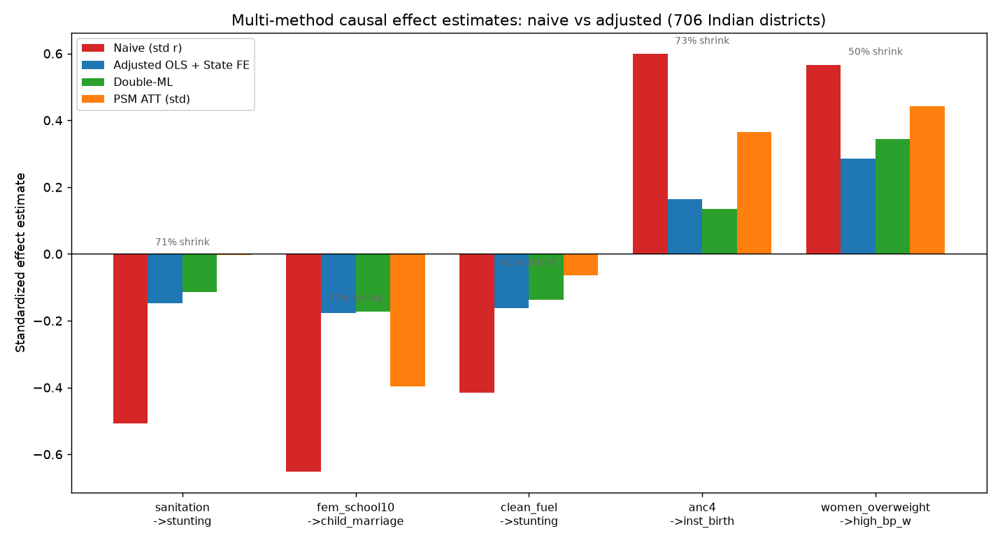
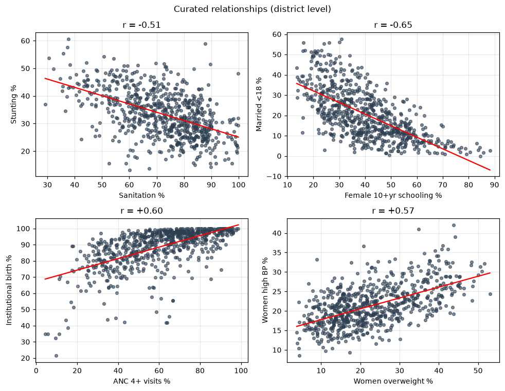
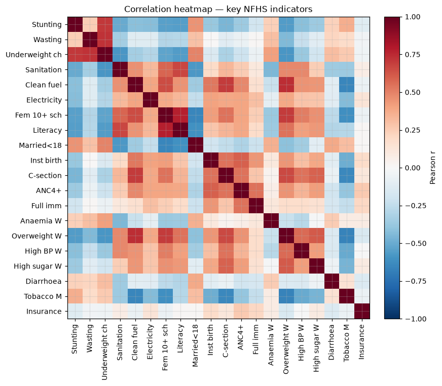
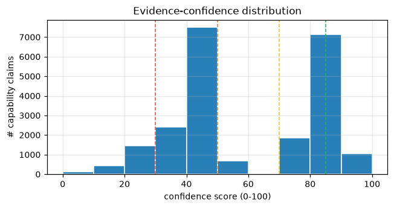
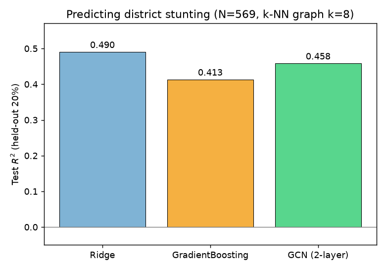
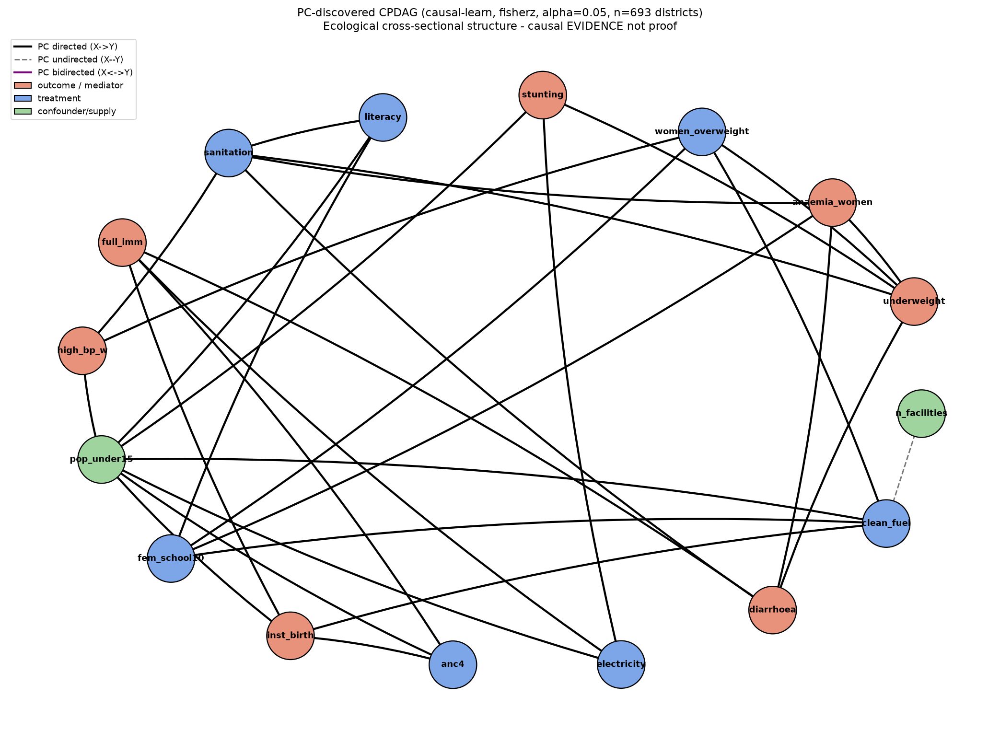

<div align="center">

# 🏥 Virtue Desk — Trust · Desert · Cause

### Turn 10,000 messy healthcare-facility records into decisions a planner can *trust* — with evidence, confidence, and cause.

**Databricks Apps & Agents for Good 2026** · Live on Databricks Free Edition

🔗 **Live app:** https://virtue-desk-7474648370355072.aws.databricksapps.com

</div>

---

## Why this exists

A planner, NGO coordinator, or analyst is handed **10,000 scraped, uneven healthcare-facility records**. Half the "capabilities" are unverified claims. Where do you safely send a patient? Where are the *real* care gaps — not just regions we under-measured? You can't act on hope. You need **evidence, honest uncertainty, and the difference between a correlation and a cause.** That is Virtue Desk.

Every number in the app is **computed live from the complete dataset — no sampling, no placeholders** — and every claim cites the facility's own text.

## What it does — 6 tracks, every answer carries its evidence + uncertainty

| Track | Question it answers |
|---|---|
| **① Facility Trust Desk** | *Can this facility actually do what it claims?* Grades **every specialty a facility lists** (2,580 in the data) as **STRONG / PARTIAL / WEAK-SUSPICIOUS / CLAIMED**, with a 0–100 confidence, the **ground-truth signals**, the **cited source text + links**, a **SHAP-style evidence attribution**, an evidence→verdict DAG, on-demand step-by-step reasoning, and a **human override saved to an audit log**. |
| **② Medical Desert Planner** | *Where are the real care gaps, and how confident are we?* Trust-weighted district aggregation for **all 2,518 capabilities** that separates a **real care gap** from **data-poor**, with a facilities table (capacity · doctors · equipment), an interactive map, and a causal layer answering *"will building more facilities actually fix this?"* |
| **③ Referral Copilot** | *Where should a patient go?* "dialysis near Guntur" → geocodes **any** Indian city/district (from 165k post offices), returns an **evidence-attached, distance-ranked** shortlist with the same per-facility "why" depth. |
| **④ Data Readiness Desk** | *What to fix before planning?* Surfaces impossible values, contradictions, capacity-without-doctors, and column-misaligned rows — ranked by review leverage. |
| **⑤ Ask the Data · Genie** | Native **Databricks AI/BI Genie** — natural-language → SQL over the gold tables, grounded in the trust rubric. |
| **⑥ Data Science Lab** | Interactive EDA across **all three datasets** — correlation explorer, confounding scatter, any-specialty grade explorer, geographic coverage, and the **causal + ML experiments** that power the engine. |

Plus a grounded **Copilot** (Llama 4 Maverick) that answers cross-track questions, **cites the numbers, states confidence, and renders the relevant chart.**

## The trust engine — how a grade is assigned

Purely from the facility's own record (transparent + auditable):
- **STRONG** = a matching clinical specialty code **and** equipment/procedure text **and** a 2nd independent source.
- **PARTIAL** = one evidence type.
- **WEAK / SUSPICIOUS** = the claim contradicts the facility type (e.g. a small clinic claiming ICU).
- **Confidence (0–100)** = how many independent evidence types and sources agree — a *probability the claim is genuine*, not a guarantee.

**Validated, not guessed.** A logistic model reproduces the grade from its evidence signals (5-fold AUC = 1.00), and — crucially — a model predicting STRONG from facility **metadata alone** (size, doctors, web presence) scores only **AUC ≈ 0.57 (near chance)**: proof the grade reflects **cited evidence, not hospital popularity.**

## The causal layer (the differentiator)

On **706 NFHS-5 districts**: PC structure-learning → Bayesian network → **multi-method effect estimation (OLS + state FE, Double-ML, propensity matching)** → E-value sensitivity, plus statistical ML (penalized, multilevel, GAM, conformal) and geometric DL (spatial GNN). The honest headline: **sanitation↔stunting (r = −0.51) collapses to ~0 after adjusting for wealth — confounded, not causal**, while female-schooling→child-marriage and ANC4→institutional-birth **survive** adjustment. And **facility count is only weakly linked to outcomes** — so "build more" isn't always the answer.

## Architecture

```
3 Marketplace datasets (Unity Catalog, read-only)
  facilities (10,088) · india_post (165,627 PIN offices) · nfhs_5 (706 districts)
        │  bronze → silver → gold  (serverless SQL Warehouse, medallion)
        ▼
  workspace.virtue_gold ───────────────────▶  Streamlit Databricks App (virtue-desk)
  gold_facility_capability_trust (75k)         6 tracks · 3 agents · Genie · Copilot
  gold_facility_specialty (118k, 2,580 spec)   every claim cites text + confidence
  gold_all_gaps · gold_district_gaps           SHAP-style attribution + cross-val model
  gold_referral · gold_facility_contact        causal DAG + 4-method effect estimates
  gold_nfhs · gold_pin_state · app_user_actions ◀── persists overrides / shortlists / chats
        ▲                                              │ on-demand
   causal + ML analysis (706 NFHS districts)    Model Serving — Llama 4 Maverick · AI/BI Genie
```

## Repo layout

```
databricks_app/
  app/app.py            # the Streamlit app (6 tracks)
  app/app.yaml          # Databricks App config (warehouse + Genie env)
  app/requirements.txt
  app/.streamlit/config.toml
  build_gold.py         # builds all gold tables on the SQL Warehouse
  01_medallion_pipeline.py
build_*.py · data/ · figures/ · report.html · MASTER.md   # the deep data-science analysis
.claude/skills/         # 10 installed Databricks agent skills
docs/ · prompts/ · AGENTS.md · SUBMISSION.md
```

## Run it yourself (Free Edition)

```bash
brew install databricks
databricks configure --host https://dbc-fc1bd7fb-a374.cloud.databricks.com --token   # paste a PAT

python databricks_app/build_gold.py            # build the gold tables

databricks apps create virtue-desk
databricks workspace import-dir databricks_app/app /Workspace/Users/<you>/apps/virtue-desk --overwrite
databricks apps deploy virtue-desk --source-code-path /Workspace/Users/<you>/apps/virtue-desk
# grant the app service principal: USE/SELECT/MODIFY on workspace.virtue_gold,
# CAN_USE on the warehouse, CAN_QUERY on databricks-llama-4-maverick, CAN_RUN on the Genie space
```

## Databricks stack used

Unity Catalog · serverless SQL Warehouse · Delta medallion · **Model Serving (Llama 4 Maverick)** · **AI/BI Genie** · **Databricks Apps** · 10 project-scoped **Databricks agent skills** (`databricks aitools`). Lakebase-ready for synced low-latency reads.

## Coding agents

`databricks aitools install --scope project` installed the skills in `.claude/skills/`. Agents read [`AGENTS.md`](AGENTS.md) for workspace defaults and conventions; UI / Lakebase / Genie prompt templates are in [`prompts/`](prompts/).

## 📚 Documentation

| Doc | What's inside |
|---|---|
| [`docs/METHODOLOGY.md`](docs/METHODOLOGY.md) | The inner mechanics — medallion pipeline, the trust rubric, confidence scoring, entity resolution, and the **cross-validated model that proves the grade isn't a popularity proxy** (metadata-only AUC ≈ 0.57). |
| [`docs/CAUSAL_INFERENCE.md`](docs/CAUSAL_INFERENCE.md) | **Correlation vs. causation** — the causal ladder (PC → OLS+FE → Double-ML → PSM → E-values), the naive-vs-adjusted effect table, and why facility count is only weakly linked to outcomes. |
| [`docs/DATA_DICTIONARY.md`](docs/DATA_DICTIONARY.md) | The 3 source datasets (field coverage) + every gold table. |
| [`docs/design_research.md`](docs/design_research.md) | Interface / interactivity techniques (cited). |
| [`report.html`](report.html) · [`MASTER.md`](MASTER.md) | The full deep-analysis report. |

## Inside the analysis

**Correlation → causation across 4 estimators.** Bars that collapse toward 0 under adjustment (sanitation→stunting) were *confounded*; bars that survive (schooling→child-marriage, ANC4→institutional-birth, overweight→BP) are *likely causal*:



**Confounding, visualized.** Sanitation↔stunting looks strong (r = −0.51) — until you colour each district by wealth and the relationship dissolves:



**NFHS correlation matrix** across 706 districts (red = positive, blue = negative):



**Trust-confidence distribution** — most claims sit at PARTIAL; a high-confidence STRONG tail clears the ≥2-evidence-types + 2nd-source bar:



**Geometric deep learning** — spatial GNN vs. baselines on district outcomes, and the PC-learned causal DAG:

 

---

<div align="center">
<i>The hardest part of "for good" data work isn't prediction — it's honesty: showing the evidence, communicating uncertainty, and telling a correlation from a cause.</i>
</div>
