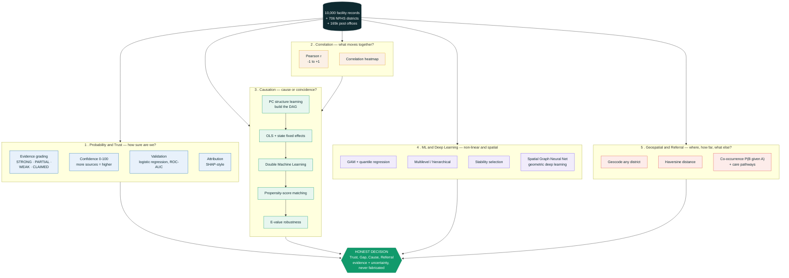

# How facilitiesHelp.io reasons — the technique stack

One picture for judges and users. Read it **top to bottom**: the three datasets flow into **five method families** — probability, correlation, causation, ML / deep learning, and geospatial — and they all converge on a single **honest decision** that always carries its evidence and its uncertainty.

### In plain language

| Pillar | The question it answers | What we actually run |
|---|---|---|
| **1 · Probability & Trust** | *How sure are we a claim is real?* | A deterministic grading rubric turns the facility's own text into STRONG / PARTIAL / WEAK-SUSPICIOUS / CLAIMED with a 0–100 confidence; a logistic model proves the grade is reproducible, and a metadata-only model (AUC ≈ 0.57) proves it isn't just hospital fame. |
| **2 · Correlation** | *What moves together across districts?* | Pearson **r** (−1 to +1) over 706 districts, shown as an interactive heatmap. A strong correlation is a hint, **not** a cause. |
| **3 · Causation** | *Is it a real lever or a coincidence?* | The causal ladder: **PC** structure-learning builds the DAG → **OLS + state fixed-effects** → **Double Machine Learning** → **propensity-score matching** → **E-value** robustness. Effects that collapse under adjustment (sanitation→stunting) were confounded; ones that survive (schooling→child-marriage) are likely causal. |
| **4 · ML & Deep Learning** | *Non-linear, small-sample, and spatial patterns* | GAM + quantile regression (dose–response & tails), multilevel/hierarchical shrinkage, stability selection, and a **spatial Graph Neural Network** (geometric deep learning) benchmarked against baselines. |
| **5 · Geospatial & Referral** | *Where, how far, and what else might they need?* | Geocode any Indian district, rank by **haversine** distance, and suggest related care with specialty **co-occurrence P(B \| A)** and NFHS-correlation **care pathways**. |

**The golden rule across all five:** show the evidence, state the uncertainty, and never fabricate a number.
