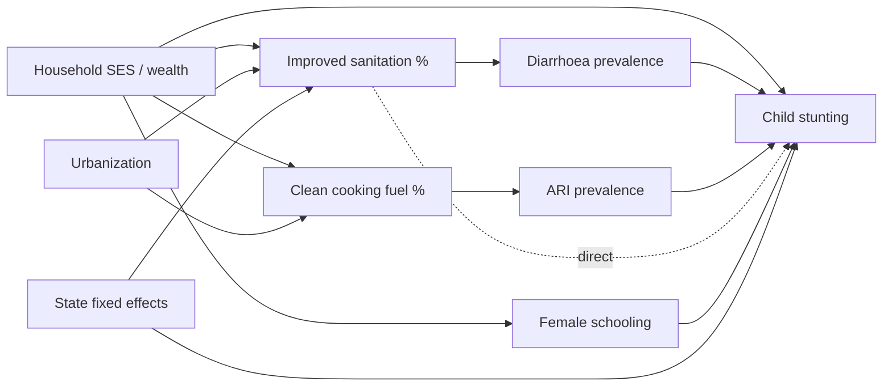

## Data Preparation & Causal-Readiness Blueprint

*The bridge between "understand the data" (EDA) and "model causation" (PC/Bayesian-net/KNN-matching/GNN). This designs the prep and the identification strategy — no models are fit here. Validated on the COMPLETE national data (706 districts; suppression 5.4% `*` / 6.6% `(x)`); the supply↔demand join now WORKS (~95% of facilities map to a pincode, ~80% to an NFHS district), so the models below are executable, not hypothetical.*

### 1. Analytic unit & table design
- **Realistic causal unit = district × survey-wave** (a panel). NFHS is published at district grain; facilities and pincode must be *aggregated up* to district.
- **Secondary unit = facility** (for the supply-side trust models in the products workflow).
- **Target analytic table (district-wave):**
  - *Outcome block* (from NFHS): stunting/wasting/underweight, institutional birth %, full immunization %, anaemia, teen pregnancy, etc.
  - *Exposure/supply block* (aggregated from facilities via pincode→district): facility count, capability density (maternity/NICU/emergency/dialysis per 100k), trust-weighted capability availability.
  - *Context block*: SES proxies, % population <15, urbanization proxy (post-office/pincode density), sex ratio, **state fixed effects**.
  - *Keys*: `district_lgd_code` (surrogate — must be added), `state`, `wave`.

### 2. Cleaning & typing (deterministic rules)
- Strip whitespace on **both** names (`"South Andaman "`) and numeric strings (`"927 "`) before any join/coercion.
- `'*'` (suppressed, <25 cases) → `NaN` **plus** a `__suppressed` indicator column.
- `'(x)'` (e.g. `(29.5)`, based on 25–49 cases) → numeric value **plus** a `__lowprecision` flag, and a per-cell **reliability weight** (1.0 full / ~0.5 low-sample / 0.0 suppressed).
- **Four coexisting units in NFHS's 109 cols** — never standardize across them; tag each in the dictionary: percentages 0–100; counts (sample sizes); per-1000 ratios (`sex_ratio_*`); rupees (OOP delivery ~1,600–9,500).
- Facilities: literal `"null"` → `NaN`; JSON arrays (`specialties`/`procedure`/`equipment`/`capability`) → **multi-hot** matrices, de-duping within-row repeats (e.g. `["pediatrics","familyMedicine","familyMedicine","pediatrics"]`); encode `facilityTypeId`/`operatorTypeId`/`state`; **de-dup via `cluster_id` BEFORE district aggregation** (one real facility repeats across overture/dynamic/constant sources).

### 3. Missing-data strategy — the #1 threat
- **NFHS suppression is MNAR, not MCAR/MAR.** In-sample gradient confirmed: small/remote A&N-island and Arunachal districts carry ~15–25% suppressed cells per row; large Bihar districts (Patna, Bhagalpur) carry ~1–3%. Suppression fires *deterministically* when underlying cases <25 — i.e. it's a function of population/denominator and outcome rarity, **the very quantities being modeled**.
- **Why naive handling biases causal estimates:** complete-case deletion silently drops the poor/remote tail (selection on the outcome's correlates); mean-imputation fabricates a population→indicator relationship and **attenuates the SES contrasts that identify effects**.
- **Recommended:** carry missingness indicators into models; multiple imputation *with* the indicators (documenting the MNAR assumption); prefer models tolerant of missingness; run a **sensitivity analysis** (e.g. how do effects move under pessimistic imputation of suppressed cells?).
- Facilities sparsity (`capacity` 10%, `numberDoctors` 26%) is more **structurally missing / MAR** — model with presence flags; don't impute capacity as if random.

### 4. Outliers, bounds & transforms (for modeling)
- Proportions are bounded [0,100] and skew at the extremes → offer a **logit transform** for continuous methods.
- **Winsorize** heavy tails (OOP expenditure, C-section %, engagement metrics).
- **Standardization is mandatory** for distance-based KNN/PSM (otherwise rupees & per-1000 ratios dominate Euclidean distance).
- **Coordinate cleaning first** (confirmed corruption): *Sanjivani Multi Speciality Hospital* — Kerala address, `lat=59.95, lon=-38.26` (mid-North-Atlantic): a combined lat/lon swap + sign error. Apply India-bbox filter (lat ~6–38, lon ~68–98) + swap/sign detection, and reconcile against address/pincode (prefer pincode centroid on conflict) before any facility→district point-in-polygon assignment.

### 5. Join / panel construction
1. Build a **Census-2011 LGD district-code crosswalk** for NFHS districts (handles post-2011 splits/renames; raw-name joins will silently drop districts).
2. `pincode → district/state/centroid` from the India Post directory (also yields an **urbanization proxy** via office density). Note `"NA"` lat/lon offices still bridge by pincode→district.
3. Facilities → district via `address_zipOrPostcode → pincode → district` (primary), with lat/lon point-in-polygon as a fallback/validator.
4. Aggregate facility supply to district features (counts, capability density, trust-weighted availability from `facility_capability_trust.csv`).
5. Join supply block to NFHS outcome block on `district_lgd_code`.
- **Failure modes:** name mismatches, many-to-one pincode→district, coordinate errors, and (in these samples) **zero state overlap** — so this is designed for the FULL national downloads.

### 6. Causal framing + starter DAG
**Variable roles (concrete columns):**
- **Outcomes Y:** child stunting/wasting/underweight; institutional birth %; full immunization %; anaemia; teen pregnancy; neonatal-risk proxies.
- **Treatments/exposures T:** improved sanitation %, clean cooking fuel %, female literacy/10+ schooling, health-insurance coverage, ANC4+ — **and supply exposures**: facility density, maternity/NICU/emergency capability density.
- **Confounders X:** wealth/SES proxies, % population <15, urbanization, sex ratio, **state fixed effects**.
- **Mediators (do NOT condition on for total effects):** diarrhoea/ARI prevalence (on the sanitation→stunting path); institutional birth (on the ANC→neonatal path).
- **Colliders (exclude):** care-seeking variables conditioned on illness.

**Starter DAG** — *"Does sanitation/clean-fuel reduce child stunting, and is it mediated by diarrhoea?"*

*Total effect of SAN→STU: adjust for {SES, URB, STATE}, NOT for DIA (mediator). Direct effect: also condition on DIA/ARI. This is the contrast structure learning + matching must respect.*

### 7. Method-readiness map
- **Constraint-based (PC) & score-based Bayesian-net structure learning:** prune to ~15–25 causal variables first (109 cols × ~640 districts underpowers conditional-independence tests); logit-transform proportions; **faithfulness is risky** because mediated + direct sanitation→stunting paths can partially cancel — report **bootstrap skeleton stability**, not a single graph.
- **KNN / propensity-score matching:** standardize all features; trim to **common support / overlap**; verify small/remote districts aren't all in one treatment arm (no overlap ⇒ no identification); check balance (SMD < 0.1).
- **GNN:** the right inductive bias is a **district spatial-adjacency graph** (or a facility k-NN graph for the supply side), node features = the analytic table. But ~640 nodes is tiny → heavy regularization, 1–2 layers, treat as exploratory.
- **Cross-cutting threats to validity:** (1) **ecological fallacy** — district-level effects ≠ individual effects; (2) **cross-sectional ceiling** — one NFHS wave has no temporal precedence → **pull NFHS-4 for a 2-wave diff-in-diff / lagged DAG**; (3) **unobserved confounding** (no income/caste/migration); (4) **small effective n** after listwise drops.

### 8. Ordered data-prep pipeline (run before any causal model)
1. Load all three with `dtype=str`; strip whitespace everywhere.
2. Parse NFHS tokens → numeric + `__suppressed` / `__lowprecision` flags + reliability weights.
3. Tag every NFHS column with its unit (pct / count / ratio / rupees).
4. Quantify & map missingness; confirm the MNAR gradient; decide imputation + sensitivity plan.
5. Facilities: `"null"`→NaN; explode JSON arrays → multi-hot; encode categoricals.
6. De-dup facilities on `cluster_id`.
7. Clean coordinates (India bbox, swap/sign repair, pincode reconciliation).
8. Build pincode→district crosswalk + LGD district codes for NFHS.
9. Assign facilities → district; aggregate supply/capability-density features.
10. Assemble district-wave analytic table (outcome + supply + context blocks).
11. Transform proportions (logit), winsorize tails, standardize for distance methods.
12. Variable selection / role assignment per the DAG (T, Y, X, mediators, colliders).
13. Overlap/common-support & balance diagnostics.
14. (Causal phase) structure learning → BN → matching/PSM → GNN, each with the validity guards above.

**Fix-before-modeling shortlist:** add district codes; resolve MNAR suppression; clean coordinates; de-dup on `cluster_id`; bring NFHS-4 for a panel. Without these, every downstream causal estimate is biased in a *known direction* (toward dropping/averaging the remote, low-supply, high-need districts).

> Caveat: the spawned blueprint agent was denied Bash/pandas in its sandbox, so its in-sample figures were read off raw CSV rows rather than computed aggregates — re-verify all missingness %/ranges on the full data.
